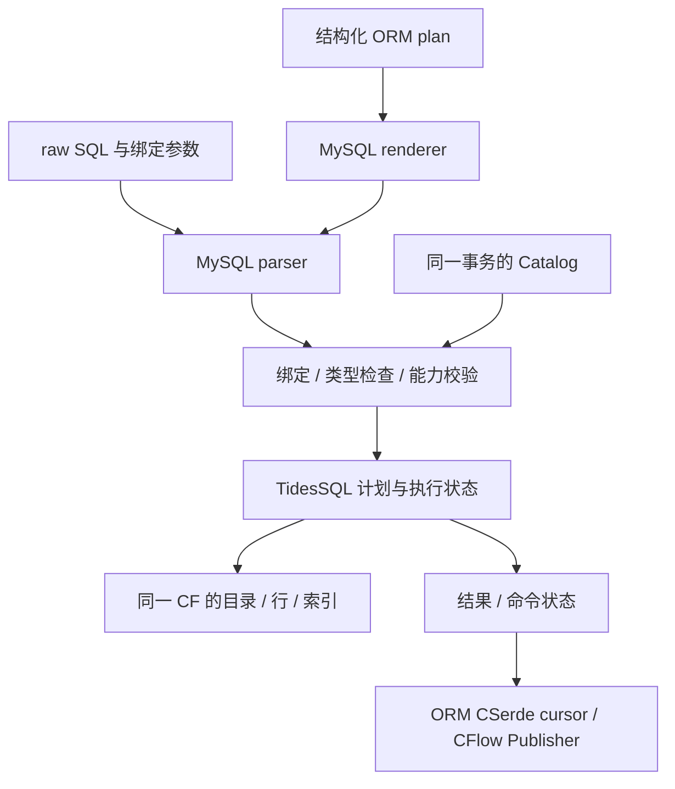

# TidesDB SQL 执行层设计

2026-10-06 rebase 决策：保留 `master` 的 Salts 摘要接口、无 SSL libpq 和随构建
SDK 匹配的 Plugin ABI epoch；TidesSQL 服务端保留 GmSSL 密码验证实现。公开导出
不再解析或打包 GmSSL 开发文件，Windows 只暂存 libpq/sqlite3 的 vcpkg DLL。
这取代下文历史阶段记录中的客户端直接 GmSSL 链接、随包 GmSSL 和固定 ABI 4
准入描述；SQL、认证报文、密码记录格式和插件加载时的精确 ABI 校验保持原契约。

## MySQL 远程接入与共享数据库

总任务 [#204](https://github.com/qigao/turbodb/issues/204) 将远程服务拆成
[#205 共享数据库/会话](https://github.com/qigao/turbodb/issues/205)、
[#206 statement/会话状态](https://github.com/qigao/turbodb/issues/206)、
[#207 服务端协议](https://github.com/qigao/turbodb/issues/207)、
[#208 TLS/认证/调度](https://github.com/qigao/turbodb/issues/208)、
[#209 driver E2E](https://github.com/qigao/turbodb/issues/209)。实现与验证结果更新
到对应 issue；本地完成尚未提交/发布的代码不作为已发布功能关闭 issue。

事实：现有 MySQL client 使用 COM_STMT_PREPARE/EXECUTE；TidesSQL 以前由每个
connection 打开原生 DB，而原生 DB 对目录持有独占锁。因此仅增加监听器并为
每个客户端调用旧 connection_open，不能形成共享数据库的多会话服务。
依据为 `mysql/session.h`、本模块 `src/connection.c` 和原生
`tidesdb/src/tidesdb.c` 的目录锁路径。协议依据来自
[MySQL Client/Server Protocol](https://dev.mysql.com/doc/dev/mysql-server/latest/PAGE_PROTOCOL.html)
及[预处理语句协议](https://dev.mysql.com/doc/dev/mysql-server/latest/page_protocol_command_phase_ps.html)。

选择分层同步调用：MySQL frontend → TidesSQL SDK → TidesDB；服务进程单独拥有
物理数据库，各网络连接拥有独立 SQL 会话。候选“所有连接共用一个 SQL session”
会串用事务/autocommit/诊断；候选“每连接重开同目录”违反原生锁契约；将协议处理
放入 ORM driver 会让客户端承担服务端状态并穿透引擎边界。故新增服务 frontend，
保留 MySQL driver 的客户端职责；不引入插件或异步存储事实源。网络异步调度独立于
SQL 同步执行，不能据此假设 SDK 支持跨线程并发。

SQL 解析归属保持单一：远程路径中 MySQL ORM driver 只把结构化 plan 渲染为 MySQL
SQL，MySQL client 只编码 `COM_QUERY` 或 `COM_STMT_PREPARE/EXECUTE`；二者都不链接
`sqlparser` 或 TidesSQL。`tidessqld` 收到文本后才调用 TidesSQL，后者在 PREPARE 或
直接执行入口解析、绑定并校验执行 profile；EXECUTE 只提交类型化参数给已准备的
statement，并执行 schema 失效检查，不在客户端重解析或插值。直接嵌入 TidesSQL SDK
时同一解析发生在应用进程内，属于引擎边界而非远程 server。MySQL packet、握手和
结果行的协议解码不等于 SQL grammar 解析；ORM plan 渲染也不产生第二套 SQL 语义事实源。

本次 #205 增量为 SDK 1.1.0 的 opaque `tdsql_database`，不改 ABI v1 DTO。
database 唯一拥有 native DB/CF 和配置字符串；session 借用这些不可变资源，
复制预算配置值，独立拥有 diagnostics、autocommit/access、transaction/result。
控制面和全部会话操作都是 single-threaded，由同一 owner 串行执行；名额计数
不使用 atomic，也不承诺不同会话可并发进入。connect 的初始化成功后才计入名额，
OOM 不消费名额；没有排队或自动重试。读路径只取事务快照，不推进另一会话状态。

容量单位是活跃 session，`sql_max_connections` 默认 128，可配置且必须为正数。
计数在达到上限前拒绝，递增不越过该上限；每个 session 的结果、AST、工作空间、
写集合继续受既有 statement/transaction 预算约束。容量规划需计算
`max_connections × (session 元数据 + diagnostics + retained statement/transaction)`，
并另加 native TidesDB cache/worker 内存。此式为规划上界，不是预分配量或性能结论。
网络服务的全局工作量/收发 byte 配额和超时归 #208，不能仅以 session 数限制替代。
session admission/close 为 O(1)，另有既有 diagnostics 初始化/释放；执行算法不变。

关闭顺序是停止 admission → 释放结果/外部事务 → 关闭会话并回滚 SQL 事务 →
关闭数据库。数据库仍有会话时 BUSY，不释放资源；会话关闭遇到回滚失败仍保留
handle 和名额，调用方必须处理失败。checked result/transaction 清理消费 handle
并隔离其会话；其他会话不被静默改变。COMMIT_UNKNOWN 不重放，真实存储结果由
之后的独立事务观察。初始化失败遵循原有 CF/Manifest 创建契约，不删除 CF。
旧本地入口在存储初始化前分配 diagnostics，保持原有失败顺序。

**HIGH｜兼容与验证：** 共享数据库支持是新增入口，不修改 ORM ABI、SQL 方言、
隔离级别或磁盘格式。新增直接集成测试验证可见性、状态/诊断隔离、关闭回滚、
BUSY 与满额、非法配置及重新打开；现有 owner fault 测试补充 session OOM、
清理失败与提交不确定性的跨会话隔离。原有 SDK/ORM 生命周期回归仍需通过。
SDK static package minor 版本提升为 1.1.0；旧 DTO 和入口保持兼容，回滚只需
回退代码/安装产物，没有数据迁移。MySQL 远程能力必须等 #209 真正 E2E 验证，
不得将 parser 接受、SDK 单测或协议 codec 单测当成服务端已经可连接。

### #207 MySQL 服务端 codec 边界

选择独立 `server/mysql` 私有适配层，分包帧、命令/参数解码、响应编码；引擎
不依赖协议，codec 不调用 SQL、认证、网络或存储。复用 `mysql/wire` 的整数、
lenenc 和 packet stream 源码；现有 MySQL client 的安装目标/公开 ABI 不改。
私有静态 target 编译同一基础源码，无代码副本；正式协议测试使用已有客户端
encoder/decoder 验证互操作。后续 registry/dispatcher 负责 SDK 调用，握手/协商
仍需实现；不把 client session/auth 直接当作 server。

数据协议｜single-threaded、每连接单 owner。调用者提供固定请求缓冲；frame
assembler 唯一推进已用 bytes/序号/ready 状态。完整消息前只返回 NEED_MORE；
ready 后暂停输入，剩余粘包由 consumed 告知，直到消费者显式 release。完整
SQL/EXECUTE payload 的借用视图只活到 release/关闭，不能跨 buffer 复用。
包载荷上限是协议的 0xffffff，总消息限额是 caller buffer capacity；检查累积
长度与序号，满额返回 LIMIT。序号/长度错误锁定失败，不尝试重同步；断连关闭
丢弃未发布请求。连续最大包须等较短包（包括零长度终止包）才完成消息。

参数协议｜EXECUTE 使用准备得到的 count 和调用者提供的有界 types/values
数组，支持新 type 与复用上次成功 type。先完整校验所有类型、NULL bitmap、
值长度和尾部，再一次性发布 values/types；失败不改缓存，不执行半可信请求。
TEXT/BLOB 借用请求 bytes，二者的总载荷使用独立硬限额，数值槽计入 arrays 容量。
既有 driver 的 signed TINY 0/1 映射 BOOL（协议没有独立 BOOL 类型）；整数、DOUBLE、
NULL 和字节值使用其原生类型，无 SQL 拼接。长数据、游标、query attributes、
压缩、LOCAL INFILE、多结果和 optional metadata 不声明支持；解码明确拒绝
未实现命令/flags，SQL 多语句由单语句 parser admission 拒绝。

响应协议｜caller 拥有固定发送区；编码先测量/校验后写入，失败保持输出 bytes
与 size。包帧按官方长度分片，精确最大载荷附零包，序号 modulo 256。响应由
引擎会话状态/真实结果元数据导出，不维护另一个事务状态。PROTOCOL_41 的
OK/ERR/EOF、prepare OK、列 metadata、文本/二进制行分别编码；EOF 形式须
与实际协商匹配。DOUBLE 文本要求 numeric locale 的小数点为 `.`，否则明确
UNSUPPORTED；不修改全局 locale。ERR 载荷消息限制为 512 bytes，SQLSTATE
须为五个大写字母/数字；上限依据
[MySQL 8.4 mysql_com.h](https://github.com/mysql/mysql-server/blob/8.4/include/mysql_com.h)
的 `MYSQL_ERRMSG_SIZE`。未知 server status 位拒绝编码；readonly transaction 位
须同时有 in-transaction 位，不用未经事实源确认的状态发送成功。

HIGH｜上限与失败：无 codec 分配/容器增长/队列，保留量为 caller 请求/发送
capacity + frame metadata + count*(type/value 大小)，乘加先检查；完整请求与
完整编码才可交给下层。网络慢客户端背压、超时、认证与关闭 drain 归 #208。
MED｜此组件不安装、不开放监听器，旧 SDK/ABI/配置/持久化格式不变；回滚删除
私有 target/测试即可。验证需独立 golden、客户端互操作、截断/边界/序号/
分片/超限/输出原子性及未实现能力拒绝，不能当成 #209 远程 E2E 已完成。
官方：[包帧](https://dev.mysql.com/doc/dev/mysql-server/latest/page_protocol_basic_packets.html)、
[EXECUTE](https://dev.mysql.com/doc/dev/mysql-server/latest/page_protocol_com_stmt_execute.html)、
[文本结果](https://dev.mysql.com/doc/dev/mysql-server/latest/page_protocol_com_query_response_text_resultset.html)、
[二进制结果](https://dev.mysql.com/doc/dev/mysql-server/latest/page_protocol_binary_resultset.html)。

### #207 statement registry 与 SDK 接入

背景｜wire codec 无权拥有 SQL/schema；MySQL statement ID 必须只在所属连接内
定位真实 SDK prepared handle。选择私有 `registry.c`，单线程同步调用公开 SDK；
固定 CSTL Vec slot 表按配置预留，每个已准备 handle 独立持有固定 wire types 和
临时 values Vec。候选 hash map 会增加小容量表的 hash/entry/rehash 状态；候选
直接用 slot 下标作 ID 会在 CLOSE/复用后把旧请求指向另一 SQL。选择线性查找
和单调递增 uint32 ID：零保留，成功准备才消费 ID，耗尽不回绕/重用。

事实源与所有权｜registry 借用一个 SDK connection 至 dispose，唯一拥有其准备
的 statement handles 与 wire cache；SQL、推导类型/schema/元数据、事务、诊断
仍只在 SDK。PREPARE 先做协议/容量 admission，再调用无副作用 SDK prepare；
推导出真实参数数后检查 wire bytes，分配两数组，成功才发布 ID/prepare DTO。
失败关闭 handle 并归还临时存储；清理失败锁定 registry，保留未消费资源供关闭。
EXECUTE 全载荷校验后更新 wire cache，typed bindings 直接进入 SDK；普通 SQL
错误不清除合法缓存、不自动重放。临时 values 在 SDK 返回后置零，不跨请求保留
TEXT/BLOB 借用。查询结果由 SDK response 返回调用者，须 checked destroy，
然后才能重用 response、execute/reset/close；EOF/cancel 本身不释放 ownership。

状态与关闭｜PREPARE/EXECUTE/RESET 受 SDK quiescence/隔离约束，metadata 只读。
RESET 保留 SQL/ID/types，按
[官方协议](https://dev.mysql.com/doc/dev/mysql-server/latest/page_protocol_com_stmt_reset.html)
仅清理首版未实现的 long data/cursor；不改事务或诊断。CLOSE 无响应，按
[官方契约](https://dev.mysql.com/doc/dev/mysql-server/latest/page_protocol_com_stmt_close.html)
释放此连接的 handle；未知 CLOSE ID 忽略，未知 EXECUTE/RESET/metadata ID 明确
报错。BUSY close 保留映射；其他 SDK close 错误仍消费 handle并隔离 owner，不
二次释放。断连先停止 admission/清理结果，再 dispose registry，最后关闭 SQL
connection（回滚事务）。dispose 遇 BUSY 保留剩余 handles，进入 closing，不能
继续接收命令；清理错误继续消费其他可关闭资源并传播首个失败。
未知 CLOSE 的边界依据为
[MySQL 8.4 mysql_stmt_precheck](https://github.com/mysql/mysql-server/blob/8.4/sql/sql_prepare.cc)。
BUSY disposal 优先返回尚有资源，保留已发生的清理错误；之后全部资源消费时
仍返回该错误。非 BUSY 的 dispose 即使失败也消费 registry，不能按失败重放。

计算｜固定表容量 S、活跃 handle 参数数 P_i；wire 请求上限与 TEXT/BLOB 总 bytes
分开限制。registry wire quota 包括 registry owner、S 个 slot、两 Vec 的请求容量
及 Salts sequence receipt/alignment slack；SDK 自己的 prepared bytes quota 另
约束 SQL/schema/names。预留量为 `sizeof(registry) + slot_allocation(S) +
sum(type_allocation(P_i) + value_allocation(P_i))`，乘加先 checked，CRT allocator
自身 bookkeeping 不计入请求 bytes。slot/type/value Vec 都把 element_limit 固定
到实际容量，不增长、不排队/淘汰。lookup/registry admission/dispose 为 O(S)，
execute 解码/清零为 O(P_i)，另加 SDK 执行成本；额外 wire 存储 O(S+sum(P_i))。
线性表适合默认 64 statements；若配置很大，应先测量再改查找结构。

HIGH｜正式测试须验证真实 PREPARE→native EXECUTE→result 生命周期，连接间 ID
隔离、稳定 metadata、DDL/事务/schema invalidation、缓存/预算/ID 耗尽、所有
构造分配失败和关闭消费边界；不能用 mock 或 codec 互操作替代远程 E2E。
MED｜只增加不安装的私有 frontend target，没有 SDK API、ABI、磁盘、配置或
部署变化；无 SQL 插值、自动 reprepare 或提交重放。回滚撤回私有 registry 即可，
无需数据迁移。QUERY/PING/QUIT 分发与响应状态机已在下一节接入；握手/能力协商仍待，
网络/TLS/认证/调度及现有 driver 真正 E2E 保持 #208/#209 验收。

事实｜2026-10-05 新增正式 registry suite 16 用例/647 断言，owner suite 3 用例/
92 断言，全通过；client encoder 生成请求后经 registry 进入真实 SDK/原生
TidesDB，覆盖 metadata、ID 隔离/耗尽、缓存、DDL/DML/事务、schema 失效、
断连回滚、多语句 admission、硬限额、构造分配失败、BUSY 与 consumed cleanup。
owner suite 在真实 commit 成功之后模拟 I/O 确认失败，独立 session 观察已提交
数据，并检查重复 EXECUTE 不再调用 commit；此证据不等于硬件掉电或 TCP 故障
验证。metadata snapshot/结果清理的 native rollback 确认失败验证第一会话隔离。
Windows Release 全部 33 项 TidesSQL 与 7 项 MySQL client CTest 通过（104.88 秒），
构建无编译警告/错误。复验构建 `tidessql_mysql_registry_test`
`tidessql_mysql_registry_owner_test` 后
`ctest --preset win-release-user -R '^tidessql_mysql_registry(_owner)?$'`。
日志 `build/Msvc-Release/Testing/mysql-registry-engine-regression.log`。未运行
ORM 全量/安装（既有 Salts Plugin ABI 不匹配）、Linux/sanitizer/benchmark；
代码未提交/推送。registry/codec 仍是私有构件，#204/#207 保持开放。

### #207 command 响应状态机

选择私有同步 dispatcher，接入 SDK QUERY 与 registry prepared lifecycle，协议
结果仅在 adapter 层序列化。caller 提供固定 payload scratch 与独立 frame output；
dispatcher 不复制整结果或排队多命令。PREPARE 返回 ID/参数/列 metadata；QUERY
返回文本行、EXECUTE 返回实际 result metadata 与二进制行。nullable/unsigned/type
由 SDK DTO 推导；row 与 metadata 类型不一致立即失败，不发送错误解释的数值。
列 catalog 为协议标准 `def`，schema/table/original name 为空，因为 SDK 未提供
origin，不能从 SQL 猜测。文本/字节不转码；binary charset + VAR_STRING/BLOB
保留 SDK TEXT/BLOB 区别。CHARSET/长度是 wire 表达约束，不伪称持久化列声明。

数据与状态｜single-threaded，同一 database 全部 session 仍由一个 owner 串行。
dispatcher 独占借用所属 connection，caller 不同时在该 connection 调用其他 SDK。
accept 完整 payload，在 SDK 返回后不借用 input；成功意味着命令已接入，SQL
失败则持有 ERR 响应，无 SQL 重试。仅一个响应/包 pending；emit 先消费一行并
编码至固定 scratch，再 frame 至独立 output。output 容量失败保留 pending 包，
可以在同一事实源上再次取包，不重读行/重执行。成功 emit 后不能再次 emit，
需 caller 在整个 frame 转移给 owned transport 或写完后 acknowledge；ACK 才
推进序号/metadata index/phase。该交接不是客户端确认或远程提交确认。所有
借用 output 视图须在复用前到期；scratch 与输出不得 alias，不跨 ACK 保留。

完成与错误｜IDLE/active/error-to-send/terminal 各状态可区分；active 时拒绝新
命令，直到最终 ACK。结果 EOF 后先 checked destroy，再取 SDK state 编码 final
EOF/OK；不把临时 autocommit 查询快照当显式事务。过程 ERR 替代 final terminator，
销毁 result，cleanup failure 覆盖主错误并要求断连。COMMIT_UNKNOWN 不重放，
ERR 发送后关闭；wire error 的 code/SQLSTATE 分类只表达 SDK 有证据的类别，
不能把所有 SQL_ERROR 冒充 syntax error。未知 statement ID 有专门协议错误，
SDK 原诊断保留。warning_count 按官方实现饱和至 uint16 上限，SDK 仍持有真实计数；
末尾包在惰性行求值后读取计数。PING 不执行 SQL；CLOSE/QUIT 不产生响应，失败要求关闭。
SEND_LONG_DATA 等无响应的未实现命令要求关闭，不插入无关联 ERR 扰乱后续流。

容量与关闭｜固定 scratch 至少容纳完整有界 ERR，正常 payload 超限明确 ERR，
不截断 row/diagnostic。metadata 在首包前校验，未能发送的 prepared handle
关闭；已提交 DML 的编码/传输失败不能补偿或重放，只可关闭并由新事务观察。
网络断连 dispose 销毁活跃结果、关闭 registry；之后 caller 关闭 SQL connection
回滚尚未提交事务，再关闭共享 DB。无锁、异步队列或第二个事务事实源。
额外存储为固定 scratch/output + dispatcher/registry + 已有 SDK result quota；
每包 O(payload bytes + columns)，metadata preflight/行检查 O(columns)，另加 SDK
成本。帧分片和序号回绕复用已有 codec；请求的下一序号来自完整 frame assembler。

HIGH｜验证包括既有 client decoders 的完整文本/二进制/prepare 响应链、实际
metadata、行/警告/事务状态、顺序、ACK/背压/预算、晚失败/提交未知及断连清理；
这仍非网络 E2E。MED｜新增私有 source，无公开 SDK/ABI/磁盘或部署变化；两种
EOF 模式由协商结果显式指定，不用 fallback。握手/TLS/认证/调度仍待 #208，
真正 driver 远程验收仍属 #209。回滚私有 dispatcher 即可，无数据迁移。
官方：[结果集](https://dev.mysql.com/doc/dev/mysql-server/latest/page_protocol_com_query_response_text_resultset.html)、
[PREPARE](https://dev.mysql.com/doc/dev/mysql-server/latest/page_protocol_com_stmt_prepare.html)、
[二进制行](https://dev.mysql.com/doc/dev/mysql-server/latest/page_protocol_binary_resultset.html)。
错误分类参照 [MySQL error reference](https://dev.mysql.com/doc/mysql-errors/8.4/en/server-error-reference.html)；
warning_count 表达参照 [官方 Protocol_classic 实现](https://github.com/mysql/mysql-server/blob/8.4/sql/protocol_classic.cc)。

事实｜2026-10-06 正式 dispatch suite 17 用例/1871 断言、扩展 native owner suite
6 用例/213 断言全部通过，无失败/跳过/TODO。实际 SDK 结果经已有 client 解码器
读取完整链，覆盖两种 EOF、空集、多行、动态 prepared metadata、SHOW 与参数化
EXPLAIN metadata/二进制行、全部七种值、
零参数 DDL/DML、RESET 缓存、未知命令/ID、多语句无副作用、SDK 别名限额、
scratch/row limit、frame capacity retry、ACK/reentry、序号回绕、lazy warning、
事务状态及未读完结果的断连回滚。native 故障验证 EOF cleanup ERR/断连、
commit 确认丢失后的终止 ERR/不重放、PREPARE snapshot cleanup 无 ID/metadata。
最小复验构建 `tidessql_mysql_dispatch_test tidessql_mysql_registry_owner_test` 后
`ctest --preset win-release-user -R '^tidessql_mysql_(dispatch|registry_owner)$' -V`，
日志 `build/Msvc-Release/Testing/mysql-dispatch-final-test.log`，2 项 CTest 共 4.21 秒。
Windows Release 全部 34 项 TidesSQL 与 7 项 MySQL client CTest 通过（82.57 秒），
本轮构建无编译警告/错误；日志 `build/Msvc-Release/Testing/mysql-dispatch-engine-regression.log`。
未验证真实网络、握手、TLS/认证或远程 driver；#204/#207 保持开放。

### #207 TLS 前后握手边界

选择私有 greeting encoder、SSLRequest/HandshakeResponse41 decoder 与 negotiation
gate。复用已有 wire 整数 codec/client handshake DTO，无加密、账户存储或 SDK 调用。
服务端只声明 Protocol41、SSL、plugin/secure auth、transactions、long flags、
DEPRECATE_EOF，CONNECT_WITH_DB 仅在服务配置允许数据库名称选择时声明。compression、
multi-statements/results、query attributes、LOCAL INFILE、session tracking、connect
attrs、lenenc auth 和 optional metadata 均不声明，客户端额外 flags 明确拒绝。
首版 plugin 为 caching_sha2_password；其他 plugin 不隐式降级。握手解析成功只
表示等待账户验证，不表示已认证，不创建 SDK connection 或进入 command phase。

状态/所有权｜single-threaded，gate 仅存固定 header/phase/序号，无动态分配。
新 gate 等待 greeting 完整发送后的序号 1 SSLRequest；只接受完整 32 字节，
不会在明文路径解析 username/token。成功暂停 MySQL 输入并等待实际 transport
TLS 完成事件，调用者随后恢复序号 2 的 encrypted HandshakeResponse41。TLS
前后 header flags/charset/max_packet 必须一致，禁止途中变更能力或静默降级；
仅支持 binary charset，与当前 SDK 不转码的 bytes 契约一致。完整 login 校验后
一次发布借用 views（用户名/可选数据库/token/plugin），只活到输入 release；
调用者同步授权或按账户配置解析至已拥有的身份，不能跨网络挂起保存裸指针。
任何 wire/顺序/TLS 状态失败终止 gate，禁止重放/resync；等待 TLS 时无新命令。

容量/错误｜username/database 字节数有命名硬上限；plugin/token 使用固定
caching_sha2 形状（token 为空或 32 字节），max_packet 非零且由后续 transport
和响应预算共同约束。cstring 用有界 memchr，checked subtraction 后消费字段，
禁止尾随字段/非零 filler。纯 codec 失败保持输出，greeting measurement/preflight
完成后才写 caller buffer。长度/类型/TLS/sequence/unsupported 可以区分，诊断
不得输出密码/token/nonce。gate 固定 O(1) 存储，解码 O(payload)；不新增队列、锁。

HIGH｜正式验证须覆盖已有 client greeting parser、SSL/login builders 的互操作，
独立 greeting bytes、所有截断点/额外 flags、越限/零值、空 auth/token 中的 NUL、
TLS 前禁止 login、TLS header 一致、序号/phase 错误和失败不发布 views。
仍需 #208 实际 TLS/账户和 #209 远程 E2E，不能把协议成功等同认证成功。
MED｜仅私有 target 增量，无 SDK/ABI/磁盘/配置/部署或加密依赖改变，回滚撤回
私有握手 source 即可。#208 的 GmSSL 替换要求保持；本层不绑定 OpenSSL 后端。
官方：[HandshakeV10](https://dev.mysql.com/doc/dev/mysql-server/latest/page_protocol_connection_phase_packets_protocol_handshake_v10.html)、
[SSLRequest](https://dev.mysql.com/doc/dev/mysql-server/latest/page_protocol_connection_phase_packets_protocol_ssl_request.html)、
[HandshakeResponse41](https://dev.mysql.com/doc/dev/mysql-server/latest/page_protocol_connection_phase_packets_protocol_handshake_response.html)、
[连接阶段](https://dev.mysql.com/doc/dev/mysql-server/latest/page_protocol_connection_phase.html)。

事实｜2026-10-05 正式 handshake suite 14 用例/659 断言通过，无失败/跳过/TODO。
包括独立 Protocol10 golden 与已有 client parser/capability selector、SSL/login
builders、二进制 token 的 NUL、可选数据库/空 auth、未广告 flags、全部截断点/
filler、字段限额、TLS header 一致、提前/重复 TLS 回调、明文 login、phase 与
sequence 失败不发布 views。TLS ready 在测试中由调用者模拟，不证明网络 TLS。
Windows Release 全部 35 项 TidesSQL + 7 项 MySQL client CTest 通过（75.73 秒），
本轮构建无编译警告/错误；日志 `build/Msvc-Release/Testing/mysql-handshake-engine-regression.log`。
最小复验构建 `tidessql_mysql_handshake_test`，运行
`ctest --preset win-release-user -R '^tidessql_mysql_handshake$' -V`，日志
`build/Msvc-Release/Testing/mysql-handshake-test.log`。当前仍未接入账户、实际 TLS
完成事件、监听器或真实 driver E2E；#204/#207/#208 保持开放。

### #208 GmSSL 与密码验证边界

按 #208 的 GmSSL 替换要求，MySQL client 的 SHA1/SHA256 token 计算改用 GmSSL
原语，算法/公开接口/nonce 与 output 契约保持，临时 digest/context 安全清零。
构建与安装包由 GmSSL::GmSSL 提供，取消本项目对 BoringSSL/OpenSSL 的链接；
vcpkg 为 gmssl 单独选择与 Salts 相同 registry baseline，已有 libpq/zstd 版本
不随之迁移。静态 GmSSL、公开头和原 config/copyright 随包发布，consumer
从生产者 package 解析，不能悄悄链接另一个 crypto 构建。许可证 Apache-2.0；
Salts 使用的 port 带 TLS IO 适配补丁与 AES/SHA/P256，记录在第三方 notices。

服务端选择 caching_sha2 的 TLS 完整认证；首版无快速认证 cache，每次是明确
cache miss/full-auth policy，不是错误回退。账户只保存随机 16 字节 salt、
PBKDF2-HMAC-SHA256 的 32 字节 verifier 与 iterations，不保留明文或快速 SHA
密码等价物。PBKDF2 由 GmSSL 实现，不自行实现 KDF；选择与 TLS 同一密码库
限制依赖和失败边界，不宣称 FIPS 认证。账户解析/文件格式/管理由服务入口
负责，本增量只提供私有固定 DTO/make/verify，不更改数据库格式。

所有权/容量｜single-threaded；record 是 caller-owned immutable scalar，make
校验后一次替换 out，失败保持 out。salt 来自 GmSSL CSPRNG，失败明确拒绝。
密码最多 1024 字节、非空；协议完整密码必须恰好 NUL terminated，不接受内嵌
NUL/尾随字段。完整验证仅允许 transport 已建立 TLS，成功输出 bool 判断，
wrong password 是合法比较结果 false，配置/库失败不是 false 或成功。
iterations 在命名范围 600000..2000000 中，record 显式携带；verify 不得降低
工作量。KDF 与 constant-time 比较用 GmSSL，临时 hash/context 及时安全清零。
网络 owner 在验证完后安全清零它拥有的密码输入；CNet callback bytes 不可修改。
无额外 heap/queue，KDF CPU 为 O(iterations)、额外内存固定；后续连接数、登录
速率/超时限制必须覆盖每次完整认证的 CPU，不能无界排队或阻塞等待其他 owner。

HIGH｜验证包括现有 token golden/失败输出、独立 KDF fixture、正确/错误密码、
TLS 前拒绝、完整密码形状、iterations/bytes 边界、CSPRNG/KDF 失败不发布、
secure clearing 和真实 GmSSL/CNet TLS；最终仍需账户授权和 TCP driver E2E。
MED｜crypto 依赖/安装 package 改变，公开 client ABI/数据/认证 token 保持；
需本地相关与相邻回归、打包/consumer 正式测试覆盖，ORM Plugin ABI 阻塞不能
用修改 crypto 掩盖。回滚恢复此前 crypto 实现与包；无持久化迁移。
官方：[认证交换](https://dev.mysql.com/doc/dev/mysql-server/latest/page_caching_sha2_authentication_exchanges.html)、
[GmSSL primitives](https://github.com/guanzhi/GmSSL/tree/v3.2.0/include/gmssl)、
[密码派生工作量参考](https://cheatsheetseries.owasp.org/cheatsheets/Password_Storage_Cheat_Sheet.html)。

事实｜2026-10-05 password 10 用例/76 断言、TLS 4 用例/264 断言、client auth
5 用例/26 断言通过；独立 SHA1/SHA256/PBKDF2 对照值与真实 GmSSL 路径一致。
TLS suite 导入当前安装的 Salts CNet，通过真实 loopback TCP、SSLRequest payload、
server/client STARTTLS 完成 TLS 1.3，校验证书后传输 login/full-auth 并验证密码。
另测错误身份、错误 CA、停滞握手超时；关闭顺序为 listener、两端 CNet drain/
destroy、TLS context destroy。callback 输入有界复制，不跨 callback 借用；
TLS 开始前收发请求均达到终态，handle generation 不变，失败不调用 login gate。
证书为 first-party 测试数据，独立错误根具有相同 subject、不同密钥；有效期
2026-01-01..2035-01-01，满足 GmSSL 最大 3653 天。最初引用的 20 年证书被
库按有效期上限拒绝，替换测试夹具后通过，没有削弱验证或修改 Salts/GmSSL。

本 suite 显式编排 CNet/codec/verifier 的 payload；尚未整合 MySQL frame stream、
账户名称授权、服务 entrypoint/调度或现有 MySQL client session/ORM 连接。
它证明实际运行库的 TLS 前置能力，不替代 #204/#209 真实 driver 服务验收。
完整 Windows Release 37 项 TidesSQL 与 7 项 MySQL client CTest 全通过（72.63 秒），
无编译警告/错误。复验 target 为 tidessql_mysql_password_test、tidessql_mysql_tls_test、
mysql_auth_boundary_test，CTest 过滤 `^(tidessql_mysql_(password|tls)|mysql_auth_boundary)$`。
安装规则保留提供者 Release 与 Debug 静态 archive，避免 Debug 包缺少 config
要求的 Release location。正常安装及 package consumer 验证仍受 ORM Plugin ABI
4/3 不匹配阻塞；未执行 Linux/sanitizer/benchmark 或发布，不宣称依赖发布完成。

### #208 账户授权与认证会话交接

背景与选择｜账户必须约束逻辑数据库，且最终认证 OK 不能先于实际 SDK 会话
创建。选择私有不可变 policy + 单 owner 认证状态机：policy 是服务控制面的
唯一事实源，账户名称、密码 verifier、默认数据库和授权 bitmap 明确绑定到
服务已打开的 `tdsql_database`。不按客户端名称打开路径、不动态创建数据库。
候选只返回 bool 会丢失 session 创建/发送交接失败的资源归属；由网络层重复
维护用户名/权限会产生两个事实源。本状态机直接复用 SDK connect/state/close，
不进入 SQL 解析、查询或事务；协议字段仍由已有 wire codec 编码。

数据/容量｜policy 借用控制面冻结的连续 account/binding spans，服务拥有并在
所有连接销毁后清除 verifier/释放数组和数据库。account_count 不超过配置
max_accounts，默认 128、实现上限 1024；数据库最多 64，固定 uint64 grant
bitmap，无可增长数据结构。default database 必须显式授予；未知 mask bits、
重复名称、空名称、NUL、超长名称、无效 verifier work factor 或 NULL 数据库
在 policy init 拒绝。查找字节精确且大小写敏感，未指定数据库使用账户明确的
默认值；指定未知/未授权名称绝不改选默认。policy validate 为 O(A²+D²)，
每次登录 O(A+D)，名称均有握手既有上限；无新缓存/索引/分配。

顺序/所有权｜single-threaded，与全部 SDK 调用同 owner，无锁/线程/队列。
完整且已通过 TLS gate 的 login 只留下 policy 和索引，不保存输入 views。
full-auth 请求 seq3 完整传给 owned transport 并 ACK 后才接受 seq4 password。
未知账户同样走完整认证并做一次相同 iterations 的 KDF，使用首条 verifier
仅作恒定工作量比较，未知标记无条件拒绝，即使密码碰巧匹配也不会授权；
policy 要求各账户 iterations 一致。不宣称用户名查找恒定时间，也不维护快速
认证 cache。认证库失败与密码不符可区分，不把库失败当作普通比较 false。

密码/权限通过后创建 SDK connection 并读取真实 session state，最终 seq5 OK
使用其 flags/warnings；SDK 失败计划通用 ERR，不回显服务器路径/凭据。
认证 owner 保留 connection，直到最终 OK 交接 ACK 后才能一次 move 给命令
owner。网络 owner 可以在交接前准备 dispatcher，初始化失败必须替换尚未发出的
OK 为 ERR，并先 dispose dispatcher，再 dispose auth。密码、权限、session
创建、发送容量或交接任一失败，均不得暴露可执行 connection。完整输出可在
容量不足后重取；emit 成功等待唯一 ACK，不能重做 KDF/connect 或重复响应。

关闭/错误｜停止网络 admission 后，先清 dispatcher/result，再 dispose auth
或 transferred connection，最后关共享数据库。auth dispose 失败保留待清理
connection、锁定认证状态，不恢复 admission；只可按 SDK cleanup 契约重试。
认证 ERR 为 1045/28000；有效密码之后的未知数据库为 1049/42000、无授权为
1044/42000；session quota 为 1040/08004，OOM 为 1037/HY001，库/内部失败为
1105/HY000。错序/TLS 丢失直接终止，不 resync/replay。网络层拥有密码复制，
verify 返回后立即安全清零；本层只借用本次调用的 payload。

HIGH 验证｜真实 SDK/TidesDB 的正确/错误/未知账户、精确名称和权限、默认选择、
路径样式输入拒绝、额度耗尽、handoff/capacity 原子性、独立 session、认证途中
断连与 disposer 错误；注入 KDF/connect/state/close 失败验证无成功输出/资源泄漏。
仍须正式 CNet framed listener、登录速率/时间与连接 byte 配额、真实 driver E2E。
MED｜仅新增私有 NO_INSTALL 实现，不改变公开 SDK、配置文件、部署或磁盘格式；
服务配置入口将另行集成。回滚可撤掉私有认证 owner，无数据迁移。
官方：[认证交换](https://dev.mysql.com/doc/dev/mysql-server/latest/page_caching_sha2_authentication_exchanges.html)、
[服务端错误码](https://dev.mysql.com/doc/mysql-errors/8.4/en/server-error-reference.html)。

事实｜2026-10-05 policy/auth owner 已接入真实 `tdsql_database_connect/state/close`
和实际 dispatcher 初始化。认证 suite 27 用例/1223 断言通过：正确/错误/未知账户、
默认与显式 grant、精确大小写、路径样式数据库名、无 TLS/错 sequence、空/错误密码、
KDF 故障、session quota/OOM/state 故障、输出容量重取、单 ACK/move、断连、BUSY
cleanup、terminal cleanup quarantine、两个独立 SQL session 和 dispatcher PING。
policy 覆盖重复/空/NUL/超长名称、NULL handle、account/database 容量、64-bit grant
边界、默认 grant 和一致 work factor。Windows Release 38 项 TidesSQL + 7 项 MySQL
client CTest 全通过（83.63 秒），构建无编译警告/错误；日志
`build/Msvc-Release/Testing/mysql-auth-engine-regression.log`。尚未接 CNet framed
listener/服务配置或真实 client，因此不标记 #208 授权/服务验收完成。

### #204/#208 CNet listener 与连接调度

背景与选择｜协议帧、TLS gate、账户授权和 command dispatcher 原先分别可测，
但没有一个组件拥有完整 TCP 连接。新增私有 `frontend` 连接状态机和 `server`
CNet 适配器：`frontend` 是协议与 SDK session 的唯一 owner，`server` 只把 CNet
终态事件映射成 SEND/RECEIVE/START_TLS/DISCONNECT 动作。没有在 callback、网络层
或 ORM driver 复制 SQL/认证状态，也没有隐藏工作线程。listener wait、CNet poll、
TLS、KDF 和全部 TidesSQL SDK 调用由同一个调用线程串行推进。

数据与容量｜server init 一次预分配 CSTL `vec_t` slot，最大 1024 个且运行期不增长，
因此 observer 的 slot 地址稳定。每个 accepted 连接从 Salts 全局 pool 取得一块固定
`input_bytes + scratch_bytes` workspace；frame assembler 复制 callback 借用字节，
不跨 callback 保存 view。每次发送从 pool 取得 `output_bytes` 上限内的 buffer，
frontend 完整编码后交给 `cnet_send_buffer`；CNet 成功 retain 后 caller 立即 release，
`on_send` 才 ACK frontend 并推进结果行/sequence。每连接只允许一个在途发送和一个
receive demand，明文 SSLRequest 后的额外字节以及 reply 期间 pipelining 明确拒绝。
总连接 workspace 上限可复算为 `max_connections * (input_bytes + scratch_bytes)`，
另加 CNet 自身按 config 固定的连接、command、event、TLS BIO 预算与每个在途 output。

状态与失败｜accept 前初始化 workspace/frontend，失败不发布 slot；首次 CONNECTED
发送 greeting，SSLRequest 完整消费后在同一 handle 上 `cnet_start_tls_server`，第二次
CONNECTED 才开放加密 login。认证最终 OK 的发送终态后 session 一次 move 给 dispatcher；
远端关闭或 transport failure 按 dispatcher → SDK connection 顺序清理，活动事务由
connection close 回滚。BUSY cleanup 保留 slot 并由后续 poll 重试；其他 cleanup failure
隔离 slot，禁止复用。stop 先关闭 listener，再由 CNet drain terminal callback；超时返回
BUSY 并保留 owner 供重试，成功后按 client、listener、TLS context、slot vector 顺序释放。
协议/认证错误只关闭本连接；listener/poll owner 失败向服务调用方 fail fast。

兼容性与迁移｜实现仍为 `NO_INSTALL` 私有库，不增加公开 TidesSQL SDK ABI、磁盘格式、
账户文件或部署参数。现有 MySQL client wire 格式未改。回滚可撤掉 server/frontend，
本地数据库无需迁移。独立 `tidessqld` 可执行文件、稳定 CLI/TOML 配置、账户密钥装载、
登录速率/CPU 配额和 ORM driver 的进程级 E2E 仍属后续部署层；这些公开行为接入前
需单独确定配置与升级契约。

事实｜2026-10-06 正式 `tidessql_mysql_server_e2e` 通过 8 个用例；最新成功运行 358 条断言，覆盖现有
`TurboDB::MySQL` async session 的真实 loopback TCP、证书/身份验证 TLS 1.3、full-auth、
prepared `SELECT 42 AS n`、metadata/row、错误密码、正确密码但无数据库 grant、两个同时
在线 session 的 slot/结果隔离、TLS 前停滞客户端的有界停止、read timeout 主动回收、零超时
stop 的 BUSY owner 保留/停止准入/后续重试，以及超时/版本/output 配置的原子拒绝。慢客户端
用例在连接被接受后停止推进 client，只驱动 server poll，确认 `SALTS_ETIMEDOUT`、slot/workspace
释放和 transport failure 计数；完整目标连续运行 5 次通过，该慢客户端用例随后隔离连续
运行 10 次也全部通过。正常链路统计无
transport/protocol failure。服务与事务增量合并后的 TidesSQL
MySQL protocol/MySQL client 相邻 CTest 18/18 通过（38.98 秒）。构建使用 MSVC `/W4`
无新增警告；日志为 `build/Msvc-Release/Testing/mysql-server-e2e-final.log` 和
`mysql-transaction-regression-final.log`。本结果完成私有 listener 和现有 client 远程链路，
不等同于可部署 daemon 或 ORM plugin 远程验收。

双 session 用例先让第一连接完成认证并进入 metadata，再在其结果会话仍存活时建立第二
连接，最后同时检查两个活跃 slot、结果行和独立终态。该用例验证 TidesSQL 的在线会话
隔离，不承诺同一进程内两个 GmSSL 握手可稳定重叠。

HIGH｜历史事实：Windows 重复运行中，GmSSL TLS 1.3 曾在
`tls13_verify_certificate_verify`/`tls13_recv_server_certificate_verify` 间歇失败；相同调用栈
也出现在单连接 transaction E2E 与独立 `tidessqld` ORM E2E。失败不由 TidesSQL 双会话
slot 状态触发，影响远程连接可用性与 CI 稳定性；尚无 SQL 数据不一致证据。

事实｜当时的 Salts SDK 1.8.25（commit `21f02db32def5a3a4f8d28f97abed0f9aaef8090`）中的 CNet
静态链接 GmSSL #5；其上游源码基线 `7c9f02904ef33e59c87b4f16621cc8fd434e7579` 的
`ecdsa_signature_from_der` 在 ASN.1 INTEGER 去掉前导零后可能得到 31 字节 `r/s`，但随后
直接调用读取固定 32 字节的 `secp256r1_from_32bytes`，把相邻 DER 字节纳入曲线整数。
[GmSSL 上游 c5ee40e3](https://github.com/guanzhi/GmSSL/commit/c5ee40e3dfb640547afea7f3a9fc8fe0c9412d4a)
通过清零固定缓冲区并右对齐复制变长 `r/s` 修复了这一边界。该代码路径与失败栈及概率性
相符；修补前的当前 CNet 完整 server suite 在第 8 次重复运行失败，是根因判断的反例基线。

事实｜把该修复回移到实际旧版 API，隔离构建 GmSSL #6 与 Salts/CNet 后，完整
`tidessql_mysql_server_e2e`、`tidessql_mysql_server_transaction_e2e`、
`orm_mysql_tidessqld_e2e` 分别连续 20/20 通过，共执行 280 个正式测试用例。没有引入 server
accept 串行化、客户端重试或协议 fallback。确定性契约另构造合法的 31 字节 `r` DER；旧
provider 编译后退出码为 1（未左补零），补丁版同一源码退出码为 0。推论｜两类 A/B 结果
强支持该 provider 修复，但有限重复次数不能证明所有 TLS 路径绝无其他问题。

架构影响｜正确发布边界是：在 `qigao/vcpkg-cache` 发布带确定性 DER 边界契约测试的
GmSSL #6，重建并发布静态包含它的 Salts/CNet，再由 TurboDB 更新 SDK；仅改变 TurboDB
自己的 GmSSL baseline 不会替换 CNet 内的 provider。

事实｜该链路已于 2026-10-06 完成。vcpkg-cache PR #182（merge
`b8bcce436838b716522bb2c8b35438b47ac1830b`）发布 GmSSL #6，PR #185（merge
`ab71347f4df19381c819ce8989cb22cb3c61da10`）把 cache producer 对齐到 Salts 的精确
manifest、registry identity 与首次安装顺序；Linux arm64 的空 L1 cache-only 验证从 NuGet
恢复 ABI `589630979a67bf8bd74bd84176635e9fc518c9bd1800f1f9fa3027a49de71fbe`，没有源码构建。
Salts `v1.8.27` 精确指向 `c11b508cc6c4d54a34404a9849bd89023d1790a3`；release run
`37399469140` 的七个平台 SDK、Linux arm64 cache-only/smoke、NuGet 打包与发布全部成功。
资产 `Salts.Native.1.8.27.nupkg` 的 SHA-256 为
`670cf8fdcb97d188935ae1e00fb00a14c5bddd56b26d81390affc039747729e7`。

TurboDB 用该不可变发布资产的 Windows x64 Release SDK 完成 671 步全量重建；
`tidessql_mysql_tls`、`tidessql_mysql_server_e2e`、
`tidessql_mysql_server_transaction_e2e` 各连续 20/20 通过，共 60 次进程测试、293.53 秒，
未增加重试、accept 串行化或协议 fallback。相邻 MySQL frontend/daemon/ORM 远程组合
15/15 通过（53.15 秒），最终 Windows Release 全套 142/142 通过（433.72 秒）。全套首次
运行发现 relational 集成测试仍假设旧的 3 项 SHOW 变量并把现已支持的只读 `@@sql_mode`
列为拒绝项；测试对齐当前 23 项契约后为 292/292、16580 条断言通过，没有修改生产实现。
因此该 provider 的 HIGH 发布阻断已关闭；有限重复次数仍不能证明所有 TLS 路径没有其他
独立缺陷。未修补基线的复现命令为：

```powershell
ctest --preset win-release-user -R '^(tidessql_mysql_server_e2e|tidessql_mysql_server_transaction_e2e|orm_mysql_tidessqld_e2e)$' --repeat until-fail:3 --output-on-failure
```

### #204/#209 现有 MySQL client 的远程事务验收

测试拓扑｜现有同步 transaction/cursor API 由调用线程推进自己的 CNet client，不能与
同线程的 server poll 互相等待。正式 E2E 使用单 worker、单 coroutine 上限的 Salts
Executor 承载唯一 server owner；任务循环只执行一次有界 poll 后协作 yield。主测试线程
只访问已发布的端口并调用现有 `TurboDB::MySQL` API。停止由原子信号触发，server owner
在线程内完成 listener close、CNet drain 与 SDK session 清理，主线程随后执行
executor shutdown/wait/destroy。数据库 handle 在 server task 终止后才回到主线程关闭。
Executor 仅属于测试编排，不改变私有 server 的显式 poll API，也没有在生产路径增加
隐藏线程或第二份连接状态。

验收范围｜真实 loopback TCP、证书验证 TLS 和 full-auth 后，先远程 PREPARE/EXECUTE
建表及插入，再以 SERIALIZABLE transaction 执行参数化 UPDATE、事务内 CREATE TABLE、
SAVEPOINT、保存点后的 INSERT/DDL、ROLLBACK TO、RELEASE 和 COMMIT。新 TLS session
解码二进制行，确认提交值为 20、保存点后的行不存在、提交前创建的表可写、保存点后
创建的表返回 SQL error。另以独立事务验证显式 ROLLBACK 和销毁活动 transaction 都把
99 撤回为 20。夹具最多建立 13 个短连接，配置 16 个固定 slot、64 个 command 和
32 个 request 上限；不使用无界扩容。

同一真实链路另以一个 prepared SELECT 绑定 NULL、INT64_MIN、UINT64_MAX、有限 DOUBLE、
BOOL、含引号 TEXT 和含 NUL/0xff BLOB。客户端核对 7 个执行期列定义的 type/unsigned
flag，并用现有 binary row decoder 逐值核对 kind、宽度和完整字节。命令结果同时验证
INSERT/UPDATE affected_rows 为 1；类型矩阵不依赖当前数值表列 profile。

错误语义｜测试发现现有 client 把格式正确的 ERR_Packet 统一报告为 PROTOCOL。现在只有
损坏的 ERR_Packet 返回 `MYSQL_SESSION_PROTOCOL`；可完整解码的 PREPARE/EXECUTE/control
错误返回既有 `MYSQL_SESSION_SQL_ERROR`，保留 error code/SQLSTATE，继续隐藏可能含 SQL
或凭据的服务端文本。此改动不修改 wire、公开结构布局或枚举值，ORM 可按已有状态映射
区分 SQL 拒绝与协议损坏。

事实｜2026-10-05 `tidessql_mysql_server_transaction_e2e` 5 个用例/192 条断言通过，
`mysql_script` 新增的有效/损坏 prepared ERR 分类用例通过。TidesSQL MySQL protocol 与
MySQL client/daemon 相邻回归 20/20 通过（41.98 秒），日志为
`build/Msvc-Release/Testing/tidessql-autocommit-regression.log`。新增用例在同一真实 TLS
session 依次执行 `SET autocommit=OFF` 与参数化 INSERT：直接断开时新 session 看不到该行；
再次写入后执行 `SET autocommit=ON`，新 session 可读取已提交值。控制语句按 MySQL 客户端
语义走 COM_QUERY，DML 仍走 PREPARE/EXECUTE。另一个用例在远程事务写入但未提交后停止
服务，等待 server owner 完成连接清理，再由本地 SDK 验证更新已回滚；它验证普通断连
回滚。COMMIT_UNKNOWN 用例使用只编入该测试目标的现有 MySQL client fault hook，
在 COMMIT 完成 CNet 发送后关闭连接；客户端返回 `MYSQL_SESSION_COMMIT_UNKNOWN`，发送
计数严格为 1。server 完成清理后，本地 SDK 读取实际存储，值只能是提交前 10 或单次提交
后的 11，不把未知结果解释为失败，也不重放事务。生产 `TurboDB::MySQL` 目标不编译该 hook。
后续已覆盖 ORM plugin 到独立 `tidessqld` 的进程级远程链路及官方 Connector/J 的
初始化 SQL 及 Windows Debug sanitizer；Linux 实际 runner 与默认 JDK OCSP ClientHello
兼容仍未覆盖，因此 #209
保持开放。MySQL plugin capability
现声明已由该链路实测的 SERIALIZABLE；这只修正运行时能力元数据，不改变 Driver ABI、
MySQL wire、事务实现或磁盘格式。

### #204/#209 Connector/J 初始化与真实进程验收

范围与依赖｜测试配置只有在 caller 显式设置绝对
`TURBODB_MYSQL_CONNECTOR_J_JAR` 时才查找 Java 17 Runtime 并注册，生产 target、安装包与
普通测试配置不依赖 Java 或 Connector/J。单文件 Java probe 建立临时 PKCS12 truststore，
以 `sslMode=VERIFY_IDENTITY` 连接真实 `tidessqld`，完成 full-auth、关闭 autocommit、DDL、
参数化 INSERT、COMMIT 与参数化 SELECT。truststore 在 finally 中删除；daemon、数据库与
临时目录沿用有界 process fixture 关闭。Connector/J 8.3.0 和 9.1.0 均已通过。

初始化契约｜官方 Connector/J 9.1.0 源码的 `NativeSession.loadServerVariables()` 对服务端
8.0.0 查询 21 个系统变量，包含已移除于 8.0.3 的 `query_cache_size/type`，并使用
`tx_isolation` 别名。变量 ID 仍由同一有界 session 表解析；新增项只读，不建立第二份
可变配置。字符集/collation、关闭的 query cache/performance schema、Apache-2.0 license、
UTC 与严格 SQL mode 是当前 profile 的静态事实；`max_allowed_packet` 取语句 request 的
`max_query_bytes`，因此驱动发送上限不会超过引擎实际 admission 上限。transport timeout
不在 SDK statement 快照内，表达式返回 NULL 而非伪造值；SHOW 的固定 TEXT Value 列将其
呈现为 `NULL`。`character_set_results` 返回 NULL，
避免驱动为了重复设置同一结果字符集发送额外 SET。SQL mode 声明
`NO_BACKSLASH_ESCAPES,STRICT_TRANS_TABLES`，与 parser 模式及写入拒绝截断的既有行为一致，
因此默认 `jdbcCompliantTruncation` 不会尝试写只读变量。

所有权与资源｜快照按值增加一个 `uint64_t max_allowed_packet`，其余元数据为静态借用
字符串或标量；单 owner、同步、无 I/O/锁/分配，AST 销毁后变量 ID 与快照仍有效。
Connector/J 测试使用已有 daemon slot、packet/query 限额和 30 秒进程 deadline，无重试、
明文 fallback 或隐藏服务线程。失败保留驱动异常与 daemon 输出，测试 fixture 再按既有
顺序停止并清理。

HIGH｜事实：GmSSL 3.2.0#3 在解析 JDK 默认的空 OCSP `status_request` ClientHello 扩展时，
由 `tls_client_status_request_from_bytes()` 返回失败并中止握手；移除其他诊断限制后仍可
稳定复现。当前正式 probe 仅设置
`-Djdk.tls.client.enableStatusRequestExtension=false`，不固定协议、cipher、签名算法、
命名组或 session ticket，且继续验证 CA 与 hostname。推论：正确修复属于 GmSSL/CNet
provider 的标准 ClientHello 兼容；本仓库不能把禁用证书验证、TLS 降级或自动重试作为
替代。因此本结果证明 Connector/J SQL/认证链路，但不宣称零参数的默认 JDK TLS 已兼容。

验证｜TinyTest 单元测试覆盖别名、NULL、静态 metadata 与 request packet 上限；连接集成
测试执行完整 21 列初始化投影并验证只读 SET 拒绝。真实进程测试分别以 Connector/J
8.3.0、9.1.0 通过，9.1.0 连续三次通过；最小复验命令见 readme。Windows 与 Linux
native SDK workflow 以 Temurin 17 和 Maven Central 固定获取 9.1.0 jar，并通过同一显式
cache 输入让两端完整 CTest 必须运行该目标；Android job 不下载 jar。公开 SDK ABI、
MySQL wire、磁盘格式与 daemon 配置不变；回滚可移除只读 metadata 与 opt-in 测试，
无数据迁移。readme 记录了当前实际验证的 `TurboDB::MySQL`、ABI 4 MySQL ORM plugin、
Connector/J 8.3.0/9.1.0 矩阵及完整 21 列初始化 SQL；未列版本不在兼容声明范围内。

Sanitizer 验证｜Windows Debug engine-only preset 使用 MSVC AddressSanitizer 构建并顺序执行
prepared、connection/session metadata、parameters、完整 runtime、MySQL dispatch 与真实
TCP/TLS transaction E2E，6/6 通过（119.70 秒）。为使该受支持构建组合可生成，SQL parser
正式测试启用时 manifest 明确选择其实际使用的 SQLite reference 依赖；GmSSL 在 TidesSQL
生产 frontend 的父作用域解析；依赖可选 `TurboDB::MySQL` client 的单项 E2E 只在 ORM
构建启用时注册并显式报告跳过原因。随后从 SaltsUtils 干净 `HEAD ec6682d133e6` 构建并
安装 Debug+ASan 生产包；完整 ORM/daemon 配置下，daemon config/process/CLI/Connector-J、
MySQL server E2E、ORM C/C++ ABI、MySQL plugin 与 ORM 到独立 tidessqld E2E 共 9/9 顺序
通过（17.06 秒）。SaltsUtils 自身 tests/examples/benchmarks 未纳入该依赖安装；这里验证
的是 TurboDB 对该 Debug package 的实际消费链路。标准 Release ORM/daemon 配置随后重新
configure 并回归。

### #204/#208 `tidessqld` 部署入口

状态｜公开部署契约已由用户确认并接入。新增可执行文件、CMake 选项和 TOML v1；
现有 SDK ABI、MySQL wire 与磁盘格式不变。

候选方案｜A 使用已安装的 `Salts::TomlParser` 严格解析 TOML，使用 `cmeta_fs_read_file`
有界读取；B 使用 SaltsUtils DataBind JSON；C 只提供大量 CLI 参数。选择 A：当前 SaltsUtils
已经导出静态 `Salts::TomlParser`，不新增第三方包；TOML 适合账户/数据库数组。DataBind
本机为 3.0/ABI 9，会把共享 DataBind runtime 与 schema 生命周期带入仅需控制面解析的
daemon；CLI-only 会把密钥材料和嵌套 grant 暴露给进程参数并增加重复解析。TidesSQL SDK、
MySQL frontend 和存储层均不依赖 TOML 类型，配置细节只留在 daemon adapter。

公开入口｜新增构建选项 `TURBODB_BUILD_TIDESSQL_SERVER`，默认 `OFF` 以保持现有仅 SDK
构建不新增 SaltsUtils 依赖；开启时构建并安装 `tidessqld`。标准 Windows/Linux user 与
native CI preset 显式开启，Android 和外部数据库 E2E profile 保持关闭。首版命令固定为：

```text
tidessqld serve --config <absolute-path>
tidessqld check-config --config <absolute-path>
tidessqld hash-password --password-env <name> [--iterations <count>]
tidessqld --help
tidessqld --version
```

`serve` 与 `check-config` 必须显式给配置文件，不搜索当前目录或用户目录。
`hash-password` 只从指定环境变量读取非空明文，使用现有 GmSSL CSPRNG 和
PBKDF2-HMAC-SHA256 生成 salt/hash，以 TOML 字段输出；不接受命令行明文、不记录秘密，
退出前安全清零。CLI 沿用仓库 CmdParser 调用点的严格预校验规则；由于已安装 CmdParser
会在语法错误时直接退出，daemon-local 固定命令解析器负责返回稳定退出码。重复选项和
未知选项 fail fast，不展开 response file，也不把 secret 放入 argv。

TOML v1｜顶层 `version = 1` 必填，未知 key/table、重复名称、隐式类型转换、嵌入 NUL、
越界值均拒绝。配置文件最大 1 MiB，database 最多 64 个、account 最多 1024 个；所有
文件/数据库路径要求绝对路径。首版不热重载。

```toml
version = 1

[server]
host = "127.0.0.1"                 # CNet numeric IPv4/IPv6
port = 3307                         # 0 允许 OS 分配，用于受控测试/嵌入部署
backlog = 128
max_connections = 128
poll_timeout_ms = 10
shutdown_timeout_ms = 10000
input_bytes = 65536
scratch_bytes = 65536
output_bytes = 65536
command_capacity = 256              # 2 的幂
request_capacity = 128
completion_batch_capacity = 64
event_capacity = 256                # 2 的幂
command_buffer_bytes = 0            # 0 表示 CNet 的有界 capacity×command 上限
event_buffer_bytes = 0
read_timeout_ms = 5000
write_timeout_ms = 5000
tls_handshake_timeout_ms = 5000
tls_io_buffer_bytes = 16384
server_version = "8.0.0-TidesSQL-1.3"
certificate_file = "C:/etc/tidessql/server-cert.pem"
private_key_file = "C:/etc/tidessql/server-key.pem"

[[database]]
name = "tenant"
path = "C:/var/lib/tidessql/tenant"
column_family = "sql"
initialize = false                  # 新库必须由管理员显式改为 true

[[account]]
username = "alice"
password_iterations = 600000
password_salt_hex = "000102030405060708090a0b0c0d0e0f"
password_hash_hex = "64-hex-characters"
databases = ["tenant"]
default_database = "tenant"
```

密码 hex 由 GmSSL `hex_to_bytes` 解码并要求恰好 16/32 bytes；不手写通用 hex codec。
database/account 名称复制到 daemon-owned 固定上限/tstr 存储，映射 grant bitmap 后构造现有
immutable auth policy。客户端 database 名称仍只匹配逻辑名称，不进入路径 API。

分层与状态｜`config` adapter 只负责有界读取、TOML 解析、类型/键/范围验证和 owning DTO；
`runtime` owner 按配置顺序打开 database，构造 binding/account/policy，再初始化现有
`tdsql_mysql_server`；`main` 只处理 CLI、信号 flag、边界日志和退出码。核心事实源仍是
各 `tdsql_database` 与每连接 `tdsql_connection`。signal handler 只设置 `sig_atomic_t`，
不分配、不记录日志、不做 I/O。

启动/失败顺序｜先完整解析并验证所有配置与 grant，再依次打开 database，最后开放
listener。任一步失败均不开放端口，并按逆序关闭已经打开的 database；不得删除、迁移或
自动修复目录。运行期 poll owner 失败停止 admission，进入同一 shutdown。关闭先调用
server stop 取消连接、销毁 dispatcher/session 并回滚未提交事务；成功 quiescent 后再逆序
关闭 database，最后安全清除 verifier/config owners。stop 超时在总 shutdown deadline 内
以 50 ms 上限切片按现有 BUSY 契约重试；超限返回非零并保留最后一次 BUSY，不把仍有 session 的 database 当作
成功关闭。

错误与日志｜配置/启动错误由 `main` 消费并输出一次，包含 operation、stage、状态和受限
路径，不包含密码、salt、hash、SQL 或客户端 payload。正常 INFO 仅记录启动后的绑定地址、
database/account 数量，以及关闭时 accepted/closed/failure 汇总；连接热路径不逐请求写
INFO。普通日志不是可靠审计通道。首版控制台 sink 即可，文件轮转留给部署层，避免同时
新增日志配置格式。

兼容性与回滚｜不修改 TidesSQL SDK ABI、MySQL wire、现有本地 API 或磁盘格式；新增的
依赖仅存在于可选 daemon target。TOML `version` 是部署契约版本，不等于存储版本。
回滚时停用/卸载 `tidessqld` 即可，已有数据库保持原样；不自动降级配置。未来字段只有在
同 version 保持旧语义时才可选加，否则提升 config version 并提供显式迁移说明。

验证｜config/runtime TinyTest 当前 10 项/220 条断言覆盖 owning 解析、未知字段、hex、grant、
listener 启停与数据库最终关闭；配置文件恰好 1 MiB 可加载，1 MiB+1 与嵌入 NUL 在解析前
拒绝；server 数值字段的零值/最小值、queue 形状、frontend scratch 与 server version 边界
均与实际 CNet/MySQL frontend 准入保持一致。第二个数据库打开失败会逆序关闭第一个数据库、清空 runtime，Windows 随后可删除其
目录。CLI TinyTest 5 项/45 条断言以独立子进程验证 help/version、有效与缺失配置、未知/
重复/不完整参数、PBKDF2 输出形状、空密码环境和非法迭代次数；测试同时确认明文密码不在
合并输出中，并为子进程设置 15 秒硬超时。进程级 E2E 1 项/16 条断言启动真实 `tidessqld`，使用现有
MySQL client 完成 TCP/TLS/full-auth、事务内 DDL/DML、SAVEPOINT、COMMIT 及 prepared SELECT。
Windows CTest 没有可共享 console，进程用例完成远程验收后只终止其专属子进程；runtime
用例独立验证有界 server/database 清理，生产入口同时安装 C signal 与 Win32 console handler。
本地 install component 验证安装 `tidessqld.exe`、`cnet.dll`、`salts.dll`，在只保留系统 PATH
时 `tidessqld --version` 返回 0；当前 install manifest 与实际 driver 目录均只有 SQLite、
PostgreSQL、MySQL、TidesDB 四个 ORM driver，独立 Redis client 保留但 Redis ORM driver
不存在。安装相关 daemon、Connector/J、Driver ABI、MySQL plugin/独立进程八项 Windows
Release CTest 顺序执行 8/8 通过（5.12 秒）。server E2E 的强制 stop BUSY 用例单独连续运行
20 次通过。进程测试通过测试专用绝对路径覆盖，直接对已安装 `tidessqld.exe` 重跑
CLI、现有 MySQL driver 事务/保存点、Connector/J 与 MySQL ORM plugin，4/4 顺序通过
（4.22 秒）；默认构建树路径同样 4/4 通过（4.24 秒）。非法覆盖不会回退 PATH。
Windows/Linux native workflow 在 install 后、stage 前对各自安装树运行同一集合；当前
本地证据仅覆盖 Windows，Linux 必须等待实际 runner。调用该 reusable workflow 的入口已将
`tidessql/**`、packaging/cmake/presets、CMake preset 与 vcpkg manifest/config 纳入 push/PR
paths，避免仅修改这些范围时漏跑 host matrix。
Native SDK 暂存脚本和 NuGet 内容测试要求 Windows/Linux 发布
`bin/tidessqld[.exe]`，同时拒绝 Android 包误带 host daemon；高容量组合的聚合内存预算、
Linux 实际 runner 仍属后续加固范围，不在本轮结果中宣称覆盖。
NuGet 内容契约同时要求 GmSSL config、公开头、许可证和 Release/Debug 静态库，并拒绝
遗留 OpenSSL/BoringSSL 配置、头、许可证、crypto/ssl 开发库与 pkg-config 文件，避免 #208
加密提供者迁移后继续用旧包结构验收。Windows PostgreSQL 模块的实际 PE 依赖是
`driver → libpq → ssl/crypto`，所以 libpq 的两个 BoringSSL 运行时 DLL 不属于 MySQL/TidesSQL
提供者回退，必须保留。staging 从复制 vcpkg 全部 DLL 收紧为 `sqlite3/libpq/ssl/crypto` 四项
显式、缺失即失败的闭包；包测试精确约束 Windows `bin` 的八个 DLL，排除 ECPG/pkgconf 等
无关产物。事实｜fresh Windows Release install/stage 成功，四种 driver、host daemon、
TidesSQL/GmSSL SDK 齐全，无 Redis ORM driver 或旧加密开发文件；staged consumer 在受限 PATH
下配置、编译、链接、运行通过，stage daemon 的 process/CLI/Connector/J/ORM E2E 4/4 通过。测试脚本通过
Python 语法检查。Linux/Android 文件名遵循同一静态 `gmssl` target 的平台归档命名，仍需
实际 matrix/package job 给出最终产物证据。
包内容契约另对三个 RID 要求 TidesSQL/TidesDB config、TidesSQL 公开头和平台静态库，
避免只发布 daemon 而遗漏可嵌入 SDK；Windows install manifest 已逐项匹配。

HIGH｜事实：首次正式安装 consumer 在 Windows 原生反斜杠路径下被 vcpkg wrapper 的非法
CMake 转义阻断；路径规范化后又暴露 `OrmTargets` 先于其依赖 `TurboDB::Types` 加载。
导出配置现将外部根转换为 CMake path，先解析 Salts/TidesDB/GmSSL，再加载基础
`TurboDBTargets`，最后加载 ORM/TidesSQL targets。组合安装的独立 `TidesSQLConfig` 也按
生成时的 ORM 选项解析其共享 export 中引用的 GmSSL target，不依赖 ambient crypto 包。
正式 consumer 先独立查找 TidesSQL、再查找 TurboDB，链接 `TurboDB::TidesSQL`、
`TurboDB::MySQL`、`Orm::C`，运行 ABI、MySQL fail-fast 参数检查，并从导出的 driver 目录
加载已安装 MySQL plugin、拒绝同目录出现 Redis ORM plugin、核对 canonical metadata 后
关闭 runtime。Windows Release 已在仅含 TurboDB/Salts/SaltsUtils 安装 bin 与系统目录的
PATH 下完成配置、编译、最终链接和运行；
fresh stage 也通过同一 plugin load 验证；Windows/Linux CI 在 install 后及 staging 后各执行
一次同一脚本，Android 不运行 host executable。此修复不改变 target 名称、SDK ABI、wire、配置
或磁盘格式，旧 consumer 无需源码迁移。

事实｜实现位于 `server/daemon/config.c`、`runtime.c`、`main.c`。配置层在打开数据库前验证
TOML、名称/grant、numeric host、TLS keypair 及 CNet capacity；runtime 直接在最终稳定地址
初始化带内部反向指针的 server owner，避免聚合结构浅移动留下旧栈地址。启动失败逆序关闭
已打开数据库；正常关闭先停止 server，再逆序关闭数据库并清除 verifier。

## TidesSQL 模块边界与迁移

### #206 SDK prepared 生命周期设计

背景｜MySQL frontend 必须在 PREPARE 返回参数数量和列元数据，且 statement 能跨
EXECUTE 的事务快照存活。已有 type-only query 拥有 Catalog leases，不能直接用作
会话持久 statement。选择 SDK 1.3 的 opaque statement：持有有界 SQL、参数类型、
列名/类型，以及根查询和依赖查询中每个物理 Catalog 来源 occurrence 的 Catalog ID/规范
schema slice；CTE 引用由现有 lexical binder 区分并跳过。不持有原生事务/iterator、运行
算子或实际参数。协议 ID registry 留在 #207，引擎拥有 SQL 与 schema 语义。

候选常驻物理计划会 pin 旧事务并产生跨快照借用；只保存 SQL 不验证元数据会让
schema 改变后执行另一套语义。选择持久描述符加每轮显式重新绑定：PREPARE 使用
纯 Binder，EXECUTE 在当前执行事务内逐来源验证 Catalog ID/schema 后走已有执行路径。
不用 TableVersion 判定 schema（普通 DML 也改变它），复用 Catalog encode 得到
列/默认值/主键规范 bytes；索引由新执行计划重新读取，不缓存另一份索引状态。

SDK 入口为 connection_statement_prepare、statement_parameters/parameter、
statement_columns/column、statement_execute、statement_reset、statement_close。
prepare 复用 tdsql_request 的 SQL/limits，不允许参数 reader/value；execute 使用
独立 ABI v1 bindings DTO 的 typed values，不含 SQL，避免替换 statement 文本。
派生参数类型和初始结果元数据属于 PREPARE；实际类型执行沿用既有引擎转换契约，
每轮 result 的元数据为该轮事实源，frontend 必须发送完整元数据（不协商 optional
metadata）。不承诺完整 MySQL 隐式转换或参数类型重准备规则。

所有权｜同数据库所有操作仍须单 owner 串行。成功 statement 独立拥有固定 CSTL
向量及 WORK budget，借用 connection 至 close；SQL/AST/临时 query/Catalog source
均不跨 prepare 返回。已有 SQL transaction 中使用其 Catalog 快照，否则用局部
只读 metadata 事务并回滚关闭，不改变 autocommit/next-access/诊断。execute 的
values/payload 只借用调用，query 由既有 runtime 复制。result 活着时该 statement
的 execute/reset/close 返回 BUSY；结果销毁解除关联。connection close 在仍有
statement 时 BUSY；断连关闭顺序为 result → statement → transaction/session → DB。

容量｜sql_max_prepared_statements 默认 64，sql_max_prepared_bytes 默认 16 MiB，
均为可配置正数。单 statement 同时受原有 WORK 和剩余会话 prepared bytes 限额，
计入对象、Vec metadata、SQL、schema bytes、参数类型和列名；成功发布后才计入
会话数量/bytes，close 释放。不持久保存 values，无 SEND_LONG_DATA/server cursor。
RESET 验证 handle/owner/无活动 result，保留 SQL/metadata；长数据与游标由 codec
明确拒绝，不伪造部分支持。旧 DTO、ABI v1、磁盘格式和依赖保持；仅增加公开入口、
bindings DTO 与上述选项，SDK minor 变为 1.3.0，回退代码/安装库无需迁移数据。

HIGH 错误/失效｜准备失败清空输出，普通解析/绑定/OOM/容量错误不发布半个 handle
或改变业务状态。schema ID/bytes 变化会锁定 statement 失效，EXECUTE 在参数读取、
业务读取或写入前返回 INVALID_STATE；普通 JOIN 的任一来源变化都遵循同一规则。
RESET 不恢复，须 close/new prepare。当前
不自动重准备，与 MySQL 默认自动重准备存在明确差异。原事务快照中的旧 schema
仍可执行，之后的新事务检查最新 schema。普通参数/执行错误不损坏描述符；执行
清理错误仍按既有 rollback/quarantine/COMMIT_UNKNOWN 语义处理，无自动重放。
statement close 不访问 native DB，清理失败消费 handle 并隔离 connection。
Catalog begin 的错误状态不足以区分主读取失败和同码 abort 回滚失败；新增私有
orm_sql_catalog_begin_checked 的 cleanup_failed 观察输出，由 SDK 在发生清理失败时
隔离会话。历史 catalog_begin 的输出/错误码保持，不通过错误文本或重试判断。

验证归属正式 prepared 集成 suite：无副作用与诊断/next-access 保持、SQL bytes
复制、初始列和参数元数据、七种实际值与重复执行、事务/只读、schema 改变和普通
DML 区分、跨会话/旧快照、RESET/CLOSE/BUSY、参数错误与输出原子性、容量退款、
逐个 WORK Vec 故障。普通表 JOIN 逐 occurrence 保存 table identity/schema slice，
第二个来源的 ALTER 也必须在参数读取和执行前锁定失效；全部持久/临时分配纳入同一
quota 与逐点故障矩阵。marker-free/scalar-filtered SHOW 与 simple EXPLAIN 在同一 snapshot
内构造 metadata，传入 connection 的真实显示名及 session snapshot，不调用 next；
SHOW WHERE 根据显示 schema 推导类型并编译 predicate，但不创建 scan。复制列 metadata 后关闭 query、依赖图
和 Catalog lease。descriptor 不缓存 AST/计划，EXECUTE 重新解析绑定。SHOW 不保存
schema；SELECT/EXPLAIN 的物理来源按 AST occurrence 保存 identity/canonical schema slice，
CTE reference 使用相同词法事实源跳过。非递归 CTE、derived、scalar/IN/EXISTS 和
dependent EXPLAIN 可准备；配置正数递归轮次上限时，递归 SELECT 的 seed/member 可做
type-only 准备。SHOW LIKE 子句 marker、WHERE 中白名单以外的函数及递归 UPDATE/DELETE
查询依赖仍拒绝。scalar result、IN element、可独立定型的 compound 分支，
以及 marker-free 兄弟输出向投影 marker 的反向传播已覆盖。公共 C++ SDK 用例和既有 owner fault/SDK/ORM 回归覆盖 ABI、
分配及清理边界。网络/TLS/认证和真实 driver E2E 仍归 #207–#209。
官方依据：[PREPARE protocol](https://dev.mysql.com/doc/dev/mysql-server/latest/page_protocol_com_stmt_prepare.html)、
[RESET protocol](https://dev.mysql.com/doc/dev/mysql-server/latest/page_protocol_com_stmt_reset.html)、
[statement caching](https://dev.mysql.com/doc/refman/8.4/en/statement-caching.html)。

事实｜2026-10-05 上一阶段 Windows Release 30 项引擎 CTest 全通过（174.50 秒）；
prepared suite 19 用例/2515 断言，独立 prepared owner suite 9 用例/255 断言，
runtime 283 用例/647352 断言。新用例覆盖 schema ID/列/默认值变化及旧事务快照、
元数据和结果分配退款、单表七种实际值、begin 主读失败叠加同码 rollback 失败、
COMMIT_UNKNOWN 无重放、失败结果清理后的 statement 最终释放。源码和公共 header
及 CMake package 为 1.3.0 / ABI v1，旧 DTO 布局保持。
后续已将 ORM Driver SDK 与全部插件统一升级到本机 Salts Plugin ABI 4，并运行
Driver SDK、真实插件 admission、runtime registry/race 与独立 daemon 链路回归。
旧 ABI 3 插件须协调重编译；没有 TidesSQL SDK、MySQL wire 或磁盘格式迁移。
Linux/sanitizer 未执行。最小复验见 readme 的 SDK 1.3 段落；全引擎
日志 `build/Msvc-Release/Testing/prepared-engine-regression.log`。一次中间最小回归的
临时目录 fixture 创建失败发生在 SQL 调用之前，随后完整重跑通过。
事实｜2026-10-06 SHOW/simple EXPLAIN 与 scalar-list IN/BETWEEN/CASE/标量函数推导增量后，
prepared suite 31 用例/7519 断言、dispatch suite 17 用例/1989 断言、参数推导
suite 21 用例/3188 断言、runtime suite 283 用例/647415 断言通过；prepared owner、MySQL registry
及其 owner、dispatch 四项相邻 CTest 同样通过。逐点 reserve/resize 故障覆盖新增
metadata 与复合比较路径，失败不发布 descriptor，后续 prepare 可立即成功。
PREPARE 验证限常用单表子集、下节 DDL、marker-free/scalar-filtered SHOW 及 simple
EXPLAIN；SHOW LIKE 子句 marker、白名单以外的函数、dependent/complex EXPLAIN、复杂自动参数推导和递归准备元数据
仍属 #206 待完成范围。旧的显式 typed run/Binder 能力不因此被删减；
不能据此宣称 #204 远程连接或完整 MySQL PREPARE 兼容已经完成。

事实｜2026-10-06 后续增量以 dependency binding 的 `result`/`element` 为唯一类型事实源，
支持父级 scalar/IN probe marker；compound root 只处理全局分页，每个叶子继续在自己的
schema 与依赖 scope 中推导。公开 SDK、COM_STMT_PREPARE/EXECUTE 与逐分配故障矩阵均已
覆盖。Windows Release 的 parameters/runtime/prepared/dispatch 四项顺序 CTest 全部通过
（65.01 秒；23/288/34/20 用例，3222/653316/22843/2414 断言）。后续增量已补齐
跨分支输出反向传播；递归准备、Linux/sanitizer 与外部 Connector 仍未验证。

事实｜2026-10-06 compound 参数推导新增两阶段叶绑定：先绑定投影中没有未决 marker
的叶子，以现有 SELECT Binder 产出的列类型建立有界只读上下文，再绑定其余叶子并按
投影序号约束 marker。DOUBLE 优先于 I64/U64 数值上下文；列宽不一致时不消费上下文，
仍由既有 compound 形状校验给出错误。`parameter_output_root` 将借用限制在目标叶根，
嵌套 query scope 不会误用兄弟类型。该变化仅涉及私有 scope，无公开 ABI、配置、磁盘
格式或部署变化。SDK、MySQL binary protocol 的左右方向/提升/执行用例及 prepare
逐分配故障矩阵通过；prepared、dispatch、runtime 三项 Windows Release CTest 全部通过
（65.28 秒）。

事实｜2026-10-06 递归 PREPARE 复用现有 CTE resolver 与 `sql_max_recursive_iterations`
配置，不建立第二套递归事实源。type-only dependency graph 编译 seed/member 的 schema、
形状和 marker 类型，但通过 `binding_only` 禁止 cache/snapshot/轮次执行；AST、临时 source
与 WORK 向量继续按逆拓扑关闭。上限为 0 时 fail fast 返回 UNSUPPORTED，正数上限只授权
已有有界递归语义，不改变执行期超限错误。公开 SDK 与 COM_STMT_PREPARE/EXECUTE 已验证
四个递归 marker 的 I64/I64/U64/I64 元数据及 11、12、13 实际结果；prepared allocation
fault matrix 覆盖该路径。递归 UPDATE/DELETE 查询依赖仍明确拒绝。三项 Windows Release
CTest 全量通过（65.79 秒；36/289/20 项，33378/653365/2618 条断言）。

### #206 DDL PREPARE 边界

背景｜现有 mysql/session.h 的 typed DDL 也使用二进制 PREPARE/EXECUTE。复用
DDL 执行器后回滚仍会求值 DEFAULT、读取业务行和占用写资源；仅接受 AST 又会
把引擎不支持的类型/约束误报为已准备。选择在既有 Catalog/DDL 模块内抽取只读
校验入口，复用名称、类型、约束、索引与 ALTER 的结构规则；不增加另一套 SQL
语义。DEFAULT 只编译白名单表达式，不开启运行器；数值转换、NULL/范围、除零
和非空表改列等依赖实际值/数据的检查留到 EXECUTE。校验用临时列定义不得传出
或编码持久化，不以假 NULL 充当尚未计算的默认值。

所有权/状态｜DDL descriptor 只保存有界 SQL，无参数和结果列，不保留 Catalog
快照、原生事务、表行或索引条目。准备中的元数据临时对象按原预算关闭。每次
EXECUTE 使用当前事务重新绑定 DDL 意图；DDL 不缓存 schema bytes，避免成功
ALTER/DROP 后把自身 descriptor 锁死。DML 原有 ID/schema 失效契约保持。
PREPARE 不消费 next-access、不清诊断、不分配表/索引 ID、不升级 Manifest；
既有可回滚 DDL 与 READ ONLY 拒绝写入的执行语义保持，无自动重放。

MED｜扩展 SDK 1.3 PREPARE 范围至当前引擎支持的 CREATE/ALTER/DROP/TRUNCATE
TABLE 与 CREATE/DROP INDEX，不改变 DTO、配置、依赖或磁盘格式。名称存在性
和结构错误在当前元数据快照校验，执行仍重新验证；不承诺 MySQL 自动重准备或
DDL 隐式提交。回滚代码无需迁移数据。验证覆盖准备无写入/无求值、执行与重复
执行、默认值错误的阶段、数据检查延迟、事务/只读、全部 DDL 分支和预算退款。
官方范围依据：[MySQL prepared statements](https://dev.mysql.com/doc/refman/8.4/en/sql-prepared-statements.html)。

事实｜2026-10-05 Windows Release 全部 30 项 TidesSQL CTest 通过（125.11 秒）。
本增量新增 12 个正式用例；prepared suite 28 用例/3277 断言、owner suite
12 用例/433 断言，runtime 283 用例/647352 断言保持通过。native 探针拒绝
Data/Unique/Index 的 get/seek 时，全部 DDL 准备分支仍成功，业务读取/写入/
提交计数为 0；已有 SQL 事务的 WORK 与 leases 归零，临时 metadata 事务只
回滚一次。覆盖 DEFAULT 的执行错误、DDL 重复意图、全部 ALTER 动作、索引、
多表删除、只读/事务回滚、逐个 reserve/resize 失败退款与清理失败隔离。
一次新增测试构建修正了 EOF 枚举名（应为 TDSQL_DONE）；无生产执行行为改动。
日志 `build/Msvc-Release/Testing/prepared-ddl-engine-regression.log`，最小复验
沿用上一节的 prepared/owner/SDK CTest。MED｜ORM/安装仍受 Salts Plugin ABI
4/3 不匹配影响，未安装 SDK 1.3；Linux/sanitizer、提交/推送未执行。
SHOW/EXPLAIN、复杂自动推导与递归准备仍待 #206；#207–#209 网络服务未实现。

### #206 统一执行与会话快照

本轮先实现两个完整入口，不将尚未实现的 prepared handle 暴露给用户：
`tdsql_connection_run` 一次解析 AST，按顶层 SELECT/SHOW/EXPLAIN/UNION/
QUERY_GROUP 或 WITH 的 body 分类，再进入现有命令/查询执行路径；分类不读存储、
不调用参数回调，也不以失败后尝试另一条路径代替判定。旧 execute/query 保留
原有错误顺序、诊断规则和事务行为，与 run 共享已解析输入的内部执行函数。
请求和参数沿用已有生命周期；成功响应包含 COMMAND 的 affected rows 或 ROWS
的 owned result。响应有独立 struct_size/ABI v1，失败保持整个输出不变；调用方
必须先释放上一响应的 result，才能复用输出槽位。结果释放继续采用 checked API。

`tdsql_connection_state` 返回 by-value 只读快照，不解析 SQL、不分配内存、不打开
事务、不清空诊断，在 BUSY/隔离状态下也可观察。autocommit/access、failure 和
warning total 来自会话；IN_TRANS/read-only/rollback-required 来自当前 SQL 或
公开 transaction owner。连接新增一个 borrowed external transaction 索引，
仅用于寻找 owner；状态仍以 transaction 的 state/read_only/failed 为事实源，
finish/release 只在索引指向本 handle 时清除，避免旧 finished handle 覆盖新 owner。
自动提交查询的临时原生快照只表示 connection BUSY，不表示多语句 IN_TRANS。
警告数是读取时已产生的计数，消费结果可能继续增加；协议应在结果消费/清理后
读取最终状态。事务状态快照可在诊断失败后读取，但不解除隔离或回滚要求。

两个新 DTO 随 SDK minor 1.2.0 增加，既有 v1 DTO/ORM ABI/磁盘格式不变。
响应的 last_insert_id 为该 profile 的真实无生成 ID 值 0；AUTO_INCREMENT 与
LAST_INSERT_ID() 仍拒绝，不把显式主键当作生成 ID。MySQL 协议具体 flag/SQLSTATE
转换归 frontend；引擎 DTO 不依赖 wire 常量。依据为
[OK packet](https://dev.mysql.com/doc/dev/mysql-server/latest/page_protocol_basic_ok_packet.html)
和[COM_STMT_PREPARE](https://dev.mysql.com/doc/dev/mysql-server/latest/page_protocol_com_stmt_prepare.html)。

**HIGH｜协议与验证：** 同一 owner 线程串行调用不变；状态 getter 为 O(1)/O(1)，
分类至多穿过 AST 深度并受节点数界限，解析/执行沿用既有预算，不添加重试、
SQL 字符串参数插值或并行调度。新增正式 API 场景覆盖命令/查询/CTE 分类、typed
参数只消费一次、ABI/解析失败输出原子性、事务/自动提交/访问模式、警告读取、
结果 BUSY 以及清理/提交故障的状态观察，并运行原有 SDK/ORM 回归。真正的 prepare
需要在无参数值时完成语义绑定、返回列 metadata，独立受限保留 AST/依赖并处理
schema 变化；它仍是 #206 未完成范围，本次 run 不宣称实现该协议阶段。

### #206 写语句纯绑定边界

准备语句需要将类型绑定与求值/写入分开。本阶段新增私有 INSERT/REPLACE
VALUES/SET（含 duplicate-key assignment）和单表 UPDATE/DELETE 绑定入口，
输入为 borrowed AST、参数类型和同线程 Catalog owner；不要求或伪造参数值。
入口仅读取 Catalog、编译表达式并检查目标列/行形状，返回状态；编译资源在返回前
统一释放，不保留事务/结果/参数。它不开始或结束事务、不创建保存点、不读业务行、
不求值或生成警告，也不因当前事务只读而拒绝一个尚未执行的写命令。

执行和绑定共用语法/目标列/表达式检查，执行仍按原有路径验证实际值、求值、转换、
扫描和写入。VALUES 的维度须 checked arithmetic；工作内存、节点、步骤继续使用
当前 statement budget，失败后释放所有临时资源，清理失败仍标记 owner.failed。
时间复杂度沿用各 Binder 的节点/列检索，空间受工作配额限制；不会分配行物化结果。

**HIGH｜范围与迁移：** 类型由调用方提供且可 nullable；NULL 类型代表实际的 NULL
类型，不能作为“未知参数”占位。首个增量拒绝 WITH 和表达式子查询；查询和写语句
依赖在后续章节接入。现有执行入口仍支持其原有范围。这些私有头不安装，不新增 SDK
公开入口、配置、依赖、格式或版本变更；后续 #206 仍需未知参数类型推导、查询依赖
的无值绑定、列 metadata 和有界 prepared owner。本阶段回滚仅需回退代码。
正式测试验证危险表达式只编译而不求值、警告保持、表版本/行不变、只读会话策略可绑定、
参数/列错误、范围拒绝和分配/预算失败清理；已有执行回归验证运行语义未改变。

### #206 查询列元数据与 INSERT SELECT 纯绑定

新增私有 `orm_sql_runtime_query_bind`，输入为 live MySQL AST 的查询 root、完整文档
的参数类型和现有 Catalog owner；输出为零初始化、地址稳定的 query owner。SELECT
（含普通表 JOIN、分组/窗口）与集合/query-group 复用已有 Binder，但强制延迟执行，
只读取 schema/index metadata，不打开运行算子、不读取业务行、不求值或清空诊断。
参数值不需要传入；类型不可用 NULL 占位冒充未知。集合类型/比较能力在绑定期检查，
实际参数范围、NULL、分页及 frame distance 在执行期开启时检查。

成功后 query 拥有编译计划、列名/类型、工作配额和 Catalog source leases；AST 与输入
类型可释放。列视图借用到 runtime_close，owner/budget 必须保持活跃直至 close；
不能把它直接保留到事务结束后的公共 prepared handle。业务执行关闭，next/cancel
返回 INVALID_STATE；内部 execution_open 可显式提供同类型参数开启执行。失败统一
关闭部分资源，预算释放，清理失败仍污染 owner；单线程、无重试、无额外缓存。
算法和内存复杂度沿用原有计划绑定，所有容量仍受 statement work/node/step 配额约束。

INSERT SELECT 的纯绑定调用此入口取得源列数/类型，与目标列匹配后立刻关闭 query；
仅读取元数据，不建立物化行集、保存点或写集合。此首个查询绑定增量拒绝 WITH/
derived table/子查询，后续查询依赖在下节接入；外部 registry 仍拒绝，原有执行
支持不变。这是 #206 的内部基础，仍需未知参数
推导、完整依赖绑定、schema 变化与公开 prepared 生命周期；SDK ABI、磁盘格式、
依赖和部署不变，回滚只需回退代码/安装产物。协议准备需要列元数据的依据见
[COM_STMT_PREPARE](https://dev.mysql.com/doc/dev/mysql-server/latest/page_protocol_com_stmt_prepare.html)。
验证范围包括参数值缺席时的真实列元数据、AST 释放后的所有权、参数分页/窗口、
JOIN/集合/分组类型、危险表达式及损坏业务行不被求值/读取、INSERT SELECT 不写入、
范围拒绝、逐个分配失败与预算清理，以及现有 SDK/ORM 执行与故障回归。

事实｜2026-10-05 本增量新增 13 个正式用例；runtime suite 的 253 个用例、
623684 条断言全部通过，无失败、跳过或 TODO。Windows Release 完整构建与
96 项 SDK/ORM CTest 全部通过（170.24 秒），`install-win-release-user` 已更新
SDK 1.2.0 静态库；私有入口不安装，SDK/ABI 版本不变。复验采用 `win-release-user`
构建 preset 和 `ctest --preset win-release-user -R "^(orm_|tidessql_)" -j 2`；
结果见 `build/Msvc-Release/Testing/Temporary/LastTest.log`。Linux/sanitizer
本轮未执行，尚需匹配平台/Debug SDK，不能据此宣称 MySQL 远程服务已通过验收。

### #206 查询依赖的无值绑定

查询纯绑定扩展为一个 statement-owned 依赖图：非递归 WITH、派生表、LATERAL、
scalar/IN/EXISTS 及相关查询复用既有拓扑排序、词法 frame 和捕获检查。新增内部
binding 模式与执行/EXPLAIN 分开；只保留编译计划、类型、列名及捕获元数据，不复制
参数值、不构造 EXPLAIN 算子、业务缓存或运行算子，不发布可求值业务源，不求值、
不读业务行或修改诊断。scope 的 binding_only 构造标志独立于 defer_execution；
普通延迟执行仍构造重开所需的输入，不能因暂未执行而省略这些资源。
递归 CTE 本阶段明确拒绝，即使调用者提供迭代上限；不能用默认值或 NULL 冒充参数。

输入 AST/参数类型借用本次同步调用，成功后可释放。query 唯一拥有根计划和依赖图，
Catalog owner/budget 借用到 close；先关闭根消费者，再逆拓扑关闭依赖和释放 WORK，
每份引用恰好释放一次。构造失败关闭部分资源，清理失败仍隔离 owner。依赖图中的
source 只发布 schema，不提供业务读取；next/cancel 返回 INVALID_STATE，带此元数据
图的 query 不可开启执行。无依赖的计划仍可通过既有私有 execution_open 提供真实值。
公共 prepared handle 将来必须重新接入运行资源并检查 schema，不能直接保留此事务快照。

拓扑是单线程同步 owner，无共享可变状态、队列、重试或背压等待。容量和算法复杂度
沿用 dependencies.h 的有界节点/深度、拓扑与 frame 扫描，以及 statement WORK/steps；
达到上限明确失败，释放临时预算和 source leases。未知参数类型推导、递归依赖、
写语句的 WITH/表达式依赖在下节继续接入，公开 prepared 生命周期仍待后续 #206。本增量不改变 SDK
ABI、配置、磁盘格式、依赖或部署，回滚仅回退源码和安装静态库。验证覆盖无参数值的
真实业务列元数据、相关捕获与分组约束、LATERAL 顺序、非法引用、AST 释放、坏业务行
与危险表达式不被读取/求值、逐个 reserve/resize 失败及配额清理，以及原有执行回归。
依据为 [COM_STMT_PREPARE](https://dev.mysql.com/doc/dev/mysql-server/latest/page_protocol_com_stmt_prepare.html)。

事实｜2026-10-05 本增量新增 10 个正式用例，runtime 共 263 个用例、631654 条断言
全通过，无失败、跳过或 TODO。Windows Release 完整构建及 96 项 SDK/ORM CTest
全通过（166.82 秒），`install-win-release-user` 已更新 SDK 1.2.0 静态库。复验在
VsDevCmd x64 环境使用 `cmake --build --preset win-release-user -j 4`，随后运行
`ctest --preset win-release-user -R "^(orm_|tidessql_)" -j 2`；结果见
`build/Msvc-Release/Testing/Temporary/LastTest.log`。Linux/sanitizer 未执行，仍需
匹配平台/Debug SDK；本轮未提供网络服务或公开 prepared handle。

### #206 写语句查询依赖的无值绑定

单表 UPDATE/DELETE 的非递归 WITH、scalar/IN/EXISTS、相关及嵌套 LATERAL 查询
复用 `orm_sql_dependencies_bind`；目标表 schema 和别名由既有 change Binder
发布为根词法 frame。赋值、WHERE 和计算排序共用执行的表达式/捕获/输出形状
检查，绑定模式只保留类型和 query slots，不打开表达式运行器或参数值缓冲。
INSERT/REPLACE SELECT 的非递归 WITH、派生/LATERAL 表和表达式查询依赖则复用
已有 query Binder，匹配源列数/类型后关闭。IGNORE 和 duplicate-key assignment
仍走既有检查；VALUES/SET/duplicate assignment 内的查询表达式与现有执行
子集一样明确拒绝，递归准备也仍拒绝，即使提供正迭代上限。

选择复用已有纯绑定依赖图，而非单独实现写语句依赖解析或尝试执行 SQL：前者
保持 AST、Catalog schema、捕获语义和资源限额为同一事实源，后两者分别容易造成
语义漂移和业务副作用。撤除旧的全文依赖拒绝 gate，保留完整 statement root
校验，由各 Binder 检查其实际消费的语法；原有执行入口不改变分派或容错规则。
语法位置参考 [MySQL WITH](https://dev.mysql.com/doc/refman/8.4/en/with.html)：
WITH 可在 UPDATE/DELETE 前，在 INSERT SELECT 中紧邻 SELECT；这是执行 profile
中的准备增量，不代表支持官方全部写语法。

输入数据单元为 borrowed AST、完整文档 source-order 参数类型及现有 Catalog
owner/budget，均须保持到同步返回。change context 唯一拥有目标定义、编译表达式
和临时依赖图；先关闭消费者，再关闭依赖，再释放 WORK 与目标定义，失败同样
执行清理且清理失败隔离 owner。INSERT 源 query 不跨返回保留。无参数值、业务
缓存、物化行、保存点、写集合、提交或警告变更；允许只读 owner 准备写语句。
单线程、无队列和重试，依赖算法复杂度与 WORK/steps/nodes/depth 硬上限沿用
dependencies.h，满额明确返回 LIMIT_EXCEEDED。

SDK/ABI、配置、磁盘格式、依赖和部署不变；迁移无需用户数据变更，回滚仅需
回退源码/安装库。验证范围包括 CTE/相关/LATERAL、source-order 混合参数类型、
冲突写语法、非法输出/别名/捕获/IN LIMIT、递归拒绝、坏业务行与危险表达式不
读取或求值、逐个分配故障及配额退款，以及绑定后正常执行与现有 SDK/ORM 回归。
未知参数类型推导、递归元数据及公开 prepared owner/RESET/CLOSE/schema 校验
仍待 #206；当前函数不是可跨事务保存的 prepared handle。

事实｜2026-10-05 本增量新增 10 个正式用例；runtime 共 273 个用例、640024 条
断言全部通过，无失败、跳过或 TODO。最小 runtime CTest 通过（54.08 秒），
Windows Release 完整构建及 96 项 SDK/ORM CTest 全通过（170.76 秒），
`install-win-release-user` 已更新 SDK 1.2.0 静态库，公开版本/ABI 不变。
复验在 VsDevCmd x64 环境使用 `cmake --build --preset win-release-user -j 4`，
随后 `ctest --preset win-release-user -R "^(orm_|tidessql_)" -j 2`；日志见
`build/Msvc-Release/Testing/Temporary/LastTest.log`。Linux/sanitizer 未执行，
仍需匹配平台/Debug SDK。本轮未提交或推送。

### #206 未知标量参数类型推导

新增私有 `orm_sql_parameters`：仅根据单个 MySQL 文档建立 source-order marker
offsets 和独立 resolved 状态，每个未知参数在 resolved=false 时没有可读类型。
实际 NULL 仍是值/类型，不能冒充未知参数；对外取得类型视图前必须全部完成推导。
局部推导输入为已解析的不可变 schema、一个表达式 root 和可选的真实目标类型，
支持直接 marker、列/字面量、算术、二元比较、scalar-list IN/NOT IN、
BETWEEN/NOT BETWEEN、CASE、LIKE、NOT/AND/OR、numeric CAST、
COALESCE/IFNULL/NULLIF 及 ABS/SIGN/FLOOR/CEIL/CEILING/MOD/ROUND/TRUNCATE；
当前对白名单以外的函数明确拒绝推导；已绑定 scalar/EXISTS query result 作为原子
类型事实，IN/NOT IN 另以 dependency element type 推导 probe。既有显式 typed Binder
和执行范围保持不变。当前不是整条语句的自动 prepare。

规则参考 [MySQL PREPARE](https://dev.mysql.com/doc/refman/8.4/en/prepare.html)：
直接比较/算术 marker 从同级操作数取得类型，CAST 从目标取得类型；未指定上下文
的直接 marker 使用引擎 TEXT，算术参数使用 DOUBLE。赋值目标可向全未知算术
传播类型；比较不向算术子树传播目标类型。IN/BETWEEN 从首个已知、非 NULL 操作数
取得统一比较域；无已知操作数时使用 TEXT，未定型算术子树提供 DOUBLE。上下文只
传播到直接 marker，最后由既有 Binder 校验全部操作数兼容性。searched CASE 条件
marker 固定为 BOOLEAN；simple CASE 的 operand/WHEN 共用比较域，THEN/ELSE 另行
合并结果域，并在全未知时使用外层 context 或 TEXT。LIKE 两侧 marker 固定为 TEXT，
NOT/AND/OR 操作数 marker 固定为 BOOLEAN；字面量 ESCAPE 仍由最终 Binder 校验。
COALESCE/IFNULL 从已知参数合并选择域，全未知时使用外层 context 或 TEXT；NULLIF
用任一已知参数建立比较域，并保持第一参数的结果语义。数值一元函数的未知输入
默认 DOUBLE，MOD 从另一操作数或外层 context 取得域，ROUND/TRUNCATE 的值参数
使用数值域、精度参数固定为 I64；SIGN 的结果仍为 I64。函数名、参数数、DISTINCT
和最终类型兼容性继续由同一个 Expr resolver/Binder 校验，不在推导器复制第二套语义。
所有参数描述符允许实际 NULL，实际值
的转换、重准备和约束仍属于后续执行接入。本引擎没有 DECIMAL 和完整 MySQL
隐式转换，推导后须通过现有 Binder/compiler 的真实类型检查；不能将不支持的
表达式改推 DOUBLE 以绕过拒绝。

候选方案中，NULL 占位或试执行会混淆类型/产生副作用；在网络 codec 中推导类型
会穿透语义层。选用独立参数事实源和纯标量 pass：自底向上取得确定的操作数类型，
再自顶向下传播上下文，最终复用现有 Binder/compiler 编译校验，不求值或读取
存储。成功才发布当前表达式的新增类型，普通失败保持已有元数据；冲突重推返回
SQL_ERROR。清理失败或预算无效会消费元数据 owner，禁止继续使用其旧视图。

输入数据单元为 AST、resolved schema 和类型 context，均借用到本次调用返回；
AST 在最后一次 infer 前必须存活，完整类型视图在 AST 释放后仍有效，借用到
parameters_close。owner 唯一持有 offsets/types/resolved 的有界 CSTL Vec，容量
固定为文档 marker 数，不保存实际值、Catalog leases 或事务，也不跨 statement
预算存活。调用方可将只读类型交给既有 query/write 纯 Binder，后者必须在返回
前复制需要保留的类型。单线程同步，无共享状态、队列、重试或自动扩容。

计算｜设 N 为文档节点数、M 为参数数、C 为 schema 列数、B 为 SQL 字节数；至多
O(N) 次纯编译，每次最多 O(N×(C+log(M+1)+1)+B)，故时间上界为
O(N²×(C+log(M+1)+1)+N×B)、工作空间为 O(N+M+B)。遍历、查找、
编译和固定容量分配由既有 steps/PLAN/WORK/depth 配额约束，满额立即返回
LIMIT_EXCEEDED 并退款。未新增公开 SDK/API、配置、依赖、数据格式或部署方式；
回滚仅需回退源码/安装库。后续更完整的语句上下文、JOIN/CTE/capture schema 的未知
参数传播、聚合/窗口等上下文推导、有界 prepared 生命周期与 schema 变化仍归
#206；codec 和网络服务不能据此提前声明可用。

正式验证见 `tests/unit/parameters_test.c` 及 `tests/integration/runtime_test.c`：
类型视图完整性/AST 释放、source-order、全部六种非 NULL kind、真实 NULL、
BIGINT 边界、上下文与 CAST、IN/BETWEEN/CASE/函数域及不兼容拒绝、危险表达式不求值、失败原子性、非法输入、逐个
reserve/resize 和配额/深度失败；原生 Catalog 测试仅凭 SQL/schema 推导后接入
SELECT/UPDATE 纯 Binder，损坏业务行仍不读取，事务/版本/警告/写预算不变。

事实｜2026-10-05 新增 15 个标量推导用例、1274 条断言，全部通过；新增 1 个
原生 Catalog 集成用例后，runtime 为 274 用例、640112 条断言全通过，无失败、
跳过或 TODO。最小两项 CTest 通过（52.33 秒），Windows Release 完整构建及
97 项 SDK/ORM CTest 全通过（170.99 秒）；正常安装 preset 已更新 SDK 1.2.0
静态库，公开版本/ABI 不变。中间一次 runtime 测试在最后用例的原生关闭阶段
触发旧的 60 秒 deadline，没有断言失败；该 suite 的 TIMEOUT 现为 90 秒，与
既有 CTE 原生 suite 一致，只调整测试预算，生产配置不变。
复验：VsDevCmd x64 环境下 `cmake --build --preset win-release-user -j 4`，随后
`ctest --preset win-release-user -R "^(orm_|tidessql_)" -j 2`；日志见
`build/Msvc-Release/Testing/Temporary/LastTest.log`。Linux/sanitizer 未执行，仍需
匹配平台/Debug SDK；代码未提交/推送，网络服务仍未实现。

### #206 常用整句参数推导

背景｜标量推导已经能根据真实 schema/context 取得类型，调用方仍须手动定位
每个表达式。新增私有 `orm_sql_parameters_statement(document,owner,depth,out,error)`，
以 SQL 文档和当前 Catalog snapshot 为唯一输入事实源，负责表达式遍历与最终
整句校验；不接收参数值，也不向网络层泄露 schema 解析细节。

候选方案中，复制 SELECT/INSERT/UPDATE 的全部语义规则会产生第二套事实源；
先执行再取类型会读取业务行或产生副作用。选择薄编排层复用标量推导、
metadata-only FROM 和已有 query/write Binder：先建立目标 schema，依 SQL 上下文
推导所有 marker，再释放临时 schema/租约，最后用完整类型执行原有整句纯绑定。
因此重复目标列、默认值、谓词 BOOL、表达式与语句限制仍由既有 Binder 判定。

范围｜SELECT 无 FROM、单个普通表或普通表 JOIN，先以现有 metadata-only FROM
取得组合 schema，再遍历 JOIN ON、投影、WHERE、GROUP BY/HAVING、ORDER BY、
窗口 key/control/frame 与 LIMIT/OFFSET；
INSERT/REPLACE VALUES/SET 支持省略/重排/部分 target list、多行、IGNORE、DEFAULT
和使用已有目标列的 duplicate assignments；单表 UPDATE/DELETE 支持别名、赋值、
WHERE、ORDER BY、LIMIT。赋值 marker 使用真实目标列 context；pagination marker
使用 nullable U64，实际 NULL/负值/范围仍在执行阶段拒绝。marker-free 表达式不
经过受限推导器，由已有完整 Binder 校验，例如 COUNT(*) 与字面量 IN。
含 marker 的表达式仍限算术、二元比较、scalar-list IN/NOT IN、BETWEEN/NOT BETWEEN、
CASE、LIKE、NOT/AND/OR、numeric CAST、COALESCE/IFNULL/NULLIF 及
ABS/SIGN/FLOOR/CEIL/CEILING/MOD/ROUND/TRUNCATE。聚合参数按聚合类型域先行定型，
窗口位置/offset/frame 使用 U64，窗口 key 与裸 group key 使用数值域；结构子树的
marker 全部 resolved 后，外层窗口/聚合仍由完整 SELECT Binder 校验。需要跨聚合
替换传播的复合表达式仍明确拒绝。非递归 WITH、derived 和 scalar/IN/EXISTS
依赖按既有依赖图拓扑逐 query block 推导；子块从自己的真实 FROM schema 及不可变
outer frame 取得类型，成功绑定并发布输出 schema 后父块再推导。父表达式可从 scalar
result 或 IN element 取得 marker 类型；compound 先绑定投影中无未决 marker 的叶子，
以其真实 SELECT 输出类型约束对应的兄弟投影，再处理全局 LIMIT/OFFSET。配置正数迭代
上限时，递归 SELECT 依赖按相同拓扑推导 seed/member；递归 UPDATE/DELETE 查询依赖、
INSERT SELECT 和 incoming-row alias 仍明确拒绝，既有显式 typed Binder/执行范围不变。
不据此宣称完整 MySQL prepared 兼容。
规则依据：[MySQL PREPARE](https://dev.mysql.com/doc/refman/8.4/en/prepare.html)。

所有权与失败｜单线程同步，out 必须零初始化，已占用 out 的元数据/视图保持。
成功仅持有 offsets/types/resolved 的固定 CSTL Vec，同一 active statement budget
必须活到 close；文档与 Catalog owner 只借用构造调用，AST 释放后可读完整类型。
临时 schema、编译计划与 Catalog source leases 均在返回前关闭；不保留可执行计划，
不改变事务、诊断、业务数据、表版本或写预算。任何推导/最终绑定错误清空输出、
退款临时 WORK；清理失败隔离 owner，须 rollback，不发布半套类型。没有实际值、
队列、缓存、重试或自动降级；跨事务 schema validity 由 public prepared owner
使用查询根与依赖查询中各物理 Catalog 来源的 identity/canonical schema slice 单独处理。

HIGH｜来源指纹与状态归属：durable descriptor 在参数/列元数据完整绑定后，以同一
`orm_sql_cte_bind` 结果区分逻辑 CTE 引用和 Catalog 表。遍历保留每个 TABLE occurrence：
derived/group/LATERAL 容器本身不产生指纹，但其查询体中的物理表继续收集；CTE occurrence
跳过，定义内的实体表收集。目标 DML 表仍由命令节点单独加入。准备 snapshot 拥有 table ID
和 canonical schema bytes，执行 transaction 只读比较，任一缺失、重建或字节变化原子锁定
descriptor 失效；不自动 reprepare，也不把 CTE 名称错误解释为同名 Catalog 表。

所有临时 CTE reference 向量使用 descriptor 的有界 WORK budget，并在来源表发布前释放；
部分失败由 prepared close 统一退款，不发布 statement。设 A 为 AST 节点数、T 为物理表
occurrence 数、S 为 schema 总字节；词法绑定最坏 O(A²)，两次来源扫描 O(A)，snapshot
读取/比较 O(T+S)，持久空间 O(T+S)。这沿用既有 CTE 作用域事实源，避免再实现一套名称解析。

计算｜E 为本语句表达式 root 数，N/M/C/B 与标量章节一致，Q 为 query binding 数。逐表达式定位 marker
至多 O(E×M)，至多 E 次标量 pass，因此时间上界为
O(E×(N²×(C+log(M+1)+log(Q+1)+1)+N×B)+E×(M+Q))，另加既有 schema 与整句绑定成本；
额外推导工作空间 O(N+M+Q+B+C)，另加已有 schema/整句 Binder 的存储。
所有遍历、容量乘法、查找与编译复用 WORK/steps/
PLAN/depth 配额，LIMIT_EXCEEDED/OOM fail fast；不因 marker-free 分支绕过整句校验。

MED 兼容与迁移｜新增内部编排源文件归属参数模块，仅增加私有构建源；没有公开
API/SDK 版本/ABI、配置、依赖、磁盘格式或部署变化。可回退源文件与安装静态库，
无需迁移数据。公开 descriptor 的私有 owner 由单表 fingerprint 扩为有界 table
occurrence + schema slice 向量；会话 prepared byte quota 仍是唯一容量事实源。
查询 scope 额外借用 source-order resolved 位图；SELECT/FROM 只复制已解析 marker，
表达式或分页实际访问未解析 slot 时返回 INVALID_STATE，因此零初始化类型字节从不
表示 SQL NULL/TEXT。回调只在 dependency schema 已发布、当前 query block 正式绑定
之前运行；不保留计划、参数值或额外 Catalog owner。compound 输出上下文仅借用到
对应叶根绑定完成，嵌套依赖不会继承；剩余为递归元数据及更复杂聚合上下文传播。
正式验证归属 `tests/integration/runtime_test.c` 的
`whole statement unknown parameter inference`：source-order、目标映射、marker-free
完整绑定、语句错误、能力拒绝、占用输出/非法输入/配额、逐个 WORK Vec 分配失败，
以及损坏业务行下无读写/求值/警告/事务副作用。

事实｜2026-10-05 新增 9 个正式整句推导用例；最终 runtime 共 283 用例、
647352 条断言全通过，标量 suite 的 15 用例、1274 条断言继续通过，无失败、
跳过或 TODO。Windows Release 完整构建与 97 项 SDK/ORM CTest 全通过（180.22 秒）；
其后补充异型列重排覆盖并重建，最小两项 CTest 再次通过（61.20 秒），正常安装
preset 已更新 SDK 1.2.0 静态库。初轮测试修正三处预期/构造：非 BOOL WHERE
按既有语义返回 UNSUPPORTED；整数 `/` 因需 DECIMAL 拒绝，危险求值用例改为
DOUBLE `/`；WORK 限额不能低于 owner 保留用量，测试在当前保留用量之上耗尽额度。
原有执行/预算契约不变。复验：VsDevCmd x64 中
`cmake --build --preset win-release-user -j 4`，随后
`ctest --preset win-release-user -R "^(orm_|tidessql_)" -j 2`；最小范围为
`^(orm_tidesdb_sql_runtime|tidessql_parameters)$`。日志见
`build/Msvc-Release/Testing/Temporary/LastTest.log`。Linux/sanitizer 未执行；
代码未提交/推送，网络服务尚未实现。

事实｜2026-10-06 增量新增普通 JOIN、GROUP/HAVING、聚合和窗口控制参数推导，并将
durable descriptor 的 schema 校验扩为全部普通来源。runtime 284 用例/647468 断言、
prepared 33 用例/11483 断言、MySQL dispatch 18 用例/2120 断言通过；覆盖 JOIN ON、
group/having、SUM 参数、NTILE/LAG、named window、ROWS frame、binary protocol 执行、
第二来源 ALTER 锁定失效，以及 JOIN prepare 全部分配点退款。查询依赖推导、
Linux/sanitizer、安装包与外部 Connector 验证仍未在本增量完成。

事实｜2026-10-06 私有整句推导按 runtime 依赖拓扑处理非递归 CTE、派生表、
scalar/IN/EXISTS 与相关外层 schema。全局 marker 类型和 resolved mask 是单一事实源；
子查询块只在真实本地/外层 schema 就绪后回调推导，Binder 对未解析槽 fail fast，
不发布伪 NULL/TEXT 类型。durable descriptor 复用 CTE lexical binder 跳过逻辑引用，
并为依赖图下全部物理 Catalog 来源保存 identity/canonical schema slice；公开 SDK 和
MySQL binary protocol 已覆盖 marker-bearing CTE、derived、scalar、IN、EXISTS、dependent
EXPLAIN 及来源 schema 锁定失效。参数推导 suite 23 用例/3216 断言、runtime 288 用例/
653295 断言、prepared 33 用例/16414 断言、dispatch 19 用例/2222 断言通过；完整
Windows Release 构建及 9 项相邻 CTest 顺序执行通过（74.13 秒）。compound marker、
跨查询表达式类型传播、递归推导与 Linux/sanitizer 未完成。

### 共享 DTO 与 SDK ABI v1

2026-10-05 边界收尾采用共享 DTO 加 opaque C SDK。新增
`include/turbodb/types.h` 为值、错误、option 和通用执行状态的唯一声明来源；
ORM 保留原有 typedef、枚举、构造函数及历史 struct tag，布局、数值和公开
ABI 不变。引擎与其测试改用 `turbodb_*`，不再包含 ORM 头文件。Salts 的
字符串 view 仍作为共享的借用表示，由 SDK target 声明其依赖，不另造字符串库。

候选方案中，复制两套 DTO 并在每个内部调用转换会增加布局漂移和维护成本；
一次重命名所有 `orm_sql_*` 算法既不改变所有权，也会放大审查面，故不采用。
共享 DTO 仅包含跨数据库稳定概念；查询计划、扫描状态机、预算和 Schema
仍是引擎内部实现，不安装。公开 `tidessql/tidessql.h` 只暴露配置、请求、
opaque handle、只读行/列 DTO 和同步生命周期入口。

配置和请求包含 struct_size/abi_version；初始化函数设置完整 v1 默认值。
不匹配 ABI、截断结构或缺少必需参数在访问内容/回调/存储前失败，输出
handle 清空，affected 和读取 DTO 在失败时保持不变。配置/请求借用本次
调用；结果行值、列名仍借用 handle，不延长失效点。固定消费者上下文和
WORK 预算、single-threaded owner、COMMIT_UNKNOWN 隔离不变，不新增状态副本。
v1 结构字段固定；不兼容签名或布局变更须提升 ABI major，而不是推测恢复。
Windows SDK 入口和参数回调显式使用 cdecl，状态和保存点操作使用 int32_t，
避免消费者枚举/调用约定选项改变接口。checked release/destroy 报告实际
清理错误并消费对应 handle/reference，失败隔离连接；connection_close
失败则保留连接。只有最后一个引用执行 native rollback 和预算退款，不
重复释放或推进另一份状态。

SDK 使用既有静态库 target 和安装 preset，独立 `TidesSQLConfig.cmake`
加载共享/解析 target 与同一安装前缀的 TidesDB，再加载执行器导出；不加载
ORM runtime 或插件。TurboDB 总包继续提供 `TurboDB::TidesSQL`。不引入
新的第三方库、不改数据格式、不改变 SQL 方言或事务协议。

**MED｜兼容与迁移：** build-tree 私有 connection 调用点一次更新到 v1
初始化与公共行/列 DTO；ORM 公共接口保持源/二进制兼容。静态 SDK 的依赖
由导出 targets 传递，生产者/消费者必须使用匹配架构、工具链和 Salts SDK。
测试覆盖 C/C++ 公共调用、版本拒绝、原有生命周期/事务故障及 ORM ABI。
正常安装验证文件导出；Linux/sanitizer 的执行需要对应平台和匹配 SDK，
不能用另一 profile 的二进制代替。回滚只涉及源码和 SDK 安装产物，不迁移数据。

### 连接、事务与结果入口的拆分协议

第二步采用 build-tree 内部 opaque 连接、事务和结果入口；它们只复用公开
ORM 值/错误/option DTO，不消费 `orm_query_plan`、ORM backend ops、CSerde
reader 或 CFlow cursor。driver 负责渲染结构化 plan、提供参数读取回调及结果
编码。原生数据库句柄、会话默认值、next 特征、SQL 自提交事务和错误隔离
都由 TidesSQL 连接唯一拥有，不在 driver 镜像。

请求单元是借用的 SQL 文本、参数数量/读取回调和类型化限额。回调只在该次
同步 execute/query 调用中逐项读取，调用期间输入及 TEXT/BLOB 不得修改或
释放；引擎把参数 DTO 放入既有有界 workspace。命令同步消费，查询使用
runtime 的既有参数快照，所以返回成功后请求、rendered text 和参数来源可
释放。引擎内部销毁 AST；错误和部分初始化也走同一关闭路径。

结果对象保留一次事务引用；其列名和值视图在 next/cancel/close 失效。ORM
reader 在同一次 native 执行区间解码，不跨协程挂起保存行视图。结果尾部可
附一块零初始化、Salts native scalar 对齐的固定消费者上下文，大小由 driver 的
结构体给出；checked addition 后与结果本体一起预留 WORK 并一次分配，
没有独立增长或第二套 allocator。引擎在 result destroy 时释放整块存储。
上下文只属于格式适配，不承载连接或事务事实。

拓扑保持 single-threaded 同步 owner；ORM 宿主仍串行化 native 区间并保护
连接寿命。一个连接最多一个当前原生事务和一个活动 statement；结果未关闭
时新的命令、提交、回滚、关闭均返回 BUSY。结果结束仍须显式 destroy 才
释放 statement；事务 handle 可以在 finish 后继续保留，最终 release 不得
清掉连接后来开始的新事务。

容量继续来自原有连接选项和 ORM 配置限额，包括 AST/执行步骤/工作内存、
行列数/结果字节、累计事务读写、savepoint 和诊断。结构化输入限制由 driver
renderer 检查，SQL 执行限制由引擎检查。超额在分配/副作用前明确失败；没有
重试、spill、无界扩容或数据库格式迁移。消费者上下文增加的对齐成本也计入
预算，不宣称性能收益。

**HIGH：失败与关闭。** native dispatch/commit 顺序沿用原实现；提交确认
不明终止事务并隔离连接，不能重放。清理失败锁定连接；checked connection
close 返回明确错误，不释放仍被结果/事务引用的连接。ORM destroy 保持原有
rollback 失败日志和进程 fail-fast 策略。只有成功释放全部依赖后才能释放连接。

验证以既有插件/owner/提交故障用例为主，新增直接连接入口集成用例验证：
请求返回后来源可释放、结果阻止重入/关闭、SQL 与显式事务的只读及回滚、
独立原生连接重新打开可见已提交数据。owner 故障注入继续在实际引擎实现的
分配/native 边界生效，不为适配器引入 mock 业务状态。直接提交故障用例绕过
ORM 调度，验证引擎自身 COMMIT_UNKNOWN 隔离、无重试及重新打开后的提交结果。

2026-10-05 决策：将可复用执行核心从 `drivers/tidesdb/sql` 提升到根目录
`tidessql`，与 `sqlparser` 并列。原先执行器、存储格式、SQL 会话和 ORM
适配同属 driver，导致引擎测试依赖 ORM runtime，难以供直接 SQL 调用复用。

选择分层架构：`sqlparser` 只拥有文本解析和 AST；TidesSQL 拥有绑定、求值、
查询执行、Catalog/关系记录、二级索引、诊断、资源预算及原生存储适配；
ORM driver 转换 ORM 输入和结果、注册插件并衔接 CFlow。查询和写入继续同步
调用原生事务，模块拆分不引入新的异步队列或第二份 Catalog 状态。

| 候选方案 | 取舍 |
| --- | --- |
| 全部保留在 driver | 保持目录现状，但 SQL 引擎只能随 ORM 使用，依赖方向继续混合 |
| 只搬目录 | 迁移成本最低，却仍依赖 ORM 私有 plan、owner 和 runtime |
| 先提取核心，再迁出连接入口（采用） | 先移除核心的私有 ORM 依赖并独立运行测试，再逐步收敛适配器 |
| 同时重写所有 DTO、入口和所有权 | 一次覆盖面过大，难以区分行为回归与边界迁移 |

首步已迁出执行核心、原生 bridge、18 个单元测试文件和 5 个原生集成测试
文件，建立 `TurboDB::TidesSQL`。引擎仅复用公开的 `orm_value_t`、状态码和
错误 DTO；错误填充由内部 `error.h` 完成，不链接 ORM 动态库，不包含
`orm_internal.h`。driver 构建结构化计划的 MySQL renderer，raw SQL 直接交给 TidesSQL；旧 AST lowering、ORMTDB 编解码和行适配器已删除。

第二步已迁出连接选项、SQL 会话、自提交和显式事务生命周期、保存点及
结果所有权，入口为 [connection.h](src/connection.h)。`relational_backend.c`
只负责 ORM config/plan/结果 DTO 与 CSerde cursor 转换，不维护状态副本。
直接入口用例不链接 ORM runtime，也不依赖动态插件加载。

第三步完成共享 DTO 和静态 SDK v1：公共类型由 `TurboDB::Types` 提供，
执行器不再包含 ORM 头；ORM 保持兼容别名。公开行/列和 opaque handle
只从 `tidessql/tidessql.h` 发布，私有 `orm_sql_*` 算法名称不安装。
`TidesSQLConfig.cmake` 独立提供 `TurboDB::TidesSQL`，错误检查和生命周期
契约见本节“共享 DTO 与 SDK ABI v1”及 [readme.md](readme.md)。

**HIGH：行为约束。** 模块移动不得改变 Manifest v1/v2/v3、整数/DOUBLE 索引
编码、WAL 提交、COMMIT_UNKNOWN 隔离、清理失败及只读/预算规则。
Catalog store 仍是一个原生事务的唯一 owner；查询/索引从该快照派生，借用
数据的失效点和关闭顺序保持不变。新模块不自动迁移数据，也不开放额外 SQL
语义；MySQL/SQLite 双方言解析与当前 MySQL 执行 profile 仍分别校验。

构建影响：根 CMake 先创建 SqlParser、TidesDB、TidesSQL，再创建 ORM 和
drivers。新选项 `TURBODB_BUILD_TIDESSQL` 的默认值跟随 ORM；单独启用引擎
时必须启用 parser，显式关闭引擎却启用 TidesDB ORM driver 会在配置时失败。
引擎现发布静态 SDK 和导出 target；不改变 ORM/插件 ABI。

验证范围：迁移后的全部引擎单元/原生集成测试，以及 ORM plan 转换、原生
插件、事务 owner、提交/WAL/资源故障和旧行适配回归。正式 CTest 名称保留，
测试物理路径由对应模块拥有。直接入口覆盖请求快照、结果尾部上下文、BUSY
关闭、会话与自动事务、显式保存点、完成 handle 及原生重开。owner 的分配
和事务故障注入随实现迁入引擎；提交故障专用 engine 从生产 target 的同一
源码列表构建，只链接故障 native core，不依赖共享库符号覆盖。

迁移不涉及数据库写入，回滚只需恢复源码归属和 CMake 链接，不需要恢复或
转换持久化数据。内部符号保留降低算法迁移成本，不再构成公开 DTO 或头文件
依赖。共享 DTO、SDK v1 所有权与安装契约已明确；Linux/sanitizer 验证仍受
本机环境限制，静态 SDK 不承诺跨架构或不同工具链二进制兼容。

状态：实现提案，2026-09-30；M0 存储契约、WAL 故障、提交状态与并发验证见第 15 节。
本文包含目标架构和分阶段实现记录；已接入的 profile 与能力以 [readme.md](readme.md) 为准。
已实现的私有预算、标量类型与谓词契约在对应章节和验证记录中单独说明。
关系执行器是唯一 ORM TidesDB 路径；旧接口清理与数据边界见第 1–3、11 节。
当前已实现的 MySQL AST 到受限 CRUD 计划转换见 [readme.md](readme.md)。

## 1. 目标、边界与现状证据

TidesDB ORM 插件只有 TidesSQL 关系执行路径。raw SQL 直接进入公共 MySQL parser；
结构化 ORM 计划由现有 MySQL renderer 转为 SQL 与绑定参数。名称、类型和能力检查
由引擎负责，不能丢弃不支持的语法后继续执行。

| 当前事实 | 代码与影响 |
| --- | --- |
| 插件工厂直接创建关系适配器 | [plugin.c](../drivers/tidesdb/plugin.c)、[relational_backend.c](../drivers/tidesdb/relational_backend.c) |
| 配置、会话、事务与结果由引擎拥有 | [connection.c](src/connection.c)；ORM 不维护状态副本 |
| Catalog 与关系行共享同一 CF 事务 | [catalog_store.h](src/catalog_store.h)、[relation.h](src/relation.h) |
| 结构化计划只负责 ORM 的单表查询入口 | [orm_mysql_render.c](../orm/src/sql/orm_mysql_render.c)；完整 SQL 不压平到 ORM plan |

## 2. 单一执行路径的架构决策

**HIGH｜已实施：** 删除旧 KV/ORMTDB 后端、受限 parser、游标与原生旧行适配器，
删除 `sql_profile` 选择接口。插件版本提升至 2.0.0，能力只声明 SERIALIZABLE。
此决定影响 driver、引擎配置、插件元数据、构建、测试和调用文档。

候选方案为保留双路径或只保留关系引擎。按仓库不保留旧接口、不提供 fallback 的要求，
选择后者；不引入依赖或新执行算法，减少两套行格式与错误语义的维护成本。
代价是旧连接选项和 ORMTDB 数据不再受支持。关系 Catalog 格式本身不改变。



## 3. 状态、资源与交付协议

- 数据单元为绑定参数、SQL 计划和结果行；Catalog、行和索引的事实源是同一 CF。
- 连接/事务由 TidesSQL 单 owner 同步推进；ORM 继续按已有 admission 协议串行调用。
  不增加线程、队列、状态副本或后台迁移。
- 结果拥有其事务引用；输出字节视图在下次拉取或结果关闭时失效。活跃结果阻止
  不允许的下一条语句或事务结束，关闭顺序仍为结果、事务、连接。
- 容量继续由查询、结果、扫描、工作空间和事务预算约束，满额返回明确错误。
  提交不确定时隔离 owner，不重放；错误与清理沿用引擎既有契约。
- `path`、`column_family` 必填；新 CF 仅显式 `sql_initialize=true` 初始化。
  旧选项、未知配置和非关系格式直接拒绝，不隐式接管、转换或回退。
- 验证覆盖无 profile 初始化/重开、旧选项拒绝、能力与隔离级别、结构化/raw SQL、
  结果所有权、Catalog/索引、资源故障和原生 WAL 恢复。平台未执行的检查另行报告。

## 4. 编译产物与所有权

### 4.1 类型化数据

内部核心对象使用具体结构与枚举，不使用任意字符串键 map 表示计划：

| 对象 | 内容、事实源与寿命 |
| --- | --- |
| `tdb_sql_catalog_snapshot` | 本次事务可见的表/列/索引定义及 schema epoch；事务内读取，不能仅信任进程缓存 |
| `tdb_sql_program` | 不可变计划节点、表达式指令、常量、结果列描述、参数槽、依赖版本和来源 span |
| `tdb_sql_expr` | opcode、类型、nullable、操作数 ID、来源位置、可能报错/易变属性 |
| `tdb_sql_slot` | relation ID、column ID、运行时槽下标、类型；每行访问不再做字符串名称查找 |
| `tdb_sql_row` | schema 引用和连续槽位；每槽明确 NULL、类型、标量或有长度字节串 |
| `tdb_sql_run` | 独占 program、绑定参数副本、事务租约、算子状态、预算和第一个错误 |

首版每次执行编译一次，没有全局 plan cache；取消和销毁不需要缓存失效协议。
program 构建成功后不可变，执行位置、哈希表、聚合状态均属于 run。
AST 与原始 span 只在编译期间借用；program 深拷贝名称/常量并保留必要诊断位置，
编译完成即销毁 parser document。调用者可以按现有契约释放 query/connection 句柄。

### 4.2 编译流程

1. 从连接复制固定 profile、词法选项和预算；检查 SQL 字节数、参数数、单语句限制。
2. 公共 parser 构建 AST。不得接受前缀或自动修复输入。
3. 对根、每个子句及修饰符做能力检查；未实现节点在任何写入前被拒绝。
4. 加入显式事务或创建本语句自有事务，在同一事务快照读取 Catalog，构建表/别名/CTE
   作用域；展开星号、解析限定名。该事务持续到执行结束，不能编译后换新事务套用旧目录。
5. 名称不存在报错，歧义报错；不从已有数据第一行推导 Schema。
6. 以源码 offset 排序为匿名 `?` 分配参数槽；AST 的语义字段顺序不决定绑定顺序。
7. 类型检查、常量检查、结果列元数据与表达式程序构建；核对参数个数及类型。
8. 构建逻辑计划，校验关系与表达式节点数/深度/列数，做规则优化并选物理算子。
9. 成功发布完整 program；失败释放全部构建状态，输出保持 NULL。

SELECT 的来源、谓词、分组、HAVING、投影、DISTINCT、排序和 LIMIT 有独立节点。
ORDER BY 所需但不输出的槽保留到排序完成；不能提前投影丢掉排序键。
结果发布仍经过 ORM/DataBind；首版拒绝重复输出名，计算表达式须有可绑定的唯一 AS 名称。
SQL 允许重复列名的通用结果集协议留到公共结果元数据扩展阶段，不能用 map 覆盖列。

### 4.3 内部入口契约

以下为拟定内部入口族，不在本轮声明或导出未实现函数：

| 入口 | 成功 | 失败与线程契约 |
| --- | --- | --- |
| `tdb_sql_compile` | 返回调用者独占的不可变 program | 空输出保持 NULL；单线程调用，无写入 |
| `tdb_sql_run_open` | 成功转移 program，复制参数并借用受租约保护的事务 | 失败 program 仍由调用者持有；不执行命令 |
| `tdb_sql_run_next` | 返回 ROW/DONE；行借用至 release/下次 next | ERROR 锁定首个错误；同一 run 串行访问 |
| `tdb_sql_run_command` | 完成语句并返回 affected_rows | 自动事务必须确认提交成功后才返回成功 |
| `tdb_sql_run_cancel` / `destroy` | 幂等取消、销毁所有算子与租约 | 不得与 next/command 并发；没有跨线程取消保证 |

编译时即可开启只读/参与事务来读取目录，但不做业务写入；命令写入仍在第一次 resume。
若在 open 后、首次 resume 前释放/取消，不能产生 DML 或 DDL 副作用。

## 5. SQL 值与表达式语义

固定语义 profile 是执行契约，不继承某台 MySQL 服务器的未知 session 状态。
初期继续 `NO_BACKSLASH_ESCAPES`，大小写敏感的标识符解析和严格类型检查；任何差异
记录进能力表。不能以“MySQL parser”之名承诺 MySQL 全部隐式转换或排序规则。

- 值先支持 NULL、I64、U64、有限 F64、BOOL、TEXT、BLOB。TEXT 与 BLOB 区分；
  新关系型行用显式长度，不把内嵌 NUL 截断。不读取 ORMTDB 格式。
- SQL 布尔为 TRUE/FALSE/UNKNOWN：普通比较遇 NULL 得 UNKNOWN；WHERE/HAVING/ON
  只接纳 TRUE。`IS NULL` 和 `<=>` 单独定义。NOT/AND/OR 用三值真值表测试。
- I64/U64 比较避免经 double 丢失精度；算术类型由 Binder 固定，溢出立即报错。
  未实现的混合数值转换拒绝；不把大整数、DECIMAL 或日期自动转成 double/text。
- TEXT 初期采用明确的二进制比较策略，UTF-8 验证、LIKE 的字符单位和转义单独定义。
  在 Unicode LIKE 实现前只开放声明过的 ASCII 范围，超出范围拒绝；不伪装完整 collation。
  排序、GROUP BY、DISTINCT、哈希和索引比较必须共享一个类型/排序规则定义。
- IN/NOT IN 保留右侧 NULL 导致的 UNKNOWN；空子查询、重复项也有独立测试。
- CASE/COALESCE 用带分支的有界指令程序实现惰性分支，不提前执行未选中的表达式。
  AND/OR 的内部短路顺序固定；不向调用者承诺 MySQL 的任意副作用表达式顺序。
- `@变量 := ...`、易变函数、SQL UDF 初期拒绝，防止优化规则改变副作用。
- 函数采用静态类型化注册表：名称、参数类型/数目、返回类型、NULL 规则、确定性、
  可能失败属性。首次只开放测试齐全的白名单，不引入可执行脚本或动态函数插件。
- COUNT(*) 计全部行，COUNT(expr) 忽略 NULL；空输入无 GROUP BY 时产生一个聚合结果，
  有 GROUP BY 时无组。DISTINCT/GROUP BY 的 NULL 同组，不能复用普通 `NULL = NULL`。
- 初期 GROUP BY 要求非聚合表达式明确出现在分组键中；不推断全部函数依赖。
  SUM/AVG 的精确数值返回需要 DECIMAL 支持；完成前拒绝相应精确类型组合，不能降精度。
  DECIMAL/日期/时区属于独立能力增量，先评估仓库与成熟库，不手写任意精度基础设施。

MySQL 对照：[NULL](https://dev.mysql.com/doc/refman/8.4/en/working-with-null.html)、
[GROUP BY](https://dev.mysql.com/doc/refman/8.4/en/group-by-handling.html)、
[字符串模式](https://dev.mysql.com/doc/refman/8.4/en/string-literals.html)。

### 5.1 私有标量谓词契约

M1 首个内部增量是 `value.h` 的标量谓词，不是完整 AST Binder 或表达式 VM。
复用 `orm_value_t` 的标量及显式长度视图，描述符保存绑定后的操作、输入类型和
结果 nullable 属性；NULL 字面量用 NULL 类型，列的 NULL 用声明类型加 nullable。
一个同步 owner 在调用期间借用不可变输入，结果只含 BOOL 或 NULL，不持有输入字节，
无分配、跨线程或持久化副作用。失败保持结果不变；描述符成功绑定后只读。

能力仅限六种普通比较、`<=>`、`IS [NOT] NULL`、NOT/AND/OR。逻辑操作接收 BOOL/NULL；
比较接收同类型或 I64/U64，NULL 字面量可与任一已支持类型比较。其他类型组合明确
UNSUPPORTED，非法类型描述或运行时值不符合绑定返回 TYPE_ERROR。TEXT 验证 UTF-8，
按完整字节序比较，大小写、末尾空格及内嵌 NUL 均有意义；BLOB 不验证 UTF-8，不能
与 TEXT 混比。F64 必须有限，正负零相等。不采用 MySQL 隐式数字/字符串转换或默认
collation。这些是关系执行器的内部语义。

每次执行先验证参数、类型与长度，再联合预留执行步数：固定 1 步，加两侧 TEXT
UTF-8 验证的字节数，加实际比较字节串时公共前缀长度上界。计数加法溢出及超限立即失败，
在扫描字符串前停止；验证 UTF-8 失败仍保留已预留步骤。空间 O(1)，标量时间 O(1)，
字节串时间 O(left_bytes + right_bytes)。逻辑操作只组合已求值的输入，未提供分支
求值或短路执行；惰性 AND/OR、CASE 和 COALESCE 留给后续指令程序。

规则参考：[MySQL 比较](https://dev.mysql.com/doc/refman/8.4/en/comparison-operators.html)、
[逻辑操作](https://dev.mysql.com/doc/refman/8.4/en/logical-operators.html)、
[类型转换](https://dev.mysql.com/doc/refman/8.4/en/type-conversion.html)。

### 5.2 私有 AST 谓词程序

M1 的下一内部增量为 `expr.h` 谓词编译器：输入不可变 MySQL AST 根及按 node ID
严格递增的 NAME/PARAMETER 绑定表，每项确定一个输入槽及声明类型。此表由调用者
完成名称解析/参数排序；编译器不推导 Catalog，不把 AST 遍历顺序当参数顺序。
支持 NULL/BOOL/十进制整数/UTF-8 TEXT 常量、绑定叶子和第 5.1 节的谓词；根必须 BOOL/NULL。
另支持标量非空列表 IN/NOT IN、BETWEEN/NOT BETWEEN、CASE、下述 NULL 处理函数
及第 5.3 节的算术；其他 AST（包括运行时
不会到达的分支）编译时拒绝。

列表按源码顺序比较，左值仅求值一次，匹配 TRUE 后跳过剩余项；无匹配且存在 NULL
比较时返回 UNKNOWN。BETWEEN 使用闭区间比较 `value >= lower AND value <= upper`，
先求左值与下界，下界比较 FALSE 时跳过上界，UNKNOWN 则继续；NOT 作用于合并结果。
所有元素/边界仍在编译期检查，执行入口仍校验全部参数。遵循
[MySQL 比较谓词的 NULL 与闭区间规则](https://dev.mysql.com/doc/refman/8.4/en/comparison-operators.html)，
但保持第 5.1 节的严格类型，不引入 MySQL 隐式转换、行值或 IN 子查询。
复用现有标量指令与寄存器，单 owner、无额外 I/O/线程/运行时分配；每个复合节点至多
增加一个 scratch 寄存器。指令固定容量上界调整为 document nodes 的 4 倍（checked
multiply），列表宽度不增加表达式栈深度；work/plan/step 超限立即失败并清理部分构建。
原程序容量预算可能因此提前触限（MED）；不改变公开入口、持久化格式或事务状态。

编译器用有界 CSTL 栈迭代构建指令，限制深度、访问节点、计划节点及 work capacity。
代码与标量常量由 program 独占，成功后只读，不借用 AST 或绑定表；失败清理部分
容器，不发布 program。program 的预算 owner 必须保持活动直至 destroy。重复执行使用
独占的有界 run 寄存器 vec，open 预分配、eval 复用、close 归还容量；单次 eval 入口
仍通过同一 run 生命周期完成临时执行，不作为逐行执行路径。
没有额外线程、I/O 或事务状态。程序与执行临时容器按最大容量及 metadata 预留，
任何分配失败返 OOM，计数超限返 LIMIT_EXCEEDED，不隐式扩展上限。
当前 raw Vec 的指针对齐前缀也计入 work；该账目不含 CRT heap bookkeeping，不能当作
RSS 上限。raw 记录通过 resize 后赋值写入，避免 vec_push 的临时副本分配。

AND/OR 在左值已经决定结果时跳过右侧代码，UNKNOWN 必须继续计算右侧；所有执行的
加载、分支和谓词消耗步骤，谓词的字节扫描继续按第 5.1 节计费。结果只有 BOOL/NULL，
不返回输入字节借用。运行失败不修改输出，寄存器借用值全部清空，后续执行可用剩余预算
重试；已经消耗的执行步骤不退还。编译失败的 AST/plan 消耗同样保留直到语句结束。
诊断附 AST 字节位置，不打印 SQL/参数。编译时间上界为 O(document nodes + 字面量
字节数 + expression nodes × log(bindings + 1))，运行 O(nodes + 实际字节扫描量)，
空间有界 O(document nodes + depth + 含 TEXT 的根 span 字节数)。

CASE 表达式支持 searched 与 simple 两种形式：按源码顺序选择首个 TRUE 条件或普通
等值比较命中的 THEN，FALSE/UNKNOWN 继续下一分支；无匹配时选 ELSE，缺省 ELSE
返回 NULL。simple CASE 的 operand 仅求值一次，NULL 不与 NULL 匹配。依据
[MySQL CASE operator](https://dev.mysql.com/doc/refman/8.4/en/flow-control-functions.html#operator_case)。
searched 条件须为 BOOL/NULL；各 THEN/ELSE 除 NULL 外必须同 kind，nullability 为
所有结果分支的并集（省略 ELSE 也可空）。这保留内部严格类型，不实现 MySQL 的隐式
结果类型聚合；比较支持 I64/U64 并不意味着混合有符号/无符号 CASE 结果可接受（MED）。

实现复用既有迭代栈、固定寄存器和不可变程序，新增条件跳过与复制跳转指令；每个 CASE
最多一个比较 scratch，指令仍受 4 × document nodes 上界及 plan/work 预算约束。
WHEN 是结构节点，计 AST 访问但不增加表达式深度；分支数消耗节点和计划额度，不消耗
C 栈。选中结果仅在本次 eval 内借用字节，不新增字节副本、线程、队列、I/O 或事务
状态；程序 TEXT 保持独占、run 单同步 owner、eval 退出清空所有借用。每条实际执行的
控制指令计一步；所有分支编译检查，SELECT open 仍验证全部参数。失败不发布结果，
释放规则和已消耗计数不变。WHERE 可嵌套 CASE，仍不开放表达式投影或存储过程 CASE。

函数调用首批仅开放 COALESCE（至少一个参数）、IFNULL 和 NULLIF（恰好两个参数）。
函数名须为无引号、无限定前缀的 ASCII 名称，大小写不敏感；不支持 DISTINCT、星号、
窗口或其他调用。Binder 与编译器共用私有调用识别入口；函数名是结构节点，计 AST
预算，不作为列解析或增加表达式深度。参数按源码顺序遍历，全部先绑定和检查。
COALESCE/IFNULL 选择首个非 NULL 值，后续参数不执行；非 NULL kind 必须一致，结果
仅在所有参数声明可空时可空。NULLIF 用普通相等比较，TRUE 时返回 NULL，否则保留
第一个参数的 kind/值；结果保守声明可空。比较仍允许精确 I64/U64，但 COALESCE
结果不做这两种 kind 的合并转换。依据：[COALESCE](https://dev.mysql.com/doc/refman/8.4/en/comparison-operators.html#function_coalesce)、
[IFNULL/NULLIF](https://dev.mysql.com/doc/refman/8.4/en/flow-control-functions.html)。

NULLIF 从左到右各求值一次，保存第一个值；MySQL 文档说明不相等时可能重复求第一个
表达式，此处仅支持纯表达式，禁止有副作用或易变函数（MED：不承诺求值次数与 MySQL
相同）。复用固定指令/寄存器容量和已有分支回填链，新增选取指令各计一步；无运行时
分配、线程、I/O 或持久化变化。借用生命周期、清理及 OOM/LIMIT 错误协议同 CASE；
逐参数检查 kind，不以不可达为由忽略错误。宽参数列表受 AST/plan/work 限制，不占
额外表达式深度，嵌套调用仍受 max_depth 限制。SELECT open 始终验证所有绑定值。

### 5.3 有界数值算术

内部 value/expr 支持二元 `+ - *` 和一元正负号。I64、U64、有限 F64 分别保持 kind；
二元非 NULL 操作数必须同 kind，NULL 字面量采用另一侧数值 kind，全 NULL 返回
NULL。普通算术可空性取输入并集；BOOL/TEXT/BLOB 和混合数值类型在绑定时拒绝。
一元正号保留数值；一元负号接受 I64/F64，动态 U64 负号拒绝，带符号整数字面量仍
走原有精确转换（包括 INT64_MIN）。`/`、DIV、`%`/MOD 及小数/指数常量暂不开放。
参照 [MySQL 算术](https://dev.mysql.com/doc/refman/8.4/en/arithmetic-functions.html) 的
64 位整数精度与溢出拒绝原则；不实现隐式数值转换、DECIMAL 或会话 SQL mode（MED）。

现有 Salts 安装头文件和项目 SQL/ORM 未提供可复用的 checked I64/U64 运算入口；
采用局部边界检查后执行 C 算术，不引入新依赖。整数加减在运算前检查，乘法用无符号
幅值和除法上界检查，禁止 signed overflow；F64 结果非有限时失败。绑定非法类型
返回 UNSUPPORTED/TYPE_ERROR，运行时类型漂移及非有限输入返回 TYPE_ERROR，结果
越界返回 LIMIT_EXCEEDED 并携带算术诊断。失败不改输出，也不让查询继续读取后续行。

数据单元仍是固定 orm_value_t，描述符成功绑定后不可变。单同步 owner 在 eval 内
借用输入，不分配、不保留视图、不改变线程、I/O 或事务；每个实际求值的算术指令
消耗一步。复用现有固定寄存器、深度与 AST/plan/work 限额；运算与谓词描述符在同一
指令联合体中，不增加每条指令的容量。NULL 传播前仍校验两个输入。短路未到达的
运算不求值，但其语法和类型始终绑定检查；不进行会提前触发溢出的常量折叠。
时间/额外空间均 O(1)，输出允许覆盖输入槽；错误时保留已消耗步骤，run 清理及扫描
首错锁定协议不变。仅扩展内部 WHERE，不改变分页字面量规则或公开 SQL 执行入口。

## 6. 关系算子、算法与规则优化

### 6.1 内存行源的最小查询管线

本轮内部入口 `scan.h` 接收调用者持有的不可变、连续行快照、列类型、已编译的
可选谓词、输入槽映射、投影列序号以及显式 offset/limit。不进行 SQL 语句绑定、
Catalog 访问或 TidesDB I/O；投影仅复制指定槽位，不开放任意计算表达式。
open 校验列序号、谓词输入类型和所有容量乘加，复制映射及投影校验描述，预分配输出
槽和表达式寄存器；失败释放所有部分构建状态，不消费任何输入行。

每个 run 单同步 owner，独占游标、输出槽、首个错误与工作区；程序的代码保持只读，
活动 run 数仅作生命周期保护，有活动 run 时程序 destroy 返回 BUSY。run eval 结束
清空寄存器中的借用值，成功/失败均不保存本次输入指针，已消耗步数不退还。
输入行及字节串须保持不可变并存活到 scan close；输出借用到下次 next/cancel/close。
close 顺序为清空借用、销毁表达式工作区、释放其他容器、归还 run metadata。

next 每次最多发布一行。先联合计费扫描行、输入字节和基础执行步骤，再求 Filter；
FALSE/UNKNOWN 不计 OFFSET，TRUE 才计匹配行。达到 LIMIT 或输入末尾后返回 DONE，
LIMIT 0 不读取输入；不计算 offset+limit，避免相加溢出。读取字节包括固定值槽与
TEXT/BLOB payload，包含被过滤或 OFFSET 跳过的候选；此处是内存源账目，不是 KV
编码大小。投影使用 schema 固定校验并计费，不按每行数据推导类型。调用者还须施加
外层 ORM 结果上限；本内部源不替代 native 读集或数据库快照。

状态 OPEN/ROW → DONE/ERROR/CANCELLED；ERROR 保存首个状态和诊断，后续 next 不再
消费或推进源，CANCELLED 同样不继续工作。cancel 对活动/已取消 run 幂等，不覆盖
已经发生的 ERROR 或 DONE。清理必须 close，不因终态而偷偷结束外层事务或预算。
没有线程、队列、全表复制或逐行容器增长。时间 O(扫描行 × 谓词/投影工作)，空间为
有界输入槽、投影槽及表达式寄存器，不随源行数增长。

### 6.2 声明 schema 的内部 SELECT Binder

`select.h` 将一个 MySQL SELECT AST 与调用者声明的单表 schema 绑定到第 6.1 节的
内存管线。现阶段没有 Catalog、数据库名字查找、生产入口或数据格式变化；schema
是列名、顺序、类型和 nullability 的唯一事实源，不从首行推断，也不接受运行时漂移。

- 支持列投影、列/表别名、表限定列名、`*`/`table.*`、现有谓词及非负十进制常量
  LIMIT/OFFSET，及下述显式类型参数。两种 LIMIT 写法统一为 offset/count；WHERE 的
  名字只解析源列，表别名替换
  原表限定名。没有 WHERE 也持有计划生命周期。空表和 LIMIT 0 仍完成全部绑定检查。
- AST/schema 仅借用到 bind 返回；计划复制类型、输出名、列槽与谓词代码。WHERE 的
  显式栈遍历只访问表达式子节点，按 node ID 整理出现点，不依赖 parser 分配顺序。
  表达式投影、排序/聚合/连接/子查询等均返回 UNSUPPORTED，未到达分支也检查。
- 每个计划和 run 使用同一活动 statement budget，由单同步 owner 操作。计划代码和
  元数据绑定后只读，仅 active_runs 更新；run 独占游标/寄存器/错误，源值不可变借用
  到 close。先 close 全部 run 再 destroy 计划，活动/完成/取消/错误 run 都阻止提前
  销毁；调用者不得绕过 select_close 直接释放嵌入的 scan。无线程、队列、背压重试或 I/O。
- 工作向量经 work.c 预留容量及对齐开销；计划 metadata 保守预留整个 Binder 记录，
  AST 额度计文档节点及表达式编译的再次访问，plan 额度计输出槽及谓词指令。重复名
  检查和列查找消耗 steps；容量/预算/OOM 立即失败，销毁局部计划并归还全部 work，
  已消耗计数不回滚。不改变存储或外层事务状态，读取发生在成功 open 之后的 next。
- 绑定时间 O(N + C² + P² + R×(C + log R))，空间 O(N + C + P)，N 为 AST 节点、C 为列数、P 为
  展开后输出数、R 为名字引用数（含谓词编译的二分槽查找）；C/P 受 plan 上限约束，比较受 step 上限约束。初期
  使用有界线性查找，未因未经测量的性能假设引入索引、缓存或自建容器。

**MED｜兼容性边界（事实）：** 当前内部名字限定为区分大小写的 ASCII 标识符、最多
63 字节；接受反引号，不接受字符串引号别名、限定名内部注释或数据库三级限定名。
输出重名明确拒绝，便于后续 ORM/DataBind 按名字交付；完整 MySQL 允许重名输出。
这些是本执行子集的约束，不是 parser 的语法限制或完整 MySQL 兼容声明。
[MySQL SELECT](https://dev.mysql.com/doc/refman/8.4/en/select.html) 给出星号、别名和分页
规则；[列别名作用域](https://dev.mysql.com/doc/refman/8.4/en/problems-with-alias.html)
说明 WHERE 不引用 SELECT 别名。验证采用本地契约测试，尚未运行服务端差分。

#### 参数接入协议

内部 SELECT 的参数类型由调用者按源码 `?` 出现顺序声明，计划复制类型及源码 offset；
通过 CSTL stable_sort 整理 offset，不以 LIMIT AST 的 count/offset 字段顺序确定序号。
计划不保存本次参数值。run open 核对精确数量、声明类型/nullability、值 flags、有限
浮点、UTF-8 与长度，复制值槽和 TEXT/BLOB payload；成功后不再借用调用者参数。
源行仍不可变借用到 close。各 run 拥有独立参数快照，计划及预算使用单同步 owner。

scan 将输入槽解释为列槽后接参数槽，输出投影仍只能取真实列。参数容器/字节容量及
排序临时空间先计 work，排序和复制计 steps；checked arithmetic 后才分配或复制。
参数数和组合槽数受 plan 上限约束。额度不足返回 LIMIT_EXCEEDED，OOM 返回
OUT_OF_MEMORY，绑定数量错误为 SQL_ERROR，执行数量错误为 INVALID_ARGUMENT，类型
或非法值为 TYPE_ERROR；失败归还全部本次 work、保留累计 steps、不读取源行。close
清空值槽并释放 payload；cancel/终态仍要求 close，不改变事务状态，无队列或重试。

LIMIT/OFFSET 接受常量或独立参数，参数声明须为 I64/U64，运行值须非 NULL、非负；
拒绝 TEXT/BOOL/F64 的隐式转换。所有参数在空源、LIMIT 0 和短路死分支下仍验证。
既有无参数入口是零参数便利调用，全部能力共享同一实现。未支持投影参数和表达式
分页，错误不转换为列名或重写 SQL。正式测试覆盖顺序、可重复执行、快照所有权、
预算边界、失败点和老无参数回归；生产 ABI、配置与存储格式不变。

[MySQL prepared statements](https://dev.mysql.com/doc/refman/8.4/en/sql-prepared-statements.html)
允许 LIMIT 参数；[PREPARE](https://dev.mysql.com/doc/refman/8.4/en/prepare.html) 将参数
限定为数据值。上述严格类型声明及 eager 参数校验是本内部执行器协议，非完整服务端
推导/转换规则；当前不接入 SQL PREPARE/EXECUTE 语句。

选择统一列/参数槽布局，继续复用已有表达式程序；备选的运行时 SQL 字符串替换会
重复解析且混淆值与语法，因此不采用。AST 编译、扫描、绑定三个内部模块共同调整，
接口不安装/导出，旧零参数调用转入同一实现。参数快照增加有界复制/校验开销并消耗
预算，收益是独立 run 生命周期；未做吞吐优化或性能承诺。回滚仅移除内部参数接入，
不涉及存储迁移，生产驱动使用同一关系执行器。

#### TEXT 字面量接入协议

表达式编译器支持 MySQL STRING 节点的单/双引号、成对引号和普通反斜杠转义，
以 document 的 mysql_no_backslash_escapes 选项为准。解码输出固定为严格 UTF-8 TEXT，
保留内嵌 NUL 与尾空格；比较仍用 value.c 的字节语义。字符集前缀、相邻串拼接、
COLLATE、BLOB 字面量和表达式投影均不由此增量开放。

首次遇到字符串时，程序经 work.c 为一个 CSTL 原始字节向量预留表达式根 span 长度，
作为所有解码字节的保守上界；容量固定，不随后续常量增长或移动。每个常量保存其中
的独立只读 view，AST 只借用到编译返回；程序是常量字节的唯一 owner。run 可借用
到 close，活动 run 阻止程序 destroy；每次 eval 清空寄存器借用，最终仅输出 BOOL/NULL。
没有线程、队列或 I/O，不改变外层事务。

解码先计原始 span 字节 steps，分配先计 work（含对齐开销），解码后经 value.c 验证
UTF-8 并计相应步骤；容量减法检查通过后才写入。所有字符串包括死分支均在编译时
验证，非法 UTF-8 为 TYPE_ERROR，预算不足为 LIMIT_EXCEEDED，分配失败为 OUT_OF_MEMORY。
失败销毁局部代码/字节向量，归还全部 work，保留已消耗 counters；没有半成品计划。
单同步 owner。额外时间 O(原始/解码字节)，额外空间不超过根 span 加容器开销；无
字符串的程序不分配此向量。多 run 共享只读常量而不复制，每行不新增分配。

选择固定上界字节向量而非逐常量字符串分配，复用已有所有权和预算适配层；没有新
依赖或公开 ABI。代价是可能预留包括表达式其他字符的空间，受 work 上限明确约束。
回滚只移除内部能力，不涉及磁盘格式或参数数据。验证覆盖两种词法模式、全部转义、
空串/NUL/Unicode、AST 销毁、非法字节、长串/预算、死分支和选定容器失败点。
[MySQL 字符串字面量](https://dev.mysql.com/doc/refman/8.4/en/string-literals.html) 是转义
与引号依据；严格 UTF-8、字节比较及支持范围是本执行器的独立约束。

### 6.3 关系算子与后续优化

| 算子 | 首选算法 | 上限/正确性约束 |
| --- | --- | --- |
| TableScan | 事务内前缀 iterator，逐行解码 | 统计所有扫描 key/value 字节，不能只算匹配行 |
| PrimaryKeyLookup | 完整主键类型归一化后 get | 只有谓词证明等价才替换 scan；仍保留残余谓词 |
| Filter / Project | 绑定槽位 + 表达式程序 | 每行释放临时值；错误传播，NULL 三值逻辑 |
| Limit / Offset | 计数器 | checked arithmetic；LIMIT 0 不扫数据，仍做编译合法性检查 |
| Sort | 有界记录物化 + CSTL stable_sort | O(n log n)；全量物化超限前不输出排序结果，无隐式 spill |
| Distinct | 有界 CSTL stable_sort 后相邻去重（当前数值增量） | 与排序共享数值/NULL 比较；去重前物化容量及比较步骤受预算限制 |
| Aggregate | 当前私有数值阶段：有键排序后相邻归约，无键流式归约 | 全部候选与累计组数受预算限制；后续可评估有界 hash aggregate |
| HashJoin | 有界一侧构建 + 另一侧探测 | 平均 O(build+probe+matches)；重复键与 NULL 探测显式处理 |
| NestedLoopJoin | 有界内侧物化，逐对比较 | O(left×right)；仅明确选定时使用，受 pair/step 上限约束 |
| UnionAll / Union | 顺序拼接 / 拼接后去重 | 按绑定类型对齐；分支排序/分页与外层分开 |
| Scalar/Exists/In 子查询 | 首先只做不相关子查询，单次求值 | scalar 0 行为 NULL，超过 1 行报错；缓存有上限 |
| Write | 冻结候选主键/后像，再事务写入 | 防止 Halloween 问题，详见第 8 节 |

HashJoin 内存不足直接报 LIMIT_EXCEEDED，不运行时改成 NestedLoop；不把 OOM 伪装成
换算法成功。优化器可以在执行前基于已知基数/预算明确选择算子，选择结果写入 EXPLAIN。
新索引未 READY 时规划器不选择它；执行中索引损坏直接报错，不能静默改全表扫描。

首版只做局部规则：主键等值查找、无副作用且不会改变错误行为的常量化、所需列裁剪、
经证明安全的谓词下推。外连接 ON/WHERE 的 NULL 扩展边界不得混淆；不将可能报错或
易变表达式跨 LIMIT、JOIN 或短路边界搬动。无统计资料时不声称成本最优。

示例目标（M4 完成后，在已定义 accounts(id) 与 orders(id, account_id, amount) 上）：

```sql
SELECT a.id AS account_id, COUNT(*) AS orders_count
FROM accounts AS a JOIN orders AS o ON o.account_id = a.id
WHERE o.amount >= 100
GROUP BY a.id
ORDER BY orders_count DESC
LIMIT 10;
```

可选物理路径为 Filter(orders scan) → HashJoin(accounts) → HashAggregate(account_id)
→ Sort(orders_count DESC) → Limit(10) → Export。`LIMIT 10` 限制输出数量，不能用来豁免
扫描、连接或分组预算，也不能在聚合前任意截取十行。

## 7. Schema 目录与持久化布局

### 7.1 显式存储边界

**HIGH｜事实：** 关系执行器要求显式选择 CF；初始化只允许新的空 CF，不接管已有非关系数据。关系目录、表数据、唯一键占用记录、二级索引、DDL 状态统一放在该 CF 的
不同二进制键空间，所有一次逻辑写入只提交一个 CF。
旧格式不复用新前缀、不混写，不自动逐行探测版本。

一个数据库包含多个 CF 不影响该设计，但关系事务不能跨 profile/关系 CF 写入。
将来需要跨 CF 时，必须明确配置并验证 UNIFIED WAL 模式，不能沿用当前简化 bridge
的默认配置宣称崩溃原子性。

关系型 bootstrap 是显式初始化动作：创建 CF 后检查为空，写入格式 manifest。
创建 CF 与写 manifest 不是同一事务；失败可留下空 CF，重开须报告未初始化并要求
显式完成初始化，不能把任意非空 CF 认成新库。未知格式版本拒绝打开。
生产 durable 模式要求 bridge 暴露、设置并核验对应 CF 的 `TDB_SYNC_FULL`；
不能只依赖上游默认值。掉电恢复承诺以实际 WAL/commit 故障测试为准。

### 7.2 拟定逻辑键空间

| 空间 | 逻辑键与内容 |
| --- | --- |
| Manifest | 格式版本、语义 profile 版本、目录 epoch、对象 ID 分配状态 |
| Catalog | schema/table ID、名称映射、列 ID/顺序/类型/nullability/default、主键、索引定义 |
| TableVersion | table ID → 单调写版本；扫描事务读取，每个修改该表的事务同事务更新 |
| Data | table ID、table generation、归一化主键 → 带行版本的列槽 |
| Unique | index ID、generation、非 NULL 规范化唯一键 → 主键 |
| Index | index ID、generation、索引键、主键 → 覆盖信息或行定位 |
| Maintenance | 操作 ID、目标版本、进度、BUILDING/READY/FAILED 状态 |

整数 ID 为显式固定宽度；组合键逐字段编码，长度与终止转义规则必须无歧义，禁止
直接拼接未编码字符串。需要范围排序的有符号整数使用保序编码；首期索引只开放
已通过比较一致性测试的类型，F64、locale collation 等未验证类型不开放范围索引。
序列化不写 C struct 原始内存；端序、宽度、字段 ID、未知版本和长度溢出均需 golden 测试。
目录 schema wire v1/v2 与 Data wire v1 已在文末“私有持久化 Catalog 协议”和“私有关系行”
定义并实现；Index 等其余空间仍属提案，不能依据本逻辑表直接写盘。

Catalog 与 Data 是事实源；索引是同事务维护的派生数据，不能独立接受业务写入。
初期不缓存目录，每个事务读取一致快照；未来缓存必须带 epoch 并可从存储重建。
旧事务只用其绑定的 schema epoch；DDL 与旧事务/游标协调，不能将旧行套新布局解释。

### 7.3 目录与 DDL 并发

初期表元数据定义列顺序、类型、主键和 nullability，才能在空表上绑定 SELECT *。
最早只支持基本 CREATE TABLE、SHOW TABLES/COLUMNS 和无持久化副作用的 EXPLAIN；
不支持的约束必须在创建前拒绝，不能只存 AST 然后不执行约束。

DDL 维护命令在事务中竞争持久化的目录/表维护标记；所有托管表写入先读取并校验它，
与 SERIALIZABLE 冲突规则共同阻止绕过维护窗口。读取快照的旧游标受引用保护，
删除旧 generation 前必须不存在可读旧版本的事务；不能仅检查当前连接。
跨连接冲突与 phantom 检测必须用真实 TidesDB 测试验证，不能只相信隔离级别名称。

**HIGH｜实测后的设计修正：** M0 复现原生 SERIALIZABLE iterator 的谓词写偏差：
两个事务都扫描空表，再插入不同键，均能提交。仅固定快照不能保证谓词串行化。
因此关系执行器的范围读取必须先对持久化 TableVersion 做 point get，将它登记到
原生 read set；所有修改该表的路径（含主键写入、索引维护、DDL、导入和维护命令）
必须同事务递增该版本。版本溢出明确拒绝，不能环绕。多表查询登记每个来源表的版本。
只读查询继续使用一致快照，禁止一边读旧快照一边主动刷新版本。

这是首版固定隔离协议，不是遇到错误才启动的 fallback，也不依赖全局执行 mutex。
代价是同表并发写冲突增多；细化范围保护之前必须有等价性证明和压力测量。
该协议目前由真实 KV 集成用例验证，尚未接入未实现的关系执行器；M2 所有写入入口
统一遵守后才能宣称该执行层提供上述隔离。不提供其他执行路径。

## 8. 写入、事务与失败收场

### 8.1 语句原子性

1. 完成完整 SQL 编译、绑定、能力检查和预算 admission。
2. 继续编译阶段读取目录的同一个事务；自动提交语句拥有该事务，显式事务沿用原 owner，
   不另建事务。编译失败也必须结束自有事务或释放外部事务租约。
3. 显式事务为语句创建私有 savepoint，名称与用户 savepoint 隔离；不能覆盖用户名称。
4. 在该事务可见数据上扫描、过滤，冻结候选主键和所需旧值/后像；写入阶段不继续
   在被改动的同一个 iterator 上发现目标行。INSERT SELECT 自读目标表亦遵守该规则。
5. 逐行计算赋值、检查类型/约束，写入行以及全部索引变化；所有状态受写集预算约束。
6. 自动事务仅在 commit 确认成功后返回 affected_rows；显式事务释放私有 savepoint，
   返回本语句在未提交事务中的结果，不能声称已持久化。

参数、转换、约束、预算或存储操作失败：自动事务 rollback；显式事务 rollback 到语句
savepoint 并清理，之前成功语句保留。若 rollback/release 无法确认成功，整个事务进入
失败状态，仅允许终止/销毁，不把部分写集继续交给调用者。

M0 已验证原生 `rollback_to_savepoint` 会消费目标及后续保存点。失败分支回滚成功后
直接清除本地私有保存点状态，不能再 release 同一个名字；成功分支才 release。
这与 [MySQL ROLLBACK TO](https://dev.mysql.com/doc/refman/8.4/en/savepoint.html)
保留目标保存点的行为不同。将来 M6 开放用户 SQL 保存点时，需由同一个事务 owner
适配并验证目标保存点的重建；本阶段不改变已有 ORM 事务 API 的公开行为。

commit 的 I/O 失败不能一律解释为“未提交”。有不确定结果时返回现有
`ORM_STATUS_COMMIT_UNKNOWN`，禁止自动重放命令；事务/连接进入明确不可继续写状态，
保留原始提交错误与清理错误。只对已确认的冲突返回 BUSY，由调用者决定新事务重试。

### 8.2 写入语义

- 单表 UPDATE 按 MySQL 从左到右更新工作行；`SET a=a+1,b=a` 的 b 读取更新后的 a。
  WHERE 与目标集合选择读取语句输入行。不要误用“所有赋值都读旧行”的同时赋值规则。
  参考：[MySQL UPDATE](https://dev.mysql.com/doc/refman/8.4/en/update.html)。
- UPDATE affected_rows 默认计实际改变的行；sql_client_found_rows 显式选择匹配行数。
  INSERT/DELETE 计成功插入/删除行；失败不返回部分成功计数。matched_rows 仅作为内部指标，
  不私自改变公共 command result 布局。
- M2 仍禁止修改主键；开放前必须实现旧键删除、新键插入、唯一约束及所有索引的同事务更新。
- 唯一索引不能使用 get-then-put 的无保护逻辑。规范化唯一键必须在同一事务读写相同
  占用记录，让竞争事务冲突；并发插入同值测试是开放 UNIQUE 的门槛。NULL 规则单独实现。
- 批量写入不自动分批提交。超过语句/事务总写集上限即失败并回滚该语句。
- relational 首版不启用 TTL，避免基础行自然过期而索引/唯一键/外键状态未同步变化。
  TTL 与索引一致性解决前不能组合开放。

### 8.3 事务状态归属

事务隔离级别首版仅开放经验证的 SERIALIZABLE；其他请求明确拒绝，不能静默升级或降级。
事务及游标控制继续经过已有 ORM owner/native admission；run 只持有事务租约，
不能独立推进另一份 active/committed 状态。有活跃游标时提交/回滚遵守现有 BUSY 契约。

SQL BEGIN/COMMIT/ROLLBACK 首版不开放，继续使用 ORM 事务 API。
后续要支持 SQL 事务命令，必须先让命令分类进入 ORM 事务 owner，和 API 事务共享
一个状态机。不能在 driver raw 分支私建 session 事务而让核心看不见。
若需要新增驱动能力描述或接口，采用版本化可选接口，不重解释现有 ABI 字段。

MySQL DDL 常有隐式提交。首版关系 DDL 只允许在没有显式活动事务的连接上执行，
有事务即拒绝；不暗中替调用者提交。此行为是声明过的兼容边界。
参考：[MySQL 隐式提交](https://dev.mysql.com/doc/refman/8.4/en/implicit-commit.html)。

## 9. 内存、需求、取消与错误协议

### 9.1 有界资源

新增限制作为 relational 的强类型 settings，配置从现有 `orm_option_t` 入口解析一次；
重复项、未知项、零值、溢出和互相矛盾的上限在连接建立时拒绝。
现有 ORM result/query/parameter 上限仍是外层约束，实际执行取适用的较小值。

下列默认值是初始提案，须由压力测试校准，不代表测量结果：

| 预算 | 建议默认值 | 范围 |
| --- | --- | --- |
| AST / plan 节点 | 65536 / 65536 | 每语句；深度另限 4096，编译遍历使用有界工作栈 |
| `sql_max_work_bytes` | 64 MiB | 编译峰值及执行物化、常量、参数副本、容器 metadata、scratch |
| `sql_max_materialized_rows` | 100000 | 排序、去重、连接构建侧、CTE/子查询缓冲 |
| `sql_max_groups` | 10000 | 所有聚合组及其状态 |
| `sql_max_join_pairs` | 1000000 | 候选组合比较数，不能仅计输出行 |
| `sql_max_execution_steps` | 10000000 | 每语句的表达式指令、哈希冲突比较及键比较总数 |
| `sql_max_write_rows` / `sql_max_write_bytes` | 10000 / 16 MiB | 单语句候选与编码写集，含索引 |
| `sql_max_transaction_write_bytes` | 64 MiB | 显式事务跨语句累计写集，不随语句结束清零 |

内存核算包含 capacity 而非仅 size；增长前 checked multiply/add 并预留新容量，
成功后转移账目，释放时归还。复用 allocator/容器适配器，不能另造 arena 或自制 vector。
TidesDB native transaction 自身的 metadata、read/write sets 和 WAL 缓冲不由 SQL
allocator 覆盖；总进程内存还需 native 配置和测量。不得将 SQL work 上限宣传为
整个数据库的 RSS 上限。read set 由扫描限制约束，跨语句事务还需累积扫描/读集上限。
回滚到 savepoint 不等于 native 内存已经释放；在实际释放契约得到验证前，事务累计
预算保守保留至事务结束，不能因语句回滚反复归还配额而造成原生内存无界增长。
哈希冲突比较、键比较和表达式执行共享操作步数计费，避免只有表达式指令被计数而
容器内最坏情况比较绕过执行预算。

排序峰值计算为：保留行/排序键字节 + capacity×记录大小 + sort scratch + 上游当前行
+ 下游输出槽；scratch 字节上限传给 CSTL stable_sort。JOIN 另加哈希桶、节点和重复键行。
实测记录峰值账目，验证满额和 capacity+1；不自动磁盘 spill、不静默丢行或近似聚合。

#### M0 私有预算契约

预算组件的实现契约见 `budget.h`，配置由连接入口统一校验。
它只保存固定大小的计数，不分配或拥有 SQL 数据，不代替 ORM/native 事务状态机。
一个同步 owner 持有一份事务账本；同一账本同时只允许一个语句，开始语句时清空
语句计数，结束前必须归还全部工作内存、物化行和聚合组。成功、失败和取消共用
清理路径；未释放资源时结束返回 BUSY，不自动清零掩盖泄漏。

一次 reserve 同时验证全部语句额度和事务累计读行、读字节、写字节额度，任何一项
超限均返回 LIMIT_EXCEEDED，所有计数保持不变。扫描候选（包括被 Filter 拒绝的行）、
索引和目录读写均由调用者在操作前计费；已预留的累计读写不因操作失败或 savepoint
回滚而退还。只有原生事务及其资源确已终结，owner 才可调用 reset_transaction。
该调用只重置账目，不执行数据库提交或回滚。

可归还项目只有实际存活的 work bytes、materialized rows、groups，重复/超额归还
返回 INVALID_ARGUMENT。容量预留检查 `capacity × element_bytes + overhead_bytes`
的 size_t 乘加溢出；增长时先预留完整新容量（旧容量仍在账上），分配失败归还新容量，
成功且旧存储已释放后归还旧容量。峰值记录的是预留高水位，不能解释为实测 RSS。
所有限制必须显式传入、非零，事务限额不得小于对应单语句限额；本组件不设默认值，
也不开放新配置。编译深度由未来 Binder 的有界工作栈另行约束。

### 9.2 生命周期与背压

run 生命周期：CREATED → OPEN → ROW_READY（可重复）→ DONE/ERROR/CANCELLED → DESTROYED。
单 run 只有一个同步 owner，无并发 next/cancel/destroy。不同连接并发由各自 ORM owner
与 TidesDB 事务仲裁，不能用一个全局执行 mutex 串行所有查询。

- 外层 demand 按输出行计；Filter 丢弃的输入不消耗输出 demand。
- 普通扫描不提前缓存整表；Sort/Aggregate/Join 构建侧属于明确的阻塞算子，首次输出
  可能消费大量上游输入，但始终受上述工作预算约束。
- 输出行只借用到 release/下次 next，不能跨挂起或下一次 iterator advance 保存裸指针。
  阻塞算子需要保留的行做有界拥有型复制。
- 已输出的 SELECT 行不能撤回；后续 ERROR 表示结果不完整，调用方必须观察终态。
  若调用方需要原子收集，使用已有有界 collector，在 DONE 前不发布收集结果。
- 取消未执行命令无副作用；同步 command resume 内不承诺可被另一线程安全取消。
  取消已完成自动提交命令不能撤销提交。异步分步写入属于后续专门接口，不假装当前支持。
- 销毁先停止算子、释放借用行及 iterator、结束自有事务/释放外部租约，再释放 program
  与预算存储；每个 owner 恰好销毁一次。异常清理保留第一个业务错误并附加清理阶段。

### 9.3 错误映射

内部诊断保存 stage（parse/bind/plan/eval/storage/commit）、稳定 reason、源码 offset、
算子/对象 ID 与 native code；导出为已有 orm_status + 有界 message。不得回显 SQL 参数。

| 场景 | 对外状态 |
| --- | --- |
| 词法/语法错误、未知或歧义列、非法聚合表达式 | SQL_ERROR |
| 合法但未开放的语法、类型、collation 或隔离级别 | UNSUPPORTED |
| 参数数量/类型、连接配置不合法 | INVALID_ARGUMENT |
| 预算、整数范围或表达式步数超限 | LIMIT_EXCEEDED |
| 分配失败 | OUT_OF_MEMORY |
| 唯一/NOT NULL 等约束违反、数据损坏或确定存储失败 | DATASTORE_ERROR，内部 reason 区分约束与损坏 |
| 确认的事务冲突或生命周期占用 | BUSY |
| 无法确定提交结果 | COMMIT_UNKNOWN |

提交阶段以结果是否确定为先：原生错误码不能区分 WAL 写入前后时，即使错误为分配失败，
也不能按可安全重试的 OUT_OF_MEMORY 处理；当前驱动仅将已确认的写入前冲突映射为 BUSY。

不为本阶段增加公共错误枚举。需要 SQLSTATE 或精确约束类别时另做版本化诊断接口。

## 10. 索引、DDL 与恢复

先实现同事务维护的普通/唯一索引，再开放优化器使用；索引键规范化与 SQL equality
和排序规则保持同一事实源。新索引所有查询必须使用 READY generation。

首版 CREATE INDEX 只做预算内的受控构建：在维护事务校验表 epoch，扫描基础行，写入
索引并同时发布目录定义；不能在外部可写期间无同步回填。超预算直接失败，不自动开启
后台在线构建。更大索引需要显式维护模式：先持久化 BUILDING 并拒绝相关写入，分批构建，
校验后一次发布 READY；崩溃后由维护命令恢复或清理，普通查询不能自行推进状态。

DROP/TRUNCATE 可通过原子目录变更/切换 table generation 隐藏旧数据，旧 generation
清理是派生维护任务。可见性变更须与旧事务快照协调；清理前不得仍有可访问旧代的事务。
旧数据清理失败不改变已提交可见性，但必须可诊断、可重试且有残留空间上限。

ALTER 的顺序为：兼容的 rename/default/nullable-column 元数据变更 → 有验证的索引
重建 → 类型/主键变化的显式数据迁移。每种 DDL 定义完整原子边界和故障恢复测试，
不笼统声称“全部 DDL 原子”。外键/触发器在读写顺序、死循环和恢复协议完成前拒绝。

## 11. 迁移与回滚

本次只删除代码与接口，不执行用户数据迁移或删除。现有关系 CF 可继续使用；
调用方移除 `sql_profile`，保留显式路径/CF 和初始化策略。旧 ORMTDB 库必须由用户
另行制定 schema、类型和数据核验方案后迁移，本仓库没有自动迁移入口。

回滚代码需部署经验证的旧版本并使用与其格式匹配的备份；新版本产生的数据不能
交给旧格式解析器。发生部署故障时停止写入并按明确恢复点处理，不承诺无损降级。

## 12. 分阶段实现与验收

| 阶段 | 交付内容 | 开放条件 |
| --- | --- | --- |
| M0 存储与契约验证 | 真实事务 savepoint、冲突、单 CF commit/恢复、目录 epoch；有界预算、类型/能力枚举 | 驱动正式测试通过；不开放空功能 |
| M1 表达式与关系计划 | 值规则、三值逻辑、Binder、不可变 IR、无递归执行、内存 source 的 Filter/Project/Limit | 单元与差分测试通过；仅内部测试入口，不能对用户宣称可执行 SQL 新能力 |
| M2 最小关系型闭环 | 显式目录初始化、基本 CREATE TABLE、表/列/主键、SHOW TABLES/COLUMNS、单表 SELECT、别名/星号、单/多行 INSERT、批量 UPDATE/DELETE、结构化入口适配 | 数值表最小闭环已接通：opt-in raw SQL、结构化 CRUD 和用户 savepoint 共用 Catalog；单事务行原子性、重启恢复、旧路径回归通过；禁止 TTL 及未实现约束 |
| M3 排序与聚合 | ORDER BY、DISTINCT、GROUP BY/HAVING、COUNT/MIN/MAX；经验证类型的 SUM/AVG；只读 EXPLAIN | 空集/NULL/溢出/预算边界及排序稳定性测试通过 |
| M4 多表查询 | INNER/LEFT/CROSS JOIN、明确的 RIGHT JOIN 改写、UNION、非相关子查询、非递归 CTE | NULL 扩展、重复行、歧义绑定、多表快照、pair 上限与计划对照通过 |
| M5 索引与 DDL | 普通/唯一索引、主键变更、DROP/TRUNCATE、分级 ALTER、目录 SHOW | 并发唯一性、索引等价、故障注入、恢复和迁移演练通过 |
| M6 会话与高级 SQL | SQL 事务 owner 接入、SQL PREPARE/EXECUTE、受限 SET/SHOW、相关/递归查询、窗口、视图 | 每项单独具备状态/上限/错误契约；parser 未支持的语法先补前端测试 |

M2 将“最小目录和基本 CREATE”前置，是因为空表绑定和类型语义不能等待完整 DDL 阶段。
复杂 ALTER、索引重建、外键、触发器仍后置。每阶段完整实现所开放的接口；不提交空函数、
占位返回或吞掉不支持节点的分支。

MySQL 的复制、用户权限管理、服务器级全局变量、其他 storage engine 选项、事件调度、
存储程序、XA、LOCK TABLES、完整字符集/排序规则均不列为本轮必须完成的能力。
对相应 AST 明确 UNSUPPORTED。将来需要支持时必须有实际服务与状态归属，不能 no-op 成功。
SQLite parser 保持独立可用；关系执行器首版固定 MySQL profile，不自动跨方言执行。

## 13. 测试、性能与可复验交付

测试依业务边界组织：

| 位置 | 验证内容 |
| --- | --- |
| `sqlparser/tests/` | grammar、AST、词法 profile、语法语料；不验证 TidesDB 执行结果 |
| `orm/tests/driver/tidesdb/sql/` | Binder/expr/plan/能力拒绝/算子/预算/codec/错误和分配失败；确定性内存 source |
| `orm/tests/integration/tidesdb/sql/` | 真实 TidesDB CRUD、事务、目录、索引、跨连接、持久化重启、崩溃恢复及迁移 |
| `orm/tests/flow/tidesdb/` | 需求、取消、行借用、DataBind 和连接/插件租约；不再混放 SQL 转换单测 |
| `orm/tests/e2e/mysql/` | 可选 MySQL 8.4 服务端结果差分；显式测试库与固定 session 模式 |

优先验收场景：

1. 唯一关系路径的 raw/结构化查询与公开结果契约测试持续通过。
2. 同一组绑定参数在 WHERE、JOIN、SELECT、LIMIT 中按源码位置绑定，类型和值逐一核对。
3. 三值逻辑真值表、NULL/空集聚合、LEFT JOIN ON 与 WHERE 的差异、IN/NOT IN NULL。
4. 同一查询经优化/未优化计划在结果多重集、类型、NULL、错误和有 ORDER BY 的序列上相同。
5. LIMIT 0、不足/恰好/超过预算、深树、巨大键、无匹配的长扫描和连接爆炸。
6. 每个分配边界失败，AST/program/row/容器/事务/游标恰好释放；ASan/UBSan 可用配置验收。
7. 批量第 k 行失败后无部分写入；显式事务中前一语句仍保留；rollback 失败使事务不可继续。
8. 并发插入同唯一键、扫描写入与另一事务插入的 phantom、并发 DDL 与旧游标。
9. commit/WAL、索引发布、generation 切换前后强制进程终止，重开只见合法完整状态。
10. BEGIN API 与未来 SQL 事务控制混用必须共享状态，禁止两套事务同时生效。

差分测试按能力 profile 筛选，不将故意拒绝的 MySQL 隐式转换算成成功等价；无 ORDER BY
按多重集比较，有 ORDER BY 则按声明的排序与并列规则比较。官方 SQL 语料的接受率仍只
报告解析能力，不替代执行结果测试。

性能基线使用现有 TinyTest benchmark 风格：主键查询、全扫过滤、窄/宽行投影、排序、
高/低基数组合、连接扇出和批量写入；报告延迟、吞吐、扫描量、分配量和峰值内存。
先证明正确性，再按数据决定融合、批处理或向量化；不预先承诺比现有路径更快。

关系执行能力仍未开放；已实现的 AST 转换和 M0 存储契约的可复验入口为：

```powershell
cmake --build --preset win-release-user --target orm_tidesdb_sql_storage_test orm_tidesdb_sql_wal_fault_test
cmake --build --preset win-release-user --target orm_tidesdb_sql_storage_race_test
ctest --preset win-release-user -R '^orm_tidesdb_sql' --output-on-failure
```

M0 起逐步增加正式 target，仍使用现有 user presets、TinyTest、CTest 和 CI；不建立额外
consumer 工程或独立 smoke 脚本。当前本机缺 Debug Salts/SaltsUtils SDK，ASan 验收必须
在匹配 Debug SDK 可用的环境完成，不能用 Release 测试替代。

## 14. 关键风险与停止条件

| 等级 | 风险 | 门槛与处理 |
| --- | --- | --- |
| HIGH | AST 支持被误当执行支持、修饰符被丢弃 | 全树能力检查与负例；不完整能力不开放 |
| HIGH | 值转换、NULL、排序/哈希不一致产生错误结果 | 唯一类型规则；差分/优化等价测试；不做隐式近似 |
| HIGH | 批量写、索引和目录出现部分提交 | 同 CF 事务、语句 savepoint、故障恢复；不满足即停止开放该能力 |
| HIGH | 原生冲突/phantom/提交错误语义与假设不符 | M0 真实并发和 WAL 故障验证；失败则重新设计隔离或限制能力 |
| HIGH | Schema/新格式覆盖旧数据，错误回滚丢新写入 | 显式新 CF、验证导入、停止写入切换；无自动升级/双写 |
| MED | blocking operator 内存、取消延迟或写集累积失控 | 联合字节预算、扫描/步骤/事务上限；同步取消限制明确 |
| MED | 新目录和事务 owner 穿透公共 ABI | 驱动内部计划；会话阶段单独做版本化接口设计 |
| MED | 新引擎维护成本或性能超出预期 | 按 M0–M6 分阶段验收；无测量不做优化承诺 |

## 15. 分阶段实现与验证记录

以下记录保留各阶段的验证背景；旧后端及专属测试已删除，当前入口和部署契约以第 1–3、11 节为准。

事实来源：[bridge.h](src/bridge.h)、[bridge.c](src/bridge.c)、
[storage_test.c](../orm/tests/integration/tidesdb/sql/storage_test.c)。

- 内部 CF 配置新增 `ORM_TDB_SYNC_FULL`，创建时显式映射原生同步 WAL 模式；默认仍为
  `ORM_TDB_SYNC_DEFAULT`，不改变既有连接。非法模式在创建 CF 前返回 INVALID_ARGS。
  `orm_tidesdb_verify_sync_full` 只读检查当前有效 WAL 配置，不将配置检查解释为提交保证。
- 13 项真实存储测试覆盖配置持久化、保存点回滚/释放、唯一键竞争、目录 epoch 失效、
  点读/扫描快照、无保护 iterator 的写偏差、表版本保护，以及提交前/后进程退出恢复。
  “无保护写偏差”用例明确记录当前原生限制，成功不代表它满足 SQL 串行化；受保护的
  三类用例严格要求竞争事务失败且没有部分写入，不接受成功或失败任意一种结果。
- 测试中的目录、行和索引是同 CF 内使用固定测试键的原始 KV，用于验证事务边界；
  它们不是已经实现的关系 Catalog，也不冻结第 7 节的二进制格式。
- 首批事务交错在单线程内确定性安排，覆盖重叠事务与提交顺序；真实多线程验证见下文。
  恢复子进程由 Salts 管理，使用临时目录，在事务提交前或提交确认后 `_Exit`，
  不调用数据库 close；父进程重新打开并核对整个目录/行/索引组合。
- Windows Release 首批 13 项用例通过。后续故障验证与未完成门槛如下。

### WAL 写入/同步故障与提交结果

- 测试库复用真实原生源码与构建依赖，仅替换 block manager 的 `tdb_pwritev_safe`
  和 `fdatasync` 调用点，注入状态属于测试调用线程，单次触发；同步探针只接管该线程
  完整写帧后的同一文件描述符，不改变后台线程。不修改 vendored 源码或安装生产钩子。
- `orm_tidesdb_sql_wal_fault` 包含原有 13 项、5 项写入恢复测试、4 项同步恢复测试，
  以及下文新增的 2 项内存故障恢复测试。
  写入用例覆盖写入前失败、只写帧头、
  完整帧写入后返回 I/O 错误，以及部分/完整写入后直接退出。前三项验证原生 rollback
  返回成功后退出再恢复的结果；后两项在 native commit 尚未发布 memtable 时退出。
  每项核对同 CF 的目录、行和索引测试键整批状态，拒绝部分恢复。
- 同步用例覆盖进入 `fdatasync` 时返回 EIO、真实同步成功后模拟错误，以及同步调用
  前/后直接退出。Windows 实际路径为 `fdatasync → fsync → FlushFileBuffers`；同步
  成功后的注入会执行真实 OS 调用并检查成功。四项均恢复完整批次，未见部分恢复。
  这些用例只在原生采用显式同步的平台注册；`O_DSYNC` 平台明确报告跳过，不修改
  原生同步策略来制造覆盖。进程退出不会清空 OS 缓存，不等同于断电。
- **HIGH｜事实：** 完整帧写入后 commit 返回 I/O 错误，rollback 返回成功，重开仍恢复
  整批写入。原生 rollback 不撤回 WAL，所以不能将该路径解释为“确定未提交”。
- 自动提交与显式提交现在共用提交错误分类：已确认的 WAL 前冲突返回 BUSY；其他
  native commit 错误保守返回 COMMIT_UNKNOWN，保留操作阶段、原生名称和代码。
  ORM 在释放 native 操作准入前记录连接失败；阻止新操作和此前准备但尚未执行的命令。
  显式事务进入终态，释放时不再 rollback；失败不报告成功 affected_rows。
- 这一修复使用既有状态枚举和 owner 状态，不新增公共 ABI、配置或数据格式。
  **MED｜兼容性：** 部分以前报告 DATASTORE_ERROR/OUT_OF_MEMORY 的提交失败现在会
  终止该连接的业务操作，即使具体故障实际发生于写入前。原生层未提供阶段证据，不能
  安全放宽；应用须重新打开并核对结果，禁止自动重放。回退修复会恢复错误重试风险。
- 首批 12 项真实 ORM 提交故障测试覆盖三种写入故障、INSERT/UPDATE/DELETE、已准备命令、
  显式提交终态、确定冲突仍可回滚，以及自动/显式提交在同步前/后报错的四项组合。
  fixture 通过 bridge 预建 FULL 模式 CF，再由普通驱动重开并核验有效配置，不修改
  生产默认值。它们通过内部 factory 接入同一真实后端和故障库；
  正常插件路径另由现有集成回归验证。
- Windows Release：8 个 TidesDB CTest 目标及 `orm_owner_checked`、`orm_owner_regression`
  均通过；加入同步故障用例后，故障恢复 22/22、ORM 提交故障 12/12 通过，无跳过。
  生命周期回归可用 `ctest --preset win-release-user -R '^orm_owner_(checked|regression)$'`
  重跑；运行前构建同名带 `_test` 后缀的 targets。

### 真实线程竞争与快照

事实来源：[storage_race_test.c](../orm/tests/integration/tidesdb/sql/storage_race_test.c)。
`orm_tidesdb_sql_storage_race` 链接生产原生库，不带故障探针。

- 3 个场景各运行 16 轮，每轮 4 个 Salts 线程。事务在所属线程内创建、读取、写入、
  提交和释放；唯一共享数据库/CF 在所有线程 join 后才关闭。固定 worker 槽位拥有
  各自结果，主线程只在 join 后读取，没有跨线程借用事务或 iterator。
- 一个 mutex/condition gate 等待所有事务准备完成再放行提交；锁内只推进测试状态，
  不做数据库 I/O。单次等待以单调时钟限定 5 秒，错误/超时打开停止门；销毁先唤醒，
  再等待已启动线程退出。无法在截止时间内收场则让测试进程失败，不 detach 活跃线程。
- **事实：** 共享唯一键、空扫描后的表版本键竞争，每轮恰好一个提交成功，其余明确
  返回 CONFLICT 且 rollback 成功；逐键确认失败者的行和索引均不存在。互不相关的行/
  索引写入每轮四个事务全部成功，不能用“全部拒绝”冒充隔离保证。
- 主线程在写线程启动前保留只读事务：并发提交全部完成后，它仍看到完整旧快照；
  新事务看到完整成功批次。每个场景最终关闭并重开数据库，再核验同样的行/索引/版本。
- Windows Release：3/3 并发用例通过，另有 13/13 存储契约和 8/8 SQL 集成回归通过。
  计算：3 场景 × 16 轮 × 4 写事务 = 192 次并发提交尝试；不计 setup/验证事务。
  这是固定规模的并发正确性测试，不代表长时间、多核规模或性能压力验收，也不改变
  原生 iterator 的已知谓词限制；表版本保护仍只在测试中，关系执行器尚未开放。

### 私有联合预算组件

事实来源：[budget.h](src/budget.h)、[budget.c](src/budget.c)、
[budget_test.c](tests/unit/budget_test.c)。

- 完成第 9.1 节的固定计数账本：语句资源联合预留、工作容量乘加检查、存活资源
  归还、预留峰值、跨语句事务读写累计。没有新增 allocator、公共 ABI 或配置。
- 14 项正式用例覆盖每项容量/容量+1、最后一项超限不部分扣费、三个事务额度分别
  超限、清理和重置次序、新旧容量共存、未使用容量归还、sort scratch 共享额度、
  重复归还、非法输入、size_t/uint64_t 极值及溢出。它们验证计数协议，不执行真实
  排序，不把模拟清理视作 allocator 故障覆盖，也不证明调用者已经正确计费。
- Windows Release：预算 14/14、AST 转换 21/21、真实 SQL 集成 9/9；3 个 CTest
  目标通过。组件仅编入私有 SQL 静态库，未接入 legacy 或公开关系执行路径。
  后续 Binder/算子必须在分配/读写之前调用它，并用各自的错误清理测试验证接入。

### 私有标量谓词及预算接入

事实来源：[value.h](src/value.h)、[value.c](src/value.c)、
[value_test.c](tests/unit/value_test.c)。

- 完成第 5.1 节的类型描述、12 种谓词白名单及输入/输出 nullability；绑定时明确
  拒绝未支持的类型转换，运行时检查值与绑定的契约。标量与显式长度字节串复用 ORM
  类型，UTF-8 验证复用 Salts；没有新分配器、存储格式、公开配置或运行时分发。
- 谓词执行已真实调用第 9.1 节的预算组件。计费覆盖标量操作、TEXT 验证和字节比较，
  在扫描前检查计数溢出与额度；非法 UTF-8 保留已预留的步骤，失败不覆盖结果。
- 14 项测试覆盖三值逻辑全表、普通 NULL 与 NULL-safe 比较、全部类型对的绑定矩阵、
  I64/U64 极值与 2^53 精度边界的成对比较、F64 有限性和正负零、TEXT/BLOB 区分、
  UTF-8 与内嵌 NUL、类型漂移、结果别名、非法参数及预算精确边界。
- Windows Release：值语义 14/14、预算 14/14、AST 转换 21/21、真实 SQL 集成 9/9，
  4 个 CTest 目标全部通过，无跳过。这些是本地契约测试，未运行 MySQL 服务端差分；
  完整 Catalog Binder 尚未实现，生产 SQL 能力保持原状；后续短路程序和内存查询
  算子的验证见下文。

### 私有 AST 谓词编译与执行

事实来源：[expr.h](src/expr.h)、[expr.c](src/expr.c)、
[expr_test.c](tests/unit/expr_test.c)。

- 完成第 5.2 节的有界迭代编译及指令执行，将 AST、类型绑定、标量谓词与联合预算
  串联。已编译程序可在 AST 和绑定表销毁后执行；输入借用只持续一次 eval，输出
  BOOL/NULL，不借用参数字节。整数转换提取到 value.c，由 legacy 和新编译器共用。
- 14 项正式测试覆盖 NULL 三值表、短路跳过非法 UTF-8、UNKNOWN 必须执行右侧、
  嵌套跳转、未到达分支的编译拒绝、名字/参数槽、精确整数、绑定错误、深度/节点/
  计划/容量边界、512 层非递归编译及运行、结果保持和程序销毁时序。
- 独立测试 TU 对容器 reserve 调用及每个编译 resize 调用逐点返回 OOM，另外验证
  运行时 reserve/resize 失败。每项失败要求 work 恢复到此前水位，输出不被覆盖，
  可在解除故障后继续执行。这是选定调用边界的故障模拟，不是 Salts allocator
  实际 malloc 失败矩阵，也不替代 ASan/泄漏验证。
- Windows Release：表达式 14/14、值语义 14/14、预算 14/14、legacy AST 转换
  21/21、真实 SQL 集成 9/9；5 个 CTest 目标全部通过，无跳过。当时尚未接入字符串
  字面量和名称解析，后续增量见下文；CASE/COALESCE、TidesDB 扫描仍未接入。

### 可复用工作区和内存 Filter/Project/Limit

事实来源：[expr.c](src/expr.c)、[work.c](src/work.c)、[scan.h](src/scan.h)、[scan.c](src/scan.c)、
[scan_test.c](tests/unit/scan_test.c)。

- 表达式新增显式 run 生命周期：寄存器在 open 预分配，每行 eval 后清空借用值，
  close 释放；程序只增加活动 run 计数，有活动 run 时 destroy 返回 BUSY。原单次
  eval 复用这一实现。表达式和扫描工作向量共用预算适配层，未自建容器或分配器。
- 内存源管线执行 Filter、槽位投影、Offset/Limit；open 验证 schema、映射、容量，
  next 联合计费候选行/字节/步骤，只将 TRUE 视作匹配，LIMIT 到达后不读取下一行。
  错误保存首个原因并终止，cancel 不覆盖 ERROR/DONE；close 不销毁借用程序或事务。
- 新增 15 项管线测试，表达式增至 16 项。覆盖 NULL/过滤后 OFFSET、LIMIT 0、空源、
  最大 offset/limit、嵌入 NUL、映射复制、预算精确边界/溢出、错误终态、取消、
  部分投影失败及每个选定 reserve/resize 失败点。open 后拒绝容器分配/扩容调用，
  多行 next 仍通过，工作容量保持不变；这是操作路径验证，不是吞吐或堆分配 profile。
- Windows Release：scan 15/15、expr 16/16、value 14/14、budget 14/14、legacy parser
  21/21、真实 SQL 9/9，6 个 CTest 目标全部通过，无跳过。尚未接入 Catalog、
  TidesDB iterator、任意表达式投影或公共 ORM 输出；不宣称已完成完整关系执行器。

### 单表 schema 绑定至内存查询

事实来源：[select.h](src/select.h)、[select.c](src/select.c)、
[select_test.c](tests/unit/select_test.c)。

- 完成第 6.2 节的内部绑定闭环：单表及列别名、限定名、星号、WHERE 名字到输入槽、
  输出名和类型、常量分页接入既有 scan；计划不借用 AST/schema，查询 run 阻止提前
  销毁计划。无 WHERE 和常量 WHERE 使用相同生命周期，没有隐式持久化或数据迁移。
- 15 项测试覆盖 SQL→AST→绑定→内存查询、AST/schema 销毁、重复输入出现点、别名
  作用域、星号顺序、空表/LIMIT 0、两种分页、U64 最大值、重名/未知名和未支持语法
  拒绝、常量过滤与计划复用、类型错误终态、深度/预算边界，以及所有选定 bind/open
  reserve/resize 返回 OOM 的清理。读取在 bind 失败时保持零，open 失败恢复计划水位。
  这些故障是容器调用边界模拟，不能替代 allocator 完整失败矩阵或 sanitizer。
- Windows Release：select 15/15、scan 15/15、expr 16/16、value 14/14、budget 14/14、
  legacy parser 21/21、真实 SQL 9/9；7 个 CTest 目标全部通过，无跳过。通用投影、
  Catalog 和 TidesDB TableScan 尚未接入，生产 SQL 仍走原路径；后续参数与字符串
  字面量增量见下文。

### 显式参数类型与每次执行的参数快照

事实来源：[select.c](src/select.c)、[scan.c](src/scan.c)、[expr.c](src/expr.c)、
[select_test.c](tests/unit/select_test.c)、
[scan_test.c](tests/unit/scan_test.c)。

- WHERE/LIMIT/OFFSET 支持按 SQL 源码位置排序的 `?` 参数；绑定复制类型，执行复制
  值和 TEXT/BLOB 字节。不同 run 可使用不同参数，均受计划生命周期及同一预算保护。
  CSTL 排序使用具备完整比较/生命周期 traits 的 CMeta uint64 描述符；未自建排序。
- SELECT 新增 9 项用例，覆盖两种 LIMIT 顺序、AST/类型/原参数销毁后的执行、同时
  打开的独立 run、TEXT/BLOB/内嵌 NUL、严格类型、数量错误、非法 UTF-8/flags/BOOL/
  F64、NULL/负数分页、最大 U64、空表/LIMIT 0/死分支校验、字节溢出、工作/步骤上限、
  选定排序/绑定/快照分配失败。scan 增加参数槽、真实列投影与空源映射边界用例。
- 故障测试在私有测试 TU 的容器和 sort 调用边界返回 OOM，不替代底层分配失败矩阵；
  未运行服务端差分、sanitizer 或性能 benchmark。参数不会拼接回 SQL，没有新生产入口。
- Windows Release：select 24/24、scan 16/16、expr 16/16、value 14/14、budget 14/14、
  legacy parser 21/21、真实 SQL 9/9；7 个 CTest 目标全部通过，无跳过。

### 程序持有的 TEXT 字面量

事实来源：[expr.c](src/expr.c)、[select.c](src/select.c)、
[expr_test.c](tests/unit/expr_test.c)、
[select_test.c](tests/unit/select_test.c)。

- MySQL STRING 节点在编译时解码和验证，固定容量字节向量归程序持有；多 run 只读
  共享，活动 run 阻止提前销毁。Binder 允许 WHERE 文本字面量与列/参数共同绑定，
  保持严格类型和 TEXT 字节比较；没有引入运行时类型转换或调整 legacy 字符串路径。
- 表达式新增 7 项、SELECT 新增 3 项测试，覆盖单/双引号、官方转义、未知转义、
  NO_BACKSLASH_ESCAPES、保留反斜杠的百分号/下划线、Unicode/NUL/尾空格、多个常量、
  AST 销毁、8 KiB 字符串、工作/步骤精确边界和全部选定 reserve/resize 失败点。
  非法 UTF-8 在死分支和 LIMIT 0 下仍拒绝；无 TEXT 时不分配字节向量，多行 eval
  在拒绝容器 reserve/resize 的测试条件下继续成功。
- Windows Release：expr 23/23、select 27/27、scan 16/16、value 14/14、budget 14/14、
  legacy parser 21/21、真实 SQL 9/9；7 个 CTest 目标全部通过，无跳过。未运行 MySQL
  服务端差分、sanitizer 或 benchmark；不宣称完整 MySQL 字符集/collation 兼容。

### 标量列表与区间谓词

事实来源：[expr.c](src/expr.c)、[select.c](src/select.c)、
[expr_test.c](tests/unit/expr_test.c)、
[select_test.c](tests/unit/select_test.c)。

- IN/NOT IN 列表与 BETWEEN/NOT BETWEEN 已接入内部表达式程序和 SELECT Binder。
  复用比较、AND/OR/NOT 与短路指令；不重复求左值，不增加运行时容器增长。
- 表达式新增 8 项测试：各 NULL 位置的完整三值组合、重复项/单项、闭区间/反向区间、
  I64/U64 极值、TEXT/BLOB、嵌套跳转、不可达分支校验、256 项列表的深度/计划边界、
  精确执行步数和选定 reserve/resize 故障清理。SELECT 新增 3 项测试，覆盖参数源码
  顺序、快照、过滤分页、UNKNOWN 丢弃、未知列和子查询拒绝、绑定失败清理。
- Windows Release：expr 31/31、select 30/30、scan 16/16、value 14/14、budget 14/14、
  legacy parser 21/21、真实 SQL 9/9；7 个 CTest 目标全部通过，无跳过。未运行服务端
  差分、sanitizer 或 benchmark；这不是完整 MySQL 兼容性或生产关系查询验收。

### CASE 条件结果

事实来源：[expr.c](src/expr.c)、[select.c](src/select.c)、
[expr_test.c](tests/unit/expr_test.c)、
[select_test.c](tests/unit/select_test.c)。

- searched/simple CASE 已接入内部 WHERE；编译所有分支、合并严格结果类型，运行
  只选择首个命中结果。simple operand 仅求值一次；缺省 ELSE 返回 NULL。
- 表达式新增 10 项测试：条件三值组合、NULL 不匹配 NULL、重复命中顺序、所有标量
  kind/NULL 结果、运行时跳过非法输入、编译期拒绝混合结果和非法 UTF-8、嵌套跳转、
  AST 释放与借用清理、精确步骤、64 个 WHEN 的 AST/plan/work 额度、128 层嵌套
  与深度限制、选定 reserve/resize 失败清理。SELECT 新增 5 项，覆盖参数源码顺序、
  快照与分页、UNKNOWN 过滤、不可达分支名称/类型检查、空输入及 LIMIT 0 参数校验、
  绑定故障清理。open 后重复执行没有容器 reserve/resize 调用。
- Windows Release：expr 41/41、select 35/35、scan 16/16、value 14/14、budget 14/14、
  legacy parser 21/21、真实 SQL 9/9；7 个 CTest 目标全部通过，无跳过。没有新增依赖、
  生产入口、Catalog 或持久化格式；未运行 MySQL 服务端差分、sanitizer 或 benchmark。

### NULL 处理函数

事实来源：[expr.c](src/expr.c)、[select.c](src/select.c)、
[expr_test.c](tests/unit/expr_test.c)、
[select_test.c](tests/unit/select_test.c)。

- COALESCE/IFNULL/NULLIF 已接入内部 WHERE。调用名白名单及参数个数检查共享一个
  私有入口；函数名不再误当作列输入。结果 kind 保持严格，COALESCE/IFNULL 的可空性
  取各参数声明可空性的交集；NULLIF 保留首参 kind 并保守声明可空。
- 表达式新增 10 项测试：首个非 NULL/全 NULL/单参、FALSE、可空性组合、NULLIF
  三值比较、I64/U64 极值与 TEXT/BLOB 字节、短路/两参数检查、错误个数/修饰符/
  未知函数/引号名称拒绝、死分支类型及 UTF-8、嵌套生命周期、129 参数宽列表、
  深度/计划/精确步骤限额、选定分配失败清理。SELECT 新增 4 项：列与参数绑定顺序、
  快照及分页、函数名与列名区分、不可达参数检查、绑定失败清理。重复执行无容器增长。
- Windows Release：expr 51/51、select 39/39、scan 16/16、value 14/14、budget 14/14、
  legacy parser 21/21、真实 SQL 9/9；7 个 CTest 目标全部通过，无跳过。未运行服务端
  差分、sanitizer 或 benchmark；没有新增生产 SQL 入口、Catalog、依赖或持久化格式。

### 数值加减乘与一元正负号

事实来源：[value.c](src/value.c)、[expr.c](src/expr.c)、
[value_test.c](tests/unit/value_test.c)、
[expr_test.c](tests/unit/expr_test.c)、
[select_test.c](tests/unit/select_test.c)。

- 算术类型在编译时绑定，同 kind I64/U64/F64 的加减乘和受限一元正负号接入 WHERE。
  复用值形状校验与预算；算术描述符与谓词描述符共用指令联合体，run 无逐行分配。
- value 新增 8 项：类型矩阵、小整数范围穷举、I64/U64 极值和乘法符号边界、有限 F64
  与非有限输入/结果、NULL、别名输出、错误参数及精确计费。expr 新增 6 项：优先级、
  动态正负号、精确字面量、参数 kind、短路溢出、类型拒绝、步骤上限、寄存器重用及
  编译故障。SELECT 新增 4 项：参数快照与过滤分页、溢出首错锁定、死分支/LIMIT 0
  检查、绑定失败清理。发生错误后不推进下一行，失败输出保持不变。
- Windows Release：value 22/22、expr 57/57、select 43/43、scan 16/16、budget 14/14、
  legacy parser 21/21、真实 SQL 9/9；7 个 CTest 目标全部通过，无跳过。未运行服务端
  差分、sanitizer 或 benchmark；除法、余数、混合数值转换、DECIMAL 和生产接入仍未开放。

M0 尚未完成：存储设备/内核实际同步失败、硬件掉电、长时间压力、完整预算接入/分配失败及 sanitizer
验证仍为开放新执行器前的门槛。完整帧写入后退出测试依赖仍存活的 OS 缓存，不证明
断电持久性；目前也没有据此开放关系 Catalog、批量 SQL 或新的隔离承诺。
## 计算列投影：内部 SELECT 增量

本增量涉及 Binder、表达式 VM 和内存 Scan 三层。MySQL 的 SELECT 列表允许表达式与别名（[官方 SELECT 文档](https://dev.mysql.com/doc/refman/8.4/en/select.html)）；本内部 profile 仅接受既有表达式白名单，计算列要求显式 ASCII 别名。普通列、星号扩展仍使用槽位复制。输出别名不进入表达式名称空间，重复输出名仍拒绝。没有 FROM、排序、聚合和子查询仍不支持。

选择每个计算列持有独立只读程序，复用既有编译器、类型检查与 VM；共享多结果程序可降低空间，但需要改变寄存器及结果接口，暂不采用。现编译器按整个文档节点数预留指令空间，因此 P 个计算列、N 个文档节点的编译工作及容量上界含 O(PN)，由工作字节、计划节点与步骤预算限制。MED：宽计算列表会比共享程序更早达到容量上限，不宣称性能收益。旧谓词编译入口仍限制 BOOL/NULL，新增内部标量入口；Scan 单独验证过滤器结果类型，防止数值被当作 FALSE。

数据协议：计划是类型、槽位映射、常量与代码的唯一事实源，拥有固定容量 CSTL 向量；绑定完成后 AST/schema 可释放。运行实例拥有寄存器、输入槽、参数及字节载荷快照，源行只读借用至 close。全部操作为单线程同步 owner，程序地址在运行期间固定；活跃运行阻止销毁计划。输出数值按值复制，TEXT/BLOB 只借用源行、参数快照或程序常量，至 next/cancel/close 失效。寄存器及输入槽在每次求值结束清空借用，不拥有字节数据。

执行顺序为过滤、OFFSET、投影、发布整行，LIMIT 耗尽后不再读取。open 验证全部映射、类型和参数（包括空源、LIMIT 0），预分配所有执行空间；next 不分配。所有增长均在预算内预留固定容量并检查乘加溢出，满额返回明确 LIMIT_EXCEEDED。某列失败不发布部分结果，清空输出并保留首个错误，后续 next 不再读行；close 释放全部运行空间和程序引用，计划仍可复用。取消和关闭不提交数据、不结束事务，无队列或异步副作用。

兼容性与迁移：只扩展未接入生产 backend 的私有 SELECT，不改变 ORM ABI、持久化格式、native TidesDB I/O 或配置。回滚可移除计算列路径，普通槽位路径继续工作，无数据迁移。验证覆盖混合投影、类型/NULL 元数据、参数顺序及快照、借用生命周期、短路和分页、整行失败、预算与逐分配点失败回收，并回归相邻七个 SQL 测试目标。

MED｜容量边界：扫描投影记录增加了运行状态字段，纯槽位查询的每列元数据预算也会增加；固定工作额度不足时显式失败。所有新增容量均通过 work.c 计费，未做吞吐或总 heap/RSS 对比。

事实｜Windows Release 验证：新增 15 项（expr 3、scan 2、select 10），七个 CTest 目标通过，分别为 parser 21、budget 14、value 22、expr 60、scan 18、select 53、真实 SQL 9；无失败或跳过。记录见本地 `build/Msvc-Release/Testing/Temporary/LastTest.log`。计算列绑定与 open 的选定 reserve/resize 失败点逐一覆盖，next 禁用这些分配调用仍通过；这不是全部 allocator 故障矩阵。未运行 MySQL 服务端差分、sanitizer 或性能 benchmark。复验使用 readme 中同名构建目标和 `ctest --preset win-release-user -R '^orm_tidesdb_sql(_select|_scan|_expr|_value|_budget|_parser)?$' --output-on-failure`。

## ASCII LIKE：内部表达式增量

按既有第 5 节的 ASCII 边界接入 LIKE/NOT LIKE，可用于 WHERE、CASE 和计算列。参考 [MySQL 8.4 官方说明](https://dev.mysql.com/doc/refman/8.4/en/string-comparison-functions.html)：`%` 匹配任意长度，`_` 匹配一个字符；NULL 传播，尾空格有意义。默认转义是反斜杠，NO_BACKSLASH_ESCAPES 时无默认转义；显式 ESCAPE 首版只接受解码后一个 ASCII 字节或允许模式下的空字符串，不接受参数/一般常量表达式。末尾转义字符按字面匹配。MED：固定大小写敏感，拒绝非 ASCII TEXT、BLOB 与数值转换，不承诺完整 MySQL collation。

架构选择：复用字符串解码、类型/UTF-8 校验、预算和表达式寄存器，增加独立 LIKE 标量描述符，由 VM 直接调用。仓库及已接入字符串头文件未发现同时满足 SQL 通配符、显式长度/NUL、转义与预算错误语义的匹配入口；不把文件 glob 或 regex 语法隐式转换成 SQL。采用保存最后一个百分号位置的迭代匹配，O(1) 附加空间、最坏 O((文本长度+1)*(模式长度+1)) 时间，每次匹配/重试消耗步骤预算；输入验证扫描预先计费，额度耗尽立即失败，不静默返回不匹配。

协议：输入和模式借用一次同步求值；描述符仅持有类型、转义字节、否定标志，不保留载荷、不分配内存、不做 I/O。编译后原 AST 可销毁；显式转义在绑定阶段解码并固化。运行错误保留输出，VM 清空寄存器，Scan 保留首错并停止读行，沿用现有取消/关闭契约。动态 ASCII 范围在表达式实际执行时校验，短路未执行分支不检查载荷；显式 ESCAPE 的形状在死分支/LIMIT 0 也检查。没有新配置、公开 ABI 或数据格式变化，回滚只需移除 LIKE 编译映射。验证含空串/NUL、通配符/转义、NULL、类型边界、模式选项、预算重试上限、参数快照及查询错误终态。

事实｜Windows Release 新增 11 项正式测试（value 4、expr 4、select 3），七目标通过：value 26、expr 64、select 56、scan 18、budget 14、parser 21、真实 SQL 9；无失败或跳过，重建无新增编译警告。记录为 `build/Msvc-Release/Testing/Temporary/LastTest.log`，复验命令沿用上节七目标过滤。另在 value 正式用例内，以独立前缀 DP 对照穷举长度 0..4 的二元文本与四元模式：文本数 Σ2^i=31、模式数 Σ4^i=341，共 31×341=10,571 组；转义、NUL 和大小写用独立表驱动用例覆盖。未运行 MySQL 服务端差分、sanitizer 或性能 benchmark。
## Catalog 建表定义：私有绑定增量

先实现 CREATE AST 到独立表定义的纯绑定步骤，作为持久化目录的输入；定义不是已创建的表。`catalog.h` 持有有序列名、严格类型、单列整数主键序号和 IF NOT EXISTS 意图，通过 `schema.h` 的只读视图交给 SELECT 与原生行源。schema 不再依赖 SELECT 的声明，DDL 与 SELECT 共用 `name.c` 的既有 ASCII 标识符规则。没有从首行反推 schema，空表同样可以绑定。

首批接受 BIGINT、BIGINT UNSIGNED、DOUBLE、NULL/NOT NULL，以及列级或表级 PRIMARY KEY；后续增量加入显式有限数值常量表达式或 NULL 列默认值。类型关键字忽略 ASCII 大小写，名称继续大小写敏感且最长 63 字节。按照 [MySQL CREATE TABLE](https://dev.mysql.com/doc/refman/8.4/en/create-table.html)，主键隐含 NOT NULL，表级主键在所有列绑定后解析，允许引用后面声明的列。类型范围参考 [MySQL 数值类型](https://dev.mysql.com/doc/refman/8.4/en/numeric-type-syntax.html)，DOUBLE 执行仍受既有有限 F64 约束；整数、小数及指数常量通过严格标量表达式在建表时折叠。Catalog 只保存结果值，不保存或重放默认表达式 AST。

MED｜兼容性边界：当前 profile 要求显式单列 BIGINT 主键，拒绝复合/命名主键、无主键、重复列/主键、重复 NULL 属性、未知主键列。TEXT/BLOB、较窄整数、FLOAT/DECIMAL、类型长度、UNSIGNED DOUBLE、ZEROFILL、引用列/参数/查询或动态函数的默认表达式、AUTO_INCREMENT、外键、CHECK、TEMPORARY、表选项、LIKE/AS SELECT 均不接受，避免目录记录尚未能执行的约束。IF NOT EXISTS 仅保留命令意图，不查询存在性，也不跳过定义校验。这是 MySQL 语法的严格内部子集，并非完整 MySQL DDL 执行。

数据协议：输入 AST 只借用 bind 调用；成功后定义独立拥有固定容量 CSTL 名称和列向量，是该定义的唯一事实源。schema 视图借用至定义 destroy；SELECT bind 和 table_open 各自复制所需元数据后，可立即销毁定义与 AST。所有操作单线程同步，不支持并发修改或销毁；预算必须活跃至定义释放。容量受 AST/计划节点、工作字节及步骤预算约束，算术沿用 work.c 的 checked capacity。复杂度 O(AST 节点数 + 列数²)、工作空间 O(列数)，重复检测和解析遍历逐次计费；不含队列、背压或 I/O。失败只销毁局部未发布定义、退还工作空间，累计步骤/节点保留，调用者不会获得部分 schema。

架构取舍：复用原有 schema 和预算，比立即引入另一套持久化目录缓存更小；代价是每次绑定重新构建定义，尚无跨语句目录。生产 ORM ABI、配置及 ORMTDB v1 格式保持不变，既有行源只用于测试定义到查询的对接。回滚删除私有定义绑定与测试入口即可，无数据迁移。后续 Manifest/新 CF 初始化、目录 codec、事务内创建和查找、表版本键及写入约束仍需独立实现并验收，不能将本增量当作 CREATE TABLE 已落盘。

验证覆盖拥有/借用生命周期、前向主键与隐含非空、类型与约束拒绝、重复/未知名称、名称长度、资源限额、选定 reserve/resize 逐点故障退款及重试。另以真实 TidesDB 编码行正常关闭后重开，使用 CREATE 定义生成 schema，再销毁定义后执行 SELECT；该用例验证行源对接，不是 Catalog 持久化测试。复验构建 `orm_tidesdb_sql_catalog_test` 及 readme 中的相邻 targets，运行 `ctest --preset win-release-user -R '^orm_tidesdb_(row|sql(_select|_scan|_expr|_value|_budget|_parser|_table|_catalog|_resource|_commit_fault)?)$' --output-on-failure`。

事实｜Windows Release 新增 catalog 12 项、table 1 项，以上 12 个 CTest 目标全部通过，无跳过，最终重建无新增编译警告。结果见本地 `build/Msvc-Release/Testing/Temporary/LastTest.log`；未运行 MySQL 服务端差分、sanitizer 或性能测试。

## 私有持久化 Catalog 协议

本阶段按第 7 节实现独立 CF 的目录，不接管 legacy CF。CF 创建仍归调用者；显式 bootstrap 只接受独占、静止且为空的 SYNC_FULL CF，失败不删除 CF。正常 begin 不自动初始化。目录 owner 创建并拥有一个 SERIALIZABLE 原生事务，只允许单线程同步调用；数据库、CF 和活跃预算必须存活至 finish。定义与查询结果由各自所有者持有，不缓存目录，每次操作通过同一事务 point get Manifest。

HIGH｜状态迁移：建表依次写表定义、初始 TableVersion、Manifest 的 epoch/next-id，三者属于同一 CF/事务。语句开始前完成编码及写预算 admission，以私有 savepoint 保护三次写入；失败回滚消费该保存点，成功才 release。回滚/release 失败锁死 owner，只允许 finish(false)；不会返回部分成功。finish(true) 才提交；冲突返回 BUSY，其他提交失败返回 COMMIT_UNKNOWN，清理后不得自动重试。CREATE 成功只是事务内可见；本协议不是 MySQL DDL 隐式提交语义，尚未对生产 SQL 开放。

目录无符号整数采用显式 little endian，不写 C struct、指针或 ORM enum 数值。Manifest key 为 `00 54 44 42 4d`，value 为 `54 44 42 52 01 01 00 00` 加 u64 epoch、u64 next-id；初始 0、1。表名 key 为 `01`、u8 名称字节数、ASCII 名称；表 value 为 u64 table-id、u64 generation（当前必须 1）、u64 创建 epoch，再接 schema record。TableVersion key 为 `02` 加 u64 table-id，value 为 u64 写版本（初始 1）。Data key 见下节；索引命名空间见末尾“M5 首个索引的原子构建”，不将 ORMTDB v1 行写入此 CF。

没有显式默认值的 schema record 保持原有 v1 精确字节：`53 43 01 00`、u32 列数、u32 主键序号（从 0 开始）、u8 表名长度和表名，随后按列顺序存 u8 名称长度、u8 类型（1=I64、2=U64、3=F64）、u8 nullable（0/1）、列名。只要任一列有显式默认值，编码器写 v2（版本字节为 2）；每列名称后再写 u8 默认值标签（0=无、1=NULL、2=类型化数值）和 u64 LE 载荷。NULL/无默认的载荷必须为零；I64/U64 保留完整 64 位表示，F64 保存 IEEE binary64 位且必须有限。解码器同时接受 v1/v2，拒绝未知版本、flags、类型、默认值标签/载荷不变量、重复列、非法名称、可空/非整数主键、截断和尾随字节。列 ID 在此仅为序号加一。next-id 必须等于 epoch+1，table-id/创建 epoch 必须在 Manifest 范围内；计数溢出在写入前拒绝。

容量由调用者的 max_record_bytes 与既有预算共同限制；编码固定预留一次 CSTL vec，解码按声明列数和剩余字节校验后固定分配。point get 前为最大返回载荷预留工作预算，原生 get 返回的内存由 bridge_free 释放；原生内部解压/缓存/超限返回前的分配仍不受驱动工作预算控制。读计费含查找 key 和实际返回 bytes（缺失也计一次查找），写入在三次 put 前一次性计 key+value。没有异步队列或重试，额度不足立即拒绝；工作空间在每次操作结束释放，累计读写/步骤不退款。目录查找 O(record bytes + columns²)，未引入持久缓存或新依赖。

选择专用小型定长 codec 以固定键空间、宽度和严格拒绝规则；现有 row codec 仅理解 ORMTDB v1，通用 DataBind/CSerde 不能直接替代此键布局与事务协议，因此不增加通用序列化依赖。迁移成本限于新私有模块与正式测试；回滚移除私有入口即可，实验 CF 由调用者显式保留或清理。验证需覆盖 golden bytes、损坏/长度边界、重开、快照、同名/异名创建竞争、语句/事务回滚、初始化拒绝、资源失败及 native 操作失败，不据此宣称生产关系引擎或硬件掉电验收完成。

IF NOT EXISTS 按 [MySQL 官方规则](https://dev.mysql.com/doc/refman/8.4/en/create-table.html) 不比较已有定义与新声明是否相同，但仍完整验证已有记录、版本及新语句支持范围；不掩盖损坏。新对象 ID 的版本 key 必须尚不存在，否则作为孤立元数据拒绝，禁止覆盖修复。保存点清理失败保留原语句错误及清理错误，owner 只能整事务回滚。每个调用者必须按 initialize（一次）、begin、bind_create/create 或 lookup、finish 的顺序检查返回值，最后销毁定义并结束预算；普通重名返回 CONSTRAINT，查询不存在返回 found=false，异常不修改输出标量或定义。

事实｜Windows Release 新增 codec 4 项、真实 catalog_store 20 项；13 个相关 CTest 目标全部通过，无跳过或新增编译警告，包含旧 CRUD、row、资源及提交故障回归。codec 与目录 key/value 使用固定 golden bytes；目录操作的 get、put、保存点及选定 CSTL reserve/resize 故障注入只存在于测试 TU。提交不确定用例在真实 commit 成功后模拟 I/O 错误，重开验证目录仍存在，未将其当作硬件掉电或全部 WAL 故障证明。未运行 sanitizer、MySQL 服务端差分、长时间并发压力或 benchmark。

复验：构建 readme 中的目录及相邻 targets 后运行 `ctest --preset win-release-user -R '^orm_tidesdb_(row|sql(_select|_scan|_expr|_value|_budget|_parser|_table|_catalog|_catalog_store|_resource|_commit_fault)?)$' --output-on-failure`。结果位于本地 `build/Msvc-Release/Testing/Temporary/LastTest.log`。M2 尚缺新关系行格式和写入执行器、所有写入路径的表版本维护、生产 opt-in profile；本轮未开放生产 CREATE TABLE。

## 私有关系行：插入与扫描协议

在新 Catalog CF 中增加 Data 命名空间，复用同一个事务 owner、schema 定义和 Scan 拉取接口。旧 ORMTDB v1 adapter 保留原职责。首批仅支持目录已有 I64/U64/有限 F64 与可空非主键列：按表名插入一条已类型化完整行，以及按表名打开只读 source；SQL INSERT AST 绑定、UPDATE/DELETE 和生产 raw 路由仍未开放。

Data key v1 为 `03`、u64 LE table-id、u64 LE generation（1）、8 字节 BE 主键。U64 按原值编码，I64 按模 2^64 转为 U64 后翻转最高位，保证同表字节顺序对应数值顺序；SQL 无 ORDER BY 仍不承诺结果顺序。Data value 为 `52 52 01 00`、u32 LE 列数，每列固定 u8 NULL 标志（0/1）和 8 字节 LE 载荷。NULL 载荷必须全零，非空 I64/U64 为明确 64 位表示，F64 为 IEEE binary64 位表示。类型由事务内 Catalog 唯一决定，完整校验字段数、非空、有限浮点、版本/flags、长度和主键与 key 一致性，禁止混用 legacy 编码。

HIGH｜事务协议：每次插入和每次 source_open 都通过 Catalog lookup 对 TableVersion 做 point get。插入先完成类型/容量校验和编码，检查主键不存在，再在一个私有保存点内写 Data 与 TableVersion+1。版本溢出拒绝，重复主键返回 CONSTRAINT，损坏的已有记录返回 DATASTORE_ERROR。所有 native put 前一次性计写预算，部分写入失败回滚保存点；清理失败锁死 owner。CREATE 与 INSERT 共用内部批次写入协议，不各自维护事务状态。

数据协议：owner 是原生事务唯一所有者；source 拥有目录定义、固定类型/值向量及 iterator，借用 owner 至 close。单线程同步，一个 source 一个 consumer；owner 的 active_sources 是存活引用计数，任一 source 未关闭时，INSERT/CREATE/finish 均返回 BUSY，禁止覆盖 iterator 正在借用的状态。source_open 读取目录但不扫描 Data，next 首次才定位，驱动工作区不再分配；EOF、取消和错误仍必须 close 才归还引用。输出全为标量，仍按 source next/close 失效契约使用。错误不发布部分行，首错保留；close 先清空值、释放 iterator/定义/work，再归还 owner 引用。

容量受 max_record_bytes、计划节点、工作字节及读写/步骤预算约束；固定行长度先做 checked arithmetic，解码不按不可信 count 分配。native 内部缓存/分配仍在驱动 workspace 之外。插入 O(列数 + 目录校验)，每条扫描解码 O(列数)，固定工作 O(列数)，不物化整表。无跨线程队列、缓存或自动重试。新格式只写实验 CF，不改变 legacy、公开 ORM ABI 或配置；回滚本增量停止使用 Data 入口，实验数据不自动转换。

架构选择：`relation.c` 只负责行约束、codec 与拉取源，目录/原生事务状态仍归 `catalog_store.c`。`store_internal.h` 提供有界 get、版本 key 与保存点批次边界，CREATE 改为复用同一批次实现；避免插入另建事务或独立维护提交状态。尚未提取泛化数据库执行框架，也不引入序列化/并发依赖。owner 的新增 source 引用只表示资源生命周期，不是表数据缓存。

事实｜Windows Release 新增 relation 17 项正式集成测试；14 个相关 CTest 目标全部通过，无失败、跳过或新增编译警告。实测同表不同主键和同主键的竞争提交均有一方 BUSY；不相干表写入均成功。空范围扫描后，另一事务插入该表，原事务再写别表时提交 BUSY，验证 point-read TableVersion 的读集保护；不据此扩大到尚未实现的 UPDATE/DELETE/索引路径。读写 golden bytes、所有截断长度、非空/有限数值、PK 与 key 一致性、每次 put 失败、iterator 五类失败及选定 reserve/resize 失败均覆盖。驱动工作向量禁止分配后逐行查询仍通过，不宣称 native engine 零分配或吞吐收益。

复验：构建 `orm_tidesdb_sql_relation_test` 及 readme 相邻 targets，运行 `ctest --preset win-release-user -R '^orm_tidesdb_(row|sql(_select|_scan|_expr|_value|_budget|_parser|_table|_catalog|_catalog_store|_relation|_resource|_commit_fault)?)$' --output-on-failure`，记录见 `build/Msvc-Release/Testing/Temporary/LastTest.log`。未运行 sanitizer、服务端差分、长时间并发压力或硬件掉电测试。下一阶段为 SQL INSERT AST 到类型化行的绑定及批量语句原子性，生产 raw/profile 接入仍需后续验收。

### SQL INSERT VALUES/SET/SELECT：绑定与批量写入协议

本增量增加同步写入入口，借用 MySQL AST、参数和 Catalog owner 至调用返回；不改变公开 ORM ABI、CF 或既有行格式。参考 [MySQL 8.4 INSERT](https://dev.mysql.com/doc/refman/8.4/en/insert.html) 的列顺序、多行 VALUES、SET、SELECT 和重复键规则。VALUES/SELECT 的目标清单可省略、显式为空、部分指定或重排，SET 可部分赋值；AST 的 `columns_specified` 区分省略清单与 `()`。遗漏列使用显式 schema 默认值，没有显式默认值的可空列使用 NULL，NOT NULL 列返回 SQL_ERROR。VALUES、SET 及重复键赋值支持裸 DEFAULT。`REPLACE` 支持 VALUES、SET 和 SELECT；每个候选反复删除主键或唯一键冲突拥有者后插入，影响行数为删除数加插入数，整条语句受外层保存点保护。暂不支持普通候选表达式中的列引用、递归 WITH INSERT SELECT；可解析的未支持结构返回 UNSUPPORTED，未知或重复目标列返回 SQL_ERROR。严格标量类型和现有表达式白名单保持不变，不模拟 MySQL 隐式转换；DOUBLE 通过类型化参数提供。

状态归属：原生 SERIALIZABLE 事务是唯一事实源，Catalog 表定义是默认值的唯一事实源。表定义以同序、同长度的 columns/defaults 数组拥有 DDL 元数据；查询派生 schema 不携带默认值，避免将持久化属性扩散到 SELECT/CTE 列布局。SQL 入口先绑定名称、参数和所有值表达式，在固定容量 CSTL Vec 中物化 schema 顺序的完整数值行，再交给 relation 入口。各候选先填充遗漏列默认值，再按目标映射覆盖显式值；SET、VALUES、SELECT 共用这一不变量及后续冲突/写入路径。参数按源码位置编号，所有参数（包括死分支）先验证；表达式逐个编译/求值/释放，只保存已验证的数值结果，不保存表达式常量的借用指针。错误不修改 affected_rows。

HIGH｜原子性：relation 在任何 put 之前验证整批类型、主键重复与已有行，编码所有行并准备写入描述符。主键判重及参数位置排序复用 CSTL stable_sort，临时空间及比较次数先计入预算。所有 Data 行和一次 TableVersion+1 通过同一个私有 savepoint 提交；后续 put 失败回滚整条语句，保留事务中更早的语句。清理失败毒化 owner，必须整事务回滚。成功只表示已暂存，最终持久化仍由 catalog_finish(true) 决定。

容量：单线程、无队列、无异步借用。R 行、C 列的物化数据占 O(R*C)，类型化与编码后的行各自计 MATERIALIZED_ROWS，SQL 写入峰值为 2R，所有容量乘加检查溢出；编码、描述符、参数及排序临时空间受 WORK_BYTES 限制。物化行槽和工作空间在所有返回路径释放；已消费执行/读写计数不退还。参数索引和主键排序 O(P log P + R log R)；逐表达式编译沿用 O(N) 文档工作空间，E 个表达式上界 O(E*N)，受 AST/PLAN/EXECUTION 预算约束。资源不足 fail fast，不拆批提交或降级。活跃 source 期间返回 BUSY。

验证范围：多行重排、参数源码顺序、表达式与严格类型、后续行错误零写入、批内及存量主键冲突、逐次 put 故障整批回滚、容量/分配失败退款、版本仅增长一次、事务回滚及提交重开。生产接入及 MySQL 完整赋值转换仍是后续工作。

后续默认值增量增加 v1/v2 Catalog golden bytes、所有 v2 截断前缀和坏标签/载荷、主键数值默认值、显式空列清单、VALUES/SET/SELECT/重复键/UPDATE DEFAULT、遗漏 NOT NULL 拒绝、ALTER 后默认值保留、SHOW COLUMNS/CREATE 及重开验证。Catalog 保存折叠后的有限数值或 NULL 标量；v1 无默认表保持精确旧字节。新增并行默认值数组的逐分配失败也纳入既有故障扫描，其测试事务只放宽累计读预算，单语句精确资源限额不变。

事实｜Windows Release 完整 SQL/解析器回归 39/39 通过，耗时 163.88 秒；其中 SQLite 与 MySQL 两套语料、双方言、Catalog、关系写入、真实驱动、递归 CTE 和索引故障矩阵均通过。未运行外部 MySQL 服务端差分、跨平台构建或 sanitizer。

事实｜本批新增 15 项 SQL INSERT 用例，关系行集成测试合计 32 项、2530 条断言全部通过。14 个相邻 CTest 目标回归全部通过；随后补充输入数组字节溢出检查与无参数字面量用例，最小关系行目标复跑通过。无失败、跳过或新增编译警告。支持完整列重排、跨行参数源码顺序、CASE 死分支参数校验、整数端点、NULL、严格类型拒绝；覆盖每个固定向量 reserve/resize 失败、三行批次全部四次 put 失败、savepoint admission/release/rollback 故障、2R 物化配额精确边界，以及提交重开。

复验：构建 `orm_tidesdb_sql_relation_test` 后运行 `ctest --preset win-release-user -R '^orm_tidesdb_sql_relation$' --output-on-failure`；相邻回归使用上一节列出的 14-target 正则与 readme 构建目标。最新最小测试记录位于 `build/Msvc-Release/Testing/Temporary/LastTest.log`。本轮未运行 sanitizer、MySQL 服务端差分或性能测试。关系行 UPDATE/DELETE、生产路由、列清单 AST 区分及省略列执行已由后续增量接入。

### MySQL INSERT IGNORE / ON DUPLICATE KEY UPDATE：冲突解析与语句原子性

该路径处理 `INSERT ... VALUES/SET/SELECT ... ON DUPLICATE KEY UPDATE`。SET 在冲突处理前归一化为一个完整候选行；SELECT 在执行冲突路径前归一化为有界结果快照，后续没有独立分支。候选行按源码顺序执行，每行先按主键查询；主键无冲突时，再按 Catalog 索引目录顺序检查非 NULL 唯一索引。唯一占用项只提供 owner 主键，relation 层还会读取 Data 行并重新编码索引元组，确认索引与事实源一致；损坏或孤立索引返回存储错误并毒化 owner。普通 VALUES/SET 插入仍复用批量入口；SELECT 因顺序写入使用外层保存点。重复键行复用 update/主键迁移入口，所以索引维护、TableVersion 和约束校验仍只有 relation 层一个事实源。

`INSERT IGNORE ... VALUES/SET/SELECT` 复用同一冲突解析器：已有主键/唯一键 owner 的候选直接丢弃，无冲突候选逐行插入，因此同一语句后面的候选能看到前面实际插入的唯一键。affected 只累计成功插入行。`IGNORE` 与 duplicate update 组合时，update/move 返回的键约束错误只丢弃当前候选；relation 内层保存点保证该次更新没有留下部分索引或 Data 写入。连接拥有有界 diagnostics，忽略的冲突和赋值调整可由 `SHOW WARNINGS` 读取。

表达式绑定使用 `2*C + P` 个固定槽：前 C 个是随赋值即时更新的当前行，后 C 个是不可变候选行，参数从 `2*C` 开始。绑定器在 duplicate assignment 子树中把合法的 `VALUES(col)`、`row_alias.column` 及无歧义的非限定列别名替换为候选槽；普通非限定目标列名继续读取当前行。行别名不能等于目标表名，列别名数须与目标值数一致且互不重复；这些条件在写入前验证。赋值按源码从左到右求值，后续赋值能看到前项结果。插入返回 affected=1，实际更新返回 2，无变化默认返回 0；连接选项 `sql_client_found_rows=true` 时，无变化的已有行返回 1。该选项同时使普通 UPDATE 报告经过 WHERE、ORDER BY、LIMIT 后选中的行数；DELETE 仍报告实际删除数。该行为依据 MySQL [mysql_affected_rows()](https://dev.mysql.com/doc/c-api/8.4/en/mysql-affected-rows.html) 的 `CLIENT_FOUND_ROWS` 规则。行别名规则依据 [MySQL INSERT ... ON DUPLICATE KEY UPDATE](https://dev.mysql.com/doc/refman/8.4/en/insert-on-duplicate.html)。

HIGH｜语句原子性：逐行 upsert/IGNORE 必须让后续候选看到前一候选的结果，因此不能使用“全部预检后一次批量写入”的普通 INSERT 协议。执行入口在第一行前建立外层命令保存点，每个 relation 写批次可继续使用自己的内层保存点。IGNORE 指定的键约束错误在内层回滚后继续；任一其他求值、类型、资源或 native 存储错误都回滚外层保存点，撤销本条语句此前已完成的候选行。显式事务中更早成功的语句不受影响。成功 release 后结果仍只是事务内暂存，最终持久化由 catalog finish 决定。保存点清理失败沿用 owner poisoning，禁止继续使用半可信事务。

容量与复杂度：候选行仍受 AST、参数、工作字节、物化行及读写预算限制。冲突更新为顺序算法；R 个候选、I 个索引时，索引目录读取和占用查询的上界为 O(R*I)，表达式执行为 O(R*A)，其中 A 是赋值程序总成本。当前实现为每个候选重新读取目录以保持事务内可见性与单一事实源，没有跨行索引缓存；这增加读放大，但避免缓存失效协议。未经过 profile，不宣称吞吐收益。

MED｜兼容边界：递归 INSERT SELECT 仅在连接配置正数迭代上限时开放；行/列别名限官方 VALUES/SET 位置，不扩展到 INSERT SELECT。当前数值 schema 支持 MySQL 数值、布尔值、TEXT/BLOB 到数值目标的赋值转换；尚未实现日期、时间、DECIMAL、ENUM/SET 或字符列宽规则。IGNORE 会调整 NULL、越界和无效数值并记录 warning；其他非可忽略错误保持 fail fast。一个候选同时命中多个唯一约束时，当前选择目录中的首个 owner；该顺序确定，但不承诺与 MySQL 物理索引顺序相同。调用方应避免依赖多唯一约束冲突时选择哪一行，这也符合 [MySQL 官方重复键说明](https://dev.mysql.com/doc/refman/8.4/en/insert-on-duplicate.html) 对多唯一索引场景的限制建议。IGNORE 的范围依据 [MySQL INSERT 官方说明](https://dev.mysql.com/doc/refman/8.4/en/insert.html)。

验证覆盖主键冲突插入/更新/无变化影响行数、参数与 `VALUES(col)`、左到右重复赋值、SET 列重排、三种候选来源与 duplicate/IGNORE 共用执行、同一语句先插入后冲突、IGNORE 的已有/批内主键和唯一键跳过，以及后续非忽略错误整条命令回滚并保留显式事务更早的写入。Windows Release 的 38 个 SQL 非 benchmark CTest 目标及 TidesDB row 目标全部通过（合计 39/39，163.41 秒）；其中真实插件关系测试 115 项、6034 条断言，关系层测试 105 项、15897 条断言，外层保存点故障测试所在 catalog store 40 项、2149 条断言均通过。尚未运行 MySQL 服务端差分、sanitizer、性能、长时间并发或硬件掉电测试。

#### INSERT SELECT 快照与写入协议

INSERT SELECT 复用统一 runtime 的 SELECT、UNION、括号查询组及非递归 WITH 执行图。绑定参数覆盖完整 INSERT 文档，查询投影允许匿名计算表达式，因为目标列位置已经由 INSERT 绑定。查询输出列数必须等于目标列数；元数据类型先验证是否可赋值，每个实际值再按目标 schema 执行数值转换和 NULL 约束。快照中的非目标列在每个候选物化前从 Catalog 默认值重新填充。

查询阶段把每一行深拷贝为 schema 顺序的 `orm_sql_rows` 快照并计入 MATERIALIZED_ROWS，随后关闭 runtime、依赖图及全部 source，才进入写入阶段。这样同表读取可在同一事务快照中完成，写入时不违反 owner 的活动 source 排他规则。R 行、C 列的快照空间为 O(R*C)，每行拉取、复制和后续写入均受既有 WORK、STEP、物化行和读写上限约束；满额及分配失败立即返回且统一退款，不拆批或退回其他执行器。

写入按快照顺序执行并由外层命令保存点覆盖。普通 INSERT、IGNORE 和 ON DUPLICATE KEY UPDATE 都读取同一快照；后续候选的约束、求值、资源或存储失败会撤销本语句先前候选，显式事务中更早成功的语句仍保留。空结果成功并报告 affected=0。递归 CTE 通过显式正数 max_iterations 接入同一 query-open 边界；省略上限时保持 UNSUPPORTED，超限返回 LIMIT_EXCEEDED 且不发布部分插入。

### SQL UPDATE/DELETE：筛选、物化与原子修改协议

本增量延续私有、单线程同步 owner，不启用生产 raw，不改变持久化格式或公开 ORM ABI。参考 [MySQL UPDATE](https://dev.mysql.com/doc/refman/8.4/en/update.html) 的单表从左到右赋值与 changed rows 规则，以及 [MySQL DELETE](https://dev.mysql.com/doc/refman/8.4/en/delete.html) 的 WHERE 筛选。支持现有表达式白名单、源码顺序参数、NULL 三值筛选、多项普通列赋值、`SET column=DEFAULT` 及整表/条件删除。DEFAULT 读取 Catalog 中折叠后的显式值；没有显式值时可空列取 NULL，非空列在写入前报 SQL_ERROR。主键赋值明确 UNSUPPORTED，留待定义键迁移与更新顺序；多表、优先级、IGNORE 和子查询等未实现路径继续拒绝。

核心状态仍仅由原生 SERIALIZABLE 事务持有。共享表达式绑定器复用 SELECT 的名字解析、参数位置、迭代 AST 遍历与编译，不改写 SQL 或构造伪 SELECT AST。参数和 document 借用至同步调用返回；编译器持有代码/常量，运行寄存器在扫描前一次性分配。WHERE 读取原始行；UPDATE 复制当前行到有界工作区，再逐项赋值并即时检查目标列类型/非空，后续表达式读取已赋值列。数值相等（含 NULL 对 NULL、正负零）视为无变化，只统计最终实际改变的行。

HIGH｜原子性：先在同一快照第一遍扫描计数并取得物化配额，第二遍扫描筛选/求值并复制结果；两遍之间无用户回调和写入。源借用在 next/close 失效，不跨 next 保存行指针。全部 source 关闭后，relation 再校验所有原键确实存在且记录完整，准备固定容量 put/delete 描述符，与一次 TableVersion+1 共用 savepoint。任何扫描/求值/资源错误均在写入前返回；部分 put/delete 失败回滚保存点，清理失败锁死 owner 要求整事务回滚。无变化/无匹配成功返回 affected=0，不写版本；读取版本仍保留在事务读集中。

容量与失败：第一次扫描每个匹配行先占 MATERIALIZED_ROWS，配额满即 LIMIT_EXCEEDED，不截断结果或拆批提交。固定向量按匹配上界分配；更新值矩阵 O(M*C)，删除键 O(M)，relation 编码再计一次物化行。所有容量乘加检查 size_t 溢出，WORK_BYTES/READ_ROWS/READ_BYTES/WRITE_ROWS/WRITE_BYTES/EXECUTION_STEPS 均沿用 owner budget，退款仅限释放后的工作和物化配额。两次扫描 O(2*N*(C+表达式执行成本))；编译 O(表达式数*AST 节点数)，峰值在预算内，不宣称性能提升。native 内部分配仍不计入驱动工作区。

失败不改 affected；成功仅暂存，最终提交/冲突/结果不确定沿用 catalog_finish。新加 delete 描述符是存储适配层内部契约，既有零初始化/四字段初始化仍表示 put，CREATE/INSERT 不变。验证涵盖赋值顺序、WHERE NULL、无变化、空表仍绑定、参数错误、后续行溢出、逐次 put/delete 失败、savepoint 清理失败、资源/分配失败、并发版本冲突与提交重开。

架构选择与迁移：直接套用 SELECT 投影会把赋值变成同时读取原行，违背本批采用的 MySQL 从左到右语义；重新生成 SELECT SQL 又会引入第二次解析和名称事实源。因此将原 SELECT 的迭代输入解析/编译抽为 binding.c，SELECT 仍通过原有入口调用，change.c 独立负责写入顺序和物化，relation.c 统一行校验与编码，catalog_store.c 统一 put/delete 保存点。参数位置索引及固定零初始化工作向量也共享，避免三个入口分别维护。代价为新增内部绑定契约与两遍扫描的读放大；没有新依赖、公开 ABI、存储格式或配置变更。回滚时停止使用 change.h 私有入口并保留当前格式；已提交数据无转换步骤。相邻回归重点覆盖 SELECT 的绑定错误、Catalog/INSERT 的分配退款和 put 保存点原行为。

事实｜Windows Release 本轮新增 18 项 UPDATE/DELETE 正式用例，关系行目标合计 50 项、5203 条断言通过。最终 14 个相邻 CTest 目标全部通过（28.76 秒），零失败、零跳过；最终构建无新增警告，git diff --check 通过。覆盖左右赋值依赖/重复目标、NULL/正负零/最终无变化、空表仍绑定、后续行溢出与非空约束、每个 update put/delete/stamp 故障、savepoint 回滚失败、全部固定向量分配故障、第二遍扫描失败、物化配额精确边界、成功写入后整事务回滚、删后重插、版本读集冲突及提交重开。SELECT 56 项与 INSERT 的既有用例均回归通过。

复验命令沿用 readme 的 14 个 build targets，执行 `ctest --preset win-release-user -R '^orm_tidesdb_(row|sql(_select|_scan|_expr|_value|_budget|_parser|_table|_catalog|_catalog_store|_relation|_resource|_commit_fault)?)$' --output-on-failure`；日志见 `build/Msvc-Release/Testing/Temporary/LastTest.log`。未运行 MySQL 服务端差分、sanitizer、性能或硬件掉电测试，不扩大声称完整 MySQL 兼容或生产可用。下一阶段仍需键迁移/写入顺序与 LIMIT、关系 profile 路由及生产生命周期验收。

### UPDATE/DELETE LIMIT：匹配上限协议

依据 [MySQL UPDATE](https://dev.mysql.com/doc/refman/8.4/en/update.html) 和 [DELETE](https://dev.mysql.com/doc/refman/8.4/en/delete.html)，私有入口接受 `LIMIT row_count`，UPDATE 按匹配行而非实际变化行计数。只接受非负十进制整数字面量或 I64/U64 参数；参数沿用整条语句的源码顺序。OFFSET、逗号形式、表达式以及 ORDER BY 仍拒绝。不承诺无 ORDER BY 时选择行的 SQL 顺序。

状态仍归同步事务 owner；AST/参数借用至返回，限制值复制为 uint64_t。绑定和参数验证先于执行，LIMIT 0 仍执行名称/类型/参数校验，但不打开数据扫描，不更新表版本。两遍扫描各自在接受第 L 个匹配行后停止，不请求下一行；无变化行消耗上限，WHERE 非真行不消耗。快照和输入不变使两遍选择一致，不引入独立缓存或状态源。

容量沿用固定向量和事务预算，M <= L，更新 O(M*C) 空间，删除 O(M)，扫描成本取决于达到 L 个匹配行前实际访问的行数，最坏仍为整表两遍。配额不足仍使整条语句失败，不能以配额截短 LIMIT。保存点、版本、失败输出和清理协议不变，无新依赖、格式或公开 ABI 变化。验证覆盖无变化匹配、筛选、参数顺序/端点、零上限、扫描停止边界、配额和部分写入失败。

事实｜Windows Release 新增 9 项 LIMIT 用例，关系行目标合计 59 项、5858 条断言通过；既有 reserve/resize 故障遍历改为包含 LIMIT 参数路径。14 个相关 CTest 目标全部通过（20.11 秒），零失败、零跳过，构建无新增警告。故障注入证明 LIMIT 1 的两遍扫描均不调用下一行推进；限量 UPDATE/DELETE 的每次数据写入及版本写入失败均回滚，配额不足保留 affected 和先前数据。

复验沿用上一节 14-target 命令，最小目标为 `orm_tidesdb_sql_relation_test`，运行 `ctest --preset win-release-user -R '^orm_tidesdb_sql_relation$' --output-on-failure`。本轮未执行 MySQL 服务端差分、sanitizer 或性能测试。ORDER BY、主键迁移及生产关系 profile 接入仍待实现。

### UPDATE/DELETE ORDER BY：有界快照排序协议

本增量在私有 change 入口支持一个或多个数值列的 ASC/DESC，可与 WHERE/LIMIT 组合；限定为普通或表名限定的列引用，表达式和位置序号暂不开放。依据 [MySQL UPDATE](https://dev.mysql.com/doc/refman/8.4/en/update.html)、[DELETE](https://dev.mysql.com/doc/refman/8.4/en/delete.html) 及 [NULL 排序](https://dev.mysql.com/doc/refman/8.4/en/working-with-null.html)，先筛选原始行，再按原始列值排序，最后截取匹配行并执行赋值。NULL 升序在前、降序在后；相同排序键保持扫描顺序，但不承诺跨实现的平局顺序。主键赋值仍拒绝。

单线程同步 owner 的事务仍是唯一事实源。有 ORDER BY 时，两遍扫描计数/复制全部匹配行，固定数值快照由 change 拥有；排序记录只借用快照与列描述符，生命周期不跨调用返回，排序和赋值完成后统一释放。CSTL stable_sort 排序固定记录而非行内容；比较器无分配、无 I/O、无失败路径，绑定和原生完整行解码先保证类型及有限数值。所有比较工作上界与排序 scratch 在调用前计预算，失败不降级到扫描顺序或较少行。无 ORDER BY 的提前停止路径保持不变，LIMIT 0 只绑定不扫描。

计算｜M 为所有匹配行数，K=min(M,LIMIT)，C 为列数，S 为排序列数。快照 O(M*C)、排序记录和 scratch O(M)、输出 O(K*C)，排序 O(S*M*ceil(log2(M)))；M、K、编码后的实际变化行分别计入物化预算，峰值不超过 M+2K。固定向量的容量乘加全部检查，已消费步骤/读写不退还，工作和物化配额在所有退出路径释放。无队列、异步借用、自动 spill 或 top-k 降级。配额不足、排序分配失败及后续赋值错误都在任何 native 写入前返回；成功批次仍只递增一次版本，部分写入失败沿用保存点回滚。

选择完整排序而非新写 top-k 算法，以复用现有 CSTL 与预算接口；代价为即使 LIMIT 很小也必须读取和保存所有匹配行。共享 work 排序薄适配扩展为接收内部 CMeta 描述符和每次比较的步骤上界，既有 uint64 排序保留同语义包装。无新依赖、格式、公开 ABI 或生产路由变化。回滚本增量只需停用私有 ORDER BY 入口，无数据迁移。验证覆盖排序/NULL/端点、排序前值、LIMIT 计数、部分写入回滚、分配/排序/配额故障及零上限绑定。

事实｜Windows Release 新增 13 项 ORDER BY 用例，关系行目标合计 72 项、8106 条断言通过。扩展既有分配故障遍历以覆盖有序 UPDATE/DELETE；原生 put/delete 观察验证批次顺序保留 DESC，排序及第二遍扫描故障验证快照和物化配额释放。最终 14 个相关 CTest 目标全部通过（31.64 秒），零失败、零跳过，构建无新增警告，git diff --check 通过。

复验使用 readme 的 14 个构建 targets 和上一节 CTest 正则，最小测试仍为 `orm_tidesdb_sql_relation`。未运行 MySQL 服务端差分、sanitizer 或性能测试；本轮不宣称完整 MySQL 排序表达式兼容。排序表达式、主键迁移与生产 raw/profile 接入仍待后续实现。

### UPDATE/DELETE ORDER BY 表达式：排序键所有权协议

本增量复用 binding/expr 的现有标量白名单，按 [MySQL ORDER BY 表达式](https://dev.mysql.com/doc/refman/8.4/en/select.html)、[UPDATE](https://dev.mysql.com/doc/refman/8.4/en/update.html) 和 [DELETE](https://dev.mysql.com/doc/refman/8.4/en/delete.html) 的语法边界增加计算排序键。支持 I64/U64/有限 F64/BOOL/NULL 结果，不做隐式转换；TEXT/BLOB 排序暂拒绝，避免未经定义的 collation 和借用字节生命周期。裸数值及直接带符号数值排序项仍拒绝，不解释为列位置。普通列保持直接绑定/比较路径。

所有权：单线程同步 change owner 持有固定排序描述符，其嵌入的表达式程序/寄存器地址在执行期不变，参数按整个 SQL 源码顺序借用至返回。第二遍扫描对每个 WHERE 匹配行，在源 next 之前求值每个计算键一次，校验结果并复制到固定标量键矩阵；排序记录借用快照和键矩阵到排序/赋值完成。比较器不求值、不分配、不访问源，不保存任何 TEXT/BLOB 输出。清理先关闭表达式 run，再销毁程序并归还所有工作预算；不存在队列、异步回调或缓存更新。

计算｜M 个匹配行、E 个计算排序项、S 个总排序项：新增 O(M*E) 标量键工作区和 O(E) 编译程序/寄存器，容量乘加检查溢出，全部计 WORK_BYTES；键属于对应快照行的元数据，不另计物化行。排序仍 O(S*M*ceil(log2(M)))，键求值按 M 行逐表达式计执行预算。纯列排序不分配键矩阵。LIMIT 在全部候选键求值和排序之后生效，即使出错行最终不在 LIMIT 内，排序键错误仍使语句零写入失败；WHERE 不匹配行和 LIMIT 0 不求值，但所有表达式、参数、类型与名称先绑定验证。

HIGH｜失败与兼容：任何键计算溢出、类型错误、预算/分配失败都保留 affected，不暂存任何数据/版本修改。后续保存点原子性及 owner 关闭协议保持不变，无新接口、依赖、格式或生产路由变更。新增表达式受现有 max_depth/AST/PLAN/EXECUTION/WORK 预算约束，满额不退化成列排序或缩小 LIMIT。验证覆盖原值排序、参数跨 SET/WHERE/ORDER/LIMIT 编号、CASE 短路与 NULL、数值/布尔键、多项键生命周期、未选中候选错误、分配/配额/排序失败和回滚。

事实｜Windows Release 新增 9 项计算键用例，关系行目标合计 81 项、10639 条断言通过。既有固定向量 reserve/resize 故障遍历加入计算键 UPDATE/DELETE，验证部分绑定、寄存器、键矩阵等失败清理。最终 14 个相关 CTest 目标全部通过（27.61 秒），零失败、零跳过，构建无新增警告，git diff --check 通过。

复验沿用 readme 构建目标与上一节 CTest 正则，最小目标为 `orm_tidesdb_sql_relation`。本轮未运行 MySQL 服务端差分、sanitizer 或 benchmark；未扩展 TEXT/BLOB collation、位置序号、主键迁移或生产 raw/profile 路由。

### UPDATE 主键赋值：有序键替换协议

按 [MySQL UPDATE](https://dev.mysql.com/doc/refman/8.4/en/update.html) 的唯一键顺序规则，支持现有 I64/U64 主键表达式赋值。WHERE、排序键及候选集合基于原始快照，每行只选择一次；SET 从左到右，后续赋值可见新主键，最终行与原行相同时仍为 no-op。SQL 执行器复制每个实际改变行的原主键，与最终完整行一起交给私有 relation 键替换入口。普通无主键赋值保持既有路径。

HIGH｜事务与约束：relation 在任何 native 写入前验证所有旧键存在且记录完整、旧键互异、新键互异，以及目标键是否按执行顺序已空闲。固定旧键索引由 CSTL 排序，记录键及原执行序号；二分查找目标若为后续行旧键则冲突，为自身或先前行旧键则允许（先前行保留该键时已被新键判重拒绝），索引外目标必须在事务快照中不存在。这样拒绝循环交换与覆盖尚未移动的行，允许 `id=id+1 ORDER BY id DESC`，不通过先删全部旧键绕过 MySQL 顺序约束。

单线程同步事务 owner 是唯一事实源。最终完整行和原键由调用方借用至返回；relation 拥有固定编码记录、旧键索引、新键判重数组及写入描述符。预检成功后每行按顺序删旧键（仅键改变时）并写新行，最后递增一次 TableVersion，全部共用既有 savepoint。部分 delete/put/stamp 失败整条语句回滚，保留更早语句；清理失败毒化 owner，要求完整回滚。冲突返回 CONSTRAINT，类型/非空与算术错误沿用现有状态，失败保留 affected。

计算｜R 个实际改变行、C 列：原键和旧键索引额外 O(R)，编码 O(R*C)，最多 2R+1 次 native 写入；完整行/编码行按现有物化预算计数，原键属行标识元数据，工作区、排序 scratch、二分查找步骤和读写预算全部有界。容量乘加检查，排序与查找 O(R log R)，不存在自建哈希表、异步队列或新状态源。无数据格式、配置、公开 ORM ABI 或部署变更，仅在实验 CF 的用户 SQL 明确赋值主键时替换对应行键；不执行现存用户数据的批量迁移。验证覆盖顺序冲突、无变化/重复赋值、LIMIT、端点、原生逐次故障、资源退款、并发竞争和提交重开。

事实｜Windows Release 新增 13 项主键更新用例，关系行目标合计 94 项、12578 条断言通过。固定向量分配故障遍历也加入键替换路径；验证每次旧键 delete、新行 put 和版本 put 失败后的原始行及版本保留，保存点清理失败后的整事务回滚，以及旧键/目标键损坏不被覆盖。相同目标键的并发替换暂存均可成功，提交时一方 BUSY。最终 14 个相关 CTest 目标全部通过（38.72 秒），零失败、零跳过，构建无新增警告，git diff --check 通过。

复验使用 readme 中的相关 targets 与前述 14-target 正则，最小 CTest 为 `orm_tidesdb_sql_relation`。本轮未执行 MySQL 服务端差分、sanitizer、性能或硬件掉电测试；TEXT/BLOB 排序、位置序号及生产 raw/profile 路由仍未开放。


### M2 目录查询：SHOW 的私有结果源

本轮先实现 `SHOW [FULL] TABLES`、`SHOW COLUMNS/FIELDS FROM table`，作为后续统一 runtime 的只读输入；仍不接入生产 `orm_raw()`。
输出布局按 [MySQL SHOW TABLES](https://dev.mysql.com/doc/refman/8.4/en/show-tables.html) 和 [SHOW COLUMNS](https://dev.mysql.com/doc/refman/8.4/en/show-columns.html)：表名列 `Tables_in_<database>`，FULL 增加 `Table_type=BASE TABLE`；列查询输出 Field/Type/Null/Key/Default/Extra。后续默认值增量使显式整数默认值显示为规范化文本；显式 NULL 或无默认值显示 SQL NULL，Extra 仍为空。数据库显示名由调用者明确传入并复制；不据此打开或切换 CF。首版拒绝数据库限定、LIKE/WHERE、FULL/EXTENDED COLUMNS 及其他 SHOW，避免伪造权限、排序规则或过滤结果。

目录始终来自 owner 的原生 SERIALIZABLE 事务。枚举只扫描 Catalog 名称命名空间，逐项调用现有完整 entry/schema/version 验证；不扫描关系数据，不维护另一份 Catalog。目录游标与 SHOW 结果源均单线程同步调用、地址固定，持有 owner 的 active_sources 租约直到 close；EOF、错误和取消不会提前允许写入或提交。借用行及字符串在下一次 next 或 close 失效，AST 只借用 open 调用。

游标保留一个原生 iterator，SHOW 最多保留一份有界 schema 和一行固定结果；不物化所有表。工作内存、读取条数/字节和执行步数使用现有 statement budget；满额立即 LIMIT_EXCEEDED，错误输出不更新，首次错误锁定，存储损坏使 owner 必须回滚。close 无条件回收 iterator/schema/预算，活动 scan 必须先关闭；失败 open 留空输出。枚举按物理 Catalog 键序，不承诺名称字典序；列按定义顺序。N 表、C 为单表列数时，枚举沿用 schema 解码校验的 O(N*C²) 最坏时间、O(C) 工作空间；不更改持久化格式、公开 ABI、生产配置或事务提交语义。

验证覆盖空目录、未提交与重开后的目录、旧快照、全部结果字段、隐藏元数据命名空间、非法修饰符、源/scan/事务关闭顺序、损坏 key/entry/version、iterator/get/分配故障和预算耗尽；相邻回归继续覆盖已有 CRUD 与生产 legacy 入口。

本轮 Windows Release 验证：Catalog/SHOW 36 项、1936 断言；关系 CRUD 94 项、12578 断言；上述 README 列出的 14 个相关 CTest 目标全部通过（47.91 秒），无新增编译警告。尚未进行 MySQL 服务端差分和 sanitizer；生产路由与统一 runtime/事务预算接入仍属于后续 M2 工作。


### M2 私有统一 runtime 入口

背景：CREATE、DML、SELECT、SHOW 已共享 Catalog owner，但调用方仍须分别组合 bind/source/run 和清理。选择薄的同步 runtime 调度层，复用现有执行器与 row scan；不新增 SQL 解释器、事务缓存、异步队列或第二个 native transaction。候选的生产 backend 直接拼装方案会把元数据、AST 与游标清理散落到 Publisher/事务分支，暂不采用。

输入为已解析、恰好一条的 MySQL AST、借用的参数和现有 owner。命令入口处理 CREATE/INSERT/UPDATE/DELETE；CREATE 的 affected 为 0，DML 沿用实际影响行数；所有失败保持 affected 不变。查询入口处理 SELECT/SHOW，输出一个地址固定、单线程使用的查询对象。AST、参数和数据库显示名称只借用 open 调用，查询保留编译代码、参数副本和必要 source；next 返回的行借用到下次 next/cancel/close，列元数据借用到 close。打开即取得底层 source 租约，终态也必须 close 才允许 owner 写入/结束。

资源协议：复用已激活的 owner budget，不隐式 begin/end/reset。查询元数据与临时参数类型向量先计入工作预算；向量固定容量、checked arithmetic，限制耗尽立即失败。逐语句边界及 owner 常驻元数据的预算协议见下节；runtime 本身不隐式切换预算。runtime 增加 O(参数数) 的有界准备工作，查询/命令的主要复杂度与现有模块相同；没有按结果总行数增长的缓存。

绑定完成才返回查询对象；失败依次关闭 run、销毁 plan、关闭 source 并退还工作量，输出归零。原生读取和 scan 保持已有首错锁定、损坏 owner 必须回滚的规则；清理失败也令 owner 失效。命令不提交，SQL BEGIN/COMMIT/ROLLBACK/SET 等未接入语句明确 UNSUPPORTED；不会回退 legacy。查询与命令入口用错同样拒绝，防止意外执行写入。

影响：新增 runtime 私有模块和正式集成测试，生产配置、公开 ABI、磁盘格式与已有模块入口不变；迁移只需未来 backend 适配调用此入口，删除适配即可回滚。生产接入仍须单独统一连接/显式事务/Publisher 对 owner 的所有权，并调用下节定义的语句预算边界，当前不能宣称 M2 全部完成。验证包括同事务 DDL/DML/查询连续执行、提交重开与回滚、SELECT/SHOW 统一元数据、参数副本、错误分支、预算/分配失败、游标取消/关闭和相邻回归。

实现同时将 INSERT、SHOW 和 runtime 的单段 AST 标识符读取复用到 name 模块，保留各入口的状态码与诊断上下文。Windows Release 验证：runtime 16 项、1150 断言；Catalog/SHOW 36 项、1936 断言；关系 CRUD 94 项、12578 断言。最小相关 3 个目标与其余 12 个相邻目标分别全过，共 15 个 CTest 目标，无新增编译警告；git diff --check 通过。未运行服务端差分和 sanitizer。


### M2 逐语句预算与事务常驻元数据

MED｜事实：此前 Catalog owner 的固定元数据通过普通 WORK_BYTES 预留，因此 owner 存活时 budget_end 总是 BUSY；runtime 无法在同一 native transaction 内建立真正独立的语句限额。选择在同一个 budget 中记录 `retained_work_bytes`，它是已计入 WORK_BYTES 的子集，而不是另一份内存或事务状态。仅 Catalog owner 的固定元数据使用 retained 预留；schema、plan、query、source、暂存行及参数仍属于当前语句。没有引入第二套 native owner，也不改变原生事务提交逻辑。

协议：单线程同步使用，budget 必须比所有 owner 更长寿。reserve_retained_capacity 在语句激活时先以 checked arithmetic 计算容量，并原子检查共享 WORK_BYTES 上限，成功后给出恰好一次释放所需的字节 receipt；失败不改变任何计数或输出。普通 release 不得释放 retained 字节；release_retained 在 native 句柄结束/释放后调用，可以发生在语句激活或非激活期间。总工作预算仍满足 `retained <= used[WORK] <= limit[WORK]`，不增加隐藏的无限额度。

语句结束要求所有普通 WORK_BYTES、物化行与分组已释放。活动查询（包括 EOF/取消/错误）、source 或 schema 因持有普通工作预算而继续阻止 end；Catalog native transaction 可跨 end/begin 存活。下一次 begin 将普通语句计数清零，以 retained 字节为 WORK 和 peak 的起点，累计 transaction reads/writes 保持不变；rollback/savepoint 也不退款已消耗的累计额度。没有 active statement 时 runtime、lookup、create、source open 等操作仍明确失败。失败 owner 不会因 end/begin 恢复健康。

事务 finish 可以在语句间隙运行，释放原生句柄后退还 retained 元数据；commit/rollback 错误沿用原状态码与“提交未知”语义，仍清理 receipt。reset_transaction 在语句激活或存在 retained owner 时返回 BUSY，防止通过 end/reset/begin 绕过累计限额。bootstrap 同样采用该 receipt，失败和成功均完整释放。Native 存储引擎自身的内部内存仍不由该工作预算衡量。

兼容性：未使用 retained 的 budget 调用者维持原有 end/begin/release 语义；原 Catalog 调用者也可以继续保持一个预算周期覆盖多个调用，但逐语句使用方必须显式 end/begin。这只改变私有预算和 Catalog 生命周期，不改变公开 ABI、配置、磁盘格式、SQL 方言或生产 backend。迁移是给 runtime 调用方补语句边界；回滚可移除边界调用，退回原有长周期预算。状态统计可直接观察 retained/used/peak/transaction_used；全部操作为 O(1)，无新分配或同步机制。

验证包含共享容量与整数端点、预留失败原子性、双释放/错误释放、活跃查询与独立 schema 阻止语句切换、同事务多语句提交/整体回滚、累计限额不可绕过、语句间提交冲突/未知结果和预算清理。生产 ORM/Publisher 的连接路由适配仍在后续范围。

本轮验证：新增 16 项正式用例（预算 6、runtime 7、Catalog 3）。Windows Release 预算共 20 项、runtime 23 项、Catalog/SHOW 39 项均通过；再执行其余 12 个相邻目标，含 94 项关系 CRUD 与生产 legacy SQL，合计 15 个相关 CTest 目标全部通过。编译无新增警告，git diff --check 通过；未运行 MySQL 服务端差分、sanitizer 或性能基准。

## 生产 raw SQL 接入：连接、事务和结果所有权

采用独立 `relational_backend.c` 实现既有 backend ops，由连接建立时的
直接进入唯一的 TidesSQL 后端；已删除 profile 分流。
这避免关系目录状态混入旧 KV 行路径，公共 ABI 和持久化格式不变。
本阶段开放 raw SQL 已实现子集、结构化 ORM CRUD 及用户 savepoint，SQL 事务语句
和非 SERIALIZABLE 显式隔离级别返回 UNSUPPORTED。M2 数值表最小闭环已接通，
结构化入口的转换及剩余边界见下节接入协议。

连接必须显式给出 `path`、`column_family`；`sql_initialize=true` 仅用于不存在的新 CF，
以 SYNC_FULL 创建并初始化 Manifest。CF 已存在时拒绝初始化，连接失败不删除 CF；
后续连接省略初始化，必须验证 Manifest 与 SYNC_FULL，不接管 legacy CF。
初始化要求数据库静止且由单一调用者负责；生产数据迁移不在此路径内。
保留 MySQL NO_BACKSLASH_ESCAPES 词法配置，与已有驱动一致。

一个显式事务对象拥有一个 Catalog owner 和预算，Catalog 是唯一原生事务 owner。
语句开始/结束复用 retained 预算协议；每事务至多一个活动查询，查询关闭前新语句、
commit/rollback 返回 BUSY。自动提交命令在成功 commit 后才发布 affected；自动读事务
持续到 cursor destroy 后回滚。查询/连接句柄提前释放依靠现有 ORM/插件租约延长生命。
适配器另持一个事务引用，防止内部直接调用时 destroy 与活动 cursor 交错；最后查询关闭
后执行延迟回滚。所有操作由现有 ORM native admission 串行化，不新建线程或锁。

提交冲突可能已释放 Catalog 原生句柄：适配器进入 rollback-required 状态，禁止新语句
和重复 commit，仅允许 rollback 确认结束。COMMIT_UNKNOWN 终止事务并交由 ORM 隔离连接。
清理失败保留错误、禁止继续写入；无自动重试、无 profile fallback。

结果直接转换为 CSerde map token，不做 ORMTDB 编码中转。行值与名称借用 runtime，
只在同步 Publisher resume 解码期间有效；next/cancel/close 使旧行失效。
每次拉取最多一行，EOF/error/cancel 为终态，destroy 释放 query 后结束语句预算。
结果行数/累计字节受 ORM limits 约束；字节计数为字段名称长度加值长度
（NULL=0，BOOL=1，数值=8，TEXT/BLOB=实际长度），单行受 max_parameter_bytes 约束。
重复输出名称不能用 map 无歧义表达，在 open 时拒绝。

执行工作内存、参数视图与 cursor 元数据计入 WORK；事务元数据计入 retained WORK。
parser 使用自身 input/node/stack 硬上限，与执行 WORK 分开计算；其文档在执行或 open 后销毁。
原生 TidesDB 内存、外层 ORM query/Publisher 和 parser 内存均不声称包含在 WORK 内。
所有执行预算和 parser 深度/栈限制通过 relational 专属连接选项配置，正整数、重复/未知项
及溢出立即拒绝。事务累计读写不随语句失败或清理重置。

验证覆盖：无 profile 路由、旧选项拒绝、初始化/重开/持久化、绑定 CRUD/DDL、
事务提交/回滚、活动查询 BUSY、句柄提前释放、取消、结果/工作/累计预算和错误入口。
部署回滚遵循前述恢复协议；不保留旧数据解析路径。

物化执行接入时发现原 `orm_query_execute()` 直接调用 backend，缺少 native admission。
现将公共物化入口放入 core，结果复制留在 result 模块：从执行前到 cursor dispose 后持有
同一 connection interval 与 query/transaction dependent lease，按现有规则记录 COMMIT_UNKNOWN
和连接错误。不会在 owner 锁内执行 backend 或解码；其他连接仍可并行。此修复作用于全部驱动，
使用 SQLite 回调重入/句柄释放测试和既有 owner 回归验证，公共 ABI 与结果格式不变。

## 用户保存点接入协议

本阶段通过既有 ORM transaction savepoint/rollback_to/release API 开放 relational 用户保存点，
SQL 文本中的事务控制仍拒绝。语义参考 [MySQL 保存点说明](https://dev.mysql.com/doc/refman/8.4/en/savepoint.html)：
同名创建替换旧点并成为最新点；回滚保留目标、删除其后保存点；release 只删除命名点且不提交。
名称沿用受限 ASCII 标识符（最长 63 字节），在该子集内折叠为小写匹配；不接受 SQL 引号字符。
MySQL 名称比较参考 [8.4 transaction.cc 的 find_savepoint](https://github.com/mysql/mysql-server/blob/mysql-8.4.0/sql/transaction.cc)。

Catalog owner 独占保存点注册表及原生事务。注册表只记录有界的规范化名称与创建顺序，
实际撤销位置仍由原生保存点拥有；不复制业务数据、目录 epoch、行或版本。
原生名字增加私有用户前缀，与语句原子批次的保存点隔离；不修改 TidesDB 上游实现。
原生重复命名不重排、rollback_to 会移除目标，因此替换执行 release+create，回滚执行
rollback_to+重建目标。全部原生动作成功后才更新注册表；任一步原生失败都锁死 owner，
返回原生映射错误并要求整事务回滚，禁止继续查询、写入或提交半可信状态。

`sql_max_savepoints` 默认 64，正整数，且不超过 INT_MAX/2-1，给原生 int 数组增长和内部
语句保存点留余量。首次成功准入前固定预留/分配 CSTL Vec 容量，此后不增长；上限满时
拒绝新名字，但允许替换已有名字。注册表按 retained WORK 计费，直到事务结束统一释放；
release/rollback_to 回收逻辑槽位但不缩容，事务读写累计预算绝不退款。
容量公式为 max_savepoints * sizeof(name_record) + Salts 分配对齐开销（checked arithmetic），
原生存储内部内存依旧单独受引擎约束。查找/移动为 O(S)，S 受保存点上限限制；
每次控制操作也建立一个语句预算区间并预扣比较/移动及原生步骤，配额不足时零副作用失败。

共享线程模型不变：ORM native admission 串行化；活动 cursor/source 阻止保存点控制。
完整 commit/rollback/destroy 释放注册表；提交冲突与 COMMIT_UNKNOWN 沿用现有终态协议。
非法名、缺失保存点、配置/预算/分配失败不修改业务状态；未命中的 rollback/release 返回 SQL_ERROR。
不改变 legacy 保存点行为、公共 ABI 或持久化格式；不增加依赖。验证覆盖真实插件的嵌套/替换/
重复回滚、Catalog 与主键回滚、查询 BUSY、槽位/预算边界，以及每个原生阶段和分配故障。

事实｜Windows Release 本轮 17 个 TidesDB CTest 目标全部通过，零失败、零跳过。
真实 relational 插件覆盖 19 项、733 条断言；保存点新增执行步骤额度用例后，
owner 故障目标再次通过，合计 15 项、497 条断言。构建未报告编译警告，
git diff --check 通过；未运行 sanitizer、MySQL 服务端差分或长时间并发压力。

## 结构化 ORM 入口接入协议

选择复用现有 MySQL 参数化渲染器，将其从 drivers/mysql 移至 orm/src/sql，
MySQL 驱动和 TidesDB 共同编译该实现。结构化 SELECT/INSERT/UPDATE/DELETE 计划
渲染后进入同一 MySQL parser、绑定和关系执行器；不新增存储事实源、执行器或依赖。
直接构造 parser 私有 AST 会耦合其内部布局，单独绑定结构化计划则复制语义校验，
因此本阶段接受一次有界渲染和解析的成本；未声明性能收益。

输入为 ORM 执行租约持有的不可变计划。渲染器独占临时 SQL 与参数指针数组，
参数值借用计划至同步 bind/open 返回；runtime 已编译或复制其需要的数据，
游标不保留渲染文本和参数视图。失败统一销毁临时对象，不重试、不回退。
单连接的 native admission、Catalog 事务、保存点、提交状态和错误传播保持不变。
执行数据仍由 Catalog owner 独占，结果继续经现有物化/Publisher 出口交付。

渲染文本受 max_query_bytes 限制，参数受 max_parameters 及 ORM 计划容量限制；
渲染器与 parser 同属前端，内存不计入执行 WORK，转换后的值数组仍计入 WORK。
查询前端临时空间 O(Q+P)，Q 为有界 SQL 字节数，P 为有界赋值与条件数量；
所有值经占位符传入，NULL 条件沿用 ORM 的 IS NULL/IS NOT NULL 约定。
不扩展当前数值类型、比较算子或 SQL 名称范围，不自动创建表或推断 schema。
不支持的 LIKE/类型/语法在写入前拒绝。SELECT 分页已支持，排序随后按下文
SELECT 排序执行协议接入。仅 SELECT 计划允许携带排序与分页，其他计划若带
此类字段必须拒绝，避免渲染时忽略字段而扩大更新/删除范围。

HIGH｜事实：旧渲染器直接输出标识符，名为 true/null 的投影可被当作常量解析。
共享渲染器按 [MySQL 标识符规则](https://dev.mysql.com/doc/refman/8.4/en/identifiers.html)
逐部分加反引号，防止结构化字段被解释为表达式；限定名分别引用各部分。
兼容性：不改公开 ABI、配置及持久化格式，legacy 不变；MySQL 生成文本增加反引号，
普通标识符语义不变，关键字标识符得到正确解释。引用字节也计入 max_query_bytes，
接近该上限的计划可能更早返回 LIMIT_EXCEEDED，通过精确文本及资源失败用例验证。
迁移仅涉及内部源文件归属及构建引用；回退可恢复结构化入口的 UNSUPPORTED 准入，
无需数据转换。验证范围包括共享渲染器、MySQL 构建、真实 TidesDB 插件 CRUD/NULL/
筛选/分页、raw 互通、事务保存点、资源拒绝及 legacy 回归；排序的独立增量见下文。

事实｜Windows Release 本轮 18 个相关 CTest 目标全部通过（17 个 TidesDB 加共享
MySQL 渲染器），耗时 59.43 秒。真实插件 26 项/1077 断言，owner 故障 17 项/641
断言，共享渲染器 5 项/48 断言。MySQL 与 TidesDB 插件构建通过，无新增编译警告；
git diff --check 通过。未运行 MySQL 服务端差分、sanitizer 或 benchmark。

## SELECT 排序执行协议

本增量在既有 Binder/Scan 内加入排序阶段，raw 与结构化查询共用。参考
[MySQL SELECT](https://dev.mysql.com/doc/refman/8.4/en/select.html) 的多项 ASC/DESC、
输出别名优先解析、从 1 起算输出序号，以及
[NULL 顺序](https://dev.mysql.com/doc/refman/8.4/en/working-with-null.html)。
排序键支持当前数值/BOOL/NULL 列、输出别名/序号和现有标量表达式；字节排序所需
collation 尚未实现，TEXT/BLOB 键明确拒绝。表限定名只解析来源列。输出别名仅支持
独立键；复合表达式内的输出别名和带符号的数值常量键明确拒绝，防止误绑定。

Scan 独占物化记录与排序工作空间；Catalog 仍拥有事务、源和物理数据。open 只绑定
并准备求值器，不拉取数据；首次 next 扫描全部 WHERE 匹配行，复制源行及其字节
载荷、求值排序键，再调用既有 CSTL stable_sort。排序完成后才应用 OFFSET/LIMIT
并求值输出表达式；无需输出的表达式不执行。LIMIT 0/提前 cancel 不读取源。
同键保持输入次序以便复验，但用户需要确定的业务顺序时仍应给出完整排序键。

单同步 owner，无异步队列或新线程。借用源行不能跨 next；每条快照独立拥有有界
存储，排序记录仅移动其描述符，关闭时逐一释放一次。参数仍由 Scan 深复制。
记录表使用有硬上限的 CSTL Vec 按需增长；每次增长先预扣新容量与旧容量共存的
WORK 峰值，分配成功后释放旧收据，失败不消费半成品。快照数逐条计 MATERIALIZED_ROWS，
全部工作与稳定排序 scratch 计 WORK，比较和复制计 EXECUTION_STEPS；物理读取只计一次。
满额、读取/排序键表达式/分配/排序错误均在首行发布前返回，锁存错误，不返回成功前缀，
不退化为截断、top-k 或磁盘 spill。输出表达式仍在选中行上求值，沿用逐行错误协议。
错误/EOF/cancel 仍需 close 才释放租约和所有资源。

复杂度为 O(N*过滤成本 + M*(C+S) + S*M*log(M))，空间 O(M*(C+S)+载荷字节)，
N 是扫描行数，M 是匹配行数，C 是来源列数，S 是排序项数；均受已有预算约束。
不改变 ABI、格式或依赖；未排序路径保留流式行为。验证覆盖别名冲突、序号、NULL、
表达式及参数顺序、排序后分页、空集/零 LIMIT、借用源失效、预算与逐分配点失败。

事实｜Windows Release 排序增量验证 17 个 TidesDB CTest 目标全部通过，耗时 27.05 秒。
SELECT 绑定/执行 71 项、6379 条断言；真实 relational 插件 29 项、1205 条断言。
相邻回归包含 UPDATE/DELETE 排序、Catalog、runtime、事务 owner、提交及资源故障。
构建日志无编译警告或错误，git diff --check 通过。未运行 MySQL 服务端差分、
sanitizer 或性能 benchmark；该增量不代表 M3 或完整 MySQL 语义已完成。

## SELECT DISTINCT 执行协议

沿用 Binder/Scan 的单同步 owner 和排序物化机制，不新增存储或事务事实源。
按 [MySQL DISTINCT](https://dev.mysql.com/doc/refman/8.4/en/distinct-optimization.html)
对完整输出元组去重，再排序、分页；[NULL 与 NULL 属于同一组](https://dev.mysql.com/doc/refman/8.4/en/problems-with-null.html)，有限 DOUBLE 的正负零相等。
本阶段输出支持 I64/U64/DOUBLE/BOOL/NULL；TEXT/BLOB 依赖尚未实现的 collation，绑定时拒绝。
ORDER BY 遵守 [MySQL DISTINCT 组合约束](https://dev.mysql.com/doc/refman/8.4/en/group-by-handling.html)：
排序表达式须等同某个输出，或其引用的来源列都作为普通列选出。别名和序号沿用现有规则；
同一表达式通过已绑定指令及来源槽位比较，忽略 SQL 位置，不将不同参数位置视为相同。

选择复用 CSTL stable_sort 后相邻去重，避免另建哈希/相等/增长状态；代价是保留所有匹配行。
每条快照追加已计算的完整输出，排序记录只借用快照；先按输出元组排序并压紧唯一记录，
再按用户排序键排序唯一记录。输出直接复制已保存的值，不重复求值。无 ORDER BY 不承诺行序。
相比 SELECT ALL，DISTINCT 的输出表达式必须在去重前对所有匹配行求值，不能先跳过 OFFSET。
LIMIT 0 和首次 next 前取消不读源；其余查询在首次 next 完成物化，失败不发布成功前缀。

Scan 独占快照、输出与有界记录 Vec，生命周期到 close；Catalog 源借用至 close，EOF/cancel
仍保留活动租约。WORK 计所有容量、增长时旧新共存与两次排序各自的 scratch；MATERIALIZED_ROWS
计去重前匹配行，重复行不绕过容量。求值、比较、压紧与输出复制计 EXECUTION_STEPS，物理读计一次。
任一额度或分配失败锁存错误并由 close 统一释放；无截断、spill 或无界增长。
物化/去重/排序失败不发布首行；后续交付输出复制仍计费，预算耗尽时沿用逐行错误协议。
MySQL 可对无排序 DISTINCT LIMIT 提前停止；本增量保留完整物化，暂不实现该优化。

计算｜M 个匹配行、U 个唯一行、P 个输出、S 个排序项、C 个来源列：新增去重比较 O(P*M*log(M))，
用户排序 O(S*U*log(U))，保留空间 O(M*(C+S+P)+源载荷字节)。不声明性能收益。
MED｜兼容性：不改公开 ABI、配置或数据格式；原来拒绝的 DISTINCT 数值查询进入有界物化，
可能因重复行多而达到额度，即使最终输出很少。回滚可恢复 Binder 准入拒绝，无数据迁移。
验证包括复合输出、NULL/零/端点、表达式与参数、ORDER BY 合法性、分页、借用源、取消及每个分配/排序失败。

事实｜Windows Release 本轮 17 个 TidesDB CTest 目标全部通过，耗时 59.78 秒。
SELECT 86 项/8119 条断言，真实插件 32 项/1342 条断言；新增用例包含两次排序各自的失败、
逐步骤额度失败、物化配额、表达式比较额度、事务快照/保存点和 Publisher 错误清理。
构建日志无编译警告或错误，git diff --check 通过。未运行 MySQL 服务端差分、sanitizer
或 benchmark。当时 M3 的 GROUP BY/HAVING、聚合与 EXPLAIN 仍待实现；后续接入见下文。

## 分组归约阶段接入协议

先建立私有 aggregate 行源，再在后续 Binder 增量将 SQL 分组键/聚合调用绑定为槽位。
已有 scalar Binder 不识别聚合函数，直接塞入 scalar eval 会混淆逐行值与组状态；因此选择
分层执行：来源及 WHERE/参数化键与参数表达式 → aggregate → HAVING/最终投影/去重/排序/分页。
aggregate 仅接收已计算的值，不持有 AST、Catalog 或原生事务；不修改 scalar 语法准入。
本阶段不向 SQL 用户开放尚未绑定的 GROUP BY/HAVING，后续接入仍属 M3 必做项。

首批归约函数为 COUNT(*)、COUNT(value)、数值/BOOL MIN/MAX，参考
[MySQL 聚合函数](https://dev.mysql.com/doc/refman/8.4/en/aggregate-functions.html)。
COUNT 使用非空 I64、检查 INT64_MAX 溢出；COUNT(value) 忽略 NULL；MIN/MAX 忽略 NULL，
空组或全 NULL 返回 NULL。无分组键的全局归约在空输入上产生一行；有键时空输入无组。
组合键支持 I64/U64/有限 DOUBLE/BOOL/NULL，NULL 同组、正负零同组。TEXT/BLOB 分组与极值
依赖 collation，暂不准入；COUNT(value) 可检查任何已支持标量的 NULL 性。
SUM/AVG 需另行确定精度和溢出契约，不用 DOUBLE 偷换 MySQL 的精确数值结果。

aggregate 是单同步 owner，借用输入行源描述符/context/types 至 close。open 固定复制归约规格、
输出类型和值工作区，并打开自身 Scan：有键时用既有 CSTL stable_sort 物化排序，无键时流式消费。
Scan 校验并投影完整输入行，COUNT(*) 不读取虚构参数槽。按相邻键逐组归约，组间至多保留一条
借用自身 Scan 输出的 lookahead；它在下次拉取前被消费，不借用上游可复用的 buffer。
组输出拥有独立标量值，下一次 next/cancel/close 失效。可通过 row_source 接入下游 Scan，
下游活动租约使直接 next/cancel/close 返回 BUSY；必须先关闭下游，再关闭 aggregate，最后关闭来源。

无后台线程、队列、磁盘 spill 或隐式 fallback。首次 next 才读源，提前取消不读源；
下游 LIMIT 0 无需拉取 aggregate。源 read 计数只由物理源承担，派生聚合行不再计物理读。
WORK 计自身元数据、固定数组、Scan 工作区和分组排序快照/scratch；MATERIALIZED_ROWS 由
排序 Scan 按全部来源行计费；GROUPS 在每组开始前准入，累计至 close，空输入的全局组也计 1。
比较/更新/拷贝计 EXECUTION_STEPS；满额即明确失败，不缩减输入或返回伪成功。
任一错误锁存，out 不变，重复 next 不推进；可能在此前已交付的组之后报错，沿用 Publisher
终态协议。所有部分初始化、EOF、取消和错误资源由 close 统一归还，不结束调用方事务。

计算｜N 个输入行、K 个键、A 个归约：有键排序 O(K*N*log(N))，归约 O(N*(K+A))；
有键空间 O(N*来源列数+源载荷)，无键归约 O(N*A) 时间、O(来源列数+K+A) 空间。
选择排序复用已有数值比较和预算实现；哈希聚合可减少重复输入的保留，但新增哈希一致性、
容器扩容和失败状态，本阶段不引入。未声明性能提升。
MED｜迁移与验证：新增私有模块及正式单元目标，无公开 ABI、配置、数据格式或依赖变化；
可移除后续 Binder 路由以回退，无数据转换。测试覆盖无序/复合键、空集/NULL、数值端点、
规格校验、可复用输入、下游过滤/分页、租约、逐分配/排序/预算故障及唯一清理归属。

事实｜Windows Release 分组归约基础阶段的 6 个相关 CTest 目标通过，耗时 14.62 秒。
新增 aggregate 25 项/5324 条断言；相邻 expr、scan、select、runtime 与真实 relational 插件均通过。
构建日志无编译警告或错误，git diff --check 通过。未运行 sanitizer、MySQL 服务端差分或 benchmark。
当时 SQL 聚合绑定、GROUP BY/HAVING 和 SUM/AVG 尚未接通；本阶段仅证明私有归约与 Scan 组合契约。

## SQL 聚合绑定首批接入协议

SELECT Binder 将调用分成原始行作用域与组结果作用域：WHERE/聚合参数绑定原始 schema，
聚合调用绑定为组结果槽位，普通列仅能引用显式分组键。遵循
[MySQL 分组约束](https://dev.mysql.com/doc/refman/8.4/en/group-by-handling.html) 的确定性要求，
不推断主键函数依赖或 WHERE 单值约束。首批 GROUP BY 接受来源列；SELECT 计算项仍须别名。
COUNT(*)、COUNT(expr)、MIN/MAX(expr) 可出现在 SELECT/HAVING/ORDER BY，并参与现有标量表达式。
HAVING 支持分组列、聚合调用和直接聚合/列输出别名；复合输出表达式的别名先明确拒绝。
表达式分组、GROUP BY 别名/序号、分组星号投影、聚合 DISTINCT、SUM/AVG、ROLLUP 与窗口暂不开放。
这些是分阶段边界，后续仍需完成 M3，不能据此声称完整 MySQL 聚合兼容。

输入 Scan 拥有 WHERE 与聚合参数快照，派生行源借用其输出到下次拉取；aggregate 独占归约状态，
最终 Scan 对组行应用 HAVING、输出表达式、DISTINCT、ORDER BY、OFFSET/LIMIT。
只在分组查询分配额外 run，地址稳定到 close；关闭顺序为最终 Scan → aggregate → 输入 Scan。
AST 和 schema 在 bind 后可释放，参数由各执行阶段复制。GROUPS/物化/WORK 与执行步骤共享既有额度，
派生行不重复计物理读。LIMIT 0 仍完成类型/名字/参数验证，但不拉取输入。
失败统一释放部分初始化状态，活动 source 租约和事务归属不改变，不修改公开 ABI 或磁盘格式。
新增的表达式输入替换只允许 Binder 已验证的聚合 CALL；普通 scalar 编译入口不自动接受聚合。
替换表属于绑定期，按 AST node ID 固定容量分配，编译完成立即释放，运行期不保存 AST。

MED｜兼容性与成本：不改公开 ABI、配置和持久化格式。分组候选及最终排序的组快照同时占用
既有额度；即使最终 LIMIT 很小，也可能在首行前因容量不足失败。全局无键聚合不物化来源，
有键聚合采用排序归约，时间/空间公式沿用 aggregate 契约；不引入散列表、spill 或无界缓存。
等价聚合调用绑定到同一输出槽以保证 DISTINCT/ORDER BY 比较一致，当前仍保留各调用的参数程序
与归约项，尚未优化重复计算。绑定期名字作用域扫描最坏 O(AST 节点数²)，等价调用比较最坏
O(聚合调用数² × 表达式大小)，两者均消耗步骤预算。后续优化需单独测量。
标量编译器新增私有显式 CALL 替换标志，普通入口不因此自动接受聚合；名称/参数输入不能冒充 CALL。
所有参数数目在组参数绑定前核验，因此同时缺少参数与输出别名时优先报告参数 SQL_ERROR。
回滚恢复 Binder 的聚合/GROUP BY/HAVING 准入拒绝即可，无数据迁移；事务、旧 profile 不变。

验证范围涵盖空输入/NULL、多键、隐藏聚合、HAVING 名称作用域、DISTINCT 与聚合等价性、
参数及 AST 生命周期、配额、取消/租约、绑定/open/两级排序的容器分配失败，及真实插件
中的物化结果、Publisher、事务保存点与提交重开。SUM/AVG、表达式分组和 EXPLAIN 继续属于 M3。

事实｜Windows Release 聚合绑定增量验证 18 个 TidesDB CTest 目标全部通过，耗时 61.26 秒。
SELECT 99 项/10353 条断言，expr 65 项/5518 条断言，真实 relational 插件 35 项/1493 条断言，
aggregate 25 项/5324 条断言；其余 legacy、Catalog、relation/runtime、资源和提交故障回归通过。
构建日志无编译警告或错误，git diff --check 通过。未运行 MySQL 服务端差分、sanitizer 或 benchmark。

## GROUP BY 表达式与引用接入协议

按 [MySQL SELECT 名称解析规则](https://dev.mysql.com/doc/refman/8.4/en/select.html)，
GROUP BY 独立名称先找来源列，再找输出别名；正整数按输出位置解析。键表达式在原始行作用域
编译并由输入 Scan 在 WHERE 后计算，键值仍限数值/BOOL/NULL；不能包含聚合调用或窗口。
来源列同名时优先来源列，未知名与越界位置立即报错，别名不进入 SELECT 同级表达式作用域。

完整 SELECT/ORDER BY 表达式与已绑定键按既有编译程序/输入槽比较，相同时替换为组结果槽。
复用现有表达式比较，避免另写 AST 比较器或文本替换；参数身份仍是各自源码位置，不因运行时
值相同而等价。只比较无聚合的候选根；复合表达式中的聚合仍沿用组作用域绑定。
参考 [MySQL 非列分组表达式约束](https://dev.mysql.com/doc/refman/8.4/en/group-by-handling.html)，
不推导键内部来源列的函数依赖，不把任意相同子表达式替换成键。HAVING 可使用已映射分组键的
输出别名；直接把复杂键嵌在新的 HAVING/SELECT 表达式中仍要求其中来源列独立分组。

新增固定容量键程序数组，程序/输入槽归 SELECT plan 所有，输入 Scan 借用到 close。
临时候选程序在比较后统一释放，不缓存 AST 或运行期键副本；所需空间、比较和编译步骤共享
现有预算。等价比较失败直接传播；不通过吞掉绑定错误尝试其他执行路径。不改 ABI、配置或行格式。
验证覆盖表达式/NULL/多键、别名与来源列冲突、序号、参数身份、非法分组、运行时溢出、逐分配
故障及真实 TidesDB 事务。回滚恢复列分组准入；无需数据迁移。SUM/AVG、EXPLAIN 后续继续推进。

事实｜Windows Release 的 18 个 TidesDB CTest 目标全部通过，耗时 61.28 秒。
SELECT 108 项/12221 条断言，expr 66 项/5538 条断言，真实 relational 插件 37 项/1610 条断言。
构建无警告或错误，git diff --check 通过。未运行 MySQL 服务端差分、sanitizer 或 benchmark。

## 只读 EXPLAIN 接入协议

首批支持 `EXPLAIN [FORMAT=TRADITIONAL] SELECT ...`，复用已绑定 SELECT plan 的事实，
输出 MySQL TRADITIONAL 的 12 列；见 [EXPLAIN](https://dev.mysql.com/doc/refman/8.4/en/explain.html)
和[输出列](https://dev.mysql.com/doc/refman/8.4/en/explain-output.html)。没有统计信息的 rows/filtered
为 NULL，possible_keys/key/key_len/ref/partitions 为 NULL；当前物理访问是 ALL，全表前缀扫描。
Extra 描述计划实际采用的 WHERE、物化、排序、聚合、HAVING、DISTINCT 和分页；LIMIT 0
明确显示 Zero limit，扫描类型 NULL、rows=0。不提供虚构成本或原生引擎索引估算。

runtime 以专用入口绑定 EXPLAIN 的 SELECT 子节点，普通 SELECT Binder 不自动解包 EXPLAIN。
Catalog/schema 与参数完整校验，随后只创建单行说明的派生源和结果 Scan；不开 SELECT run，
不拉取 relation source，也不计算可能溢出的业务表达式。Catalog 读取照常计入读预算，说明行
不计为业务物理读。关系 source 持有 owner 租约至 close，EOF/取消后仍需关闭；事务和预算归属不变。
说明字符串为固定上限、标准格式化输出，计划及说明元数据均计入 WORK，格式化及交付计入步骤。
无新依赖、公开 ABI 或数据格式变化，回滚仅恢复 EXPLAIN 准入拒绝。

JSON/TREE、ANALYZE 和 DML EXPLAIN 暂不开放，未覆盖语法明确失败，绝不转入命令执行路径。
验证覆盖列/标志、参数与 AST 生命周期、LIMIT 0、未知名字/非法参数、不读损坏业务行、
只读/写预算、租约/取消、逐分配失败、原生事务与真实 ORM 物化结果。

事实｜Windows Release 的 18 个 TidesDB CTest 目标全部通过，耗时 64.37 秒。
SELECT/说明源 110 项/12268 条断言，runtime 27 项/2568 条断言，真实插件 39 项/1727 条断言。
说明源所有权测试在关闭原 plan/AST 后读取结果；损坏持久化行测试先 EXPLAIN 成功再实际 SELECT
报错，证明两条路径的读取边界。构建无警告或错误，git diff --check 通过。
未运行 MySQL 服务端差分、sanitizer 或 benchmark。当时 M3 的 SUM/AVG 尚待精度契约与实现。

## DOUBLE SUM/AVG 接入协议

按 [MySQL 聚合返回类型](https://dev.mysql.com/doc/refman/8.4/en/aggregate-functions.html)，
DOUBLE 参数的 SUM/AVG 返回 nullable DOUBLE；精确参数需要 DECIMAL。当前先接受 DOUBLE
以及仅产生 NULL 的参数表达式（后者保持 NULL 类型），明确拒绝 I64/U64/BOOL/TEXT/BLOB，
不隐式转换、不改变 ORM ABI 或持久化格式。精确 SUM/AVG 仍需后续 DECIMAL 能力，不能据此
宣称所有数值聚合已完成。NULL 被忽略，空输入/全 NULL 返回 NULL，零和返回非空零。

沿用 [MySQL 8.4 的累加/除数路径](https://github.com/mysql/mysql-server/blob/8.4/sql/item_sum.cc)：
按实际来源顺序累加 DOUBLE，AVG 另计非空个数，整组完成后除以个数，不采用增量平均或重新排序。
HIGH｜结果边界：这里遵循项目已有有限 F64 契约，输入 NaN/Inf 是 TYPE_ERROR，中间和溢出是 LIMIT_EXCEEDED，
即使后续抵消或最终数学平均可表示也立即失败。不保证不同物理行序的浮点结果逐位相同。
没有补偿累加/高精度保证；下溢遵循现有 DOUBLE 算术，有限零可返回。

归约输出在组完成前保存和；AVG 非空计数由 aggregate 独占。仅有 AVG 时分配按归约项数固定
上限的计数 Vec，计入 WORK；每组归零，UINT64_MAX 前检查增量，NULL 不推进计数。
finalize 在发布组之前完成且仅执行一次，计入步骤；失败沿用锁存错误与 close 清理。
类型绑定集中在 aggregate 的纯类型函数，SELECT Binder 与归约阶段共用，避免结果类型分歧。
SELECT/HAVING/ORDER/DISTINCT、参数化表达式及 EXPLAIN 复用既有管线，无新依赖或数据迁移。
验证覆盖多组、混合归约、独立 NULL 分母、空输入、正负零、溢出/非有限数、失败分配与步骤额度，
以及真实 DOUBLE 表、事务保存点、结果类型与重开。回滚恢复 SUM/AVG 准入拒绝即可。

事实｜Windows Release 本轮新增 16 项正式用例；18 个相关 TidesDB CTest 目标全部通过，
耗时 66.28 秒。aggregate 32 项/6143 条断言、SELECT 116 项/12546 条断言、真实插件
42 项/1916 条断言。包含 AVG 每个执行步骤额度边界及固定向量 reserve/resize 故障，
参数/AST 生命周期、保存点回滚与提交重开、溢出查询失败后的连接复用，以及 EXPLAIN 不执行聚合。
构建无警告或错误，git diff --check 通过；未运行 MySQL 服务端差分、sanitizer 或 benchmark。

## M4 有界嵌套循环连接协议

先实现私有执行算子，再接多表名字绑定、同事务目录来源与 EXPLAIN；此内部阶段不开放 SQL JOIN。
语义参考 [MySQL JOIN](https://dev.mysql.com/doc/refman/8.4/en/join.html)：INNER/CROSS 输出匹配组合，
LEFT 对无 ON TRUE 匹配的左行恰好输出一次右侧全 NULL。ON 的 FALSE/UNKNOWN 都不匹配；
WHERE 必须放在连接之后，不能用它判断是否补 NULL。RIGHT 后续由 Binder 显式交换输入和输出映射。

选择设计既定的 NestedLoopJoin，复用两侧 Scan 校验、表达式程序及共享参数/行快照复制。单同步 owner
借用两个独立来源；同一来源不可同时当左右输入，自连接必须各开游标。open 不读数据。
首次 next 先拉左行；左空则不物化右侧，否则右侧读到 EOF 并深拷贝 TEXT/BLOB。左行借用
保持到这一行的所有候选/补 NULL 处理完毕；右侧快照及拼接输出由算子拥有。每个候选先计
JOIN_PAIRS 和拷贝步骤，再执行 ON；NULL 扩展只计拷贝步骤。源独占物理读取计费。
ON 使用原始两侧类型，输出右侧类型在 LEFT 时变为 nullable，避免将补 NULL 喂给 ON。

将 Scan 已有物化注册表和行复制抽成私有 rows 模块供排序及连接共用：CSTL Vec，固定倍增
策略仅是分配粒度，硬上限仍是 MATERIALIZED_ROWS/WORK。增长同时计旧新容量，行视图不随
注册表移动失效。复制前检查字节算术与 payload；所有拥有的快照在 close 释放，包括失败的半成品。
失败后只允许读取已锁存错误或清理，不能继续 append。无磁盘 spill、无隐式算法切换。

HIGH｜失败及生命周期：输出借用到 next/cancel/close，失败不修改调用者的输出结构；重复 next
不再读取/计费。下游租约存在时 next/cancel/close 返回 BUSY，必须先关闭下游；EOF/取消/错误
也持有两侧租约直到 close。关闭只释放本算子资源，不结束来源所属事务。参数复制和编译程序
租约沿用 Scan；不引入第二个事务或存储格式。执行 O(L×R×ON成本)，右侧 O(R×行宽+payload)
空间；巨大组合由 pair/step 上限明确失败。没有测量依据时不宣称性能优势。

验证包括重复匹配、空侧、NULL/三值逻辑、ON 与 WHERE 差异、右侧 payload 复用、参数快照、
下游分页/取消及多级连接组合、来源/表达式错误、候选上限、每个分配失败与步骤边界。
回滚只移除内部连接准入和恢复 Scan 原物化实现；SQL 前端/数据格式保持不变。

事实｜Windows Release 的新增连接/快照测试 22 项、4719 条断言全部通过；19 个相关
TidesDB CTest 目标回归全部通过，耗时 66.30 秒，包括原有排序、聚合、SELECT、真实插件、
关系 CRUD 和 runtime。构建无警告或错误，git diff --check 通过。未运行 MySQL 服务端差分、
sanitizer 或 benchmark。此证据证明私有算子的执行/生命周期边界；尚未证明 SQL 多表绑定、
多表目录快照或 JOIN EXPLAIN，后续接入完成前 raw SQL JOIN 保持明确拒绝。

### FROM 名字及 ON 绑定边界

FROM 绑定只处理表树及 ON，不代替 SELECT/WHERE/GROUP/ORDER 的完整准入。调用者按 FROM
叶子从左到右提供声明 schema，同名自连接需要独立 schema 绑定项和不同别名。表名/列名沿用
既有 ASCII 大小写敏感规则。组合 schema 的每列携带其有效表别名；单表零初始化字段仍使用
原 scope qualifier，UPDATE/DELETE 与旧 SELECT 接口不变。限定名字只查对应表，未限定重复列
返回 SQL_ERROR，别名隐藏原表名；重复有效表别名在绑定时拒绝。

计划按前序固定分配表树，逆序绑定子计划，过程不用 C 栈递归；节点数、组合行宽、深度、
比较次数及名字/列/表达式/槽位内存均有现有预算约束。ON 只在当前左右子树组成的 schema
中编译，不能看到其他兄弟表或外层 SELECT 别名。参数以整个语句的源码位置计序，编译后
只保留参数类型和槽位；AST、输入 schema 均可释放。叶子独占名字副本，父 schema 借用子节点
已固定地址的名字；整个计划是这些视图的唯一 owner，销毁时统一释放。

HIGH｜外连接类型：先用两侧实际输出类型编译 ON，再对 LEFT 的右输出或 RIGHT 的左输出
标记 nullable；之前子连接的可空性不得收紧。RIGHT 明确计划为交换输入后的 LEFT 算子，ON
列槽随之映射，参数槽不动；计划的逻辑输出仍按 SQL 左右列顺序，运行时必须用投影恢复。
INNER/CROSS 无 ON 时等价无条件组合，有 ON 时按 INNER 处理。不支持的 USING/NATURAL/FULL、
派生表及带修饰的表引用继续 fail fast，不能忽略字段；这些能力需要后续单独的列合并/作用域协议。
验证包括同名列、自连接、别名隐藏、ON 可见性、参数顺序、外连接类型传播、RIGHT 槽位映射、
AST/schema 释放、资源边界和全部固定分配故障。`select_bind_from` 使用该逻辑 schema 完成
SELECT 各子句绑定，计划独立拥有元数据，不延长 FROM/AST 生命周期。限定星号只展开指定
表；重复相同分组键只引入一个源名字，避免被误判为同名异表歧义；重复输出名字仍拒绝。
内存管线验证 FROM 的 ON 程序、JOIN、RIGHT 投影恢复及最终 SELECT 可以组合执行。
SQL 入口仍等 Catalog 多表来源和 JOIN EXPLAIN 接入后开放。

事实｜Windows Release 新增 FROM/组合 SELECT 测试 22 项、2488 条断言通过；20 个相关
TidesDB CTest 目标全部通过，耗时 64.92 秒。既有 SELECT 116 项/12546 条断言和 JOIN
22 项/4719 条断言均回归通过。新增限定名字段只属于内存 schema；Catalog 编码仍逐字段
写原有名字/种类/nullable，未改变磁盘格式或 ORM ABI。构建无警告或错误，git diff --check
通过。未运行 MySQL 服务端差分、sanitizer 或 benchmark，真实多表 Catalog 生命周期仍待接入验证。

### Catalog 多表执行生命周期

每个 FROM 表出现位置拥有独立 Catalog relation source，自连接也不共享游标；同一查询的来源都借用同一事务快照与预算。FROM 执行树只有一个同步 owner，叶来源由 runtime 持有，JOIN 节点持有输入 scan、右侧有界快照及 ON evaluator。树节点固定分配，不在执行中移动。RIGHT 交换物理输入后投影回 SQL 左右列顺序。

打开顺序为 FROM 形状校验、Catalog 名字解析、FROM/SELECT 绑定、从叶到根打开算子、打开 SELECT。打开算子不读取数据。失败按相反依赖顺序释放；正常关闭先 SELECT，再从根到叶释放 FROM 算子，最后释放计划及 Catalog 来源。活动消费者使 FROM close/destroy 返回 BUSY。EOF、取消或执行错误不提前释放事务租约，必须 close；不引入异步写入或事务所有权副本。

所有节点、映射、元数据、参数与物化行使用现有预算；树遍历受深度/节点/步骤限制，候选配对共享 JOIN_PAIRS 上限，物理读只由 relation source 计数。超额锁定执行失败，没有 spill 或算法回退。TRADITIONAL EXPLAIN 每个表出现位置一行，按物理嵌套循环顺序展示别名及执行说明；只保留 Catalog 租约，不打开 JOIN、不读取 relation 行，未知估计保持 NULL。

当前增量已将该管线接入 relational raw SQL：INNER/LEFT/RIGHT/CROSS、逗号、自连接及链式连接。保留单表旧路径，避免给单表查询增加 FROM 构造开销；多表先复用 FROM 形状验证取得表名，再读取目录并绑定完整计划，两个遍历均保守计入节点/步骤预算。公开 ORM ABI、Catalog 编码、配置格式及事务归属保持不变。回滚仅撤回 runtime 的 JOIN 准入，无数据迁移。

MED｜兼容性及代价：新开放语法限于数值表和既有表达式类型，输出列名仍须唯一；不支持 USING/NATURAL、派生表或索引连接，不声称完整 MySQL 兼容。叶子校验 scan、RIGHT 投影和所有连接右侧快照增加 WORK/步骤开销；多连接的候选数、物化行共享原有上限，超额显式失败。选择现有有界算子组合而非另写执行器/优化器，保持单向 Parser→Binder→Runtime→Catalog 依赖。

EXPLAIN 输出结构依据 [MySQL TRADITIONAL EXPLAIN](https://dev.mysql.com/doc/refman/8.4/en/explain-output.html)，Extra 中的连接和物化说明属于本执行器。外连接与 ON/WHERE 分工依据 [MySQL JOIN](https://dev.mysql.com/doc/refman/8.4/en/join.html)。验证覆盖真实表、自连接、混合三表连接、ON 参数位置、NULL 补齐及过滤、GROUP/HAVING/DISTINCT、物理读计数、逐分配故障、配对额度、损坏行、EOF/取消、保存点、句柄延迟释放和重开；未进行 MySQL 服务端差分或性能比较。

事实｜Catalog 多表 JOIN 增量新增 16 项正式用例，Windows Release 的 20 个相关 CTest 目标全部通过，耗时 72.73 秒。FROM 25 项/2713 条断言、runtime 35 项/8586 条断言、真实 relational 插件 47 项/2145 条断言；既有 JOIN 22 项及 SELECT 116 项回归通过。构建无编译警告或错误，git diff --check 通过；未运行 MySQL 服务端差分、sanitizer 或性能 benchmark。

## M4 UNION 拼接与去重协议

按 [MySQL 集合运算](https://dev.mysql.com/doc/refman/8.4/en/set-operations.html)，UNION ALL 保留所有分支行，UNION/UNION DISTINCT 对整个组合去重；混合链按 AST 的左结合关系执行，右侧 DISTINCT 可以消除左子树 ALL 留下的重复。列名取第一个分支，外层 ORDER/LIMIT 与分支内排序分页各自绑定。SQL 接入仍须完成各分支 Catalog 绑定、参数全语句编号与 EXPLAIN，不能仅据算子测试开放语法。

执行算子复用两个验证 Scan 和一个输出 Scan：ALL 按需读完左分支再读右分支，保留重复且不物化；DISTINCT 对拼接结果调用已有有界排序去重，不手写第二套比较或容器。两分支列数必须相同；本阶段仅同 kind 与 NULL-only 类型对齐，nullable 为并集。异种非 NULL 类型返回 UNSUPPORTED，避免未经定义的精度损失、DECIMAL 或字符排序规则转换。ALL 可借用 TEXT/BLOB，DISTINCT 与现有 SELECT 一样只接受数值/BOOL/NULL。

单同步 owner，固定地址 run 拥有输入/输出 Scan 和合并类型。输入来源、类型及上下文由调用者持有至 close；两来源必须独立且同预算。打开只校验不读取，两侧即使为空或外层 LIMIT 0 也完整校验。concat 视图借用输入 Scan 输出，直到下一次 next/cancel/close；下游物化必须深拷贝。只有原始来源计物理读，不将拼接行再计费。所有工作和排序/物化/步骤沿用同一预算，超限不 spill、不回退。

HIGH｜关闭与失败：输出消费者先关闭，再关闭 UNION 输出 Scan、输入 Scan，最后释放来源。消费租约使直接 next/cancel/close 返回 BUSY；EOF/取消/首错都保留输入租约至 close。失败保持 caller output 不变并锁存首错；ALL 已交付前缀遵循流式查询契约，DISTINCT 物化失败不发布前缀。打开失败释放所有部分分配和新租约，消费计数不退款。ALL 时间 O((L+R)×列数)、固定工作 O(列数)，DISTINCT O((L+R)log(L+R)×列数)，空间由物化行/工作上限约束。无新依赖、配置、数据格式或事务 owner。

### UNION 查询树接入

`orm_sql_query_scope` 描述同一文档内的查询块，参数始终按完整文档的源码顺序编号。SELECT/FROM Binder 的节点入口直接读现有 AST，不重渲染/截取/重解析 SQL。聚合发现只扫描当前 SELECT 的 span，避免兄弟分支的 COUNT/MAX 改变本分支分组状态。原单表与 JOIN 入口保持原调用契约，新增入口仅为私有查询树服务。

compound 先以轻量链接/栈验证 SELECT、UNION、QUERY_GROUP 全树和深度，再按实际树节点数一次固定分配执行节点；叶子通过原 runtime 打开独立 SELECT（包括 JOIN/聚合），全体共用一个 Catalog owner。自底向上绑定类型和尾部 ORDER/LIMIT，并打开算子但不取行；父节点关闭后再关闭孩子。叶子列名/类型生成只读输出作用域，首分支列名复制到父计划。尾部作用域无表限定名，不会把外层 ORDER BY 误绑为第二分支别名或基础表列。

参数和所有输出元数据均复制/编译后拥有；AST、输入参数缓冲可在 open 后释放。QUERY_GROUP 的内层 SELECT/UNION 与外层排序分页分别运行，不做可能改变表达式错误行为的下推。UNION ALL 源分支按需拉取，外层 LIMIT 可以避免读后续分支，但不会免除任一分支的打开校验与 Catalog 租约。多个 DISTINCT/ORDER 物化阶段共享同一限额，不能分别扩容绕过预算。每个 Binder 的全 AST 遍历保守计入预算，复杂多分支可能早于 parser 上限触发执行限额。

MED｜公共入口影响：共享 ORM 的行/命令分类现在可跳过前导括号及空白，使 `(SELECT ...) UNION ...` 进入行 Publisher；SQL 的完整合法性仍由对应 driver/parser 判断。未增加通用解析器依赖，也不改变写事务、持久化格式和旧 SQL 成功路径。真实插件测试覆盖括号查询的行流及命令入口拒绝；共享 SQLite Publisher 测试验证原有路由和所有权。

本次开放关系 raw SQL 的 UNION ALL、UNION/UNION DISTINCT、混合链、括号查询、外层 ORDER BY 名称/序号/表达式与 LIMIT/OFFSET，分支可用已有 JOIN/分组能力。每个 SELECT 仍要求 FROM 和唯一输出名；异种非 NULL 类型、文本/BLOB DISTINCT、TABLE/VALUES 集合项、INTERSECT/EXCEPT、CTE 和 UNION EXPLAIN 明确拒绝。后续继续补 UNION EXPLAIN、非相关子查询和 CTE，M4 尚未完成。回滚撤回 compound 准入及前导括号分类即可，无数据迁移。验证包括 NULL/重复、全局参数顺序、分支作用域、配对与物化预算、逐分配故障、查询树深度、保存点、重开和释放外部句柄后的游标生命周期。

事实｜UNION/复合查询增量的 Windows Release 验证：21 个 TidesDB CTest 目标及共享 SQLite 行流目标，共 22 个目标全部通过，耗时 84.24 秒。UNION 算子 15 项/3495 条断言、runtime 44 项/12633 条断言、真实 relational 插件 52 项/2356 条断言、共享行流 19 项/211 条断言。既有 SELECT 116 项及 FROM 25 项回归通过。构建无编译警告或错误，git diff --check 通过；未运行 MySQL 服务端差分、sanitizer 或性能 benchmark。


### UNION EXPLAIN 接入

事实｜默认/TRADITIONAL EXPLAIN 现可绑定整棵 UNION/QUERY_GROUP 树。复用 compound 的树、各分支的 SELECT/FROM Binder 和 UNION 类型/形状校验，避免建立第二套语法准入。候选方案中，打开完整执行树再拦截 next 会持有无用的数据执行状态，且无法满足既有“不打开业务执行器”契约；独立 EXPLAIN Binder 则会使错误规则分叉。当前选择构造时显式区分执行与说明模式，叶子沿用只读 EXPLAIN，父节点只绑定尾部计划并保存说明。

核心状态由 compound 单线程拥有：固定节点数组、每个节点的列类型/计划/说明文本、一个只读结果 Scan 和后序游标。所有分支共用原 Catalog owner，保留来源租约至 close；没有新事务、队列或异步写入。输入 AST 和参数只借用至 open 返回；说明文字和元数据随后由查询持有。EOF、取消和错误都不提前释放租约，关闭先释放结果消费者，再释放说明、计划与来源；部分构造失败退还 work 并清空输出，已消费步骤不退还。数据执行器未打开，JOIN 配对、业务物化与 relation 行读取不会因解释计划而推进；目录读取仍用于绑定和计费。

SELECT 叶子按 SQL 顺序取得正整数 id，同一 JOIN 的各表共用 id；第一分支为 PRIMARY，后续分支为 UNION。合并节点 id 为 NULL、select_type 为 UNION RESULT；括号节点为项目扩展 QUERY GROUP，独立显示其排序和分页。说明结果按左孩子、右孩子、父节点顺序输出，JOIN 叶子内部沿用物理表顺序；后序遍历使用现有父子链接，时间 O(查询节点数 + 说明行数)，不分配遍历栈或复制行载荷。节点、说明文本和结果 Scan 计入原 work 上限，遍历与格式化计入执行步骤，超额锁存错误并要求调用方关闭，没有降级路径。

MED｜兼容性：12 列名称及 PRIMARY/UNION/UNION RESULT、结果 id 的 NULL 语义参考 [MySQL EXPLAIN 输出](https://dev.mysql.com/doc/refman/8.4/en/explain-output.html)。`union_result`/`query_group` 表标签、QUERY GROUP 和 Extra 的算子描述表示本地实际计划；没有模拟 MySQL 优化器的行布局、编号作用域或估计值。即使 UNION ALL 可流式执行，也显式输出其拼接节点；若 DISTINCT 与外层 ORDER 各有排序，Extra 分别记录两个阶段。未知估计仍为 NULL。普通单表/JOIN EXPLAIN 元数据保持原样，仅复合结果的 id 列可空。JSON/TREE/ANALYZE/DML、未支持的类型转换或文本去重继续拒绝。

无公开 C ABI、配置、存储格式或依赖变化；增加少量固定节点元数据，沿用容量计费。回滚仅恢复复合 EXPLAIN 的准入拒绝，不涉及数据迁移。验证覆盖混合/括号计划、RIGHT JOIN 物理顺序、参数与 AST 生命周期、零 LIMIT、名称/类型/参数错误、损坏数据与溢出表达式不执行、每个固定分配失败、每个取行步骤边界、EOF/取消/事务占用及真实插件结果。M4 的非相关子查询与非递归 CTE 仍待实现。

事实｜UNION EXPLAIN 增量的 Windows Release 验证：21 个 TidesDB CTest 目标全部通过，耗时 79.47 秒。runtime 49 项/25373 条断言、真实 relational 插件 54 项/2492 条断言，UNION 算子 15 项/3495 条断言。本轮新增 7 个用例，包含逐分配故障与每个取行步骤边界；既有 SELECT/FROM/JOIN、存储和事务回归通过。构建无编译警告或错误，git diff --check 及新增文件空白检查通过。未运行 MySQL 服务端差分、sanitizer 或性能 benchmark。

最小复验（在已配置的 x64 MSVC 开发环境中）：

```powershell
cmake --build --preset win-release-user --target orm_tidesdb_sql_union_test orm_tidesdb_sql_runtime_test orm_tidesdb_sql_relational_test
ctest --preset win-release-user -R "^orm_tidesdb_sql_(union|runtime|relational)$"
```


## M4 非相关子查询求值协议

接入顺序是值/基数求值器、表达式惰性调用、查询树绑定与只读 EXPLAIN；仅内部算子验证不开放 raw SQL 子查询。当前选择在已绑定子查询行源之上复用 Scan、Rows 和现有比较原语，不在 open 时把子查询替换为常量，也不修改 parser AST。后续表达式调用必须保持 CASE/AND/OR/COALESCE 的短路：只有实际到达该子查询操作时才首次求值；缓存属于一次查询执行，不能跨语句、保存点或事务复用。相关引用、行值比较、ANY/ALL 和 CTE 分别实施，不假装已支持。

官方依据：[标量子查询](https://dev.mysql.com/doc/refman/8.4/en/scalar-subqueries.html)、[子查询错误](https://dev.mysql.com/doc/refman/8.4/en/subquery-errors.html)、[IN/ANY](https://dev.mysql.com/doc/refman/8.4/en/any-in-some-subqueries.html)、[EXISTS](https://dev.mysql.com/doc/refman/8.4/en/exists-and-not-exists-subqueries.html)。标量要求单列，空集为可空结果、单行为该值、多于一行为 SQL_ERROR；EXISTS/NOT EXISTS 只关心行的存在。SQL 层必须为 EXISTS 生成保留基数/过滤/分组/HAVING/分页但省去无用 SELECT 列表求值的来源，不能把普通投影求值的副作用混入存在性判断。

求值器为同步单 owner，借用已准备好的独立 row source 至 close，open 不拉取任何行；Scan 持有来源租约。SCALAR 首次调用最多观察两行，在第二次拉取前深拷贝首值及 TEXT/BLOB；EXISTS 首次只观察一行并缓存 BOOL。IN/NOT IN 首次完整物化单列集合，之后用同一比较原语逐值比较；命中返回 TRUE，未命中且存在 UNKNOWN 返回 NULL，空集即使左值为 NULL 也返回 FALSE，NOT IN 只反转已知 BOOL。I64/U64、UTF-8 TEXT/BLOB 等沿用现有严格比较规则，不引入隐式转换或新的排序规则。

HIGH｜状态与失败：PENDING 只能转 READY、FAILED 或 CANCELLED；READY 保留不可变标量/集合，后续探测错误可转 FAILED。任何执行/基数/预算/分配错误锁存首错，不发布半完成缓存，不继续读取来源，输出参数不变；调用错误不启动执行。取消不覆盖首错，缓存值的借用有效期至 cancel/close。来源/Scan、复制值、缓存注册表全部计费，Rows 统一控制 work 和 materialized_rows，来源只负责原生读取计数；取消/EOF 仍须 close，先关闭消费者再归还来源租约和缓存。无 spill、隐式重试、跨线程共享或新事务。

MED｜资源与复杂度：标量最多保留一个值及其载荷，存在性固定存储；IN 保留 N 个值及载荷，用既有有界 Rows registry。首次 O(N+载荷)，每次探测 O(N×比较成本)，消耗执行步骤，不做未经测量的哈希/排序优化。固定元数据、临时 Scan 与深拷贝峰值均计入 work；全局物化额度可由外层排序/JOIN 和子查询共同消耗。引入仅私有实现和正式测试目标，没有公开 ABI、数据格式、配置或依赖变化。撤回内部模块不影响当前 raw SQL 支持范围；完整 SQL 接入后再添加语法、快照、EXPLAIN 和真实插件验收。


事实｜私有 subquery.h/.c 已实现上述已绑定行源求值阶段，没有开放 raw SQL 子查询。
正式 subquery 测试 20 项通过；来源复用导致的字节失效、逐分配失败、每个首次求值步骤、
物化/work/read 配额、首错与取消均有覆盖。runtime 增加真实 SELECT/UNION 行源接入测试，
验证同一 Catalog 快照、缓存不重读、事务来源租约、空标量与多行错误；这不等于完成 AST 子查询绑定。
runtime 51 项/25524 条断言、真实 relational 插件 54 项/2492 条断言通过。
7 个相关 CTest 目标全部通过，无构建警告或错误；未做 MySQL 服务端差分、sanitizer 或 benchmark。

最小复验（已配置的 x64 MSVC 开发环境）：

```powershell
cmake --build --preset win-release-user --target orm_tidesdb_sql_subquery_test orm_tidesdb_sql_runtime_test orm_tidesdb_sql_relational_test
ctest --preset win-release-user -R "^orm_tidesdb_sql_(subquery|runtime|relational)$"
```


### 子查询表达式调用协议

选择专用惰性查询指令和类型化调用来源；表达式层不依赖 Catalog、Scan 或 subquery 实现，只借用查询来源接口。来源持有 kind/result/probe 类型、同一预算、回调及活跃引用数，subquery 将其适配到既有缓存求值器。普通 NAME/参数仍是值输入，不把未求值子查询塞进输入值数组，也不在 Scan 收集输入时执行。编译仅接受经过 Binder 验证、按 AST id 排序的 scalar/EXISTS/IN 子查询绑定；子查询内部 AST 对此表达式不透明，IN 左操作数则在原指令流中恰好求值一次。未显式绑定的子查询继续拒绝。

HIGH｜生命周期：program 只拥有指令、类型和节点身份，不保留 AST、来源或原生句柄。run 打开时验证全部查询来源（包括不可达分支），固定复制来源指针并逐项借用；来源必须在稳定地址存活至 run close。一个来源可供同一单线程执行 owner 的多个表达式 run 共享缓存，禁止并行访问。活跃引用期间 subquery 的直接 eval/cancel/close 返回 BUSY；表达式通过受控回调调用内部求值。来源先构造，表达式后打开；关闭顺序相反。任何部分分配或引用计数溢出必须退还已借用引用及 work，失败输出为空。

回调仅在对应指令实际到达时执行；跳过 CASE/AND/OR/COALESCE 分支不访问来源，也不会提前抛出多行或读取错误。输入和返回值都遵循已绑定类型；返回值再次校验，错误保持调用者输出，寄存器在每次退出时清空。字节返回值借用查询缓存至来源 cancel/close；其他查询调用不得使它失效。表达式 run 在 eval 内禁止重入或关闭（BUSY），subquery 同样禁止回调导致的重入，避免寄存器或缓存被覆盖。全部操作同步，无队列/等待/新线程；指令、验证、指针数组和寄存器沿用已有预算，超额立即失败。

MED｜兼容性与验证：旧 compile/run_open 入口保持行为，并拒绝缺失查询来源的程序；新入口仅供内部 Binder 使用。结构比较只允许同一文档/作用域内的相同查询节点身份，不把独立查询结果当成同一个常量。尚不开放 SQL 子查询。验证范围包括实际 subquery 来源的短路、IN 左值一次求值、NULL、参数/AST 生命周期、来源元数据错误、多个消费者、失败回滚、每个步骤边界及回调重入。没有公开 ABI、配置、持久化或依赖变化；撤回新调用入口即可回滚本阶段。


事实｜惰性调用接口已实现于 expr.h/.c，并由 subquery 暴露其类型化来源；尚未接到 Scan/Binder 的 SQL 子查询入口。
新测试覆盖真实缓存来源的短路、多行错误延迟、空标量回退、AST 释放后的字节有效期、IN 左侧子查询每次恰好调用一次、
NULL/NOT IN、多消费者租约、来源数组复制、非法/缺失元数据、回调错误与非法 UTF-8、重入关闭保护、
查询节点身份比较、逐分配失败、重复来源引用计数溢出回滚及每个惰性求值步骤边界。
原 runtime 明确拒绝未接通的 scalar/IN/EXISTS raw SQL，防止只凭内部能力意外放行语法。

Windows Release 验证：subquery 36 项/5465 条断言、runtime 51 项/25539 条断言通过；
10 个相关 CTest 目标（expr/scan/aggregate/select/from/join/union/subquery/runtime/relational）全部通过，
最终 subquery/runtime 复验通过，最终构建无警告或错误。没有 MySQL 服务端差分、sanitizer 或 benchmark 证据。
复验沿用上一节的正式 preset 和 subquery/runtime 目标。

### Binder 与 Scan 的子查询来源映射

内部 Binder 接收已验证、按 AST id 排序的依赖描述，并分别输出普通值槽位和查询槽位。
内层查询体不在外层列解析中遍历，IN 左值仍在外层绑定；参数编号始终来自完整文档。
Scan 在同一单线程语句 owner 下接收共享查询来源表，各过滤/投影/排序表达式通过独立槽位映射选择来源。
打开时使用计入 work 的临时指针表，表达式 run 复制指针、校验类型并借用来源；随后释放临时表。
映射数组只需存活至 open 返回，来源及缓存必须存活至所有消费者 close。EOF、取消或首错不提前释放租约。
打开失败退还部分引用和 workspace；来源读取/物化失败由现有 Scan 首错路径锁存，输出保持不变。
来源缓存是唯一查询结果事实源，不在 Scan 中新增副本或提前执行；排序已有的行快照保持原规则。

MED｜本阶段仅扩展私有绑定/执行描述，不改变公开 ABI、配置、磁盘格式或 raw SQL 支持范围。
未提供依赖描述的子查询继续拒绝。SELECT/FROM 的依赖所有者与分组作用域、EXISTS 投影消除、
完整 SQL/EXPLAIN 接入仍需后续实现。验证过滤/投影/排序映射、惰性分页与短路、完整文档参数编号、
共享缓存租约、映射错误、分配及步骤失败清理；回滚仅移除本阶段内部映射字段和调用。

HIGH｜回调生命周期：Scan 在 next 执行期间禁止重入 next/cancel/close（BUSY），进入检查先于
输出清理，避免来源回调在表达式仍持有寄存器和查询租约时释放 Scan。退出时清除执行标记，
首错仍由原有 ERROR 状态锁存，不把调用错误当成成功或自动重试。

事实｜本阶段增加 14 个正式用例，subquery 50 项/8945 条断言通过；覆盖完整文档参数编号、
嵌套依赖的选择、IN 左值、三种 Scan 表达式共享缓存、空输入/分页/短路、映射数组释放、
TEXT 缓存生命周期、延迟多行与排序读取错误、非法映射、逐分配失败、打开步骤边界和 Scan 重入。
Windows Release 10 个相关 CTest 目标全部通过，耗时 27.00 秒；runtime 51 项/25539 条断言、
真实 relational 插件 54 项/2492 条断言通过，最终构建无警告或错误。
无 MySQL 服务端差分、sanitizer 或性能测量证据；raw SQL 子查询仍由现有拒绝测试守住入口。

### SELECT/FROM 的查询依赖传递

同一查询执行 owner 提供统一的依赖类型表（绑定期）和来源表（打开期），索引一一对应。
SELECT/FROM 只拥有各表达式的查询槽位与编译结果，不保存 AST 或来源表；表达式 run 打开时
通过共享的映射入口校验并借用所需来源。过滤、组键、聚合参数、HAVING、投影、排序及 JOIN ON
保持各自普通输入布局，查询槽位独立于行宽、分组结果槽位和 RIGHT JOIN 列重排。
来源在稳定地址存活至全部消费者关闭；每次执行的缓存由该执行 owner 独占，不跨语句复用。

HIGH｜作用域：聚合发现、HAVING 别名替换和 ORDER BY 别名检查必须跳过内层查询体。
绑定期依据 parser 查询节点的源码范围构建有界遮罩，不改 AST；最坏 O(查询节点数×文档节点数)
时间、O(文档节点数) 临时空间，全部计入步骤/work。外层 IN 左操作数不属于内层体。
遮罩仅隔离作用域，不能替代依赖自身的完整绑定；未提供依赖类型的子查询继续拒绝。

MED｜分阶段与回滚：本阶段接通私有 SELECT/FROM/JOIN，不开放尚无完整依赖 owner 的 raw SQL。
无公开 ABI、数据格式、配置或依赖变化；普通无子查询入口保持原行为。新增来源入口与映射可独立撤回。
验证查询块聚合隔离、内外层参数、分组前后映射、JOIN 空输入/NULL 扩展、RIGHT 重排、短路、
部分打开失败、重入和关闭顺序；EXISTS 的投影省略与完整 SQL/EXPLAIN 树仍属于后续接入。

官方参考：[标量子查询](https://dev.mysql.com/doc/refman/8.4/en/scalar-subqueries.html)、
[子查询作用域](https://dev.mysql.com/doc/refman/8.4/en/correlated-subqueries.html)。当前设计仅接收
已独立绑定的非相关依赖；不实现官方文档中的向外层查找或相关聚合语义。

事实｜SELECT/FROM/JOIN 私有链路已实现。新增 18 个正式用例，subquery 68 项/12578 条断言通过；
验证组键/聚合参数/WHERE/HAVING 的映射、内层聚合和别名隔离（含 UNION 尾部）、DISTINCT/排序来源共享、
完整文档参数编号、RIGHT 列重排、LEFT 空右表/短路、ON 多行错误、分组与 FROM 逐分配故障，
以及 SELECT/JOIN/FROM 回调期间的关闭保护。查询映射统一复用表达式层入口，没有独立缓存。
Windows Release 的 10 个相关 CTest 目标全部通过，耗时 29.42 秒；runtime 51 项/25719 条断言、
真实 relational 插件 54 项/2492 条断言通过，最终构建无警告或错误。未进行 MySQL 服务端差分、
sanitizer 或性能测量；raw SQL 子查询仍未开放。

### runtime 非相关标量依赖所有者

本阶段把已有私有路径接到 raw SQL 标量子查询。候选方案为递归 runtime_open、修改 AST 提前求值、
或独立的固定依赖表；选择固定依赖表，以保持惰性分支、稳定来源地址、有界构造及统一关闭顺序。
语句 owner 持有所有依赖查询、标量缓存、来源适配器、类型表和拓扑次序。按查询体包含关系建树，
内层先绑定/打开，再编译消费者；全体使用同一 Catalog 事务和完整文档参数编号。表是唯一依赖事实源，
没有跨语句缓存、AST 改写、隐式相关引用、额外事务或提前读取。

HIGH｜构造和生命周期：所有描述放入一次分配的固定 CSTL 向量后再打开，来源地址不移动。
每个标量来源必须单列，结果声明可空；零行、多行及执行错误继续由惰性缓存处理。
内层计算列允许无别名，内部空名称不注入 SQL 名称空间；顶层别名要求及各块 FROM 要求保持原契约。
所有内层名称/类型/参数在 open 时验证，即使分支不可达。失败先关闭已打开的消费者，再释放其依赖；
成功后的 EOF/取消保留来源与 Catalog 租约至 close。依赖中的 QUERY_GROUP/UNION 复用现有执行器。
相关列引用不能落到外层，直接报告内层名称绑定错误，不提供静默转换。

EXPLAIN 构造同一依赖关系和业务输出类型，但只打开元数据来源，不打开标量缓存或业务执行 run。
输出包含 PRIMARY/SUBQUERY/UNION 的稳定查询块编号；可空结果节点 id 保持 NULL。
子查询基数和算术错误不得在 EXPLAIN 中执行；名称和类型错误仍必须拒绝。
绑定期间的 Catalog 元数据读取照常计入读预算，EXPLAIN 取行不增加业务读取。

MED｜资源和兼容性：依赖识别、包含关系和次序最坏 O(Q²+文档节点数)，固定空间 O(Q)，
以上为依赖发现成本，各子查询另计既有绑定/打开成本；全部计入 AST/plan/work/steps，
深度受已有 max_depth 限制，无新的配置或持久化格式。
只增加标量 SELECT 能力，原始 IN/EXISTS 暂时明确拒绝，随后接入 IN 左值类型推导与 EXISTS 投影省略。
完整 M4 目标不因此缩减。回滚可在 runtime 入口停用依赖构造，恢复原有拒绝行为；磁盘数据无需迁移。
验证真实 Catalog 快照、JOIN/分组/UNION、参数与 AST 生命周期、空/多行/短路、EXPLAIN、取消、
每个分配与步骤失败以及关闭后租约/work 归零，之后运行真实 relational 插件回归。

事实｜标量 raw SQL 接入新增 14 个用例；Windows Release 的 10 个相关 CTest 目标全部通过
（27.61 秒）。runtime 62 项/47220 条断言、真实 relational 插件 57 项/2620 条断言、
subquery 68 项/12578 条断言通过。覆盖嵌套/UNION/分组/JOIN、事务快照、AST/参数生命周期、
NULL/多行/短路、EXPLAIN、取消、深度、逐分配故障及每个构造步骤预算边界。
构建无警告或错误，git diff --check 和新增文件空白检查通过。
未运行 MySQL 服务端差分、sanitizer 或性能 benchmark。

### IN 查询元素类型与消费者比较描述符

背景：标量依赖先于消费者打开，但 IN 的左值类型属于外层行、分组或参数，不能从内层查询推断。
候选方案为先拆全部查询的绑定/执行阶段、在 Binder 回调中创建来源、或由表达式拥有比较描述符。
选择第三种：依赖声明集合元素类型；表达式先编译左值，再复用 predicate_bind 生成 EQUAL 描述符，
执行时连同左值传给集合来源。类型错误在编译阶段拒绝，执行不重新推断类型或隐式转换。
这样保留现有单次打开流程，避免 Binder 持有 Catalog 或在编译回调中推进执行状态。

HIGH｜所有权与错误：比较描述符由不可变表达式程序持有，仅借用至回调返回；集合来源仍由语句依赖表
拥有，首次到达时有界物化一次。回调校验元素类型与描述符一致，先验证左值再读取集合；多消费者可以
用不同的兼容左值类型查询同一缓存。直接算子 API 保留固定 probe 契约；新增 compiled-set 入口没有固定
左值，禁止直接 eval，只接受已编译消费者。缓存、租约、首错、取消和关闭协议不变。
表达式来源统一将 IN 结果声明为可空 BOOL，具体 NULL/空集/命中结果由三值比较决定。

MED｜影响与兼容：改动仅限私有 expr/subquery/dependencies 和 query scope，不改变公开 ABI、配置、
持久化格式或依赖；没有迁移步骤。既有标量与 EXISTS 算子回调新增可空比较参数。IN 的内层仍要求
单列、FROM 和非相关绑定，计算列可省略别名；CASE/逻辑短路仍保留。按
[MySQL IN 规则](https://dev.mysql.com/doc/refman/8.4/en/any-in-some-subqueries.html) 处理空集和 NULL，
按[子查询限制](https://dev.mysql.com/doc/refman/8.4/en/subquery-restrictions.html) 拒绝 IN 查询块的 LIMIT。
EXPLAIN 只绑定类型并组合计划，不打开集合缓存或执行比较。EXISTS SQL 接入另需投影省略，仍明确拒绝。

依赖发现维持原有复杂度；每次探测 O(集合行数 × 比较成本)，缓存空间 O(行数+载荷)，由原有工作区、
物化和步骤预算限制。回滚可撤回 IN 准入，无存储迁移。验证覆盖类型/NULL/空集、嵌套、参数载荷、
分组/JOIN/UNION/EXPLAIN、逐分配故障、每个构造步骤边界、惰性错误及真实插件连接复用。

事实｜IN/NOT IN raw SQL 接入新增 12 个用例。最终 Windows Release 复验：subquery 70 项/12679
条断言、runtime 70 项/68713 条断言、真实 relational 插件 59 项/2708 条断言全部通过（33.60 秒）。
相邻 expr/scan/aggregate/select/from/join/union 七个 CTest 目标此前同轮回归通过。
覆盖有符号/无符号及 NULL 左值、字节参数所有权、缓存共享、嵌套/UNION/JOIN/分组、事务快照、
EXPLAIN、LIMIT 拒绝边界、延迟错误、物化上限、逐分配故障和每个构造步骤预算边界。
最终构建无警告或错误，git diff --check 及新增依赖文件空白检查通过。
未运行 MySQL 服务端差分、sanitizer 或性能 benchmark。

### EXISTS 接入前的 SELECT 行数观察路径

EXISTS 需要观察是否产生结果行；普通 SELECT 的投影求值会执行本不需要的算术或子查询。
候选方案为修改 AST、让 Scan 识别 EXISTS、或在 SELECT 打开时派生执行规格。选择最后一种：
SQL 语义与聚合依赖归属 SELECT，Scan 保留既有通用接口，不复制解析文档或改写其节点。
本阶段新增完整私有行数观察入口，raw EXISTS 仍由 runtime 拒绝，待查询依赖与复合计划接通后开放。

HIGH｜语义：入口只承诺 ROW/DONE/CANCELLED 与分页后的基数，调用者不得把返回载荷当作 SELECT
输出。保留 WHERE、组键、HAVING、DISTINCT、LIMIT/OFFSET；排序不改变行数，省略其求值。
非 DISTINCT 计划不打开投影表达式，返回一个借用的内部见证列。DISTINCT 仍需原输出元组去重，
因此保留投影及其聚合；后续 EXISTS 准入层再依据语义判断可消除的 DISTINCT/UNION。
非 DISTINCT 分组只保留 HAVING 使用的聚合计算，未使用的聚合槽在运行规格中改为 COUNT(*)；
保留槽位、分组和空输入上的全局聚合单行行为。编译计划保持不可变，普通 SELECT 可同时另开执行。

所有者与失败：派生聚合项、输入类型、投影和表达式映射由当前 SELECT run 的固定 CSTL 向量拥有，
不借用临时规格；Scan/聚合消费者关闭后释放。WHERE/HAVING/组键继续保留查询来源租约；省略的投影、
排序或聚合参数不打开表达式来源。构造错误退还全部新工作区，保留已消费计数，来源与计划可再次打开。
检测活跃执行回调的 BUSY、首错锁存及取消契约保持原样。

MED｜边界与验证：仅私有 SELECT 执行接口，无公开 ABI、存储、配置或依赖变更。额外固定空间
O(预聚合列数+聚合数)，活跃聚合判定 O(聚合数×HAVING 输入槽数)，复制与查找计入工作区/步骤。
回滚撤回新入口即可，不迁移数据。验证投影/排序/无用聚合的延迟错误、HAVING 活跃错误、
分组空输入、DISTINCT/OFFSET、参数与查询租约、逐分配故障、步骤上限及原 SELECT 回归。
官方依据：[EXISTS 只判断行](https://dev.mysql.com/doc/refman/8.4/en/exists-and-not-exists-subqueries.html)。

事实｜本阶段新增 11 个用例，SELECT 124 项/12975 条断言、subquery 73 项/12804 条断言通过。
Windows Release 的 10 个相关 CTest 目标全部通过（38.12 秒）；runtime 70 项/68713 条断言、
真实 relational 插件 59 项/2708 条断言通过。包含每个构造步骤及逐分配失败、查询来源租约、
忽略投影/排序/无用聚合的错误、保留 HAVING 错误、DISTINCT/OFFSET 和普通计划复用。
构建无警告或错误，git diff --check 通过；未运行 MySQL 服务端差分、sanitizer 或 benchmark。
复验：构建 `orm_tidesdb_sql_select_test orm_tidesdb_sql_subquery_test` 后执行
`ctest --preset win-release-user -R "^orm_tidesdb_sql_(select|subquery)$"`。

### EXISTS 查询需求与复合执行

runtime 的私有 query scope 增加 VALUES、CARDINALITY、EXISTENCE 三种需求。普通查询及标量/IN
仍需 VALUES；EXISTS 根只需 EXISTENCE。复合树按父到子的次序传播需求，再沿已有反序构造流程打开。
UNION ALL/括号组可传递行见证；存在 LIMIT 的父节点保守要求子树保留完整基数。需要完整基数的
UNION DISTINCT 保留真实子列参与去重；纯存在性且没有分页的 UNION 可省略去重，传递行见证。
这避免将所有子列替换为同一常量后错误改变 OFFSET 的结果，也避免无意义地执行被忽略的投影。

选择显式需求而非 AST 改写或在 Scan 中识别 SQL；逻辑输出计划仍用于名称/类型/宽度验证，物理
见证来源固定为单列 BOOL，复合尾部只应用已验证的分页值。源类型由各固定节点拥有，不借用临时数据。
EXISTS 的独立 SELECT 在 offset=0 时可省略 DISTINCT，保留 LIMIT 0，否则最多返回一个见证；
offset>0 时保留 DISTINCT 元组。分组/HAVING 的活跃聚合规则继续由 SELECT 的行数路径执行。

HIGH｜依赖与失败：EXISTS/NOT EXISTS 使用既有惰性布尔缓存，NOT 由表达式 VM 处理；没有共享
全局缓存或额外事务。内层允许多列及无名计算列，但仍执行既有名字/类型/语法白名单检查。
所有依赖先绑定，未使用投影中的子查询不求值；Catalog/AST/参数/关闭顺序沿用已有协议。
EXPLAIN 绑定相同逻辑计划并列出 SUBQUERY，不打开业务执行器。构造失败回收新 run 与租约。

MED｜兼容与验证：仅私有 scope/SELECT/compound/runtime/dependencies 变更，无公开 ABI、磁盘
或配置迁移。EXISTS 仍受 FROM、非相关及已有表达式/分组能力限制。复合需求传播 O(树节点数)，
见证为节点内固定值；原有 work/steps/depth 上限保持。验证空集/NULL/NOT、忽略投影/排序、
HAVING、DISTINCT/OFFSET、UNION ALL/DISTINCT、嵌套依赖、参数、EXPLAIN 与每个构造失败点。
回滚撤回 EXISTS 准入即可，不改变已存数据。

事实｜EXISTS raw SQL 本轮新增 12 个用例。Windows Release 的 10 个相关 CTest 目标全部通过
（32.60 秒），runtime 79 项/90143 条断言、真实 relational 插件 62 项/2845 条断言，SELECT 124 项、
subquery 73 项及 expr/scan/aggregate/from/join/union 回归通过。真实插件验证当前事务更新可见、
回滚后结果变化、物化结果类型、错误后可继续执行及取消释放租约。构造故障矩阵覆盖 EXISTS 复合执行
与 EXPLAIN 的每次 reserve/resize 失败和执行步骤额度；工作区回到基线、owner 不被错误毒化。
构建无警告或错误，空白检查通过；未运行 MySQL 服务端差分、sanitizer 或性能 benchmark。

### CTE 共享物化与独立读游标

CTE 多次引用不能共享派生表的单消费者游标，也不能为每次引用独立执行并维护结果副本。
选择语句所有的 `cte_store` 作为只读查询派生缓存，复用 Scan 的来源租约及 Rows 的有界深拷贝，
每个 FROM 出现位置持有独立 reader。相较重复执行，读一次原始结果可保持同一缓存事实源；
相较无界全量缓存，沿用 work/materialized_rows/steps 配额，满额明确失败，不自动落盘。
依据：[MySQL CTE 物化一次及延迟物化](https://dev.mysql.com/doc/refman/8.4/en/derived-table-optimization.html)。

数据单元为带已绑定 schema 的整行。输入 query/row source 借用至 store 关闭；store 拥有类型、
Scan、Rows 及首个错误，reader 拥有独立位置和来源描述符，类型和缓存行借用 store。
单线程同步访问，生产结果按来源顺序物化；首个 reader.next 完整物化后才发布第一行，
之后缓存不可变，其他引用只移动各自的位置。TEXT/BLOB 深拷贝，不保留来源复用 buffer。
借用缓存行在 store.close 前地址稳定，cancel 不释放存储；reader 对外仍遵守普通 row source
的 next/close 失效契约。复杂度为物化 O(行数×列数+字节载荷)，缓存读取 O(1)，空间由 Rows 预算限制。

状态为 PENDING→READY 或 FAILED，取消进入 CANCELLED；FAILED 保留首因，不被取消覆盖。
失败前缓存的部分行不公开，所有引用观察相同失败。回调重入 next/cancel/close 返回 BUSY，
不改变正在执行的状态。store 在 reader 未关闭时不能销毁；reader 被 Scan/JOIN 消费时不能关闭。
关闭顺序为消费者、reader、store、上游 query；新 reader 可从 READY 缓存起点读取，不重新执行。
cancel 使所有 reader 后续取行返回明确 INVALID_STATE；错误不伪装为空集，保留调用者输出。
容量观测使用既有工作区峰值、物化行数和执行步骤；关闭退还驻留额度，累计读取额度不回退。

MED｜迁移与准入：本模块为私有完整算子，尚不开放 WITH SQL。名称层还需处理声明顺序、嵌套
WITH 的遮蔽、列名列表和从包含树扩为依赖图后的拓扑打开/关闭；CTE 重复引用必须绑定不同 reader。
非递归 SQL 接入之后再实现递归迭代和终止配额，不能将递归引用当作普通表查找或无限展开。
无公开 ABI、文件格式、配置或依赖变更，撤回内部算子即可回滚。验证包括多读者交错、重复读取、
空集类型、可复用字节缓冲、首次物化失败、资源上限、逐分配故障、重入、取消及关闭租约。

后续绑定使用现有 WITH/CTE AST，无需改公共 AST：先解析每个 TABLE 出现位置所指向的定义，
再把引用到定义的边加入依赖图，拓扑打开定义及其 reader，逆序关闭。词法包含关系仍可用于
确定嵌套作用域，但不能单独作为执行顺序；前一 CTE 被后一 CTE 引用时存在跨兄弟边。
列名列表在定义结果 schema 形成后校验宽度和唯一性，引用自身别名继续由 FROM 绑定。
名称依据：[MySQL WITH 作用域、声明顺序与列名](https://dev.mysql.com/doc/refman/8.4/en/with.html)。
EXPLAIN 每个物化定义描述一次、引用保留各自出现位置，不执行缓存物化。

事实｜私有 CTE store 新增 17 个用例、4290 条断言通过。Windows Release 的六个相关 CTest
目标全部通过（36.96 秒），包含 scan/join/subquery/runtime/真实 relational 插件回归。
构建无警告或错误，空白检查通过。逐次 reserve/resize 及构造/物化的每个执行步骤失败均释放
工作区与来源租约；双读者自连接验证上游读取一次。未运行 MySQL 服务端差分、sanitizer 或 benchmark。
WITH SQL 入口尚未接入，该结果只证明私有共享缓存算子，不代表 CTE 查询已可执行。

### 非递归 WITH 的绑定与依赖图

CTE 准入复用现有 WITH/CTE AST。独立纯绑定器 `cte_bind` 先验证各 WITH 的重复名称、列名列表，
再按词法包含关系和声明顺序，将 TABLE 出现位置映射到 CTE 定义身份。由内向外查找可见名称，
CTE 隐藏同名 Catalog 表；没有可见 CTE 的表仍按普通 Catalog 表解析。非递归定义只能引用
前面声明及外层定义；RECURSIVE 关键字可出现在无自引用的 WITH，自引用明确返回 UNSUPPORTED。
依据：[MySQL WITH 名称解析](https://dev.mysql.com/doc/refman/8.4/en/with.html)。

定义、独立 TABLE 引用和已有 scalar/IN/EXISTS/派生表组成一张语句依赖图。原包含树保留用于
作用域与 EXPLAIN 遍历，另加引用→定义的执行依赖，稳定拓扑顺序按所有子依赖先于消费者打开。
遇环立即拒绝；最长依赖链纳入原深度上限。普通查询在无 CTE 时继续走相同表达式/来源逻辑。
所有注册表地址固定，名称映射构造后释放；CTE 定义拥有 store、schema、类型与显式列名，
引用节点拥有 reader。只在第一次实际取行时物化，关闭严格逆拓扑：查询消费者、reader、store、
定义查询及其上游。失败回收已准备节点，不发布半绑定结果，普通求值错误不毒化存储 owner。

WITH 包装在执行时降为其查询主体，名称已由 AST 身份解析，避免重新按字符串查找或改写 AST。
显式 CTE 列名列表在查询 schema 确定后检查宽度，允许内部计算列省略别名，并拥有重命名后的列名。
EXPLAIN 为定义输出一次 DERIVED，为各引用保留外层 FROM 行；不打开 store/reader，不读取业务行。
HIGH｜验证范围：重复引用不能共享位置、跨定义排序不能只用包含树，关闭定义前必须释放所有 reader。
MED｜限制：相关查询和 LATERAL 仍未实现；递归迭代、无 FROM 查询和 CTE DML 已由后续增量接入。不增加公开 ABI、
磁盘或配置格式、不引入依赖。纯绑定最坏 O(AST节点数²)，拓扑排序 O(依赖数²)，比较与遍历均计步骤，
向量和缓存受既有预算约束。不做合并/条件下推或自动落盘。撤回 WITH 准入可回滚，无数据迁移。

事实｜非递归 WITH 接入新增 12 个用例，Windows Release 的 11 个相关 CTest 目标全部通过
（38.65 秒）：runtime 98 项/135491 条断言、真实 relational 插件 66 项/3033 条断言；CTE store
17 项/4290 条断言及 SELECT/FROM/JOIN/UNION/expr/scan/aggregate/subquery 回归通过。
覆盖共享自连接一次读取、声明顺序与跨 CTE 依赖、嵌套遮蔽及 Catalog 同名表、显式列名/字节参数
所有权、子查询内 WITH、复合查询括号、空集类型、惰性物化失败、取消、配额、EXPLAIN，以及
WITH/EXPLAIN 的逐分配故障与每个构造步骤失败后工作区及租约回到基线。构建无警告或错误，
空白检查通过。未运行 MySQL 服务端差分、sanitizer 或性能 benchmark；不宣称完整 MySQL 兼容。

### UPDATE/DELETE 的 CTE 与查询依赖

MySQL `WITH` 写语句沿用同一依赖图和表达式 query-slot 映射。顶层 runtime 只解包命令种类，依赖发现仍以
完整 WITH 节点为根，因此定义、引用、嵌套标量/IN/EXISTS 和参数序号都保留原 AST 身份。写执行器完成
匹配计数与候选物化后关闭表达式运行实例、CTE reader/store 和子查询 relation source，再进入原有批量
写入或 `UPDATE IGNORE` 保存点。这保证写阶段没有存活读租约，候选值则由写执行器拥有的有界向量继续保存。

递归 CTE DML 复用连接的 `sql_max_recursive_iterations`；零值明确拒绝递归定义，正数走相同递归依赖构造。
失败在写入前释放依赖及 MATERIALIZED_ROWS，写入失败仍沿用原命令回滚规则。公开存储格式和配置格式不变，
内部 change 接口增加迭代上限输入。验证覆盖参数化 CTE WHERE、CTE 标量赋值、DELETE、递归准入以及写前
关闭来源；相关引用和 LATERAL 仍由后续外层行绑定设计处理。

### 非相关派生表的 FROM 来源

背景：FROM 只接受 Catalog 表，而 SELECT/UNION、查询依赖排序和类型化行源均已存在。
候选方案是另建递归派生表执行器、强制物化每张派生表，或扩展语句依赖所有者并复用 FROM 来源。
选择最后一种：TABLE.query 成为依赖树节点，与标量/IN/EXISTS 一起按包含关系排定打开和关闭顺序。
表达式来源与派生关系使用独立的定长注册表；派生项发布 AST 身份、逻辑 schema 和行源。
FROM 只按表出现次序接收已准备的 schema/source，JOIN 算法不变，不从结果首行推导类型。

所有权：单线程语句依赖节点持有子查询、schema/type 向量及行源，列名借用其子计划直至关闭。
外层 SELECT/FROM 借用派生来源，先关消费方，再逆序关闭子查询及描述向量。共享一个 Catalog 快照；
没有额外事务、文件或持久化状态。取行时执行子查询，构造只读取目录元数据；EXPLAIN 仅绑定并输出 DERIVED。
不强制复制全部派生结果；需要重复访问右侧的 JOIN 继续按既有物化预算处理，不能转成无界缓存。
借用行只在下一次 next/close 前有效，外层排序/物化按现有 Rows 协议复制。

HIGH｜失败语义：构造、执行、取消沿用 runtime 的明确错误与租约释放；无来源不得回退查 Catalog。
未使用来源不求值，但名称/类型仍完整验证；每个出现位置有独立来源，不共享游标。
MED｜兼容性：按 [MySQL 派生表规则](https://dev.mysql.com/doc/refman/8.4/en/derived-tables.html)
要求表别名及唯一输出列名；计算列暂沿用显式投影别名约束。支持嵌套、分组、UNION 与外连接，
相关引用、LATERAL、别名后的列重命名列表仍未接入。无公开 ABI、存储格式、配置或依赖改变，
撤回 TABLE.query 准入可回滚实现，无数据迁移。依赖发现仍为 O(AST节点数+依赖数²)，FROM 注册表查找
O(表数×派生依赖数)，每次比较计入执行步骤，所有向量纳入 work/depth/plan 上限。
验证覆盖空集类型、嵌套、参数所有权、JOIN NULL 扩展、混合子查询、事务回滚、EXPLAIN、取消、
每个构造步骤及 reserve/resize 失败后预算和租约回到基线。

事实｜派生表接入新增 12 个用例，Windows Release 的 10 个相关 CTest 目标全部通过（34.84 秒）。
最后加入派生来源仍被消费时返回 BUSY 的关闭保护，subquery/runtime/真实 relational 插件复验通过
（34.66 秒）。最终 runtime 88 项/108473 条断言、真实插件 64 项/2942 条断言；FROM 26 项/2737
条断言。包含按需读取只消耗一条业务行、IN 内派生表自身 LIMIT、参数复制、空表类型、嵌套、
外连接 NULL 扩展、UNION 名称与分页、EXPLAIN 无业务读取、事务更新/回滚及每个构造失败点。
构建无警告或错误，空白检查通过；未运行 MySQL 服务端差分、sanitizer 或性能 benchmark。


### 无 FROM 查询的单位行输入

背景：常量查询和递归 CTE 的常量起始行需要无表 SELECT；现有 Scan、聚合及 EXISTS 行数观察
使用至少一列的物理行。候选方案为零列关系、单独的常量执行器，以及隐藏 BOOL 占位列的单位行来源。
零列关系会扩大 Scan 的容量算术、投影及聚合输入协议；单独执行器会重复 WHERE/聚合/分页规则。
本次选择第三种方案，复用全部既有算子，额外成本为查询 owner 内的固定来源、值、类型及 EOF 状态。

事实｜runtime 为无 FROM 块创建恰好一行、无物理读取的私有来源，并在绑定作用域明确隐藏其列。
原始 WHERE、分组键及聚合参数不能访问占位列；分组后只有合法组键和聚合替换槽位可见。
COUNT(*) 和 EXISTS 行数路径继续使用物理占位值，用户表达式通过既有绑定与求值器执行。
不引入另一套 SQL parser、Catalog 事实源或异步 I/O。顶层无别名表达式保留有界源码标签，
复合查询尾部允许这些标签作为元数据；SQL 列引用继续遵守既有标识符约束，不把标签当成隐式变量。

来源与 plan/run 同属单线程 query owner，地址在关闭前稳定。open 获取 Catalog 来源租约，
next 只推进一次 EOF 状态并消耗步骤额度；事务和预算始终由 Catalog owner 持有。
EOF、取消、求值错误均不提前释放租约，close 先释放执行消费者再归还租约。打开失败走同一关闭路径，
不留下半构造计划。固定对象计入查询元数据 WORK，所有表达式/聚合/排序仍使用现有有界预算；
没有物理读行及读字节计费。单位行本身 O(1) 时间/空间，复合算子保持原复杂度。

EXPLAIN 不执行单位行投影，table/type 为 NULL、Extra 含 No tables used。
所有 EXPLAIN 行的 table 元数据允许 NULL，使普通表、常量分支和子查询说明可共享同一结果 schema。
这是说明结果的可空性扩展，原表名和值保持不变。没有公开 C ABI、配置、依赖或存储编码变化；
回滚可恢复 runtime 无 FROM 准入拒绝，无需迁移数据。

MED｜边界：长于 63 字节的自动标签要求显式别名；标签沿用表达式源码，不实现 MySQL 的全部标签
规范化规则。派生表/CTE 输出需要合法名称；可用别名或显式 CTE 列名列表。重复输出名、隐式转换、
无聚合无分组 HAVING、虚拟 FROM DUAL 仍未支持。该增量为递归 CTE 提供起始行能力，尚未实现递归迭代。
依据 [MySQL SELECT](https://dev.mysql.com/doc/refman/8.4/en/select.html) 和
[EXPLAIN 输出](https://dev.mysql.com/doc/refman/8.4/en/explain-output.html)。

验证覆盖无表常量/参数字节生命周期、WHERE/NULL/分页、空输入 COUNT、组键别名、UNION、派生表、
显式列名 CTE、scalar/IN/EXISTS、隐藏列拒绝、混合 EXPLAIN 可空性、EOF/取消/失败后的事务占用，
以及每个固定分配和构造步骤失败、标签容量、步骤耗尽及来源计数溢出。复验使用 readme 中的
win-release-user 构建及 11 个相关 CTest 目标。

事实｜本增量新增 11 个用例。Windows Release 的 11 个相关 CTest 目标全部通过（44.60 秒），
runtime 107 项/145428 条断言、真实插件 68 项/3094 条断言；既有 SELECT/FROM/JOIN/UNION、
表达式/Scan/聚合/子查询及 CTE store 回归通过。构建无警告或错误，空白检查通过。
未运行 MySQL 服务端差分、sanitizer 或 benchmark，M4/M5/M6 尚未完成。


### 递归 CTE 的轮次与缓存协议

目标是将 MySQL 递归 CTE 接入现有 WITH 依赖所有者。先扩展私有缓存的迭代协议，再接入递归
查询形状校验与可重复打开的编译计划；未完成后两项前，raw SQL 继续明确拒绝递归自引用。
依据 [MySQL WITH](https://dev.mysql.com/doc/refman/8.4/en/with.html)：非递归部分确定结果类型，
全部结果列可空；每轮读取上一轮新增行；UNION DISTINCT 对累计结果去重。

候选方案为单独递归结果容器、反复重跑整个 UNION，或扩展 CTE store。选择扩展 store，复用
现有结果 Rows、失败锁定和独立 readers，避免两份累计结果和两套读租约。SQL Binder 后续负责
限制自引用位置/次数、递归成员禁用聚合/窗口/ORDER/DISTINCT，以及给迭代工厂提供编译计划。

数据单元为已验证的类型化行。store 在单线程同步执行中唯一拥有累计 Rows；frontier 只是上一轮
新增行的固定半开索引范围，当前轮追加行不能进入当前 frontier。行 payload 深拷贝，Rows 地址稳定，
排序索引仅借用不可变行。每轮结束关闭消费者，再推进范围；输出 readers 等待全部收敛后读取。
未收敛/失败时不公开部分结果。已有非递归 store 的行为不变。

轮次工厂借用编译计划和 store 提供的 frontier，每次 open 配对一次成功 close；open 部分失败也必须
close。close 失败保留资源与轮次标志，可在 store close 时重试；释放消费者后才能释放 frontier。
工厂及其上下文保持到 store close；不能在回调中关闭 store 或打开外部 reader。内部 frontier 拉取
只在执行中的轮次可用，其他重入返回明确错误。构造不读取 seed 或执行工厂。

循环至 frontier 为空；显式 max_iterations 是私有参数，不默认复用表达式深度。轮次超过上限、
WORK/物化行/步骤耗尽均返回 LIMIT_EXCEEDED 并锁定失败，不溢写、不截断、不继续执行。
EOF/取消/失败后依旧保留外部 readers 租约。seed 来源借用到 close；递归来源逐轮释放。
结果描述只取 seed 并设为 nullable，递归成员须同种类型或 NULL；不引入隐式类型转换。

UNION DISTINCT 复用 Scan 的数值/BOOL/NULL 排序去重当前批次，再用累计结果排序索引做二分查重。
索引由 Rows 重建，使用既有有预算的 CSTL 排序；不自行编写哈希或排序算法。每轮索引重建的
O(N log N) 时间/O(N) 临时空间以及每个候选 O(列数*log N) 查重均计费。R 轮累计成本取各轮
N_i 的总和：O(列数*Σ N_i log N_i)，长单链可能接近平方，受到步骤上限约束；本阶段无性能收益
主张，后续若 profile 表明索引重建成为瓶颈，再采用可计费的增量索引。ALL 不需要此索引。

MED｜私有能力扩展不修改公开 ABI、存储编码或连接配置；尚未接通 raw 递归 SQL，不据算子测试
宣称完整语法支持。回滚可撤回 recursive store 入口而保留非递归 store，无需数据迁移。
验证需要覆盖多行 frontier、空 seed、NULL/重复/环、独立 readers、字节生命周期、轮次与全部配额、
回调重入和逐分配失败，并使用真实编译 SELECT 作为轮次生产者验证组合接口。

事实｜递归缓存核心已实现，新增 26 项正式测试/9597 条断言通过；成员通过既有 SELECT Binder
和执行器运行，多行递推及 Fibonacci 不使用模拟数值递推器。Windows Release 的 12 个相关
CTest 目标全部通过（29.80 秒），runtime 107 项/145428 条断言、真实插件 68 项/3094 条断言
及其余相邻算子保持通过。构建无警告或错误，空白检查通过；未运行 MySQL 服务端差分、
sanitizer 或 benchmark。raw 递归 SQL 仍未开放，下一阶段须接通成员绑定、计划重开、
递归规则校验、LIMIT/OFFSET 和 EXPLAIN；M4/M5/M6 的整体目标仍未完成。


### 递归 CTE 的结构绑定协议

递归结构分析只操作同一活文档中的 AST，不访问 Catalog、不执行表达式，也不重写 SQL。
名称解析增加仅供内部构造器使用的自引用保留入口；现有 runtime 的非递归入口继续拒绝自引用，
直到依赖循环能转换为 seed/schema/member 的分阶段构造。这样不会提前暴露未完成的公开执行能力。

形状计划保留 SELECT、UNION、QUERY_GROUP 和 WITH 的原树及 AST 身份，标注初始/递归/混合子树，
并为每个递归 SELECT 记录唯一直接 FROM 自引用。非递归块必须位于全部递归块之前；嵌套子查询
中的自引用不得算作外层 FROM 引用。递归引用不能在 LEFT 的右侧或 RIGHT 的左侧，禁止当前递归
块上的 GROUP BY、ORDER BY、SELECT DISTINCT、窗口及已支持聚合；独立子查询中的聚合不受此
递归限制，仍须经过普通 Binder。保留的 LIMIT AST 区分整个结果尾部与括号内成员自身分页，
后者遵循 MySQL 8.4 源码的拒绝规则。混合 DISTINCT/ALL 和右嵌套的限制也按原树检查。

查询块、FROM 路径和栈遍历显式计入深度/节点/步骤额度。输出拥有有界节点向量，AST id 只在后续
同文档绑定阶段有效；表达式、参数及结果 schema 的所有权仍由现有 SELECT/FROM plan 承担。
失败释放全部临时与输出工作区，不留下可执行半计划。该结构分析不能代替名称/类型/参数及表达式
的完整绑定；同一聚合名称分类函数由普通 SELECT 和递归结构校验共享，避免未来准入分叉。

MED｜本阶段无公开 ABI、配置或存储格式变化；仅增加私有递归构造的分析入口与正式测试。
后续还须按 seed schema 绑定递归成员、支持计划重开、全局分页和 EXPLAIN，不能仅以形状通过
宣称 raw 递归 SQL 可执行。可撤回内部入口，不影响既有非递归 WITH。规则来源：
[MySQL WITH](https://dev.mysql.com/doc/refman/8.4/en/with.html) 及
[MySQL 8.4 sql_derived.cc](https://github.com/mysql/mysql-server/blob/8.4/sql/sql_derived.cc)。

事实｜结构绑定新增 19 项正式测试/2394 条断言通过，覆盖词法作用域、成员顺序、自引用位置与次数、
外连接、独立子查询聚合、分页/混合 UNION 原树、深度、逐分配和每个构造步骤失败。
Windows Release 的 13 个相关 CTest 目标全部通过（38.64 秒）；SELECT 124 项/12975 条断言、
runtime 107 项/145428 条断言、真实插件 68 项/3094 条断言保持通过。
构建无警告或错误，空白检查通过；未运行 MySQL 服务端差分、sanitizer 或 benchmark。
复验入口见 readme 的 cte_bind/select 命令。raw 递归 SQL 尚未开放，M4/M5/M6 仍未完成。

### 递归成员的来源重读协议

成员计划重开需要复用已绑定 schema 的原生表来源和非递归 CTE 来源。采用各自所有者提供的私有
rewind 入口：关系来源保留 Catalog 事务、定义与租约，释放旧 iterator，下次取行才在同一事务创建
iterator；CTE reader 只重置自身位置，保留唯一物化缓存及其他 reader 的位置。不重查目录、重置
预算或复制结果。后续查询所有者负责按消费者到来源的顺序关闭执行 run，再 rewind 并重开 run。

数据仍是类型化借用行，单线程同步访问；控制操作要求目标来源无活跃消费者，EOF/取消后也须
先关闭消费者。关系行 view 在成功 rewind 时失效，schema/来源地址保持不变；CTE 缓存行由 store
持有，直到 store close，reader 不改变缓存所有权。每次成功 rewind 计一个执行步骤，不增加 driver
工作区，下一轮真实读取继续累计读行/字节额度。原生 iterator 的资源由既有引擎接口释放和创建。

已有读取失败不能通过 rewind 清除，取消/失败的 CTE store 不能重新开始；重入物化或活跃消费者
返回 BUSY。前置条件/步骤预算失败保持游标和 iterator 不变。关系来源持续阻止本 owner 的写入与
事务结束，因此重读期间没有同 owner 状态迁移；其他事务提交仍遵循既有 SERIALIZABLE 快照。
MED｜这些入口不改变公开 ABI、配置或持久化格式，尚不等于完整 runtime 计划可重开。
验证覆盖部分读取、EOF、消费者取消、独立读者、惰性读取、快照、首次错误和预算边界。

事实｜来源重读新增 11 项正式用例；Windows Release 的 8 个相关 CTest 目标全部通过（59.10 秒）。
relation 101 项/14052 条断言、CTE store 21 项/4447 条断言。组合用例销毁 AST 后复用 FROM/SELECT
计划，每轮重读真实表和共享缓存，递推得到 `1 → 3 → 5`；验证缓存只物化一次、每轮真实读取计费、
工厂 open/close 配对及最终缓存重放不触发新轮次。runtime 107 项/145428 条断言、真实插件
68 项/3094 条断言及 SELECT/FROM/JOIN/递归核心回归通过。构建无警告或错误，空白检查通过。
未运行 MySQL 服务端差分、sanitizer 或 benchmark。尚需完整查询计划重开、递归 schema 绑定、
依赖图接入、全局分页与 EXPLAIN；本增量不开放 raw 递归 SQL。

### 编译查询的执行状态分离

递归轮次保留 SELECT/FROM/UNION 树、输出 schema 和原生来源，只关闭执行 run。私有 execution_close
按父消费者到子来源顺序释放，execution_open 逆序重建；参数与表达式依赖注册表由外部所有者逐轮
提供，各算子复制本轮所需参数。AST 可在首次绑定后销毁，不保存 SQL 以重解析。FROM 来源顺序
以有界指针向量保留，所指来源借用到查询 close；原生来源属于查询，外部派生/CTE 来源仍属于依赖
所有者，必须在消费者关闭后由其所有者重读。单位行每轮重置，原生来源复用既有 rewind 协议。

选择在既有 runtime/compound 所有者中分离执行生命周期，避免第二套 Binder 或复制整个计划。
同步单线程运行；元数据及原生事务租约跨轮次稳定，行 view 在 execution_close 时失效。重开计费
遍历和各算子的工作区，不重置累积预算，不读业务行。部分重开失败关闭新 run，保留计划以供最终
close，锁定首个错误，禁止隐式重试。执行错误关闭后仍锁定；正常 EOF 或消费者取消可显式重开。

这些入口只用于已经分离依赖所有权的内部查询，包含自有依赖图的 root 暂时拒绝该操作，防止子查询
缓存或派生游标未经重读就被复用。重入执行返回 BUSY；活动的外部消费者必须先关闭。参数及表达式
依赖必须属于同一次语句快照，未来递归所有者负责保存参数与协调依赖，不能以此私有入口宣称公开
prepared statement 或 raw 递归 SQL 已支持。MED｜增加 O(FROM 表数) 保留指针和固定状态元数据，
均计入 WORK；无公开 ABI/配置/格式变化。验证单表/单位行/JOIN/UNION/分组/分页、基数需求、参数
字节生命周期、外部来源、取消/错误、逐分配与步骤失败，以及最终资源归零。

事实｜已实现私有 SELECT/compound 执行关闭与重开。新增 12 项 runtime 用例，覆盖单表、单位行、
左右连接、分组、混合 UNION/括号分页、全语句参数编号、基数需求、外部标量缓存与自引用来源。
递归工厂调用 runtime 入口，AST 销毁后仍可逐轮重开 JOIN 并产生 `1 → 2 → 3 → 4`。
所有固定分配点和构造步骤边界失败均验证工作区释放及首个错误锁定。
Windows Release 的 11 个相关 CTest 目标全部通过（62.09 秒）；runtime 119 项/147350 条断言，
真实插件 68 项/3094 条断言。构建无警告或错误，空白检查通过；未运行 MySQL 服务端差分、
sanitizer 或 benchmark。递归依赖构造、seed schema 绑定、参数保存、派生查询重读、全局分页与
EXPLAIN 仍需接入；raw 递归 SQL 和 M4/M5/M6 整体目标尚未完成。

### 同一语句的参数与依赖重开

语句所有者保留一次参数快照，复用 snapshot_copy 深拷贝 TEXT/BLOB，计入 WORK 和复制步骤。
内部 scope 查询继续由外部所有者提供参数，避免每个依赖节点再保留一份语句副本。显式 resume
只使用原始语句参数及原有依赖注册表；带自有依赖图的查询不允许通过外部参数重开入口换参。
快照在最终 runtime_close 释放，执行关闭不释放；不改变公开 C ABI、配置或存储编码。

依赖树中，只有祖先全部为派生表的派生查询和 CTE 引用参与轮次重读。scalar/IN/EXISTS 以及
CTE 定义是缓存边界：它们的生产者、内部派生来源及引用保持原状态，PENDING 仍惰性、READY
继续复用。普通派生查询不物化，逐轮关闭/重开；选中的 CTE 引用只 rewind 各自 reader，缓存不变。
选择此方案而非重建全部依赖，保持“一次语句一次非相关缓存”以及按需读取语义。

关闭顺序为根消费者、逆拓扑派生查询；重开顺序为拓扑引用/派生查询、根消费者。保留既有来源
地址、schema 和事务租约。构造期在已有有界父链遍历中标注重读节点，轮次 O(依赖数 + 各查询
重开成本)，执行步骤受共享预算限制；关闭路径不消耗步骤，耗尽额度后仍能清理。局部重开失败
关闭本轮全部派生 run 并锁定根错误，不回滚缓存或悄悄重试。首个读取错误不能通过 resume 清除。
所有操作仍单线程；外部消费者须先关闭，借用行在关闭执行时失效。

MED｜参数额外保留 O(参数数 + payload) 工作区；原有一次性查询也承担这份有界快照。验证包括
AST/参数释放后的重复读取、深层派生表、跨层 CTE/子查询缓存、空输入与取消、快照和额度失败。
该能力服务于后续递归依赖构造，不开放 raw 递归 SQL。

事实｜新增 14 项 runtime 用例，验证保存原始 TEXT/BLOB 参数、深层派生来源、scalar/IN/EXISTS
及 CTE 内部派生来源的缓存边界、取消/空输入、参数分页、首个错误、逐分配与步骤失败、READY
缓存失败保留及竞争事务提交后的快照。顶层 UNION 的多个分支可重读同一 CTE 链且不重复物化。
Windows Release 的 11 个相关 CTest 目标通过（62.86 秒），补充 UNION/CTE 链用例后 runtime
133 项/149461 条断言复验通过（25.35 秒）；真实插件 68 项/3094 条断言保持通过。构建无警告
或错误，空白检查通过；未运行 MySQL 服务端差分、sanitizer 或 benchmark。剩余递归接入工作为
seed schema/成员绑定、递归依赖构造、全局分页与 EXPLAIN，M4/M5/M6 整体目标仍未完成。

### CTE 的 seed schema 所有权

递归自引用在绑定成员前需要完整的名称和类型。采用共享 CTE schema Binder：从已绑定的 seed
计划复制结果名称/类型，应用显式 CTE 列名列表，并在递归模式下将全部列标为可空。成员按位置
检查宽度与类型，不能反向拓宽 seed。遵循 [MySQL WITH 类型来源规则](https://dev.mysql.com/doc/refman/8.4/en/with.html)；
现有引擎仍仅接受同种类型或成员 NULL，不新增 MySQL 隐式转换、字符串宽度推导或截断行为。

普通 CTE 也复用同一 schema 入口，保持原有可空性；派生表仍按原路径绑定。schema 所有者在固定
地址持有列名、类型和列描述，不借用 AST 或 seed 名称，后续成员 Binder 可在 seed 计划释放后使用。
所有元数据计入 WORK，名称列表校验受步骤上限约束；失败退款并清空输出，不留下半成品 schema。
该入口不读取业务行，不修改 Catalog 或存储格式。关闭消费者/缓存后释放 schema。MED｜独立名称
副本增加 O(列数) 有界工作区，换取明确生命周期；验证名称、宽度、NULL、AST/seed 释放及故障清理。

### 多成员的独立 frontier 游标

递归 factory 可在当前轮次为每个成员打开独立 frontier reader。每个 reader 固定借用同一 Rows
中的 `[first,end)`，位置互不影响，也不随本轮追加行扩大；默认 frontier 游标推进不影响新 reader
的起点。没有第二份行缓存，只有有界且计入 WORK 的游标元数据。open/next 计步骤，关闭不计步骤。

reader 只允许在 factory 当前轮次打开/读取，记录轮次编号；轮次外读取或旧轮次读取立即失败。
先关闭 SELECT/JOIN/UNION 消费者，再关闭这些 reader，最后 factory.close 返回；遗留 reader 使
轮次关闭失败并保留 store，不能推进下一轮或释放借用行。失败清理可在物化结束后关闭 reader，
再重试 store.close。计数溢出、元数据容量、重入及活跃消费者均显式报错。单线程，不新增并发协议。
这保留既有“整轮读取上一轮增量”的调度方式；不是对 MySQL 多查询块调度顺序的保证。

事实｜schema 与 frontier 本阶段新增 14 项正式用例。Windows Release 的 11 个相关 CTest 目标
全部通过（66.67 秒），递归核心 31 项/22345 条断言、runtime 133 项/149489 条断言、真实插件
68 项/3094 条断言。补充默认名称所有权及显式重命名后，CTE Binder 28 项/3663 条断言复验通过
（0.03 秒）。多成员使用真实编译 SELECT/UNION，验证默认游标推进不改变各 reader 起点、
当前轮次追加不会进入别的成员输入，以及 DISTINCT 共用累计结果。包含 AST/seed 释放、列名/类型/
宽度/NULL、泄漏 reader 的关闭重试、逐分配与全部构造/执行步骤失败。构建无警告或错误，空白检查
通过；未运行 MySQL 服务端差分、sanitizer 或 benchmark。尚需 seed/成员计划构造、递归依赖图、
全局分页与 EXPLAIN 接入，不据私有组件测试宣称 raw 递归 SQL 或 M4/M5/M6 已完成。

### 从同一 AST 构造 CTE 的两个查询部分

递归 schema 依赖整个非递归部分的 UNION 类型结果，不能只绑定第一个 SELECT；递归成员又必须
在 schema 确定后才能绑定。私有 `orm_sql_compound_open_cte_part` 使用已验证 shape，分别构造
INITIAL 和 RECURSIVE 的 compound 计划。依据 [MySQL WITH 的多个查询块规则](https://dev.mysql.com/doc/refman/8.4/en/with.html)，
两个部分均可含多个 SELECT；本入口不改变引擎既有类型转换边界或递归调度方式。

候选方案是改写 SQL/复制 AST、把叶子摊平重建 UNION，或在现有 compound 树中按 shape 选择节点。
选择第三种：保留原 AST id、参数的全语句编号、纯 seed 子树的 UNION ALL/DISTINCT 和括号排序分页。
被切断的边使用无尾部的单输入节点连接；右嵌套边界的两侧若都有 seed，仍保留二元 UNION。
跨两个部分的混合节点不执行尾部；它的全局分页由未来递归 owner 单独验证、绑定和执行，不能
作为某一轮或 seed 的局部 LIMIT。WITH 的依赖依然由外部注册表供应，不在此重复发现。

shape、AST 仅在构造期间借用，索引映射是临时工作区。最终 compound 在稳定地址拥有每个分支计划、
类型与执行器，关闭父消费者后关闭子来源；沿用已有 reopen 路径，轮次间不访问 AST。自引用通过
每个成员独立的稳定 typed proxy 绑定；factory 每轮为 proxy 关联新的 frontier reader，关闭所有
执行器后再关闭 reader。schema 和这些来源的所有者必须晚于所有成员计划释放。单线程直接调用，
不新增行缓存、事务或后台写入。

投影映射的构造为 O(shape 节点数) 时间/工作区，另加原有分支绑定和执行成本；当前 max_depth、
AST/PLAN/STEPS/WORK 配额仍检查。没有业务行读取，分部 EXPLAIN 只绑定元数据。失败关闭全部
部分构造资源、退款 WORK，输出清零；累计步骤不退还。占用输出拒绝且不变。各部分构造完成后，
owner 必须检查成员宽度/类型、全局尾部与累计 DISTINCT，之后才能发布递归结果。

MED｜切断边上的单输入节点增加有界计划及执行元数据，暂不做优化折叠，也不据此声称性能收益。
本变化复用 compound/runtime/schema，影响面含普通 UNION 的共享尾部绑定入口；相邻回归需覆盖
普通 UNION、SELECT、JOIN、依赖及真实插件。私有入口已可测试编译和迭代，但 raw 自引用仍拒绝。
迁移下一步是递归依赖图 owner 接入并持有 proxy、成员计划和参数，随后处理全局分页及最终 EXPLAIN。
回退可移除本私有入口和测试，不改公开 API、配置、存储格式或普通查询路径。

事实｜新增正式集成目标 `orm_tidesdb_sql_cte_plan`，14 项用例/4318 条断言通过。覆盖同一 AST
多 seed/成员编译、AST 释放后的迭代、右嵌套边界、seed 内部排序分页、参数位置、NULL/UNION
类型合并、原生表 JOIN 重读、溢出时无部分结果、只读分部 EXPLAIN、深度及逐分配/步骤失败。
Windows Release 共 12 个相关 CTest 目标通过（66.18 秒），runtime 133 项/149489 条断言、
真实 relational 插件 68 项/3094 条断言保持通过。构建无警告或错误，空白检查通过；未运行
MySQL 服务端差分、sanitizer 或 benchmark。递归依赖 owner、全局尾部和最终 EXPLAIN 仍待接入，
M4/M5/M6 整体目标未完成。

### 递归 CTE 的查询 owner

`cte_query.c/.h` 负责一个递归定义的编译与轮次资源归属，位于 compound/CTE cache 之上、
依赖图之下。选择独立定义 owner，而非把 factory 回调和 proxy 分散进 dependency 节点：
定义具有独立缓存、schema、参数和执行生命周期，未来依赖图只需持有 owner 并发布缓存 reader。
普通非递归 CTE 继续现有路径。新增模块不修改公开 ABI、配置、存储格式或 raw SQL 准入。

构造顺序为结构校验、完整 seed 计划、可空 schema、每个自引用的固定 proxy、成员计划和类型校验，
最后复制参数/表达式来源注册表并打开延迟 cache。schema 的名称和类型、参数 TEXT/BLOB payload、
proxy 和两部分计划均由 owner 持有；AST 和传入的注册表数组可在 open 返回后释放。外部 Catalog、
预算、表达式来源描述符及回调上下文仍借用，必须晚于本 owner 关闭。按原 AST id 合并来源注册表，
通过 CSTL 排序并拒绝重复 id。额外空间含 O(成员数 + 外部来源数 + 参数数及 payload)，全部计入 WORK；
排序计比较额度和临时工作区，构造/执行步骤、物化行数、查询深度继续使用共享硬上限。

每轮先打开独立 frontier reader，再通过同步回调准备成员的外部依赖，最后重开成员 compound。
关闭顺序是成员消费者、外部依赖的执行状态、frontier reader。回调只处理成员的 streaming 来源，
不得重置 seed 来源、其他消费者或 scalar/IN/EXISTS/CTE 缓存；来源状态仍由依赖图拥有。存在外部
FROM 注册表时，执行构造要求显式提供这组回调，避免下一轮误用已耗尽输入。该接口不自动发现依赖，
也不修改现有依赖图的拓扑循环拒绝规则。依赖回调失败后仍调用 close；close 失败保留借用资源，
原始执行错误由 cache 锁定，调用方释放 reader 后可重试 owner.close，不发布 seed 前缀或部分结果。

累计 DISTINCT 从递归成员前的 UNION 边推导，seed 内部的 DISTINCT 不改变后续 UNION ALL。
类型仍只由非递归部分确定，全部可空，遵循 [MySQL WITH 规则](https://dev.mysql.com/doc/refman/8.4/en/with.html)；
严格同类型/NULL 边界、整轮上一轮增量调度及已有有界去重算法不变。迭代上限由调用方显式给出正数，
不复用 max_depth 或设置隐式缺省。空 seed 和需求前取消不调用任何轮次依赖。

EXPLAIN 模式仅构造两部分元数据扫描，不建业务 cache，不调用轮次回调；最终 Recursive 标记和
依赖图展示见后续“递归 CTE 的 EXPLAIN 组合”。MED｜全局递归 LIMIT/OFFSET 暂明确拒绝，不能沿用分部构造入口忽略尾部的行为；
后续必须在 owner/cache 层实现生成提前终止与输出分页后才能放开。当前生产模块由正式集成测试调用，
raw 自引用仍拒绝。迁移下一步是依赖图的定义构造、成员依赖子集和自引用边接入；回退可移除新 owner
及其调用，不涉及数据迁移。没有性能收益声明，保留现有配额可观测字段。

事实｜本阶段新增 14 项 owner 集成用例，CTE plan 目标累计 28 项/12476 条断言通过。覆盖多列
TEXT/BLOB 参数深拷贝、seed-only 与递归 DISTINCT 的区分、空 seed/需求前取消、显式迭代上限、
真实派生查询轮次重开、标量缓存及表达式注册表生命周期、失败关闭重试、无业务执行的 EXPLAIN，
以及逐分配和所有构造/执行步骤失败。Windows Release 的 12 个相关 CTest 目标全部通过
（86.15 秒），runtime 133 项/149489 条断言、真实 relational 插件 68 项/3094 条断言保持通过。
构建无警告或错误，tracked/untracked 空白检查通过；未运行 MySQL 服务端差分、sanitizer 或
benchmark。依赖图接线、全局分页、最终 EXPLAIN 及整体 M4/M5/M6 目标仍未完成。

### 递归定义接入依赖图

依赖图新增私有执行入口 `orm_sql_dependencies_open_recursive`，要求显式正数迭代上限。
沿用原来的 lexical resolve、包含关系及 CTE 引用边；先对每个存在自引用的定义验证完整 shape，
再准备任何依赖查询。只有被验证的直接自引用跳过普通“引用依赖定义”的拓扑边，且不占外部
FROM 注册表槽位；对应输入由 `cte_query` 的独立 proxy 提供。其他引用继续依赖定义先完成，
前向/外层作用域规则及任意非法嵌套自引用的拒绝不变。普通 dependencies/runtime 入口仍拒绝递归，
未改变用户连接行为或增加隐式迭代缺省。

选择在既有图中标记 self 和轮次归属，而非删除整个 CTE 的依赖边或另建一份平行依赖图。
每个递归定义按需固定分配一个 owner，外部引用仍拥有独立 cache reader。生产者、schema、
参数及缓存只有各自原 owner 维护；派生/表达式注册表保持 AST id 排序，构造后可释放 AST。
该入口已能配合 runtime_scope_open 构造完整顶层查询，覆盖递归定义链、嵌套 WITH 遮蔽、派生
来源、原生 JOIN 和表达式依赖，不需要测试自行提供轮次回调或自引用 binding。

构造阶段把成员的 streaming 派生表和 CTE reader 归属到其最近递归定义。归属判定须同时满足：
位于真实递归 SELECT 内、到定义之间只有派生来源祖先。seed 中的来源不参与轮次重开；遇到
scalar/IN/EXISTS/CTE 定义就停止传播，保留其延迟缓存及内部生产者状态。每轮关闭时逆拓扑关闭
成员派生执行，打开时先处理构造阶段遗留执行，再按正拓扑 rewind reader、重开派生查询，最后
由 cte_query 打开成员消费者。共享表达式注册表在轮次之间保留，未改 AST、Catalog 或事务快照。

状态与失败：节点的 graph/index/round_owner 在固定图中保持稳定；结构预检失败不创建半个
递归 producer。构造失败仍按原契约返回可关闭的部分图。执行失败由递归 cache 和外层 Scan
锁定，保留原错误且不暴露 seed 前缀；关闭顺序仍为外部 root、引用 reader、定义 owner、其依赖。
HIGH｜检查关闭重试时发现原循环会在后续节点返回 BUSY 后，再次退款此前已释放节点的 WORK。
现在每关闭一个完整节点就缩减 prepared，重试只处理剩余节点；额外缓存 reader 用例覆盖实际
“已关闭一部分→BUSY→释放 reader→重试”路径及最终工作额度归零。

复杂度：原依赖排序仍为 O(依赖数²)；每个递归定义额外执行 O(AST²) shape 预检和
O(依赖数 × (深度 + shape 节点数)) 的成员归属分类，均计步骤。固定图多出少量归属元数据，
只有递归定义分配完整 query owner，工作区受共享 WORK 上限控制；不新增缓存副本、后台任务或
无界递归。MED｜成员回调目前遍历已准备图节点，复杂图的每轮成本随依赖数增加；未做性能收益
声明。回滚可停用新私有入口，保留普通图路径及关闭重试修复，不需要数据或配置迁移。

此阶段后的 EXPLAIN 组合见下一节；剩余接入工作为全局递归分页，以及带明确迭代限额的驱动入口。
普通入口未放开，不据私有完整图测试宣称用户可执行 WITH RECURSIVE。

事实｜新增 13 项依赖图集成用例，CTE 目标累计 41 项/21356 条断言通过。覆盖完整图在 AST 释放后
执行、多 seed/成员、递归定义链与重复引用、外层查询重开、作用域遮蔽、原生 JOIN、参数快照、
缓存边界、无需求不执行、非法自引用预检、关闭 BUSY 重试，以及逐分配和全部构造/执行步骤失败。
Windows Release 的 12 个相关 CTest 目标通过（72.45 秒）。普通查询仍在拓扑构造后立即释放
临时 lexical references，仅递归构造保留它到所有定义绑定完毕，避免扩大普通查询的临时生命周期。
恢复该释放时机后，runtime/CTE/真实 relational 插件 3 个目标复验通过（51.80 秒）：runtime
133 项/149489 条断言、CTE 41 项/21356 条断言、插件 68 项/3094 条断言。构建无警告或错误，
tracked/untracked 空白检查通过；未运行 MySQL 服务端差分、sanitizer 或 benchmark。
整体 M4/M5/M6 仍未完成。

### 递归 CTE 的 EXPLAIN 组合

私有 `orm_sql_runtime_open_recursive` 复用完整语句构造流程，要求显式正数 max_iterations，
独立于 max_depth；普通驱动继续调用原 runtime_open，保持递归拒绝行为。新入口把依赖图放在
最终地址的 query 内，避免构造后移动包含自引用指针的 owner。成功后 AST、参数及其 payload
可以释放；业务查询可用 execution_close/resume 重开，保留原参数与已物化缓存。
没有新增公开 ABI、连接配置或持久化格式，不需要数据迁移。

选择复用已有两个 compound 元数据扫描，通过依赖图串接 seed→成员→嵌套依赖；不额外复制
EXPLAIN 行或创建业务 Rows。每个定义只解释一次，多次引用仍在消费者中各有表行。叶 SELECT
使用全语句连续 id，首个 seed 为 DERIVED，后续 seed 和递归成员为 UNION；同一 JOIN 的表行
共享 id。递归 SELECT 的首个物理表行追加 Recursive，保留原有谓词/JOIN 描述；RIGHT JOIN
反转物理顺序时仍按实际首行标记。标记在构造阶段进行，可重复注解而不重复追加，容量或步骤
不足返回 LIMIT_EXCEEDED，不截断文本。

标记依据为 [MySQL 8.4 WITH 文档](https://dev.mysql.com/doc/refman/8.4/en/with.html)
及 [Explain_join::shallow_explain 上游实现](https://github.com/mysql/mysql-server/blob/8.4/sql/opt_explain.cc)：
TRADITIONAL 把 Recursive 放在 JOIN 的第一张表。这里的 QUERY GROUP/UNION RESULT 仍描述本项目
分部计划及其组合节点，id 可空；不是 MySQL 优化器的逐行副本，不提供虚构成本或统计估算。

describe 全程只绑定 schema/表达式并读取 Catalog 元数据，不创建递归缓存、不调用轮次回调、
不读取业务行、不求值投影或谓词。即使递归不收敛或表达式执行会溢出，也可解释；不支持的
格式、非法递归 shape、类型冲突、错误参数和资源超限仍在对应边界失败。各元数据扫描拥有
文本及位置，外层 Scan 锁定首次错误并保留调用方输出。EOF、取消和提前关闭不触发业务执行；
关闭沿用既有消费者→依赖顺序，构造失败归还工作区并清空 query。

固定空间只增加首行标记和 seed/member 遍历状态，不增加随结果行增长的存储。构造编号遍历
O(计划节点数 + 依赖遍历)，扫描成本与解释行数及树遍历相同，沿用共享 WORK/STEP 限额。
回滚可停用新私有 runtime 入口，普通执行路径及数据格式不受影响。
此阶段后的全局递归分页见下一节；驱动迭代配置与准入尚未完成，M4/M5/M6 仍未完成。

事实｜新增 8 项测试，覆盖重复引用只解释一次、多 seed/成员编号、INNER/RIGHT JOIN 首行
标记、嵌套递归/派生/标量依赖、危险表达式不求值、AST 释放、完整语句参数重放、格式/shape/
类型/迭代限额拒绝、逐分配失败、全部构造步骤边界、取行错误锁定与取消。CTE plan 累计
49 项/29438 条断言通过。Windows Release 12 个相关 CTest 目标全部通过（51.83 秒），
runtime 133 项/149489 条断言、真实 relational 插件 68 项/3094 条断言保持通过。
最终构建无警告或错误，tracked/untracked 空白检查通过；未运行 MySQL 服务端差分、
sanitizer 或 benchmark。复验使用 `cmake --build --preset win-release-user --target
orm_tidesdb_sql_cte_plan_test` 及 `ctest --preset win-release-user -R "^orm_tidesdb_sql_cte_plan$"
--output-on-failure`，在已初始化 MSVC x64 工具链的终端执行。


### 递归 CTE 的全局分页

完整递归定义的 LIMIT/OFFSET 由 cte_query 绑定，cte_store 执行；不把全局分页下推到每轮
SELECT。依据 [MySQL WITH 文档](https://dev.mysql.com/doc/refman/8.4/en/with.html) 的行数限制
和提前终止语义，及 [MaterializeIterator 实现](https://github.com/mysql/mysql-server/blob/8.4/sql/iterators/composite_iterators.cc)
在取下一行前检查已接受行数的规则。只在最终输出上套普通分页会完整执行无穷递归，因此未采用。

所有生成行仍只由 store.rows 持有，包含 OFFSET 跳过的前缀；frontier 使用未分页的上一轮增量，
否则后续递归将丢失必要输入。外部 CTE reader 在缓存 READY 后跳过 offset，独立持有位置，
rewind/晚加入 reader/下游定义均看到相同分页结果，不复制可见窗口。已有普通 store 和未指定
page 的递归工厂保持原行为，新增字段只在显式 paged 时生效，不改变公开 ABI 或存储格式。

纯判定采用 count >= offset && count-offset >= limit，不计算可能溢出的 offset+limit。
LIMIT 0 直接得到空缓存，不调用 seed 或轮次；达到上限后不再取行，也不为探测 EOF 多开一轮。
未达到上限时仍要求自然收敛或受 max_iterations/WORK/STEP 等配额约束。DISTINCT 以已接受的
唯一行为计数；原有 seed/成员排序、去重及其他阻塞算子可能先准备输入再返回首行，这里没有
新增流式去重算法，也不宣称避免所有上游工作。缓存保留 O(已接受行及 payload) 的空间，分页
本身仅增加 O(1) 状态和每次取行的常数比较；偏移前缀同样计入物化行与内存配额。

构造复用 select_bind_tail 和 select_validate_parameters，保留完整语句参数位置、类型及错误
语义，AST/参数释放后仅使用已解析整数。EXPLAIN 和外层 LIMIT 0 同样校验全局分页参数。
覆盖完整定义的外层 unary query-group 分页按内→外组合：内层为 (o,l)，外层为 (s,t)，先令
k=min(s,l)，得到 (o+k,min(l-k,t))；offset 加法检查溢出，空窗口不需要生成任何行。
分页节点若有 UNION 祖先，说明它只覆盖部分成员，仍返回 UNSUPPORTED，不能错误地截断整个
递归缓存。seed 内部的普通分页继续由 seed compound 执行；递归成员的局部分页边界不变。

EXPLAIN 复用最终有效分页的 metadata source，在两个分部计划之后追加 QUERY GROUP 行，
包含 Limit/Offset 或 Zero limit。该行 id 可空，采用项目已有结构描述，不执行业务查询。
临时 tail plan 构造后释放；metadata 拥有其文本和 schema，所有工作区计入共享预算。

失败与关闭：接受到最后一行后仍须关闭本轮消费者和 frontier；关闭失败时不能把缓存设为 READY，
首次错误继续由所有 reader 共享，不暴露已生成前缀。构造失败释放 tail、元数据、分部计划和依赖；
不重试业务执行，不自动扩大限额。回滚可恢复 cte_query 对全局分页的显式拒绝，缓存默认路径不变，
无需数据迁移。驱动层迭代配置与递归准入见下一节；MED｜部分成员分页及 M4/M5/M6 其他目标仍在推进。

事实｜新增 17 项测试：缓存层 8 项，覆盖零页、seed 中途停止、偏移前缀参与递归、独立读者与
重读、轮次中途停止、offset+limit 不溢出、DISTINCT 接受行计数、关闭失败和迭代超限不发布
前缀；查询层 9 项，覆盖完整语句参数生命周期、括号分页组合、seed 局部分页、危险表达式
跳过、重复引用及下游递归定义、参数错误、EXPLAIN，以及逐分配和全部构造步骤失败。
递归缓存累计 39 项/22652 条断言、CTE plan 58 项/33980 条断言通过。Windows Release 的
12 个相关 CTest 目标全部通过（73.33 秒），runtime 133 项/149489 条断言、真实 relational
插件 68 项/3094 条断言保持通过。最终构建无警告或错误，空白检查通过；未运行 MySQL 服务端
差分、sanitizer 或 benchmark。复验：构建 preset `win-release-user` 的
`orm_tidesdb_sql_cte_recursive_test` 和 `orm_tidesdb_sql_cte_plan_test`，随后执行
`ctest --preset win-release-user -R "^orm_tidesdb_sql_(cte_recursive|cte_plan)$" --output-on-failure`。


### 递归 CTE 的驱动准入

关系 profile 新增可选连接项 `sql_max_recursive_iterations`。显式正整数选择已经验证的
完整递归 runtime，省略时选择原有入口；这是构造时的能力选择，不是查询失败后的回退。
已有未配置连接不改变执行行为，`WITH RECURSIVE` 中无自引用的普通定义仍能执行。
该配置复用已有严格十进制解析及重复选项校验，范围为 1..UINT64_MAX；零、负数、空白、
符号、小数、溢出或重复选项均返回 INVALID_ARGUMENT。数字在连接构造时复制到 backend，
不借用 option 字符串，不持久化、不支持热修改。表达式深度和 parser 栈限额保持独立。

状态归属：backend 持有不可变迭代上限，既有 transaction 持有 Catalog/原生事务和预算，
cursor 持有最终地址的 query/依赖图。每个递归定义每次物化独立计数，轮次包括最后确认
收敛的空轮；达到全局分页上限时不再开探测轮。它不是 MySQL 的 cte_max_recursion_depth
会话变量，也不暗中接受 SET。WORK、STEP、物化行、物理读取、事务累计及 ORM 结果限额
继续同时生效。没有新线程、异步写队列、依赖库、公开 C ABI 或磁盘格式变更。

输入仍由原 rel_input 解析并释放；查询在返回游标前完成结构、名称、参数与类型绑定。
递归下一轮引用的是保留的编译计划与参数快照，不重新解析 AST。原生表 JOIN 和递归成员
共享同一事务快照。每个递归缓存只在成功收敛/到达分页上限并完成轮次清理后发布；超限
为 LIMIT_EXCEEDED，materialized result 不返回部分结果，Flow 终止并保留错误。普通只读
递归失败不撤销事务中先前成功写入；原生 owner 失败仍遵守原整体回滚协议。

默认、EOF、取消、错误及外部句柄释放继续使用现有 cursor 租约：关闭前事务提交仍 BUSY，
query/connection 句柄释放不销毁仍被 Publisher 持有的本地数据库及计划。提前取消无穷
递归不触发物化。EXPLAIN 在同一配置下支持 default/TRADITIONAL、Recursive 标记和全局
分页元数据，不执行危险表达式；不支持的格式和递归形状仍明确拒绝。

兼容性与迁移：新增可选选项是显式的配置扩展；接入方须为递归查询选择正数上限并处理
LIMIT_EXCEEDED。省略或移除选项即可恢复原准入，不涉及数据搬迁、Catalog 版本变化或
重新初始化数据库。legacy profile 不读取这个选项，也不尝试把递归 SQL 交给另一种执行器。
MED｜只覆盖已实现的递归子集：部分成员分页、相关/LATERAL、CTE DML 等仍受明确边界限制；
不据此宣称完整 MySQL/SQLite 兼容或整个 M4/M5/M6 已完成。

事实｜新增 12 项真实插件用例：省略配置时拒绝/重连恢复原准入、原生 JOIN/派生输入、
参数化全局分页、各定义独立轮次、重复引用、超限无部分结果及事务先前写入保留、Flow
失败与提前取消、EXPLAIN 不求值、事务快照/提交 BUSY、外部 query/connection 句柄释放后
Publisher 持有生命周期、配置复制/边界/重复校验、物化限额及非法 shape/类型拒绝。
Windows Release 的 9 个相关 CTest 目标全部通过（67.05 秒）；真实插件 80 项/3472 条断言，
legacy SQL 9 项/281 条断言，公开 Flow 2 项/106 条断言，relational owner 17 项/641 条断言，
runtime 133 项/149489 条断言和 CTE plan 58 项/33980 条断言通过。
构建无警告或错误，空白检查通过；未运行 MySQL 服务端差分、sanitizer 或 benchmark。
复验：`cmake --build --preset win-release-user --target orm_tidesdb_sql_relational_test`，
随后 `ctest --preset win-release-user -R "^orm_tidesdb_sql_relational$" --output-on-failure`。

### M5 索引定义绑定协议

索引沿用 Parser → 绑定定义 → Catalog/事务存储分层。首个私有组件 `index.h`
把一个 MySQL CREATE INDEX 绑定到调用方提供的不可变 Catalog schema；不查询磁盘，
不分配表/索引 ID，不发布目录。普通/唯一索引共用有序列定义，保留每项列序号、
I64/U64 类型、可空性及 ASC/DESC，不将 UNIQUE 转换为 NOT NULL。
语法顺序依据 [MySQL CREATE INDEX](https://dev.mysql.com/doc/refman/8.4/en/create-index.html)。
表/列名称比较沿用当前关系 profile 的 ASCII 大小写敏感规则。

所有权协议：输入 AST 和 schema 只借用至绑定返回；输出拥有固定长度名称及一个
固定容量 CSTL parts 向量，绑定成功后只读，可移动但不可复制后重复销毁。
单线程同步 owner；预算必须活跃至 destroy。AST/PLAN/STEP 累计计费；元数据和
parts 的 WORK 通过 checked capacity 一次预留，不扩容。失败保留原输出，统一
清理临时向量并退还 WORK；destroy 后所有借用字段失效。不引入线程、锁、队列或日志。
绑定按 K 个键列在 C 列 schema 上解析，时间 O(K*C + K²)、空间 O(K)，每次匹配与
重复检查都计 STEP，受 AST/PLAN/WORK/STEP 硬上限限制。

未知/重复键列、表名不符返回 SQL_ERROR；表达式键、前缀键、限定名、部分索引、
IF NOT EXISTS、非整数键等未支持形状返回 UNSUPPORTED；名称/资源超限返回
LIMIT_EXCEEDED，分配失败返回 OUT_OF_MEMORY。已有输出不可覆写。
调用方必须从同一 Catalog 快照提供 schema，未来存储层在发布前负责表版本校验。

MED｜此组件不开放 raw CREATE INDEX。后续必须完成索引键编码、独立版本化目录、
受控构建、唯一性和所有 DML 路径的同事务维护后再准入；当前持久化格式、公开 ABI、
连接配置与既有查询行为均不变，撤回该私有组件无需数据迁移。验证覆盖复合方向、
可空 UNIQUE、输入释放、非法形状、逐分配失败和每项资源边界。

前端缺口：原 CREATE INDEX 规则只在 SQLite 引擎生成。MySQL 新增独立规则，使用
追加的 `SQLPARSER_INDEX_PART` 节点分别保存 column/expression/length/descending；
SQLite 的 ORDER 列表与所有既有 kind 值保持不变。不复用 CALL 假装前缀键，以免
后续执行器将前缀长度误当函数调用；函数键即使只含名称也保留 expression 意图，
整数绑定不会误准入。语法层支持前缀/表达式不表示关系层能执行它们。MySQL 的
IF NOT EXISTS/WHERE、裸表达式等在前端拒绝。USING、索引选项等仍待后续补充。
影响面增加 parser grammar/header 与方言/故障测试；AST 消费者需要处理或拒绝新 kind，
没有新增依赖、数据库迁移或 SQL 执行准入。

事实｜Windows Release 的 10 个相关 CTest 目标全部通过（48.80 秒）。新增 index
13 项/3655 断言；parser 方言测试新增 4 项，合计 73 项/19384 断言；分配故障矩阵
增加 CREATE INDEX 样本。SQLite/MySQL 语料、Catalog、runtime 回归通过；真实插件
新增准入隔离用例，合计 81 项/3523 断言，验证拒绝索引命令后原事务写入仍可提交及重开。
构建无警告/错误，空白检查通过。未运行 MySQL 服务端差分、sanitizer 或 benchmark。
记录为 `build/Msvc-Release/index-bind-regression-{build,tests}.log`。
复验使用 `win-release-user` preset 构建 `orm_tidesdb_sql_index_test`，然后执行
`ctest --preset win-release-user -R '^orm_tidesdb_sql_index$' --output-on-failure`。

### M5 整数索引键元组协议

`index_key.c` 是索引存储编码边界，不解析 SQL、不访问 TidesDB。输入是已绑定且只读的
索引定义与调用者借用的整行数值；输出由调用者持有的固定容量字节区接收，不分配、
不保留引用、不扩容。单线程同步调用；所有输入/输出区须互不重叠，并存活至返回。
调用者通过 WORK 预留输出容量，codec 检查容量与乘法溢出，STEP 限额限制每次工作。
失败保留整个输出区及结果标志，已消费 STEP 不退还；没有资源需要 codec 关闭。

同一不可变索引定义下，每列固定 9 字节：一字节 0=NULL/1=非 NULL 标记，后跟
8 字节大端整数。I64 翻转符号位后写入，U64 原值写入；NULL 负载必须全零。
DESC 反转该列全部 9 字节，按定义顺序拼接后 memcmp 即为复合键总序。
主键既有 8 字节编码复用相同的私有整数保序工具，主键字节布局保持不变。
NULL 的 ASC 在前、DESC 在后依据
[MySQL NULL 排序](https://dev.mysql.com/doc/refman/8.4/en/working-with-null.html)。
仅在同一 schema/索引代际内比较编码，不把不同整数类型的编码混作一种类型。

编码返回 contains_null，由未来 Unique 存储层按 `definition.unique && !contains_null`
决定是否创建占用记录；含 NULL 的普通 Index 记录仍须保留主键后缀，不能因不创建
Unique 记录而丢掉行定位。该策略依据
[MySQL UNIQUE 的 NULL 规则](https://dev.mysql.com/doc/refman/8.4/en/create-index.html)。
此处没有执行唯一性检查，也未定义或写入目录、ID、generation、主键后缀。

解码输出按键项顺序排列的 K 个值；先完整验证长度、标记、NULL 负载和不可空约束，
再发布输出。损坏字节返回 DATASTORE_ERROR；编码类型/NULL/reserved 不匹配返回
TYPE_ERROR；空指针/错误行宽返回 INVALID_ARGUMENT；容量/步骤超限返回 LIMIT_EXCEEDED。
非键列不在 codec 内验证，由现有行存储入口负责整行约束。时间 O(K)，额外空间 O(1)；
每次编解码预先计 2*9*K STEP，编码再沿用现有值校验的每列一步。
验证必须以既有 `orm_sql_value_order` 为比较事实源，覆盖所有方向组合、整数端点、
NULL、相等键、独立输入生命周期、逐字节损坏/截断、输出不变和预算边界。
MED｜这是尚未持久化的私有元组表示，不改变 Manifest/行格式，不开放索引执行；
未来存储层必须单独完成命名空间/版本准入与原子维护测试。

事实｜新增 index_key 正式测试 15 项/6856 断言，Windows Release 的 8 个相关 CTest
目标全部通过（78.72 秒）：value、Catalog、index、index_key、Catalog store、relation、
runtime、真实 relational 插件。relation 的 101 项/14052 断言覆盖既有主键端点顺序、
批量写入/主键移动、持久化与故障路径，未发现整数保序工具复用造成的行为变化。
编解码测试含固定 golden bytes、2500 对复合键比较、全部截断长度、ASC/DESC 每种
非法 marker、NULL 负载每个字节和每个步骤余额边界；禁止工作向量分配后仍可编解码。
构建无警告/错误，空白检查通过；未运行 MySQL 服务端差分、sanitizer 或 benchmark。
日志为 `build/Msvc-Release/index-key-regression-{build,tests}.log`。
复验：`cmake --build --preset win-release-user --target orm_tidesdb_sql_index_key_test`，
随后 `ctest --preset win-release-user -R '^orm_tidesdb_sql_index_key$' --output-on-failure`。

### M5 索引目录记录协议

索引记录在 `index_record.h/.c` 中定义独立 wire v1，不嵌入现有表 schema wire。
候选方案包括扩展表 schema 的内嵌索引列表、独立索引目录记录。选择独立记录使单个
索引可以按自己的身份/generation 构建和校验，并保留现有表 schema 编码；代价是
存储层必须在同一事务核对表与索引目录身份，不能依赖孤立的索引记录推断当前 schema。
拥有型记录包含已绑定定义和 table_id/table_generation/index_id/index_generation；
所有 ID/generation 非零。只有未来受控构建与目录原子发布完成后，存储层才能把它
标为可用。此 codec 不写 KV，不分配 ID，不更新 Manifest，不存在 BUILDING→READY
副作用或可绕过维护的公开写入入口。

字节布局：`'S','I',1,flags`；四个依次排列的 u64 小端身份字段；u32 小端键项数；
索引名和表名各为 u8 长度加 ASCII 字节；每个键项为 u32 列序号、u8 类型
（1=I64、2=U64）、u8 标志（bit0=nullable、bit1=DESC）。头 flags 仅 bit0=UNIQUE，
保留位必须为零，未知版本返回 UNSUPPORTED。固定头 40 字节，每项 6 字节；严格
拒绝截断、尾随字节、空/非法名称、零身份、重复/越界列及与表 schema 不一致的类型。
名称规则复用 binder，禁止把 PRIMARY 作为普通索引名称。编码无 C struct 内存转储。

事实源与所有权：编码从已绑定定义派生 bytes；解码从 bytes 构造独立拥有的定义，
当前不可变表 schema 只在调用期间借用。调用者仍须将记录身份与 Catalog 查找键、
当前表 generation 核对，不能仅凭名称判断对象身份。单线程同步 owner；输入、输出
与预算不可并发修改。输出 vec/record 必须为空；失败原样保留输出，统一清理临时
资源。record_destroy 释放定义并清零身份；编码 bytes 由 caller 经 work_release 释放。

容量由 max_record_bytes、PLAN、WORK、STEP 联合限制，所有乘加预检查。解码在分配
前检查键项数量与字节数、表列数的关系；为固定 parts 容量及记录元数据计 WORK，
不增长容器。编码 O(K²)、解码 O(K²)，空间 O(K)，重复列检测每对计 STEP；输入
字节扫描也计 STEP。格式损坏/schema 不匹配返回 DATASTORE_ERROR，非法编码输入
返回 INVALID_ARGUMENT，配额/分配失败保持 LIMIT_EXCEEDED/OUT_OF_MEMORY。
所有 borrowed bytes/schema 在返回后可释放；没有回调、线程、I/O 或异步关闭。

MED｜codec 本身不写关系 CF。下节内部构建已接入原子持久化，公开准入仍须完成
全部 CRUD 的索引维护，不能只发布一个 READY 目录记录便允许旧写入路径继续工作。
codec 不转换用户数据或更改已有表/行格式。测试需覆盖 golden、身份/方向/可空性
往返、schema 不一致、所有截断、每次分配失败及资源边界。

事实｜新增 index_record 14 项/8927 断言通过；Windows Release 的 6 个相关 CTest
目标（Catalog、index、index_key、index_record、真实 relational、Catalog store）全部
通过（32.54 秒）。golden 明确元数据端序/宽度；全部截断、尾随字节、保留位、未知版本、
重复/越界列、schema 类型/可空性变更、PRIMARY 名称和零身份被拒绝；逐分配/resize
故障及编码 WORK/STEP、解码 PLAN/WORK/STEP 每个边界均验证输出和清理。
输入 bytes/schema 覆写后，恢复的定义仍可用于整数键编解码。构建无警告/错误，
空白检查通过。未运行 MySQL 服务端差分、sanitizer 或 benchmark。
日志为 `build/Msvc-Release/index-record-regression-{build,tests}.log`。
复验：`cmake --build --preset win-release-user --target orm_tidesdb_sql_index_record_test`，
随后 `ctest --preset win-release-user -R '^orm_tidesdb_sql_index_record$' --output-on-failure`。


### M5 首个索引的原子构建

本节保留首个内部构建增量的协议与验证记录；当前公开准入、多索引及 CRUD 维护见下一节。

`index_store.h/.c` 将绑定、元组编码和目录编码接到既有 Catalog / relation / 原生事务。
当前是完整的**私有首索引构建**：输入为一个 MySQL CREATE [UNIQUE] INDEX AST、
持有 v1 CF 快照的 SERIALIZABLE owner；成功返回未提交的 index ID。表中已有数据、
空表、普通/唯一整数复合键、ASC/DESC、可空列均有实际回填路径。公开 runtime 不调用
该入口；后续多个索引、CRUD 维护和索引查询计划仍属于 M5 剩余工作。

候选方案：一边扫描一边写入；完整有界回填后批量写入；后台分阶段构建。选择第二种，
复用现有 statement savepoint 和工作预算，避免在借用原生 iterator 时修改其 owner，
也不引入异步 BUILDING/READY 恢复状态。代价是两次完整扫描和与键数成正比的有界内存；
大于配置预算的建索引命令明确返回 LIMIT_EXCEEDED，不切换到后台或无界分配。
后台构建只有在另行定义快照追赶、资源配额、恢复与发布协议后才能加入。

状态归属与顺序：Data / Catalog 仍是唯一事实源，索引是同一事务派生的数据。
先读取 Manifest、表定义和 TableVersion，绑定并编码目录；拒绝 v1 CF 中已存在的
Unique/Index/IndexDirectory 或未知高位命名空间，拒绝 next-id 对应的孤儿 TableVersion。
第一次扫描完整校验并统计行数，逐行预留 MATERIALIZED_ROWS；按精确行数分配固定
CSTL Vec。第二次扫描同一快照，复制整数元组与主键，不保存跨 next 的借用视图。
两次行数不一致视为 DATASTORE_ERROR，owner 必须回滚。UNIQUE 用 CSTL stable_sort
按键元组排序并检查相邻重复；任一键项为 NULL 的元组不占用 Unique，但仍写 Index。
NULL 规则参照 [MySQL CREATE INDEX](https://dev.mysql.com/doc/refman/8.4/en/create-index.html)。

物理键协议（与目录 wire v1 分开版本管理）：

| 命名空间 | Key | Value |
|---|---|---|
| Unique `04` | u64 LE index-id、u64 LE generation、元组 | 8 字节保序主键 |
| Index `05` | u64 LE index-id、u64 LE generation、元组、8 字节保序主键 | 同一主键 |
| IndexDirectory `06` | u64 LE table-id、u8 名称字节数、ASCII 索引名 | index_record wire v1 |

元组格式复用 index_key，不使用 C struct 转储；整数主键复用 Data 的 I64 翻转符号位/
U64 原值 BE 编码。此阶段 table/index generation 都为 1；ID 从 Manifest 同一分配器
获取，目录必须和索引键同事务落地，不存在独立推进的内存 READY 标记。
完成校验并关闭 source 租约后，调用一次 store_batch，包含全部 Index、非 NULL Unique、
目录、TableVersion+1，以及 epoch/next-id 各加一的 Manifest。语句成功不提交 owner；
调用者继续使用 catalog_finish，或通过已有用户 savepoint 回滚完整构建。
任一 put 失败回滚本语句，保留之前的行写入；savepoint 释放/回滚失败则禁止提交 owner。
TableVersion 冲突检测涵盖空表幻读；Manifest 读写检测并发 ID 分配。提交冲突返回 BUSY，
沿用原生 commit outcome unknown 协议，不自动重试。这里仍遵守关系 profile 的显式
事务契约，不声称实现 MySQL DDL 隐式提交语义。

HIGH｜若索引发布后仍允许既有 DML 修改 Data，会产生不一致。因此首索引原子批次把
Manifest format byte 从 1 改为 2，其他 profile/reserved 字节不变。当前所有正常 Catalog
准入/lookup 均拒绝 format 2，旧 relational 和 legacy 入口也不能写入该 CF。回滚恢复
原 format 1，不靠 owner 内存标志修复格式。此私有入口只用于隔离测试，未接生产 SQL，
不会自动迁移用户数据。后续只有全部 DML 原子维护及恢复验证通过后，才能允许 v2
准入并公开 CREATE INDEX。已提交的 v2 不可仅改 Manifest 降级；兼容回滚需要独立的
受控索引删除/格式转换事务，当前不提供该用户操作。

单线程同步构建，无新线程/锁/IO 框架；实际持久化继续经既有 TidesDB 原生事务。
N 行、C 列、K 个键项的构建时间 O(N*C + N*K log N)，普通索引不排序；工作内存
O(N*K + N + C)，另含绑定/目录校验的 O(K²) 步数（K 受 Catalog 列数与 PLAN 约束）。
预分配键、描述符、排序槽及 scratch 全计 WORK；材料化行、两次扫描 READ_ROWS/BYTES、
最终所有 KV 的 WRITE_ROWS/BYTES、编码/复制/比较 STEP 都受现有可配置预算控制。
键长、条数、乘加预检查；max_record_bytes 同时限制完整物理键和目录值。
所有临时资源在返回前释放；错误保留调用者 index ID，累积读写与步骤配额不退还。

事实｜Windows Release 新增 index_store 集成测试 21 项/3973 断言通过，8 个相关
CTest 目标全部通过（83.73 秒）：index、index_key、index_record、Catalog store、relation、
runtime、真实 relational 插件及 index_store。覆盖普通/唯一键回填、复合方向与实际
iterator 顺序、NULL 位于任意键项、I64/U64 主键端点、非 NULL 重复拒绝、空表发布、
持久化重开及 v2/legacy 准入拒绝；逐次 put、reserve/resize/get/iterator、排序和 savepoint
故障；WORK/材料化/AST/PLAN/STEP/读写预算半额、少一单位与精确边界；完整物理键长度；
孤儿命名空间/身份、损坏 Manifest/行、计数器耗尽；双方提交顺序和空表幻读冲突。
原有行 CRUD、主键移动、查询及 raw CREATE INDEX 拒绝测试继续通过。构建无警告/错误，
空白检查通过。未运行 MySQL 服务端差分、sanitizer、benchmark 或本次索引专用崩溃注入；
不将一般原生提交/WAL 测试等同于新的索引崩溃恢复验收。
日志为 `build/Msvc-Release/index-build-regression-{build,tests}.log`。
复验：`cmake --build --preset win-release-user --target orm_tidesdb_sql_index_store_test`，
随后 `ctest --preset win-release-user -R '^orm_tidesdb_sql_index_store$' --output-on-failure`。


### M5 多索引维护与公开 CREATE INDEX

本增量解除首索引阶段的临时 v2 拒绝规则。Catalog 接受 v1/v2，其他 format/profile
仍拒绝。`runtime_execute` 现已接入 CREATE [UNIQUE] INDEX，禁止绑定参数，成功
affected=0。首索引仍在同一原子批次升级 v1→v2，后续建表/建索引保留 format=2；
Manifest 继续使用同一个 epoch/next-id 分配器，不缓存格式或索引列表，因此回滚用户
savepoint 后下一条语句自然读取恢复后的目录。旧版仅识别 v1 的驱动继续 fail closed。

目录读取归属 `index_directory.h/.c`。从同一次 Catalog lookup 获取 schema/table-id/
next-id/format，只有 v2 行写入加载索引目录；v1 的读写次数及原有路径不变。对该表
两次扫描目录，第一遍统计并计 PLAN，第二遍解码到精确容量 CSTL Vec；检查名称键、
记录名/表 schema、table-id、table/index generation=1、table-id < index-id < next-id，
并拒绝同表重复 ID。记录拥有独立定义，不保留 native iterator 视图；关闭时逐项销毁。
加载 O(I² + ΣK²)，全部字节读取、比较、定义与向量分配计共享预算。索引名只在表内
唯一；新增索引先读取已有目录并核对名称，再探测候选 ID 的 Index/Unique 前缀，
拒绝覆盖孤儿记录。新索引仍扫描同一快照并校验 TableVersion/Manifest 提交冲突。

写入维护归属 `index_change.h/.c`，由唯一的 `relation_write_rows` 路径接入。
原有 PK/类型/NULL/批量顺序校验仍先执行；UPDATE/DELETE 的完整旧行来自事务内 Data
解码，不能用新值反推。按原始行顺序为每个索引生成旧 Index/Unique 删除、新
Index/Unique 插入，NULL 唯一键只生成 Index。变更只拥有固定键字节与描述符，
未通过所有校验之前不调用任何 native put/delete。

候选方案：逐行写入后查询事务内索引；先删除全部旧唯一键再插入；在工作区模拟有序
变更后一次提交。选择第三种，复用既有 store_batch，保留“先校验整个命令”的边界，
避免先删全部旧键改变已承诺的 MySQL 有序冲突行为。将描述符副本按物理键、原始序号
用 CSTL 排序，每个不同键只读取一次快照中的占用值，然后按序模拟删除/插入：
旧项必须存在且指向准确旧主键；插入时仍被占用的 Unique 返回 CONSTRAINT。
前一行已经释放的键可以使用，后一行尚未释放的键不能使用；循环交换同样拒绝。
Index 目的键已有项、旧项缺失/主键不匹配或非法长度返回 DATASTORE_ERROR 并禁止提交。
不静默重建、不改成“先删全部”，不维护第二份可独立写入的持久化索引状态。
顺序语义依据 [MySQL UPDATE](https://dev.mysql.com/doc/refman/8.4/en/update.html)；
可空 UNIQUE 依据 [MySQL CREATE INDEX](https://dev.mysql.com/doc/refman/8.4/en/create-index.html)。

验证成功后，将有序索引变更和 Data/TableVersion 描述符合并，调用一次 store_batch。
任意 put/delete 失败均回滚该语句；savepoint 清理失败则 owner 必须全部回滚。
提交结果不确定继续返回 COMMIT_UNKNOWN，无自动重试；索引定义与行写入之间依靠
Manifest/TableVersion 读写冲突，两个并发唯一占用者也不能同时提交。
N 行、I 个索引最多 E=4*N*I 个索引操作；变更验证 O(E log E * 最大键长)，
工作内存 O(全部键字节 + E + N*C)。实际旧行缓冲为 N*C
个 orm_value_t，全部乘加/容量预检查，WORK/PLAN/READ/WRITE/STEP 使用现有可配置预算。
没有新线程、异步文件路径或依赖；复用 TidesDB 事务、Salts CSTL 和既有 ownership 边界。

HIGH｜兼容与回滚：公开 CREATE INDEX 成功提交后，该 CF 为 v2。部署旧驱动会被
Manifest 准入拒绝，不得手工把字节改回 v1。事务提交前可用用户 savepoint/rollback
回到原格式；本节阶段尚未实现已提交索引的 DROP/降级，后续 DROP 增量见下节。
此次没有自动遍历或转换用户数据库，只在显式建索引命令中更新其 CF 格式。
SELECT 结果语义与既有扫描实现保持一致；索引查找/范围扫描/EXPLAIN 索引计划尚未
接入，因此普通索引还没有查询加速收益。本节阶段的索引 DROP/TRUNCATE/ALTER、索引专用进程
崩溃注入与 benchmark 仍属于剩余验收范围，不能以本增量宣称 M5 或整体计划完成。


事实｜Windows Release 的 8 个相关 CTest 目标全部通过（90.43 秒）：index、index_key、
index_record、index_store、Catalog store、relation、runtime 和真实 relational 插件。
index_store 现为 37 项/26201 断言，新增多索引 INSERT/UPDATE/DELETE/主键移动、
有序唯一占用、NULL、空表重用、v2 新表/同名跨表索引、并发索引构建与唯一占用；
逐 put/delete、reserve/resize/get/iterator/sort 故障，目录身份/名称/generation/重复 ID、
旧索引缺失/主键不匹配/非法长度，预算少一单位与精确容量；提交前后注入错误验证
COMMIT_UNKNOWN 的两种可接受持久化状态。所有索引逐项由 Data 重新推导并核对物理
命名空间总数，检查同时覆盖缺项和残留项。真实 relational 插件 83 项/3658 断言通过，
包含公开 CREATE INDEX、raw/结构化 CRUD、唯一冲突、事务回滚与重连恢复。
原有 relation 101 项和 runtime 133 项继续通过。构建无警告/错误，空白检查通过。
未运行 MySQL 服务端差分、sanitizer、benchmark 或索引专用进程崩溃注入；提交错误
注入不等价于强制进程终止。本轮没有提交、推送代码或操作用户数据库。
日志：`build/Msvc-Release/index-change-regression-{build,tests}.log`。
复验：`cmake --build --preset win-release-user --target orm_tidesdb_sql_index_store_test orm_tidesdb_sql_relational_test`，
随后 `ctest --preset win-release-user -R '^orm_tidesdb_sql_(index_store|relational)$' --output-on-failure`。

### M5 原子 DROP INDEX

背景：多索引创建和行维护已经公开，需提供同样可回滚的索引删除命令。
语法依据 [MySQL DROP INDEX](https://dev.mysql.com/doc/refman/8.4/en/drop-index.html)：
`DROP INDEX name ON table`。Parser 仍由每次调用的 MYSQL/SQLITE 方言决定语法；
MySQL 的 AST 在既有 drop_object 中追加 table，SQLite 的 table 为 NONE，继续接受
自己的 IF EXISTS/限定索引名形式。新字段不会改动 kind 编号，但 AST 消费者需重新
编译；不宣称跨版本二进制布局兼容。TidesDB runtime 只接入 MySQL 形式，成功
affected=0，禁止绑定参数；PRIMARY、限定名称和 ALGORITHM/LOCK 不在当前执行范围。

决策：新增私有 index_drop 命令，复用 index_directory 的定义与键协议、relation 的
验证读取、index_change 的旧键验证及 store_batch 的语句 savepoint。候选方案包括
仅扫描索引前缀直接删除、异步清理目录指向的旧 generation，以及由 Data 推导全部
应有键后核对再同步删除。选择第三种，确保损坏索引不会被删除命令悄悄掩盖，且
不引入后台清理状态、线程、依赖或另一份事实源。代价是完整扫描和有界材料化，
不将该命令描述为常数时间元数据操作。

状态归属与顺序：Catalog/Manifest、Data、索引目录和物理 Index/Unique 都属于同一
同步 SERIALIZABLE owner。先读取同一快照的 schema/TableVersion/next-id，按表加载
目录并查找目标。两遍扫描 Data，精确分配 N*C 个数值 orm_value_t；复制后的行由
命令独占，不能跨 source.next 保留 iterator 借用，未来增加可变长列必须重新审查
此协议。关闭 source 后，delta 为每一行重建目标索引键，并确认旧项的主键和值长。
再扫描目标 index-id 的 Index/Unique 全 generation 前缀，核对数量、键长、值长和
generation。逐键存在性加总量一致性共同保证没有缺项或将被遗留的孤儿项。

验证完成后只执行一个 store_batch：删除目标 Index/Unique、删除目录，最后写入
TableVersion+1。表 Data、其他索引及 Manifest 均不改动；TableVersion 使并发 DML、
同表建索引及重复删除不能同时提交过时状态。无 DDL 隐式提交；用户 savepoint 和
事务 rollback 恢复完整索引及唯一约束，重复名称之后可以重新创建，分配新的全局 ID。

HIGH｜失败与回滚：缺失表/索引为 SQL_ERROR；损坏目录/行/索引为 DATASTORE_ERROR，
owner 禁止提交且必须整体回滚。验证阶段失败不发出任何写入；删除或版本 put
失败由内部 savepoint 恢复语句前状态。savepoint 回滚或释放失败禁止提交；原生
commit 结果不确定保留 COMMIT_UNKNOWN，不自动重试。返回失败保留调用者输出 ID。
没有操作现存用户库或自动迁移；该流程仅在显式 DROP INDEX 命令上触发。

MED｜兼容与容量：删除最后一个索引仍保留 v2，epoch/next-id 不变，ID 不回收，
不自动退回旧驱动可读的 v1。格式降级需要独立设计。N 行、C 列、K 个目标索引键项，
除目录读取外，时间 O(N*C + N*K log N)，工作空间 O(N*C + N*K)。CSTL Vec 精确容量，
所有乘加预检查；WORK/MATERIALIZED/AST/PLAN/READ/WRITE/STEP 和完整物理键上限均
使用既有预算。容量不足为 LIMIT_EXCEEDED，分配失败为 OUT_OF_MEMORY，临时行、
键、描述符和 source 均在返回前释放；累计消耗预算不因失败退还。

剩余范围：SELECT 索引查找/范围扫描/EXPLAIN 索引计划、DROP/TRUNCATE/ALTER TABLE、
格式降级、索引专用进程崩溃注入和性能基准仍未完成。此增量不代表 M5/M6 完成。

事实｜Windows Release 14/14 个相关 CTest 目标通过（96.24 秒），包括 parser 基础、
方言、分配失败、SQLite 扩展、SQLite/MySQL 两套语料，以及 index/index_key/index_record、
index_store、Catalog store、relation、runtime 和真实 relational 插件。
index_store 50 项/47066 断言通过，新增 13 项覆盖空表/多索引/唯一约束解除/同名重建、
v2 保留与 ID 单调分配、持久化重开、用户 savepoint、逐 delete/put/reserve/resize/get/
iterator/sort 故障、九类资源预算少一单位与精确边界、DML 双方提交顺序、重复删除与
并发建索引、孤儿 generation/非法键/缺项/错误主键，以及提交前后故障两种完整状态。
真实 relational 插件 84 项/3753 断言通过，含公开 SQL 删除、事务回滚、结构化插入、
重连与重建约束。构建无警告/错误，空白检查通过。未运行 MySQL 服务端差分、sanitizer、
性能基准或索引专用强制进程终止测试；COMMIT_UNKNOWN 注入不等同于进程崩溃测试。
日志：`build/Msvc-Release/index-drop-regression-{build,tests}.log`。
复验：`cmake --build --preset win-release-user --target orm_tidesdb_sql_index_store_test orm_tidesdb_sql_relational_test sqlparser_dialect_test sqlparser_failure_test`，
随后 `ctest --preset win-release-user -R '^(orm_tidesdb_sql_(index_store|relational)|sqlparser_(dialect|failure)_test)$' --output-on-failure`。

### M5 完整键等值读取协议

本增量采用已有 relation 行源的同步索引访问模式：完成原 SELECT 绑定后，仅在 v2、
单个实体表、WHERE 全部由整数列与整数常量/参数的等值或 IS NULL 条件通过 AND
连接时考虑索引。完整复合键的每一列都需有条件；其他 SELECT 使用原扫描计划。
这属于计划选择，不在存储错误后切换路径。原 WHERE 始终保留为结果过滤器，其他
投影/排序/分页/聚合仍由现有执行器处理。依据
[MySQL 复合索引](https://dev.mysql.com/doc/refman/8.4/en/multiple-column-indexes.html)，
先完成全键等值访问，左前缀和范围选择留待后续。候选按目录顺序取首个完整匹配，
没有统计信息或成本模型；EXPLAIN 只公布实际选择的候选，不伪造估计或优化收益。

所有权：relation 保持唯一 Catalog owner 租约，拥有选中定义、标量探针描述符和
精确容量的 CSTL Vec 键/校验缓冲。AST、参数数组不被保留；描述符复制常量或参数
序号，每次运行从当次已验证参数重新编码。打开/EXPLAIN 只读元数据，不读取索引
项或 Data；首次 next 延迟建立索引 iterator，同步逐行读取同一事务的 Data。
迭代借用只在当前调用内使用，主键复制后才做其他 native 调用。输出借用到下次
next/close；消费者关闭后才允许 rewind/rebind，最后关闭 iterator/定义/缓冲并归还
owner 租约。没有新增线程、缓存、文件路径、配置或存储格式。

每个命中项必须核对键长、主键后缀和值，再完整解码 Data、重新编码索引键比较；
非 NULL UNIQUE 还要核对唯一占用。触及的孤儿/错指针/损坏行返回 DATASTORE_ERROR
并禁止提交，不静默跳过。索引范围之外的数据以及索引中完全缺失的行不能靠局部
读取审计；全量一致性检查仍属独立维护能力。首次错误锁定，输出不变，不重试。
空范围、NULL 等号及整数越界探针正常返回 EOF。WORK/PLAN/READ/STEP 约束所有
容量和工作；临时容量乘加预检查，失败释放，预算消耗不退还。原生 get 的引擎分配
与现有 Catalog 路径一致，C 层迭代工作缓冲在打开时固定容量。

MED｜兼容与验证：没有 ORDER BY 的 SQL 不承诺行序；等值索引内按 PK 顺序读取。
本轮不优化 JOIN、OR、任意表达式残余条件、部分复合键或范围，避免改变现有表达式
短路错误语义。计划生效后参数重绑、cancel/LIMIT 0 的惰性、事务快照与并发写冲突、
Data/索引损坏、资源不足、分配/native 故障均需验证；读取预算差异用于验证实际
访问范围，不能代替性能基准。工作空间 O(C+K)，命中 M 行的读取工作 O(M*(C+K))，
另含目录绑定和原生 seek/get 成本，不声称端到端加速比例。

实现落点：`index_lookup.h/.c` 负责纯条件识别、目录选择、探针编码和索引迭代；
relation 持有计划和快照租约，使用原 Data 解码器完成回表。runtime 在完整绑定后
选择访问方式，重复执行时先 rewind、验证新参数、再编码；EXPLAIN 只复制选中名称
和本地元组长度。所有参与的实体表查询块复用此路径，因此 UNION 分支、CTE 定义
和 IN 依赖内的单表等值读取同样生效；JOIN 本身没有新增访问优化。
相比独立行源包装，这样保留既有 source 地址、生命周期和 query reuse 路径，减少
额外租约状态；相应地 relation 的私有结构增加计划字段，下游内部目标需重编译。
没有格式迁移。代码回滚后 v2 库仍可用上一增量的全扫描路径读取，不需要改数据库。

事实｜Windows Release 8/8 个相关 CTest 目标通过（115.66 秒）：index_store、
relational、Catalog store、relation、runtime、CTE plan、resource 和 relational owner。
index_store 64 项/49178 断言通过，相比上轮新增 13 个行为测试和 1 个基准；真实
relational 插件 85 项/3859 断言通过。测试覆盖完整键与残余等值过滤、NULL/混合整数
边界、非唯一重复项、ASC/DESC、聚合/去重/分页、参数复制与重绑、AST 销毁后运行、
LIMIT 0/cancel/EXPLAIN 惰性、扫描计划选择、依赖查询、逐分配/native 读取故障、
触及的孤儿 Data/错主键/错元组/唯一占用损坏、读预算精确边界和并发快照提交冲突。
唯一键单命中 next/EOF 的 READ_ROWS 增量为 3（Index、Data、Unique）；两个 NULL
匹配增量为 4（两个 Index、两个 Data），证实没有以全表扫描冒充索引查询。

事实｜TinyTest 基准固定 512 行已提交数值表、命中一行、相同预解析 SQL，每种方式
预热一次并测量 16 次；计时包含 metadata/绑定/读取/关闭，不含解析、插入、建索引
和提交。本次扫描平均 272.875 µs/次，建普通复合索引后平均 16.006 µs/次。
这是本机 Release、同进程热状态的小样本结果，不代表冷盘、大表、低选择率、
P95/P99 或生产吞吐；未增加成本模型，也未跑跨平台 sanitizer 或进程崩溃验收。
构建无警告/错误，空白检查通过。完整日志为
`build/Msvc-Release/index-lookup-regression-{build,tests}.log`，基准明细在该构建树
`Testing/Temporary/LastTest.log`。复验：
`cmake --build --preset win-release-user --target orm_tidesdb_sql_index_store_test orm_tidesdb_sql_relational_test`，
再运行 `ctest --preset win-release-user -R '^orm_tidesdb_sql_(index_store|relational)$' --output-on-failure`。

### M5 左前缀与单区间读取协议

沿用 index_lookup 的同一 owner、惰性读取、参数重绑和关闭协议，扩展识别 AND
连接的整数比较：等值前缀后最多接一个范围键项，支持 <、<=、>、>=、正向 BETWEEN。
后续键项和重复条件仍由原 WHERE 复核。目录顺序选择首个可用前导前缀；不做 OR
合并、跳跃扫描、统计成本选择或 JOIN 索引探测。依据
[MySQL 范围访问](https://dev.mysql.com/doc/refman/8.4/en/range-optimization.html)，
范围列后不再收窄复合键，EXPLAIN 的 key_len 反映实际使用的前缀长度。

边界计算复用既有完整元组编码器，不另建一种持久化编码。先在整数类型的有序
无符号域内规范化范围，对严格上下界做有检查的加减，再编码为物理半开区间。
DESC 用逻辑上界作为物理下界、逻辑下界的前缀后继作为物理上界；纯等值前缀也
通过前缀后继确定结束位置。NULL 等号或不可能的整数边界产生空区间；普通范围
排除 NULL，避免把 UNKNOWN 当作匹配。重复下界/上界仅取首次出现的候选，其余
条件保留在 WHERE，因此访问区间可以比最终结果宽，不会漏掉符合条件的行。

选择理由：在原单 iterator 上加入两条固定边界，比材料化再过滤或多区间调度更
容易保留生命周期和错误协议。lookup 拥有下界、上界、当前完整索引键和校验缓冲，
均在计划打开时以 CSTL Vec 精确分配并计 WORK；native 借用在回表前复制。读到
上界即结束，不拉取边界之外的值/Data。每个候选按实际完整元组校验 Data 和
Unique，不能以边界前缀代替完整键校验。每次执行重算边界，无额外缓存或写入。

HIGH｜验证重点：ASC/DESC 的所有开闭组合、整数端点、跨 signed/unsigned 域、
NULL、空/矛盾区间、前缀末尾进位、相邻前缀隔离、参数重绑及 EOF/取消惰性。
MED｜资源与兼容：私有计划增加 O(K) 缓冲和 O(C) 探针状态，无数据格式迁移；
匹配范围内 M 项的读取仍为 O(M*(C+K))，原生 seek/get 成本另计。未加 ORDER BY
时允许按实际索引次序返回；显式排序仍交给既有执行器。不把范围外未读数据视为
已经审计。预算/分配/native 失败直接传播，不在失败后切回全表扫描。

事实｜Windows Release 本轮 8 个相关 CTest 目标最终均通过：广域回归中的
relational、Catalog store、relation、runtime、CTE plan、resource 和 relational owner
共 7 个目标通过；index_store 的基准预算修正后单独复测通过（14.52 秒）。
index_store 为 72 项/51028 断言，真实 relational 插件为 86 项/3955 断言。
新增覆盖包含以独立整数比较为 oracle 的 72 组 ASC/DESC 开闭区间组合、复合前缀
和下一列范围、NULL/整数极值/越界/矛盾区间、参数重绑、完整后缀损坏、资源预算
精确边界，以及公开 SQL/结构化查询/重连后的 EXPLAIN ref/range 和 key_len。

事实｜扩展基准最初触及测试共用事务的累计读取字节上限；每次开始新语句不会
重置事务预算。现按样本数配置基准事务的读取预算，并为每个样本重新开始语句，
生产默认预算保持不变。最终通过的 512 行、单行命中、每组 16 次热状态样本中，
等值查询全扫描/索引平均为 243.169/19.606 µs，范围查询为 259.469/10.394 µs。
计时包含语句预算开始/结束及 metadata/绑定/读取/关闭，不含 SQL 解析、数据准备、
建索引或提交；这些小样本结果不代表大表、冷盘、低选择率或生产吞吐。

构建无警告/错误，空白检查通过。广域回归记录在
`build/Msvc-Release/index-range-regression-{build,tests}.log`，最终索引复测记录在
`build/Msvc-Release/index-range-final-{build,tests}.log`。复验：
`cmake --build --preset win-release-user --target orm_tidesdb_sql_index_store_test orm_tidesdb_sql_relational_test`，
再运行 `ctest --preset win-release-user -R '^orm_tidesdb_sql_(index_store|relational)$' --output-on-failure`。
本轮未运行 MySQL 服务端差分、跨平台 sanitizer 或进程崩溃验收；多区间 IN/OR、
成本选择和 JOIN 索引访问仍待后续，不代表 M5/M6 整体完成。

### M5 同索引多区间读取协议

本增量将最外层 OR 的每个分支解释为 AND 条件，每个分支允许一个正向标量 IN
列表。所有分支必须能使用同一个索引的前导键；不做 AND/OR 分配展开、多个 IN
的笛卡尔积或跨索引合并。缺少这种访问形状时，在选择阶段保留原扫描计划。
依据 [MySQL 范围访问](https://dev.mysql.com/doc/refman/8.4/en/range-optimization.html)，
IN 等值项和 OR 分支可形成区间并集，重叠区间合并，原 WHERE 始终保留。

协议：relation 单线程拥有分支探针、IN 标量副本、物理边界字节和区间描述符，
不保留 AST 或外部参数指针。分支数和区间数由输入节点/列表项数决定，乘加检查
后在 WORK 硬预算内用固定容量 CSTL Vec 分配；没有额外配置或无界扩容。每次
绑定从当次参数重算区间，丢弃空区间，再用既有受预算约束的 CSTL 排序及线性
合并形成不相交半开区间。描述符只借用自身固定边界区，排序不移动边界字节；
借用在重新绑定或关闭时失效。迭代复用一个原生 iterator，逐区间 seek，完整
校验每个命中项，合并后每行最多读取一次。关闭/取消仍由 relation 统一释放。

HIGH｜正确性重点：重复/重叠/包含/相邻区间不得重复或遗漏，NULL IN 项不能匹配
NULL；无可用前导键的 OR 分支不得被丢弃。原始残余条件及数值类型语义保持。
MED｜代价与失败：B 个分支、C 列、R 个候选区间、K 字节完整键需要 O(B*C+R*K)
工作空间，区间排序 O(R log R*K)、合并 O(R*K)，读取复杂度沿用单区间协议。
排序临时空间和比较步骤计入预算；分配、排序、seek、读取失败立即传播，不能
切换扫描或返回部分可信结果。计划仅在完整构造后发布，绑定失败禁止启动读取。
EXPLAIN 多区间使用 range 和最大已用键长度，不伪造基数。没有公开 API、配置、
线程或存储格式变化；回滚实现后仍可通过既有扫描读取同一数据库。

事实｜Windows Release 本轮 8 个相关 CTest 目标最终均通过：真实 relational 插件
87 项/4030 断言通过；index_store 修正新增用例遗漏的计算列别名后，81 项/53143
断言全部通过（21.40 秒）；relational owner、resource、Catalog store、relation、
runtime、CTE plan 六个相邻目标通过（78.42 秒）。新增 9 个索引行为测试和 1 个
公开驱动测试，含 ASC/DESC 的 54 组独立整数 oracle、重复/重叠/包含/相邻区间、
IN 的 NULL/越界项、不同前缀长度、COUNT 去重、无共同索引的扫描选择、AST 销毁后
参数重绑、EXPLAIN/LIMIT 0/取消惰性、区间间 seek 故障、排序分配失败、逐 Vec
分配故障及 WORK/STEP/READ_ROWS/READ_BYTES 少一单位和精确容量边界。

事实｜既有 TinyTest 基准增加同一条 IN/OR SQL 在建索引前后的对照：512 行已提交
数据、命中一行、16 次热状态样本，平均扫描 486.762 µs/次、索引 16.944 µs/次。
计时范围沿用上一节，包含绑定时的区间生成/排序/合并；不含解析或建索引。这是
小表、高选择率、重叠区间归并为一区间的测量，不代表多离散区间、大表或冷盘。
MED｜统一计划增加固定描述符和边界副本，单区间绑定也有额外开销；本次等值和
范围索引样本平均 26.050/26.888 µs，较前次记录更高。两次运行未控制系统负载，
不能据此归因或声称所有查询均加速；尚未进行配对性能回归及 P95/P99 验收。

构建无警告/错误，空白检查通过。日志为
`build/Msvc-Release/index-multi-focused-{build,tests}.log`（含首次两个测试 SQL 错误）、
`build/Msvc-Release/index-multi-retest-{build,tests}.log`（最终索引复测）和
`build/Msvc-Release/index-multi-regression-{build,tests}.log`（六个相邻目标）。复验：
`cmake --build --preset win-release-user --target orm_tidesdb_sql_index_store_test orm_tidesdb_sql_relational_test`，
随后 `ctest --preset win-release-user -R '^orm_tidesdb_sql_(index_store|relational)$' --output-on-failure`。
未运行 MySQL 服务端差分、跨平台 sanitizer 或索引专用进程崩溃测试。后续仍有
成本选择、跨索引合并、JOIN 索引访问及 M5/M6 其他验收项。

### M5 DROP / TRUNCATE 协议

采用现有 Parser → runtime command → Catalog owner 的同步调用链，开放
`DROP TABLE [IF EXISTS] name [, name] ... [RESTRICT|CASCADE]`、单表 `TRUNCATE [TABLE] name`。
不开放 TEMPORARY 或限定名称。参考 [MySQL DROP TABLE](https://dev.mysql.com/doc/refman/8.4/en/drop-table.html)
和 [TRUNCATE TABLE](https://dev.mysql.com/doc/refman/8.4/en/truncate-table.html) 的对象和
数据处理范围；沿用本项目已经确定的可回滚 DDL，不做 MySQL 服务端的隐式提交。
两者 affected=0；多表 DROP 未写 IF EXISTS 时，任一缺失目标使整条语句在写入前返回
SQL_ERROR；写有 IF EXISTS 时跳过缺失目标，全部缺失则成功无操作。

状态归属：同一 SERIALIZABLE Catalog 事务为唯一事实源。先加载表与全部索引，
通过 relation 两遍读取取得固定数值行快照；复用 index delta 验证并生成所有
索引删除。物理前缀审计覆盖目标 Data/Index/Unique 的所有 generation，结合
逐项校验和数量一致性拒绝多项、缺项及损坏，不能以 DDL 修复损坏。全部验证后
关闭全部读取租约，把各目标借用其 owner workspace 的写描述符合并后，在一个
store_batch/savepoint 中发布。DROP 删除 Data、全部索引
项和索引目录、表目录及 TableVersion；同值写 Manifest 作为目录并发冲突屏障，
不改变 epoch/next 分配计数、不复用 ID、不降级 v2。TRUNCATE 只删 Data/Index/
Unique 并递增 TableVersion，保留所有目录和 ID；空表仍更新版本以阻止并发插入
逃过冲突检查。相比 generation 切换，这种有界全量批次不需要格式迁移、旧版本
回收或后台状态机，代价是按表规模消耗读写预算，超限明确失败。

所有权与资源：单线程命令为每个目标拥有固定 CSTL Vec 行/键/写描述符及索引 delta，
合并描述符只借用这些稳定 workspace，借用仅持续到同步批次返回；metadata、MATERIALIZED_ROWS、WORK、READ、WRITE、STEP
均使用已有配置硬上限，乘加检查溢出。关闭读取源后才允许写入；完整成功前不
修改输出。O(R*C + E log E*K) 工作与 O(R*C+E*K) 空间，R 为行数，C 为列数，
E 为索引删除项数，K 为最大键长度，另含目录和物理审计。预算或分配失败不写入；
批次失败回滚本语句，保留先前语句；回滚/释放失败禁止提交并要求整个事务回滚。

HIGH｜验证：空表/多索引/NULL 唯一键、事务与用户 savepoint、DROP 后同名重建与
ID 不复用、重连、并发 DML/DDL 两种提交顺序、损坏与 orphan generation、逐删除/
写入/分配/native 故障、预算精确边界、COMMIT_UNKNOWN 前后完整状态。MED｜边界：
SQL 文本事务命令、ALTER TABLE、格式降级和索引专用强制进程崩溃验收仍独立推进。

事实｜Windows Release 本轮新增 16 个存储专项和 3 个公开驱动用例。最终 8 个相关
CTest 目标通过：真实 relational 插件 90 项/4217 断言；index_store 97 项/96335
断言；其余 relational owner、resource、Catalog store、relation、runtime、CTE plan
六个相邻目标均通过。最后七目标回归耗时 119.59 秒，构建未报告警告或错误。
版本耗尽测试确认 TRUNCATE 在写入前返回 LIMIT_EXCEEDED，而 DROP 仍可删除该表。
COMMIT_UNKNOWN 使用提交前后故障注入及关闭重开验证，不等同于进程崩溃验收。

复验：`cmake --build --preset win-release-user --target orm_tidesdb_sql_relational_test orm_tidesdb_sql_index_store_test orm_tidesdb_sql_runtime_test orm_tidesdb_sql_catalog_store_test orm_tidesdb_sql_relation_test orm_tidesdb_sql_resource_test orm_tidesdb_sql_relational_owner_test orm_tidesdb_sql_cte_plan_test`，
随后 `ctest --preset win-release-user -R '^orm_tidesdb_sql_(relational|index_store|runtime|catalog_store|relation|resource|relational_owner|cte_plan)$' --output-on-failure`。
日志为 `build/Msvc-Release/table-clear-retest-{build,tests}.log` 与
`build/Msvc-Release/table-clear-regression-{build,tests}.log`。首次驱动测试中两条
INSERT 遗漏现有绑定器要求的显式列名，修正测试 SQL 后复测通过。
未运行全仓库测试、MySQL 服务端差分或跨平台 sanitizer。

### M5 ALTER TABLE rename 协议

在既有同步 runtime/Catalog 事务中增加单表 `ALTER TABLE t RENAME [TO|AS] u` 与
`ALTER TABLE t RENAME COLUMN a TO b`，参考 [MySQL ALTER TABLE](https://dev.mysql.com/doc/refman/8.4/en/alter-table.html)。
沿用可回滚 DDL 和大小写敏感 ASCII 名称约定；不做隐式提交，不开放跨库、类型变更、
列增删或重排。相比整表重建，rename 只更新元数据，保持表/索引 ID、generation、
主键序号、列类型和所有 Data/Index/Unique 键值不变，无数据迁移和格式升级。

HIGH｜一致性：先读取并校验旧表、TableVersion 和所有索引目录。表改名验证新名
不存在，再把索引记录内的表名一起更新；列改名保留索引引用的列序号。所有记录
预先编码后，通过单个 store_batch/savepoint 发布表目录、索引目录、TableVersion
及同值 Manifest 屏障。表改名同时删旧目录；两种 rename 均递增 TableVersion，
阻止与 DML/DDL 的并发失配。失败回滚本语句；清理失败毒化 owner，必须整事务回滚。

所有权：单线程 Catalog owner 是事实源；命令独占临时 definition/index set、编码
Vec 和写描述符。AST/name 只借用至同步返回；修改 definition 的名称使旧 schema
view 失效，重新取 view 后编码。无跨线程传递或后台任务。分配与记录大小使用现有
WORK/PLAN/AST/READ/WRITE/STEP 硬上限；先完整准备再写入，超限明确失败，无 fallback。
耗时/空间随列数和索引元数据增长，不随数据行数增长；不额外扫描或修复物理数据。
回滚版本代码仍可读取改名后的同格式目录。验证涵盖主键/索引列改名、约束和查询、
回滚/重连、名称冲突、并发提交顺序、分配/读写故障与预算边界。

计算｜C 列、I 个索引、每索引 K_i 个键部件、共 B 字节元数据，目录校验与编码
为 O(C + I² + ΣK_i² + B) 时间、O(C + I + ΣK_i + B) 临时空间；沿用现有索引目录
对重复 ID/列的有界成对校验。相同名称的 rename 仍校验目录并更新版本，不删除目录。
MED｜语法兼容：MySQL 原先把 RENAME 作为普通标识符，本轮按保留关键字识别；
用作名称须反引号引用。MySQL 列改名必须带 COLUMN；SQLite 原有可选 COLUMN
规则保持。AST 使用已有 new_name，公开节点布局和调用时方言选择不变。

事实｜Windows Release 本轮新增 16 个存储专项、2 个真实驱动和 1 个方言用例。
最终 14 个相关 CTest 目标通过：index_store 113 项/114755 断言，relational 92 项/
4336 断言，dialect 75 项/19496 断言；其余 parser 基础/失败/SQLite 扩展、两套语料、
Catalog codec/store、relation、runtime、resource、relational owner 通过。最后 12
目标回归耗时 96.25 秒，构建无警告或错误，空白检查通过。
MySQL 固定语料 385 条：接受 365、拒绝 20（均为上游语法错误），missing_syntax/
over_accept/baseline_mismatches 均为 0。SQLite 固定语料仍为 1028 文件中接受 1023、
4 个预期语法拒绝、1 个资源超限；测试通过表示基线匹配，不表示所有文件均被接受。

测试覆盖 indexed/primary/unsigned 列、空表与同名操作、最长名称和记录容量、
后续索引创建/删除、查询/唯一约束/DML、用户 savepoint、数据库重开、所有预备
WORK reserve/resize 失败、逐读写/native iterator 故障、savepoint 清理失败、
八项预算精确/少一单位、损坏目录与版本耗尽、并发 DML/目标表创建的两种提交
顺序，以及 COMMIT_UNKNOWN 提交前/后完整状态。提交故障注入不是进程崩溃测试。
首次验证暴露 MySQL 缺少 rename 语法及 lexer 将其当 ID；补齐后，三个新测试的
unsigned 列输入改为显式 U64 参数，保持原有严格类型行为。

复验：`cmake --build --preset win-release-user --target orm_tidesdb_sql_index_store_test orm_tidesdb_sql_relational_test sqlparser_dialect_test`，
随后 `ctest --preset win-release-user -R '^(orm_tidesdb_sql_(index_store|relational)|sqlparser_dialect_test)$' --output-on-failure`。
最终日志为 `build/Msvc-Release/table-rename-verify-{build,tests}.log`（方言/驱动通过，
含上述三个类型输入失败）与 `build/Msvc-Release/table-rename-regression-{build,tests}.log`
（修正后存储专项及相邻回归通过）。未运行全仓库、MySQL 服务端差分或跨平台
sanitizer。剩余 ALTER 包括列增删、默认值、类型变更和重排；M5/M6 尚未完成。

### M5 空表增删列协议

事实｜当前 relation wire 中的列数必须与 Catalog 完全一致，列增删不能只改非空表
元数据。本阶段按 [MySQL ALTER TABLE](https://dev.mysql.com/doc/refman/8.4/en/alter-table.html)
开放单个 ADD [COLUMN] 尾部数值列、DROP [COLUMN] 非主键且非索引列，限空表。
沿用 BIGINT/BIGINT UNSIGNED/DOUBLE、NULL/NOT NULL，不开放 DEFAULT、FIRST/AFTER、
多动作及其他列约束。非空表返回 UNSUPPORTED；索引列须先显式 DROP INDEX。

HIGH｜原子性：复用 ALTER 的同步 Parser/runtime/Catalog owner 路径。读取旧表和
全部索引目录，校验 Data/Index/Unique 全 generation 命名空间为空后，复制形成新
definition。DROP 调整剩余列、主键和索引部件的序号；类型、表名、表/索引 ID 保留。
将新表/索引目录、递增 TableVersion 和同值 Manifest 放入一个 store_batch/savepoint。
并发插入或索引 DDL 由版本/Manifest 写冲突阻止；失败回滚本语句，清理失败毒化
owner。用户事务和 savepoint 可回滚，不隐式提交，无数据迁移、删除或格式升级。

所有权与容量：单线程命令持有旧/新 definition、index set 及固定编码 Vec；AST
借用至同步返回，所有 schema view 在 owner 销毁前释放。重用既有 WORK/PLAN/AST/
READ/WRITE/STEP 配额和 checked size；资源不足不写入。空性检查不物化数据，发现
首行即拒绝；孤儿 generation/索引项返回 DATASTORE_ERROR，不通过 DDL 修复损坏。
复用 ALTER 原有发布/清理，不为每个动作复制事务路径；private table_rename 模块
更名为 table_alter，不改变公共 ORM API、配置或磁盘格式。回退代码可读取同格式
目录。验证范围包括空表后续 CRUD、删除中间列后的索引、事务回滚、重连、并发
插入/DDL、故障与预算精确边界。非空表重写和默认值存储需要后续独立协议。

计算｜C 为旧/新列数的最大值，I 为索引数，K_i 为索引部件数，B 为元数据字节数。
空表路径使用 O(C + I² + ΣK_i² + B) 时间和 O(C + I + ΣK_i + B) WORK，复用目录
成对检查及固定编码缓冲；Data 最多解码一行就拒绝非空表，不分配行数级快照。
MED｜兼容边界：MySQL ADD 现在作为保留字，标识符须反引号；SQLite 的 ADD/DROP
语法保持。解析器允许列 DEFAULT 等已有定义结构，但本地执行器明确拒绝，不
把“解析接受”当作“执行支持”。该阶段 INSERT 尚需完整列列表；浮点值当时沿用显式 DOUBLE
参数，后续增量才接入浮点 SQL 字面量。

事实｜Windows Release 本轮新增 13 个存储专项、2 个真实驱动和 1 个方言用例。
最终 14 个相关 CTest 目标通过：存储专项 126 项/121900 断言，真实驱动 94 项/
4460 断言，方言测试通过；parser 基础/故障/SQLite 扩展、两套语料、Catalog codec/
store、relation、runtime、resource、relational owner 均通过。12 目标相邻回归
89.67 秒，最后 v1 无索引表用例加入后的存储专项复测 27.28 秒。构建无警告/错误，
空白检查通过。MySQL 语料 385 条维持接受 365、拒绝 20，缺口/过度接受/基线
不匹配均为 0；SQLite 语料维持既有预期拒绝与超限基线，非全量语法接受承诺。

验证包括 nullable/NOT NULL、I64/U64/DOUBLE、v1/v2、删除中间列后的主键和索引
序号、后续 CRUD/唯一约束、显式事务/savepoint 回滚、重连、非空与依赖拒绝、
逐分配/读写/iterator 故障、清理失败、八项配额精确及少一单位、孤儿 generation/
索引项、并发插入和建索引的两种提交顺序、COMMIT_UNKNOWN 前后状态。初次新增
测试使用了浮点 SQL 字面量和当时尚不支持的不完整 INSERT 列列表，按该阶段执行契约修正后通过。
没有将类型/INSERT 限制改成隐式转换。提交故障注入不等于强制进程崩溃验收。

复验：`cmake --build --preset win-release-user --target orm_tidesdb_sql_index_store_test orm_tidesdb_sql_relational_test sqlparser_dialect_test`，
随后 `ctest --preset win-release-user -R '^(orm_tidesdb_sql_(index_store|relational)|sqlparser_dialect_test)$' --output-on-failure`。
日志为 `build/Msvc-Release/table-columns-focused-{build,tests}.log`（方言通过及首轮
执行测试失败）、`table-columns-retest-{build,tests}.log`（驱动/存储复测）、
`table-columns-regression-{build,tests}.log`（12 目标相邻回归）、
`table-columns-base-{build,tests}.log`（最终 v1 基础用例及存储专项）。后三组文件
同在 `build/Msvc-Release/`。未跑全仓库、MySQL 服务端差分或跨平台 sanitizer。

### M5 非空表有界列重写协议

延续用户已确认的 ALTER 路线，把 ADD 可空数值尾列和 DROP 非主键/非索引列扩展
到非空表。ADD 对所有旧行补 NULL；非空表 ADD NOT NULL 仍返回 UNSUPPORTED，
不引入隐式数值默认值。依据 [MySQL ALTER TABLE](https://dev.mysql.com/doc/refman/8.4/en/alter-table.html)
及 [默认值规则](https://dev.mysql.com/doc/refman/8.4/en/data-type-defaults.html)。
DDL 仍 affected=0、无隐式提交；DEFAULT、类型变更及索引依赖删除保持拒绝。

HIGH｜状态归属与原子性：旧 Catalog/原生 SERIALIZABLE 事务是唯一事实源。两遍
relation 扫描解码并物化全部旧行；校验 Data 完整命名空间、每个旧索引项及 Unique
占用和全 generation 数量，拒绝损坏/缺项/孤儿。复用索引 delta 的既有验证逻辑，
校验用 delta 不发布。所保留索引的逻辑值及物理键未变，不重写索引项，仅调整
目录中的列序号。固定缓冲提前编码全部新行，复用 relation wire codec，不改版本。
全部准备成功后，在一个 store_batch/savepoint 发布 Data、新表/索引目录、递增
TableVersion 和同值 Manifest。任何中途错误回滚本语句；清理失败毒化 owner，
禁止提交。并发 DML/DDL 继续通过版本屏障冲突；完整事务和用户保存点均可回滚。

所有权/容量：同步单线程命令拥有旧行矩阵、单行转换 scratch 和固定记录缓冲；
AST 与 schema 仅借用至同步返回，行和索引校验结束后关闭所有读取租约再写入。
WORK、MATERIALIZED_ROWS、READ/WRITE、PLAN/AST、STEP 均使用既有硬上限和 checked
乘加；满额立即失败，无分批提交、后台迁移或自动扩额。相比 generation 切换，
原位原子重写沿用现有格式、ID 和恢复逻辑，代价是表规模受语句预算约束。回退
代码可读提交后的同格式行。DROP 的目标列数据仅在该 SQL 成功提交后被删除。
验证包括行值/NULL/整数边界/DOUBLE、主键/索引序号、重连、事务和保存点、并发
写入与建索引、逐写入/分配/读取故障、精确预算、损坏和提交结果不确定的恢复。

计算｜令 R 为行数、C 为最大新旧列数、E 为旧索引/唯一占用条目数、K 为最大
索引键宽度、M 为目录元数据大小；不含原生引擎内部开销，准备阶段时间为
O(RC + E log(E+1) K + M)，固定工作空间为 O(RC + EK + M)。无索引时只需
线性行转换。扫描/点读、索引验证和最终写入均累计计入语句预算。

事实｜Windows Release 已通过 7 个 CTest 目标：relational_owner 17、relational 95、
resource 10、catalog_store 39、relation 101、runtime 133、index_store 134 个用例；
合计 529 个。新增的非空表专项覆盖逐分配/排序/点读/迭代器/写入故障、九类资源
精确与差一配额、缺失 Index/Unique、损坏行和孤儿 generation、并发插入/建索引
的两种提交顺序、COMMIT_UNKNOWN 后原生重开，及公共 ORM 保存点恢复被删列值。
本轮没有变更解析语法，未重复运行 SQL 语料；未做 MySQL 服务端差分或跨平台
sanitizer。保留非空 ADD NOT NULL、DEFAULT、索引依赖删除及类型变更的限制。

复验：在 VS x64 开发环境运行 `cmake --build --preset win-release-user --target
orm_tidesdb_sql_index_store_test orm_tidesdb_sql_relational_test orm_tidesdb_sql_catalog_store_test
orm_tidesdb_sql_runtime_test orm_tidesdb_sql_relation_test orm_tidesdb_sql_resource_test
orm_tidesdb_sql_relational_owner_test`，然后运行
`ctest --preset win-release-user -R "^orm_tidesdb_sql_(index_store|relational|catalog_store|runtime|relation|resource|relational_owner)$" --output-on-failure`。
日志为 `build/Msvc-Release/table-rewrite-regression-build.log` 和
`build/Msvc-Release/table-rewrite-regression-tests.log`。
最后扩充连续增删列保留 DOUBLE/无符号 NULL 的用例后，index_store 134 项再次通过；
对应 `build/Msvc-Release/table-rewrite-final-{build,tests}.log`。

### M5 ADD 列位置

依据 [MySQL ALTER TABLE](https://dev.mysql.com/doc/refman/8.4/en/alter-table.html)
开放单列 ADD 的 FIRST/AFTER：省略位置仍追加；AFTER 只接受当前表已有列名。
MySQL lexer 将 FIRST/AFTER 作为可回退为标识符的 token；SQLite 保持既有关键字
和多词类型名规则，不解释列位置。AST 追加 position 枚举和 after 节点，不复用
其他字段承载隐含位置。MED｜公开 AST 头文件扩展要求调用方重新编译，原有字段
含义保持不变；通过两种方言及语料回归验证，存储 wire 无变更。

候选方案为重新构造 CREATE AST 或复用已验证的列定义克隆。选择后者：先追加并
校验全表重名，再在固定 names/columns 数组中移动新列，重新绑定受影响的名称
视图并调整主键序号。表名和旧定义保持有效，准备失败仅销毁新定义。新增位置
操作为 O(C) 时间、O(1) 附加空间，不引入依赖或第二份持久状态。

HIGH｜数据一致性沿用前节有界重写：旧行按插入位置补 NULL，所有保留索引按同一
位置调整列序号，物理键和值不变；新 Data 和新目录在同一个批次发布。预算和
失败清理共享已有协议；缺失 AFTER 目标/重名返回 SQL_ERROR，非空 ADD NOT NULL
仍为 UNSUPPORTED。不开放 DEFAULT、修改既有类型或多动作 ALTER。无数据格式迁移，
撤回本实现的代码仍可读取成功提交的同版本有序列定义。

验证范围包括所有插入位置、名称生命周期/后续改名、主键/复合索引、SHOW/SELECT *
列序、DOUBLE/无符号值、空表 NOT NULL、保存点/重开，以及 FIRST/AFTER 的逐分配、
排序、读取、写入故障、九类资源配额、损坏拒绝、并发与 COMMIT_UNKNOWN 恢复。

事实｜Windows Release 14 个 CTest 目标全部通过，共 671 个 TinyTest 用例，含
SQLite/MySQL 语料、77 个双方言用例、97 个真实驱动用例及 136 个索引存储用例。
SQLite 多词类型名边界同时使用链接的 sqlite3 执行验证。未运行 MySQL 服务端差分、
全仓库测试或跨平台 sanitizer。故障矩阵每次模拟命令独立开始语句预算，继续
使用既有上限；带 DOUBLE 谓词的查询仍按现有规划规则扫描。

复验构建：`cmake --build --preset win-release-user --target sqlparser_test sqlparser_dialect_test sqlparser_failure_test sqlparser_sqlite_extension_test sqlparser_corpus_test sqlparser_mysql_corpus_test orm_tidesdb_sql_catalog_test orm_tidesdb_sql_index_store_test orm_tidesdb_sql_relational_test orm_tidesdb_sql_catalog_store_test orm_tidesdb_sql_runtime_test orm_tidesdb_sql_relation_test orm_tidesdb_sql_resource_test orm_tidesdb_sql_relational_owner_test`。
执行：`ctest --preset win-release-user -R "^(sqlparser_(test|(dialect|failure|sqlite_extension|corpus|mysql_corpus)_test)|orm_tidesdb_sql_(catalog|index_store|relational|catalog_store|runtime|relation|resource|relational_owner))$" --output-on-failure`。
最终构建/测试日志：`build/Msvc-Release/column-position-regression-{build,tests}.log`。

### M5 索引元数据查询

修复 SHOW COLUMNS 的二级索引 Key，并开放 SHOW INDEX/INDEXES/KEYS。依据
[SHOW COLUMNS](https://dev.mysql.com/doc/refman/8.4/en/show-columns.html) 的
PRI > UNI > MUL 优先级：仅首列参与二级索引分类；单列唯一为 UNI，复合唯一
为 MUL。SHOW INDEX 使用 [MySQL 的 15 列布局](https://dev.mysql.com/doc/refman/8.4/en/show-index.html)，
PRIMARY 来自表定义，二级索引每个键列输出一行。MED｜本地引擎类型显示 LSM，
未知 Cardinality 为 NULL；不伪造 BTREE 或统计值。暂不支持数据库限定、WHERE、
EXTENDED。既有 SQL 入口和存储格式保持不变，修复会改变原来错误的空 Key 值。

复用 show owner 与 index_set_load，而非另建目录缓存或扫描数据推算统计。
事实源是当前事务中的 Catalog 表定义和完整索引目录，所有记录在 open 内校验并
复制为固定容量、单 owner 同步快照。SHOW COLUMNS 额外持有每列一个分类字节；
源关闭前持有 owner lease，禁止同 owner 修改。行借用源中名称，next/close 使
上次行失效；无跨线程发布。关闭先销毁索引与分类，再销毁表定义并退款、释放 lease。

容量复用 PLAN/WORK/READ/STEP 配额和 checked allocation；目录载入复杂度沿用
O(I² + sum(K²))，分类 O(C+I)，枚举 O(总键列数)，空间 O(C+目录元数据)。输出
不再读存储或分配内存，每次 next 收取 STEP。配额或分配失败清理全部 WORK；
损坏目录或清理失败使 owner 失败；未知 wire 版本返回 UNSUPPORTED。不产生写入，
不迁移数据，回滚/重新打开自然读取对应 Catalog 快照。

验证覆盖主键、普通/单列唯一/复合唯一、方向、NULL、别名语法、过滤拒绝、列位置
和改名、删索引、保存点/重开，以及目录读取/分配故障、配额退款和源生命周期。

事实｜新增 10 个 TinyTest 用例并扩展既有分配、配额、取消回归；Windows Release
六个相关 CTest 目标均通过。实际驱动 101、runtime 134、索引存储 141、Catalog
存储 39、owner 17、资源 10 项。旧 Catalog 测试原先拒绝 SHOW INDEX，现改为
拒绝 EXTENDED INDEX；更新后 39 项全通过。未运行 MySQL 服务端差分或 sanitizer。

复验构建：`cmake --build --preset win-release-user --target orm_tidesdb_sql_relational_test orm_tidesdb_sql_runtime_test orm_tidesdb_sql_index_store_test orm_tidesdb_sql_catalog_store_test orm_tidesdb_sql_relational_owner_test orm_tidesdb_sql_resource_test`。
执行：`ctest --preset win-release-user -R "^orm_tidesdb_sql_(relational|runtime|index_store|catalog_store|relational_owner|resource)$" --output-on-failure`。
本轮日志位于 `build/Msvc-Release/`：`show-index-tests.log`（真实驱动）、
`show-index-fault-tests.log`（owner/资源及首次目录故障矩阵）、
`show-index-final-tests.log`（更新后的 Catalog/runtime）、
`show-index-directory-tests.log`（最终索引存储，含 base-format 孤儿目录拒绝）。

### M5 SHOW CREATE TABLE

依据 [MySQL SHOW CREATE TABLE](https://dev.mysql.com/doc/refman/8.4/en/show-create-table.html)
提供 Table/Create Table 两列单行结果。从当前 Catalog 表定义与完整索引目录生成
规范化 SQL，包含有序数值列、NULL/NOT NULL、显式列默认值、主键、普通/唯一复合索引及 ASC/DESC。
名称一律反引号引用；既有 ASCII 名称契约不允许反引号字符。无虚构 ENGINE、
字符集或权限属性。MED｜这不是原始 SQL 文本；后续内联具名索引阶段
已使数值表及其具名索引定义可在本地重新执行，要求目标表不存在。不会导出表内
数据，不能宣称完整备份恢复；也不在一个结果字段拼装多个语句。

复用 show owner、目录校验及事务租约，不新增模块、API 配置或磁盘格式。先遍历
相同格式片段计算长度并检查溢出，再一次分配 Salts tstr，清零逻辑长度后在已预留
容量内追加，禁止扩容。WORK 预扣 payload/NUL 和 Salts SDS 最大头部，STEP 计入
两遍字节格式化。复杂度 O(C+总键列数+输出字节)，空间 O(输出字节+已加载元数据)，
上限来自现有 WORK/STEP 预算。单 owner 同步构建，失败不发布半条 SQL；next 无
分配或存储读取，行借用 source 的不可变 tstr，close 在退款前释放它。取消/EOF
保留租约到 close；未知版本、损坏目录、配额、分配错误沿用 SHOW 错误契约。

验证范围：所有数值类型、NULL、非首列主键、保留字名称、复合降序索引、DDL 解析、
无索引重建、改名/列位置/保存点/重开，以及逐分配和读故障、预算与取消清理。

首轮回放检查发现 MySQL CREATE TABLE 的内联 KEY/INDEX/UNIQUE 使用纯 NAME
语法，无法接收输出的方向。新增有序键列规则，复用 sqlp_append_key，同时保留
constraint.columns 的 NAME 列表和 key_terms 的 ORDER 列表。无 AST 布局变更；
MED｜MySQL 二级表约束现在也可能带 key_terms，增加的节点仍受原有 AST/内存
上限约束。PRIMARY KEY 和 SQLite 规则未改。通过双方言、两套语料及逐分配故障
矩阵验证；内联二级索引的执行支持见下节。

事实｜Windows Release 12 个 CTest 目标全部通过，包含两套 SQL 语料、双方言、
parser 分配故障、真实驱动、runtime、索引/Catalog 存储、owner 和资源测试。
本轮新增 3 个真实驱动场景、1 个输出解析与预算边界场景、1 个双方言场景；
既有 SHOW 矩阵扩展到 CREATE，包含 tstr 分配失败、格式化中途 STEP 耗尽及
损坏/未知/base-format 目录。未运行外部 MySQL 服务端差分或 sanitizer。

复验构建：`cmake --build --preset win-release-user --target sqlparser_test sqlparser_dialect_test sqlparser_failure_test sqlparser_sqlite_extension_test sqlparser_corpus_test sqlparser_mysql_corpus_test orm_tidesdb_sql_relational_test orm_tidesdb_sql_runtime_test orm_tidesdb_sql_index_store_test orm_tidesdb_sql_catalog_store_test orm_tidesdb_sql_relational_owner_test orm_tidesdb_sql_resource_test`。
执行：`ctest --preset win-release-user -R "^(sqlparser_(test|(dialect|failure|sqlite_extension|corpus|mysql_corpus)_test)|orm_tidesdb_sql_(relational|runtime|index_store|catalog_store|relational_owner|resource))$" --output-on-failure`。
最终构建/测试日志：`build/Msvc-Release/show-create-regression-{build,tests}.log`。

### M5 CREATE TABLE 内联索引

开放表级 KEY/INDEX/UNIQUE KEY 及列级 UNIQUE 的整数列键，支持复合、NULL 和 ASC/DESC，
使当前 SHOW CREATE TABLE 的完整输出可在本地重建。语法依据
[MySQL CREATE TABLE](https://dev.mysql.com/doc/refman/8.4/en/create-table.html)。
匿名键按 MySQL 规则取首列名并以 `_2`、`_3` 消重；显式名称先占用完整名称空间，
所以结果不受约束书写顺序影响。DOUBLE 索引、默认表达式、外键、
CHECK 等未执行约束仍明确拒绝。
候选方案是嵌套保存点串行建表/索引，或一次准备完整空表目录批次；选择后者，
避免在已经写表之后才发现索引验证或资源不足。无新模块/依赖，旧 schema-only
binder 保持拒绝索引，新增私有完整 CREATE owner 持有表定义和已绑定索引定义。

HIGH｜事实源是同一 SERIALIZABLE Catalog 事务：先验证全部列/键、重名、类型、
容量与目标空命名空间，再一次发布表目录、版本 1、N 条索引目录和 Manifest。
连续分配 N+1 个对象 ID，generation=1，epoch/next 同增 N+1；有索引时使用既有
format v2，不改变任何 wire 格式，不迁移既有数据。空表无需 Data/Index/Unique
物理项，后续 DML 复用当前维护路径。IF NOT EXISTS 命中既有表时不创建任何索引，
但整个输入仍先绑定验证。发布失败由既有批次保存点回滚；回滚/清理失败毒化 owner，
提交不确定沿用 COMMIT_UNKNOWN，不由调用方重试覆盖状态。

单 owner 同步绑定与发布，AST/schema 只借用调用期；固定 CSTL 向量持有独立名字、
索引定义、编码及写描述符，批次返回后统一释放，指针不跨释放或扩容保留。所有
计数和 ID 算术先检查；PLAN/WORK/READ/WRITE/STEP 共同限制，满额明确失败。
时间复杂度 O(C² + N² + sum(K*C+K²) + 元数据字节)，空间 O(C+sum(K)+元数据字节)。
内存中的准备对象只为派生数据，绝不独立推进数据库状态。无隐式提交，保留用户
保存点和并发 Manifest 冲突屏障；回滚代码仍可读取同版本成功创建的表及索引。

验证包括 SHOW CREATE 重建后唯一约束与查询、多索引、空值/方向、保存点/重开、
IF NOT EXISTS、非法后续键、逐分配/读/写故障、配额、ID 边界、孤儿目录和并发。

MySQL [官方解析器](https://github.com/mysql/mysql-server/blob/trunk/sql/sql_yacc.yy)
对 UNIQUE 的有效索引名采用 `index_name` 优先、`CONSTRAINT symbol`
次之的规则；两者都缺少时再按首列生成。本实现用同一规则写入 AST 的 name，
因此不增加公开字段或 Catalog 格式。SHOW CREATE 规范化为显式 UNIQUE KEY 名，
回放不依赖原始 CONSTRAINT 写法。PRIMARY 的 symbol 同样只影响输入，Catalog 与 SHOW
固定使用 PRIMARY；列级 PRIMARY KEY UNIQUE 按官方的两个列属性保留主键与唯一二级索引。
本节取代上一阶段“带二级索引的输出不可回放”的执行边界。

事实｜Windows Release 15 个 CTest 目标全部通过，包含 6 个双方言解析、故障和语料目标，
以及 9 个 Catalog、索引、owner、真实驱动、资源、relation、runtime 和存储目标。
MySQL 官方语料 385 条全部匹配服务端语法分类：接受 365，拒绝 20 条官方语法错误。
本阶段覆盖匿名表级索引、列级 UNIQUE、UNIQUE INDEX、CONSTRAINT UNIQUE/PRIMARY、
PRIMARY KEY UNIQUE、显式名称优先的 `_2`/`_3` 消重、逐分配/读/写故障、
保存点失败、8 类预算、ID 耗尽、孤儿命名空间、并发建表两种提交顺序，以及
COMMIT_UNKNOWN 在实际提交前/后重开后的完整性。未运行外部 MySQL 差分或 sanitizer。

复验构建：`cmake --build --preset win-release-user --target sqlparser_test sqlparser_dialect_test sqlparser_failure_test sqlparser_sqlite_extension_test sqlparser_corpus_test sqlparser_mysql_corpus_test orm_tidesdb_sql_catalog_test orm_tidesdb_sql_index_test orm_tidesdb_sql_relational_owner_test orm_tidesdb_sql_relational_test orm_tidesdb_sql_resource_test orm_tidesdb_sql_catalog_store_test orm_tidesdb_sql_relation_test orm_tidesdb_sql_runtime_test orm_tidesdb_sql_index_store_test`。
执行：`ctest --preset win-release-user -R "^(sqlparser_(test|(dialect|failure|sqlite_extension|corpus|mysql_corpus)_test)|orm_tidesdb_sql_(catalog|index|relational_owner|relational|resource|catalog_store|relation|runtime|index_store))$" --output-on-failure`。
最终构建/测试日志：`build/Msvc-Release/constraint-syntax-regression-{build,tests}.log`。

### 直接相关子查询的逐行执行

普通单表 SELECT、仅含普通表的 JOIN SELECT 及单表 UPDATE/DELETE 现可向其直接
scalar、IN/NOT IN、EXISTS/NOT EXISTS 子查询暴露当前行。
语义依据 MySQL 8.4 的[相关子查询](https://dev.mysql.com/doc/refman/8.4/en/correlated-subqueries.html)：
内层名称先在自身 FROM 作用域解析，只有失败后才按显式 `外层别名.列` 查找外层；同名内层限定符
会遮蔽外层。内层现可为无 FROM、单普通表、仅含普通表的 JOIN，或由这些叶子组成的 UNION/查询
分组；直接子查询内部归属明确的嵌套派生表和非递归 CTE 也可捕获同一外层行。相关递归 CTE、
LATERAL、跨来源定义边界仍留在后续作用域设计中；表达式查询链及分组父行的捕获见后文。

UPDATE/DELETE 已持有目标 schema，因此直接子查询能先完成确定性的目标列匹配。SELECT 对直接依赖
中的未限定名采用保守候选识别：先准备外层 schema，再由完整内层 FROM schema 按“内层优先、外层
次之”绑定。内层存在同名列时计划保持非相关并继续使用一次缓存；内层没有该列而外层唯一匹配时才
追加外层参数槽。候选识别可能为最终非相关的查询提前读取 Catalog 元数据，但不读取业务行；这部分
读取和构造步骤正常计入语句及事务额度，故障矩阵将 transaction read bytes 与被验证的逐步骤额度
隔离，避免一种额度先掩盖另一种额度的边界。

SELECT 的外层 relation schema 只在 AST 确认直接依赖包含匹配的限定名时提前打开，因此非相关查询
保持原有 Catalog 打开和故障清理顺序。普通表 JOIN 先建立带每列来源限定名和外连接 nullable 信息的
稳定组合 schema，再建立依赖图。根 JOIN 含派生或 CTE occurrence 时，依赖拓扑先发布全部根 FROM
查询来源，再由 root runtime hook 以相同 source/schema 建立组合 schema，随后才绑定顶层表达式依赖；
依赖注册表发布后才编译 ON 条件并打开执行器。这个两阶段 FROM
绑定使 ON 本身也能引用相关依赖，同时所有 relation、组合 schema、输入向量仍由同一个 query owner
按消费者、FROM run、FROM plan、relation 的既有逆序释放。UPDATE/DELETE 在依赖构造前已经从
Catalog 持有目标 schema，直接把该 schema 和目标可见限定符（别名优先，否则表名）暴露，不额外打开 relation。绑定器
把外层列作为内部参数槽追加到语句参数之后；原 SQL marker 数量与偏移仍独立校验。Scan/JOIN/Change
的表达式回调同步借用当前完整逻辑行，借用不跨 callback。

相关内层 JOIN 沿用同一个参数布局：FROM plan 单独保存 SQL marker 数量，把外层列类型追加到参数
类型数组，并在绑定 ON 时把外层列映射到 `本地列宽 + marker 数 + 外层列序号`。ON 发现外层引用后
把 FROM plan 标记为相关，SELECT plan 合并该标记。构造阶段只打开并持有各普通表 relation、编译
FROM/SELECT 计划，不建立执行器；每次外层行求值时先 rewind 各独立 relation，再打开 JOIN 和 SELECT，
求值完成后按消费者、FROM run 的顺序关闭。局部 JOIN 限定符优先，因此与外层同名的内层别名仍
遮蔽外层，不会因候选扫描产生错误捕获。

相关复合查询将相同的 marker 与外层列类型追加到每个 SELECT 叶子及 UNION/查询分组尾部计划。
构造阶段只绑定叶子、列统一规则、DISTINCT、全局 ORDER/LIMIT，不打开叶子或尾部执行器；根计划
聚合所有叶子的 correlated 标记。每次外层行求值按叶子到父节点重开完整执行树，关闭时按父节点到
叶子的既有顺序释放消费者。候选形状遍历受 AST、深度、步骤和工作内存额度约束，并在进入延迟执行
协议允许 WITH、派生来源和非递归 CTE occurrence。归属于当前依赖节点的来源按依赖拓扑标记为相关
输入；每次回调先由内到外重开这些来源，再打开消费者，关闭时反序执行。相关 CTE 定义按行重建
store，内部 occurrence 重新取得 reader，从外层定义借入的 occurrence 只 rewind 原 reader，因此一行内
保持一次物化和多 reader 语义。同一 SELECT 的兄弟派生来源仍须使用显式 LATERAL 才能相互引用。

相关依赖保留一份有界语句参数快照和固定参数单元。每个外层行到达时写入借用的外层标量，重开
已编译的内层 relation/SELECT 计划，执行一次基数或集合判断，随后依次关闭子查询消费者和内层
执行。任何打开、求值或关闭失败都沿既有 sticky error 路径终止语句。非相关依赖仍采用一次惰性
缓存，执行重开、CTE 和递归路径不改变事实源或缓存归属。

相关标量的 TEXT/BLOB 输出在临时 scalar cache 关闭前深拷贝到 dependency node 的 Rows 存储，
并保留到全部表达式消费者关闭，因此满足查询来源“输出借用至 owner close”的契约。每次产生字节
结果占一个 MATERIALIZED_ROWS 单元，payload、注册表扩容和复制步骤沿用共享额度；额度不足时本次
求值失败且不发布悬空输出。验证覆盖逐行 scalar/IN/EXISTS、外层 INNER/LEFT JOIN、内层 INNER/LEFT
JOIN、内层 ON 相关引用、相关 UNION ALL/DISTINCT/查询尾、嵌套及复合派生来源、非递归 CTE 的单/多
occurrence 与外层 CTE reader、参数与外层槽顺序、限定符遮蔽、NULL 扩展、TEXT、限定名错误、表达式
行上下文、单个 CTE 和含 CTE JOIN 作为根行来源、完整 runtime 故障矩阵及真实 relational 插件。根
FROM 内的 CTE reader 在拓扑上先于顶层表达式依赖打开；单表直接发布 definition schema，JOIN 在全部
输入发布后生成组合 schema，直接子查询据此使用同一逐行回调，定义仍只物化一次。
LATERAL 仍是后续工作；递归捕获、跨定义捕获和分组父行映射见后文。

### 表达式查询链的多级词法捕获

MED｜背景：最内层表达式查询可能同时读取父层和祖先层，例如
`SELECT o.id,(SELECT (SELECT i.id+o.id) FROM items i WHERE i.id=2) AS n FROM items o`。
只让所有子查询共享根 schema 会丢失 `i.id`，按根行预计算最内层也无法反映父层当前候选。
这里按 [MySQL 的由内向外作用域规则](https://dev.mysql.com/doc/refman/8.4/en/correlated-subqueries.html)
扩展原有 Parser/Bind/Runtime 分层，不引入新的存储事实源。

候选比较：根行预计算只适合没有父层局部引用的情况；先绑定父 SELECT 输出会与子查询结果类型形成
相互依赖；先准备各层 FROM schema，再从内向外绑定表达式，能复用既有来源绑定和类型化查询注册表。
选择第三种方案。依赖拓扑增加“所属 SELECT 的 FROM 查询来源先发布”约束，schema owner 只打开
Catalog 元数据、组合限定符和 nullable 信息，不编译 ON 或投影、不读取业务行。

每个表达式依赖的捕获 frame 是固定列数组：先放父查询输入，再放祖先 frame；每列带 lexical_depth。
绑定时同层重复名称报 ambiguous；一旦某层限定符匹配，就不再查更外层同名限定符，即使目标列缺失。
无 FROM 的物理 BOOL witness 不进入可见 frame。各 UNION 分支使用表达式所在 SELECT 的输入 schema。
marker 类型和源码偏移仍只有原 SQL 的 marker 数，捕获列类型追加在其后。表达式查询之外归属于同一
回调的派生/非递归 CTE 来源沿用相同捕获布局；嵌套表达式回调拥有自己的来源重开边界。

数据协议：单线程同步调用；语句依赖节点拥有固定参数 snapshot 和字节结果；父查询当前行只在嵌套
回调期间借用。子回调先校验父 frame 正在执行，再组合父行与父 frame 已捕获的祖先值，重开自己的
来源和执行器，求值后按消费者到来源的顺序关闭并清空借用槽。所有成功的字节结果深拷贝至有界结果
owner，保持到表达式消费者关闭。任何预算或分配失败锁定查询错误，由语句关闭路径释放已完成的
部分状态；不重试、不降级。临时 schema owner 和列数组在绑定完成时释放，失败时也覆盖尚未轮到绑定
的祖先节点，因此不留下额外来源租约或悬空 schema 借用。

影响：仅修改私有 schema/binding/runtime/dependency 契约；公开 ORM ABI、Catalog/wire、磁盘数据和
连接配置不变，无迁移。额外 Catalog 元数据读取和临时 schema 工作区计入原预算；旧额度可能更早报
LIMIT_EXCEEDED。普通排序保持 O(N²)；多级来源前置条件最坏增加 O(N³) 检查，frame 发现为 O(N*A)，
其中 N 为依赖数、A 为 AST 节点数；全部步骤、宽度、深度、WORK 都受同一显式配额限制。
回滚可撤回 frame 构造与嵌套回调准入，恢复单层绑定，无数据处理步骤。

验证覆盖同时捕获父/祖父、三层与 marker 顺序、最近层限定符遮蔽、未知列和同层歧义、嵌套 IN/EXISTS、
NULL/TEXT、JOIN/派生/CTE/UNION 输入、UPDATE/DELETE、EXPLAIN 不读取业务行、逐分配/逐步骤构造及
执行失败清理，以及真实 relational 插件。跨派生/CTE 定义边界和分组后的父查询行映射见后文。
剩余边界保持未完成状态，不能据此宣称完整 MySQL 兼容。

可复验命令（Windows Developer Command Prompt）：

```text
cmake --build --preset win-release-user --target orm_tidesdb_sql_runtime_test orm_tidesdb_sql_relational_test
ctest --preset win-release-user -R "^orm_tidesdb_sql_(runtime|relational)$" --output-on-failure
```

### 分组消费者的词法捕获映射

HIGH｜事实：分组执行器输出的是分组键和聚合值，不能用原始输入列序号解释该行。SELECT Binder
在原始行作用域绑定每个 GROUP BY 键时记录源列到分组键槽的映射；别名和序号先按既有规则解析，
重复键保留首个可见槽。WHERE、分组键求值和聚合参数的查询依赖仍接收原始行；投影、HAVING 和
ORDER BY 在切换到分组 schema 后向依赖所有者提供映射。

协议：每个词法 frame 的全部列拥有本节点的固定 capture 槽和 used 标记，复制祖先列后重新绑定标记指针。
子查询绑定实际外层 NAME 时标记该列；后代绑定完成时向父 frame 对应的祖先槽传播实际引用，
最深层引用也因此进入所属祖先的分组校验。所有后代先绑定，
分组消费者最后检查：实际被引用的立即输入列必须有直接分组键；缺失时返回 SQL_ERROR，EXPLAIN
执行相同检查。没有引用的槽只使用既有类型默认值完成固定参数布局的内部校验，任何 SQL 表达式都
无法读取这些槽；不会用任意组内行代替缺失的分组键。祖先值仍来自正在执行的父 frame。

数据和资源归属：分组行由聚合执行器拥有，仅在同步回调内借用；capture flags 和复制后的槽映射由
语句依赖节点拥有，直到消费者关闭再释放。Binder 的映射是有界 CSTL scratch，不跨 bind 保存裸指针。
原始输入列数受 PLAN_NODES 限制，分配按 checked arithmetic 计入 WORK，逐列检查计入 STEPS；
OOM/LIMIT 和校验失败均使用现有关闭路径，不打开半可信执行器或重试。绑定期间的来源 owner 仍在
依赖构造完成时释放。此变更不改公开 ORM ABI、连接选项或磁盘格式，无迁移；旧额度可能更早耗尽。

候选比较：保留组内任意行会突破既有严格分组契约；重新执行原 SELECT 来取源列会改变快照消费和
结果语义；源列到键的显式映射只复制 metadata，复用当前聚合值。选择最后一种。撤回该映射和对应
准入即可恢复明确拒绝，数据存储不变。语义依据为
[MySQL GROUP BY 说明](https://dev.mysql.com/doc/refman/8.4/en/group-by-handling.html)及
[MySQL 分组作用域检查](https://dev.mysql.com/doc/dev/mysql-server/8.0.46/group__AGGREGATE__CHECKS.html)。
本执行器仍不实现主键/唯一键/WHERE 单值的函数依赖推断，也不从复合分组键反推源列；这些
MySQL 允许的情况仍可能被拒绝，不将此增量称为完整 ONLY_FULL_GROUP_BY 实现。

验证包含重排/重复/别名/序号键、JOIN/NULL 分组、scalar/IN/EXISTS、HAVING/ORDER、分组前查询、
全局聚合内的祖先捕获及 outer GROUP BY 键、嵌套父/祖父捕获、EXPLAIN 无业务读取、未分组捕获
及祖先间接引用的拒绝，以及构造/执行阶段逐分配和逐步骤故障。正式测试及复验命令沿用上节。

事实｜Windows Release 的 13 个相关 CTest 目标全部通过，耗时 87.28 秒，包含完整 runtime、真实
relational 插件、owner 故障测试以及 SELECT/表达式/聚合/FROM/UNION/子查询和 CTE 回归。
未运行 MySQL 服务端差分、sanitizer 或性能 benchmark。

### 跨定义捕获与 CTE reader 生命周期

MED｜背景：定义内部的表达式查询可以同时读取定义局部行和更外层行，例如
`SELECT o.id,(SELECT d.x FROM (SELECT (SELECT i.id+o.id) AS x FROM items i WHERE i.id=2) d) AS n FROM items o`。
原有表达式 frame 链不能直接把所属 SELECT 的局部行穿透到普通定义，否则会放行非 LATERAL 的
兄弟表引用。按 [MySQL 派生表作用域](https://dev.mysql.com/doc/refman/8.4/en/derived-tables.html)和
[CTE 名称解析](https://dev.mysql.com/doc/refman/8.4/en/with.html)，选择定义 frame 只传递已有外层
frame，不追加所属 SELECT 的 FROM；定义内的表达式再追加定义自身 FROM 的 schema。

候选比较：共享根行无法表达定义局部行；共享所有祖先行会误开放兄弟来源；定义传递 frame 加上
表达式局部 frame 复用当前 binder 和执行器，不需 LATERAL 执行协议。每个节点拥有独立 used 标记，
后代和 CTE reference 仅传播实际捕获列。CTE 定义 frame 是其更深消费者 frame 的祖先后缀，
按该后缀传播，宽度不一致立即报 INVALID_STATE。仅捕获定义局部行的子查询不能把根定义误标为
相关；未使用的祖先槽保持类型默认值，SQL 绑定无法读取它们。

拓扑保持子查询先于消费者，并先发布定义继承 frame 所需的外层 FROM 元数据。根定义不借用根
SELECT 兄弟 schema；普通定义使用该 frame 协议，递归定义的捕获与轮次生命周期见后文。嵌套回调读取已激活父执行器的
frame 值，跨定义寻找最近的表达式参数 owner，仅实际使用的槽要求其存在；输入行仍只同步借用。
声明了内层同名限定符时保持最近层遮蔽。

HIGH｜协议：单线程同步求值中，相关表达式回调拥有其派生/CTE 定义执行；CTE store 是该次
物化结果的唯一 owner。reader occurrence 可以位于更深的表达式回调，因此关闭 store 的条件
必须按定义归属判断，不能只按 reader 最近的回调判断。准备重开时，先释放所有引用该次物化的
非活动 reader，再关闭 store；活动消费者返回 BUSY，不能强制销毁。嵌套回调的 reader 随自身
求值打开和关闭，不能跨外层回调的 store 重建保留借用。元数据地址仍由语句依赖节点拥有，
reader payload 只借用 store，预算、错误传播和失败 cleanup 沿用既有契约，不引入第二份缓存。
没有实际捕获外层值的 CTE 保持原有语句缓存，不能因所属表达式相关就将其一起销毁；它可能仍被
非相关嵌套表达式的缓存执行器借用。同一回调的稳定 CTE occurrence 只 rewind 自己的 reader。

影响和迁移：变更限于私有 dependency/schema 契约，公开 ORM ABI、配置、Catalog/wire 和磁盘
格式不变，无数据迁移。节点、完整 frame flags、固定参数和 reader 都使用既有有界 CSTL 工作区，
额外 WORK 和 STEPS 可能更早触发旧额度。初始化中的 ancestry/frame 检查仍受现有深度、节点及
步骤上限约束；每次回调遍历 O(N) 节点并检查至多 O(D) 祖先，最坏 O(N*D)，其中 N 为依赖数，
D 为有界查询嵌套深度，执行/物化成本另按既有来源计费。失败不发布结果、不自动重试，语句关闭
释放部分执行、reader 和快照；构造/执行阶段的逐分配及逐步骤测试验证 WORK 和来源租约归零。
回滚可撤回定义 frame 准入和 reader 协议，恢复明确拒绝，无存储恢复步骤。

验证覆盖定义局部加祖先列、根派生/CTE 的局部捕获、多重定义、UNION 和分组、依赖 CTE、多 reader、
跨多层回调引用、稳定缓存、同名 CTE 遮蔽、IN/EXISTS、marker/TEXT/NULL、UPDATE/DELETE、EXPLAIN
无业务行读取、非法兄弟来源及未分组捕获拒绝，以及真实 relational 插件。复验命令沿用前文。

事实｜本阶段新增 7 项 runtime 和 2 项真实 relational 插件用例，并扩展构造/执行故障矩阵。
Windows Release 的 13 个相关 CTest 目标全部通过（90.14 秒）；追加语句重开及内层同名限定符
用例后，完整 runtime 再次通过（34.76 秒）：167 项/427226 条断言。真实 relational 插件累计
138 项/7053 条断言通过。构建无编译警告或错误，git diff --check 通过。未运行 MySQL 服务端
差分、sanitizer 或性能 benchmark；相关递归 CTE、LATERAL 和函数依赖推断仍未完成。

### 相关递归 CTE 的执行重开协议

HIGH｜协议：递归定义的编译 seed/member、nullable schema、自引用 proxy 和 SQL 参数 payload 由
语句依赖节点的 CTE query owner 持有，外层表达式回调只拥有本次递归 cache。关闭所有 occurrence
消费者及 reader 后关闭 cache、member round 和 seed 执行；下一回调更新固定参数数组中的外层
捕获槽，重开 seed，并从新的空 cache/frontier 开始。SQL marker 前缀使用 owner 的深拷贝；捕获槽
仅借用同步回调值，完整执行关闭后清空。普通非相关递归 cache 保持语句复用。

状态：编译完成并有初始 cache → 关闭业务执行 → 以捕获行打开 seed/cache → 物化及递归轮次 →
读者消费 → 关闭业务执行。活动 reader、frontier 或消费者返回 BUSY；配额、OOM、类型和迭代
失败不发布部分结果，不隐式重试。部分打开仍可通过关闭路径释放，关闭无需剩余步骤额度。
捕获、执行、物化和步骤共享既有硬上限；递归轮数仍由显式 sql_max_recursive_iterations 控制。
此阶段接入 seed/member 的直接外层列引用，定义内部表达式查询 frame 需要与自引用 schema 的
构造顺序一并扩展，保持未完成边界。公开 ORM ABI、配置和磁盘数据格式不变，无迁移。
语义依据：[MySQL WITH/递归 CTE](https://dev.mysql.com/doc/refman/8.4/en/with.html)。

结构选择：每个外层行重新解析/编译会依赖已释放 AST，并重复维护 schema；把相关递归 cache
保留到下一行会返回旧行结果。选择只重开业务执行、保留固定编译 owner。定义 frame 只传递
所属查询的祖先捕获，seed/member 使用该 schema；used 标记也传播来自前置相关 CTE 的实际
引用，防止只有间接依赖时误复用 cache。各 occurrence reader 在 cache 之前释放，自引用仍
只使用既有 frontier proxy，不能成为外部 reader。CTE query owner 的关闭及失败释放不需要剩余步骤额度。

参数及资源：owner 深拷贝原 marker 前缀，并为追加捕获槽分配固定容量；每次执行只更新后缀，
关闭清空借用。seed/member/tail 必须具有一致参数宽度，绑定和 EXPLAIN 用完整类型布局验证。
round 的外部来源按自身编译宽度使用参数前缀，宽度超过当前递归 frame 立即返回 INVALID_STATE；
普通语句重开仍要求精确宽度。所有数组使用既有有界工作区；额外快照、schema 和 cache 按 WORK、
MATERIALIZED_ROWS 与 STEPS 计费，旧额度可能更早耗尽。每次外层回调的额外生命周期遍历为
O(N*D)，递归行与轮次成本保持既有预算规则，不宣称性能提升。

验证覆盖 seed/member 直接及前置 CTE 间接捕获、父/祖先 frame、GROUP BY、JOIN、UNION DISTINCT、
多 reader 及嵌套消费者、marker 重开、TEXT/NULL、EXPLAIN 无物化/业务行消费、严格分组拒绝、
迭代失败、UPDATE/DELETE 原子性及构造/执行逐分配和步骤失败清理。回滚撤回递归定义 frame
准入与执行重开路径即可恢复拒绝；非相关递归行为及磁盘数据不变。

事实｜本阶段新增 10 项 CTE plan 和 1 项真实 relational 插件用例，并扩展递归构造分配矩阵。
Windows Release 的 13 个相关 CTest 目标全部通过，耗时 91.50 秒；追加构造步骤矩阵和重开生命周期
用例后，完整 CTE plan 再次通过（14.13 秒），累计 68 项/69618 条断言。最终构建无编译警告或错误，
git diff --check 通过；未运行 MySQL 服务端差分、sanitizer 或性能 benchmark。递归定义内部的新
表达式/派生/CTE frame 捕获、LATERAL 和 GROUP BY 函数依赖推断仍未完成。

### 递归定义内部的词法 frame 与分阶段绑定

HIGH｜协议：递归列 schema 仍只有 seed 编译计划这一事实源。依赖所有者先绑定 INITIAL 查询内
的表达式/来源依赖，再在稳定的 CTE query owner 中编译 seed、发布 nullable schema；RECURSIVE
查询内的表达式依赖随后使用该 schema 构造局部 frame，最后在同一 owner 中绑定 member 并打开
cache。AST、参数及 registry 在两个绑定阶段之间由构造调用方保持有效；不复制、重编译 seed，
不引入第二份递归缓存。阶段失败按消费者先于来源的顺序关闭，尚未轮到最终绑定的 seed owner
也必须退款。schema-only 自引用注册项只用于绑定，执行时仍由独立 frontier proxy 替换。

单线程同步回调中，表达式可以捕获 member 当前行及定义继承的祖先行；闭包参数只借用本次
回调，TEXT/BLOB 结果沿用有界深拷贝。递归 owner 必须正在执行，不能用未绑定完成的 seed
metadata 伪造活动 frame。自引用表出现在子查询、重复自引用、非法外连接位置仍按既有官方
shape 检查拒绝。绑定顺序、数组宽度、payload、物化和步骤受原有硬配额约束，不做失败后重试。
公开 ORM ABI、配置和磁盘格式不变；额外绑定步骤可能使旧额度更早耗尽。

事实｜前一轮进度复核中，分阶段绑定可编译，现有 68 项 CTE plan 回归通过（73413 条断言）。复核发现
构造步骤不足时未初始化节点的清理访问空 graph、EXPLAIN 延迟标记遮蔽 metadata 构造，以及
自引用提前准备 seed 时缺少祖先来源前置依赖；已分别改为由 graph 提供清理预算、EXPLAIN
保留 metadata 构造、拓扑排序先发布祖先来源。schema-only 自引用只允许供关闭状态的词法
metadata owner 使用，实际执行仍要求 frontier source。Windows Release 的 13 个相关 CTest
目标全部通过（102.43 秒），构建无警告或错误，git diff --check 通过。

该轮结果只验证当时已有能力，递归内部新增捕获的验证在下述增量完成。

本轮继续让拓扑排序等待实际继承的全部祖先 frame 来源，确保内层递归 seed 绑定前，外层
frontier 的 nullable schema 已发布；不只等待最近一个 SELECT。最坏排序为 O(N^3 * D)，N 为
依赖节点数、D 为作用域深度，全部遍历计入步骤额度。member 阶段拒绝重复自引用 registry、
携带执行 source 的自引用项，以及不借用该 seed columns/count 的 schema，不静默丢弃错误项。
未完成的 seed owner 不能执行；成功完成 member 保留同一 seed plan 地址。单线程、同步借用、
关闭顺序、公开 ABI 和磁盘协议沿用本节契约，无迁移；回滚撤回递归内部 frame 准入及分阶段
绑定，恢复上一阶段已验证的直接相关递归路径。

验证覆盖 seed/member 当前行与祖先行、scalar/IN/EXISTS、多层表达式、内部派生表/CTE 及
递归 CTE、相关 member FROM 定义、重复 reader、JOIN/GROUP BY、最近同名限定符、TEXT/NULL、
原 marker 快照、AST 释放后的执行重开、EXPLAIN 无业务求值、UPDATE/DELETE 原子性，以及
构造/执行逐分配和逐步骤失败清理。自引用表移入子查询、普通派生表引用兄弟行、未分组
捕获继续拒绝。语义依据为 [MySQL WITH](https://dev.mysql.com/doc/refman/8.4/en/with.html)：
递归列类型来自 seed 且 nullable，自引用表只能在 member 的直接 FROM 中出现一次。

故障矩阵复用 owner 并保留累计计费，每次探测先为非目标资源提供有界余量，再收紧目标
步骤额度；否则多次构造会先耗尽 AST 等累计预算，无法验证所选故障边界。工作内存上限不变，
每个失败点都核对来源租约、owner 状态及 WORK 退款，不改变生产配额或吞掉配额错误。

事实｜本轮新增 14 项 CTE plan 和 1 项真实 relational 插件用例。Windows Release 的 13 个相关
CTest 目标全部通过（102.74 秒），CTE plan 累计 82 项，真实 relational 插件累计 140 项；
构建无编译警告或错误，git diff --check 通过。MED｜LATERAL、GROUP BY 函数依赖推断仍未实现；
未运行 MySQL 服务端差分、sanitizer 或性能 benchmark。

### UPDATE/DELETE 目标别名

单表写 AST 为 UPDATE 和 DELETE 分别增加可选 alias NAME。MySQL 模式接受 `AS alias` 与裸别名，
依据 [MySQL UPDATE](https://dev.mysql.com/doc/refman/8.4/en/update.html) 和
[MySQL DELETE](https://dev.mysql.com/doc/refman/8.4/en/delete.html)；SQLite 模式按
[qualified-table-name](https://www.sqlite.org/syntax/qualified-table-name.html) 只接受 `AS alias`。
两个方言仍由调用时显式选择，不做失败后重试。解析器只保存语法事实，不绑定 Catalog。

写执行器将物理 table 与表达式 qualifier 分开：Catalog/schema 查找、索引维护和最终批量写始终使用
table；WHERE、SET、ORDER BY 及直接相关子查询只接收 alias（若存在），否则接收 table。这样声明别名后
继续写 `原表名.列` 会在绑定阶段返回 SQL_ERROR，不会静默接受第二个限定名。alias 是 document 内
借用 span，执行 open 期间解析为 vstr，未增加持久化状态、分配或生命周期；错误沿原写语句入口传播。
旧 legacy lowering 无目标限定符语义，因而显式拒绝带别名的 AST，避免忽略公开字段。

验证覆盖 MySQL 的 AS/裸别名、SQLite AS 别名及本机 SQLite 执行对照、UPDATE 赋值与相关标量、DELETE
相关 EXISTS、声明别名后原表限定名拒绝，以及完整 runtime 和真实 relational 插件回归。公开 AST
布局改变要求解析器消费方与库一同重新编译；Catalog、wire、配置和磁盘格式不变，回滚只需恢复语法
准入与 alias 字段，不涉及数据迁移。

### LATERAL 来源与逐行 JOIN 接入设计

事实｜现有 JOIN 在首个左行出现后物化右输入一次；FROM 执行树在取行之前打开全部叶子。
依赖定义的 frame 刻意不包含同一 SELECT 的兄弟行。这三个边界必须同时改变，才能执行
依赖另一侧当前行的 LATERAL 查询；仅放宽名称解析会返回错误结果。
依据：[MySQL LATERAL](https://dev.mysql.com/doc/refman/8.4/en/lateral-derived-tables.html)。

选择仍采用 Parser → Binder → Runtime 分层。parser 只保存 TABLE.lateral 与 query/alias；
不引入 MySQL 服务端 parser、临时 AST 改写或新的存储事实源。逐行重新解析会依赖已释放
SQL/AST 并重复绑定 schema；全局共享右缓存会混淆外层行，因此采用一次编译、逐行执行重开。

HIGH｜绑定与状态归属：LATERAL 查询的计划、稳定列 schema、SQL marker 快照由依赖 owner
持有；JOIN 只借用回调描述符和当前驱动侧行。Binder 建立显式可见的同层来源 frame，再追加
既有祖先 frame；普通派生表仍不接收兄弟来源。需要区分逗号前缀、JOIN 子树与祖先输入，
不能只提供紧邻左叶子的 schema。环形依赖、未知列、歧义和非法方向立即拒绝。
右侧引用左侧只允许 INNER/CROSS/LEFT，左侧引用右侧只允许 INNER/CROSS/RIGHT；
RIGHT 的物理驱动反转复用现有逻辑列投影，不改变星号与限定列的输出顺序。
不允许引用所属 FROM 查询的聚合结果；JSON_TABLE 的隐式 lateral 属于另一个尚未开放的能力。

HIGH｜执行与关闭：每个驱动侧行先关闭上一轮右消费者和物化结果，再同步借用当前行、
更新捕获槽并重开依赖查询，最后打开右扫描并在有界 Rows 中深拷贝结果。
左行为空时不调用右业务执行；LEFT 在无 TRUE 匹配时发布一行 NULL 扩展。
ON 与下游 WHERE 保持不同阶段，派生查询 LIMIT 每轮独立生效。捕获的 TEXT/BLOB 借用
只在同步轮次有效，结果载荷由 Rows 拥有，不能保存失效的左扫描指针。
依赖多个前缀来源时重开相应右子树，避免混用不同祖先行。没有实际同层捕获的 LATERAL
可以继续使用普通语句缓存，但判断只来自 Binder 的捕获标记。

所有执行单线程、同步、同一 Catalog 事务快照，无消息队列和额外锁。WORK、物化行、
JOIN_PAIRS、步骤和嵌套深度沿用硬上限，乘加溢出与满额显式返回错误，无磁盘 spill。
每轮的右结果空间回收，累计读行、步骤与 pair 额度不退款。回调失败不发布当前行，
锁定首个错误且不自动重试；取消/EOF 后保留必要租约直到 close，消费者先于来源关闭。

MED｜兼容与验证：公开 ORM、配置和持久化格式不变；parser 的 TABLE AST 增加字段，
消费方必须重新编译。普通 JOIN 的一次物化与普通定义的 scope 保持原行为。
验证需覆盖双向 JOIN、空/NULL/重复行、每轮分页、链式前缀及祖先捕获、CTE/递归/分组、
参数与 AST 生命周期、EXPLAIN 无业务读取、逐分配/逐步骤/取消与 BUSY 清理。
回滚撤回 LATERAL 执行准入及私有重开协议即可，不迁移或重写用户数据。

以下记录 LATERAL 各增量的历史验收，最新执行范围见本节末尾的
[依赖来源与 runtime 接入](#lateral-依赖来源与-runtime-接入)。

parser 阶段：MySQL parser 已实现显式 LATERAL AST 与独立方言规则；正式测试覆盖 JOIN/逗号、
WITH/UNION/括号查询、源码 span、关键字/别名、SQLite 名称对照和逐分配失败。
TidesDB 依赖入口与 FROM Binder 仍在业务绑定前返回 UNSUPPORTED，旧 lowering 也显式拒绝。
逐行算子与 FROM/依赖 frame 接通完成前，不将 parser 支持表述为驱动执行支持。

私有 JOIN 算子的接入协议：显式 right_binding 提供成对的 open/close 回调。open 只借用
当前左行直到本轮 close；失败必须不留下执行或借用。成功后通过稳定地址的右 source 发布
相同预算、列数和类型；算子校验后取得 scan lease。每轮先关闭右 scan，再关闭回调，
最后释放本轮 Rows，之后才允许推进左扫描。close 失败保留回调 owner 与左 scan 以供
显式 close 重试，不自动重新求值。算子构造只验证 metadata，不调用回调或读取行。
取消和求值失败锁住状态，右轮次在算子 close 时释放；EOF 释放当前右轮次后才推进至空左行。
普通 JOIN 不提供回调并保持原算法。该协议仅是执行算子，不单独开放 SQL 准入。

事实｜私有逐行 JOIN 已实现上述回调协议。新增 16 项算子用例覆盖 INNER/LEFT/CROSS、
空左/空右、ON 拒绝、逐行 TEXT/BLOB 深拷贝、schema 改变、回调/输入错误、取消与下游租约、
关闭失败重试及首个错误保留，以及构造/执行逐分配和全部步骤边界。
每个故障点核对 WORK、物化行与捕获/来源租约释放；普通 JOIN 的既有用例仍通过。
parser 新增 4 项方言用例与 1 个逐分配矩阵样本，CTE plan 新增 1 项执行准入拒绝用例，
FROM 原拒绝用例补充 LATERAL，未引入临时验证工程。

事实｜Windows Release 的 20 个相关 CTest 目标通过（103.70 秒），包括 6 个 parser/语料目标、
真实 relational 插件 140 项、runtime 167 项、CTE plan 83 项。该轮 JOIN 为 36 项；
随后仅补充 BLOB 生命周期和首个错误保留两项测试，单独重建并运行 JOIN 38 项/12350 条断言
全部通过。两轮最终构建无警告或错误，git diff --check 通过。
未运行 MySQL 服务端差分、sanitizer 或性能 benchmark。MED｜SQL 执行所需同层来源 frame、
方向检查和 FROM 逐行子树接入仍未完成，LATERAL SQL 继续显式拒绝。

HIGH｜同层 frame 元数据准备：在所属 SELECT 的真实 FROM 树中验证目标子树身份，
只对该子树发现来源并绑定 schema；TABLE 查询体是独立作用域，不参与 FROM 身份遍历。
这允许准备已就绪的 JOIN 前缀而不要求 LATERAL 自身或后续兄弟的输出 schema，
也不会因后续无关来源不存在而提前访问 Catalog。子树内部的外连接 NULL 扩展、限定名和
SQL 参数顺序沿用原 Binder；ON 和 SELECT 业务表达式不求值。
元数据 query owner 拥有名称和列描述、借用同一事务，成功后 AST/schema 输入可释放；
完整关闭先销毁 FROM schema，再释放原生来源。WORK、AST、plan/depth/steps 全部计费，
失败不发布 schema 并归还工作区和新租约，累计计费不退款。
scope 和数据格式不新增外部配置，采用显式私有 subtree 参数而不修改或复制 AST。
只完成 schema 的 FROM 计划具有未完成条件绑定状态，执行入口统一返回 INVALID_STATE；
显式完成 ON 绑定后才可执行普通子树。含 LATERAL 的子树仅供元数据，当前继续拒绝执行。

事实｜私有 FROM 子树来源发现、schema 绑定和 runtime 元数据 owner 已实现。
新增 7 项 FROM 与 6 项 CTE plan 用例：前缀/叶子与 LEFT/RIGHT NULL 扩展、完整 marker 顺序、
嵌套查询身份拒绝、输入和 AST 销毁后的 schema 生命周期、未完成条件的执行拒绝、
仅声明输出的 LATERAL 来源、真实 Catalog 元数据与逐分配/全部步骤失败清理。
业务读取通过原生 relation iterator 保持 NULL 验证；READ_ROWS 同时记录 Catalog 元数据 get，
不能要求该计数在元数据构造期间不变。执行拒绝前后则核对计数和步骤均不增加。
公开 ORM、parser AST、配置和磁盘格式未变；只新增私有入口及计划状态，数据不迁移。

事实｜Windows Release 的 FROM 33 项/2941 条断言与 CTE plan 89 项/1063417 条断言通过；
随后 14 个相关 CTest 目标全部通过（110.36 秒），包括 JOIN 38 项、runtime 167 项、
真实 relational 插件 140 项和来源 owner 17 项。最终构建无编译警告或错误，
git diff --check 通过。复验使用 `win-release-user` 构建 `orm_tidesdb_sql_from_test` 与
`orm_tidesdb_sql_cte_plan_test`，然后 `ctest --preset win-release-user -R "^orm_tidesdb_sql_(from|cte_plan)$"`。
MED｜LATERAL 的同层来源可见性、依赖排序、捕获布局与 FROM 执行接入仍待完成，
生产 SQL 准入继续拒绝。未运行 MySQL 服务端差分、sanitizer 或性能 benchmark。

HIGH｜LATERAL 可见前缀协议：从所属 SELECT 的真实 FROM 边遍历到目标 LATERAL TABLE，
TABLE 的查询体保持不透明。INNER/CROSS/LEFT 先左后右，RIGHT 先右后左；目标之前已完成的
兄弟子树组成互不重叠的前缀，不包括自身、后续来源或嵌套查询的 FROM。依据为
[MySQL 8.4 contextualize_tabs](https://github.com/mysql/mysql-server/blob/mysql-8.4.0/sql/parse_tree_nodes.cc)
和 [find_field_in_tables 的 end_lateral_table 截止点](https://github.com/mysql/mysql-server/blob/mysql-8.4.0/sql/sql_base.cc)。
前缀顺序用于捕获参数布局，各完整子树内部保留 SQL 列序及既有 NULL 扩展；处于同层，
不能按 JOIN 深度误作祖先 frame。后续外层 frame 再追加到此布局之后。

前缀发现仅拥有预算内 CSTL ID 向量，AST 借用到构造结束；合成元数据 owner 固定持有每个
前缀的 runtime schema owner 及连续列视图，不绑定 ON、读取业务行或执行 LATERAL。
每个列名和限定符借用其 schema owner，直到合成 owner 关闭；AST、声明 schema 可在构造成功后
释放。所有操作同步单 owner，无跨线程共享、缓存或数据迁移。容量受 AST/plan/work/depth/steps
预算限制，算术先检查；未命中目标、非法方言/形状或配额失败立即返回明确错误，退款临时 WORK
并逆序关闭全部已开的 Catalog 租约。失败不污染事务，不自动降级为全 FROM 可见。
空前缀是合法空 schema。仍不开放生产 SQL；后续依赖排序、frame 绑定和逐行 FROM 共用此结果。

事实｜上述私有前缀发现及合成元数据 owner 已实现。新增 8 项 FROM 与 13 项 CTE plan
测试，覆盖 maximal 前缀、RIGHT 两侧和祖先重排、前置 LATERAL 声明输出、空前缀、嵌套身份
及不支持 JOIN 拒绝、跨前缀重复限定符、Catalog 缺表错误、既有消费者租约保留、AST/声明
schema 销毁后的名称生命周期、逐分配/逐步骤失败和 WORK 峰值精确容量。
将合成 frame 交给现有 child binder 的测试进一步验证：全部前缀同层，所以不限定的重名列
保持歧义；未来来源不可绑定；完整语句 marker 之后的捕获槽按前缀顺序映射，独立 child
编译后可在元数据 owner 和 AST 释放后用两组参数重开并产生不同结果。这是私有 child 协议
验证，尚未将 LATERAL body 自动挂接到 FROM 逐行回调。无公开 ABI、配置、依赖或磁盘格式变更。

事实｜本批最终 Windows Release 构建无新增警告或错误，14 个相关 CTest 全部通过
（121.54 秒），零失败或跳过：FROM 41 项/3175 断言，CTE plan 102 项/1066540 断言，
JOIN 38 项、runtime 167 项、真实 relational 插件 140 项均通过。git diff --check 通过。
复验先构建 `orm_tidesdb_sql_from_test` 与 `orm_tidesdb_sql_cte_plan_test`，再执行
`ctest --preset win-release-user -R "^orm_tidesdb_sql_(from|cte_plan)$"`；相邻回归使用上一批
14 个目标正则。CodeGraph 已同步；未进行 MySQL 服务端差分、sanitizer 或性能 benchmark。
MED｜下一步将该前缀事实源接入依赖图排序和 frame 捕获，再连接 FROM 子树的逐行重开；
生产 LATERAL SQL 仍返回 UNSUPPORTED，不能把本批私有子查询验证当作完整 LATERAL 执行。

HIGH｜LATERAL 依赖构造协议：显式私有 metadata 入口复用同一个 dependency owner、拓扑排序、
schema registry 和 SELECT binder。普通 open/open_recursive 继续拒绝 LATERAL，生产 raw
SQL 不调用该入口。LATERAL 节点记录所属 SELECT 及由前缀发现入口推导的只读子树 ID，
拓扑先等待这些子树内的来源定义，再绑定 LATERAL 及其内部查询；不等待自身或未来兄弟输出。
表达式节点仍等待完整的局部 FROM，各定义继承祖先 frame；LATERAL 额外加入所属 SELECT 的
同层前缀 frame。祖先从近到远追加，捕获 used 标记由各节点独立持有并在消费者绑定前传播。

构造状态由 dependency owner 独占，同步单线程；前缀 ID 是原 AST 的派生视图，合成 schema
沿用上一批有界 runtime owner，不存在第二个可独立推进的执行状态。临时 frame 工作区及租约在全部
绑定结束后关闭，固定捕获布局、参数快照与编译计划保留到 graph close。metadata 入口不创建
业务执行器或 CTE cache，不提供业务 row source，execution replay 明确拒绝；成功后 AST 和
参数输入可释放，调用方仅可读取已声明 schema 或将其交给后续元数据消费者。
失败保留可关闭的部分图，先关闭消费者再逆序释放已绑定节点，尚未轮到的 frame 也必须释放。
所有新增工作区、遍历和排序复用 WORK/PLAN/depth/steps 上限，复杂度沿用有界拓扑排序并增加
前缀扫描成本。无公开 API、配置、依赖或磁盘格式变更；撤回私有入口即可回滚此阶段。

事实｜上述私有 metadata 构造入口已实现，新增 16 项 CTE plan 用例，累计 118 项/
1097234 条断言。覆盖连续及嵌套 LATERAL、RIGHT/LEFT 前缀、祖先捕获、内部派生表/CTE/
递归 CTE、完整参数布局、分组校验，以及前向/自身引用、歧义和不支持表达式拒绝。
逐分配和逐步骤故障矩阵验证 WORK 与租约清理；元数据构造不执行潜在溢出的投影。
Windows Release 的插件及 14 个相关测试目标构建成功，无新增警告；14 个 CTest 全部通过
（111.20 秒），零失败或跳过。复验使用 `win-release-user` 构建相应测试目标，再执行
`ctest --preset win-release-user -R "^orm_tidesdb_sql_(runtime|relational|relational_owner|cte_plan|expr|aggregate|select|from|join|union|subquery|cte_store|cte_recursive|cte_bind)$"`。
MED｜生产 LATERAL SQL 仍拒绝；逐行 FROM 接入和聚合归属等官方限制验证尚未完成。
本批未进行 MySQL 服务端差分、sanitizer 或性能 benchmark，不能作为完整兼容性证明。

HIGH｜逐行查询适配协议：私有 LATERAL query owner 从已准备好的 scope/frame 编译 child，
不自行发现依赖或扩大可见域。编译 owner、SQL marker 深拷贝、固定参数槽与输出类型均在
稳定地址保留；AST/frame 只借用构造期。JOIN 的 right_binding 接收完整捕获行，按 marker
之后的固定布局借用其值，执行重开与输出读取沿用 runtime，不另建结果缓存或执行状态。
来源和查询依赖仍由调用方持有，外部 registry 及其来源必须保持到 query owner 关闭。

每轮 open 要求关闭态且没有来源消费者；成功后捕获行保持不可变直到 round close。
下游先关闭 source scan，再关闭 child 执行器，然后清空全部借用槽；关闭失败保留借用
及状态，只允许重试关闭，父 JOIN 不能推进左行。构造与轮次失败立即报错，保留 runtime
首个执行错误，不隐式重试。同步单 owner；固定槽/类型、marker payload、执行工作区和
行/步骤额度全部计入现有预算，容量加法先检查，无新配置、公开 ABI、依赖或数据格式。
调用方负责在 open 前重开外部依赖；完整 FROM 的祖先前缀组装与图调度仍须后续接入。

事实｜MySQL 官方回归允许直接 `LATERAL (SELECT MAX(t1.a))`，将聚合留在该派生查询，
不能仅因参数引用前缀列而拒绝。来源：[MySQL 8.4 测试](https://github.com/mysql/mysql-server/blob/mysql-8.4.0/mysql-test/t/derived_correlated.test#L343)。
完整跨查询聚合归属仍按独立能力处理，不把当前局部聚合实现当作外层聚合重定位。

事实｜逐行 query owner 已实现，新增 16 个正式用例：真实 Catalog 左输入组合 JOIN，
验证空右轮次后继续推进、LEFT NULL 扩展、MAX/COUNT 的匹配/空输入重置、直接前缀
MAX、TEXT marker 深拷贝、空左输入不求值、消费者 BUSY 与捕获清空、执行错误保持，
以及零捕获、RIGHT 组合前缀、非法输入和容量溢出拒绝。构造和逐轮 open 的逐分配/
逐步骤矩阵核对 WORK 退款、来源租约和失败后的借用槽清空。
Windows Release 插件及相关目标构建无警告或错误，14 个 CTest 全部通过（112.17 秒），
CTE plan 累计 134 项/1101064 条断言，runtime 167 项、真实 relational 插件 140 项。
复验沿用上一批 14 个目标的构建与 CTest 正则；空白检查通过，CodeGraph 已同步。
MED｜依赖图执行节点与 FROM 子树调度尚未接入此 owner，生产 LATERAL SQL 仍明确拒绝。
未进行 MySQL 服务端差分、sanitizer 或性能 benchmark，无公开 ABI 或磁盘格式变化。

### FROM 相关子树调度协议

HIGH｜增加显式私有执行入口，普通 FROM 入口继续拒绝 LATERAL。
新入口使用已完成 schema/ON 绑定的完整 FROM 计划；每个普通叶子提供 rewind，每个
LATERAL 叶子提供已编译 query 的成对回调、完整捕获类型及稳定来源。全部元数据由固定
FROM 计划推导，不访问 AST 或另行解析 SQL；所属 SELECT 之外的祖先值取参数尾部快照。
每个 LATERAL 的同层前缀沿编译树的物理第二子树祖先收集，root 到 leaf 的顺序与既有
前缀发现一致；完整前缀内部仍使用 SQL 列序与 NULL 扩展。构造验证类型、宽度及完整回调，
不读取行或调用 provider。普通执行路径保持原有算法及接口；新增控制元数据计入 WORK。

新执行 owner 固定分配节点及来源描述，按需打开叶子、JOIN 和 RIGHT 投影；来源描述的
scan lease 与内部算子 lease 各约束明确的消费者，不独立推进业务行。包含 LATERAL 的
物理右子树通过 JOIN 回调在每个左行重开，普通叶子先 rewind，LATERAL 按前缀行加祖先
快照调用其编译 owner。祖先 JOIN 保留当前左行直到整个右子树关闭成功；同层捕获槽
仅借用不可变行值，provider 和内部消费者关闭后清空。无缓存、异步任务或额外事务。

关闭按父消费者先于子来源进行，任何 provider BUSY/失败立即停止释放，保留工作区、
前缀借用和未关闭来源供显式 close 重试；不得释放仍被借用的左行或继续读下一行。
首个执行错误锁定整个 FROM，重复 pull 不读取或扣额度；cleanup 不需要剩余步骤额度。
回调重入关闭返回 BUSY。WORK/PLAN/steps/rows/pairs 仍用既有预算，宽度/容量先检查；
固定路由空间 O(nodes*depth + schema/frame widths)，构造包含 O(tables²) 的来源独立性检查、
O(nodes*depth) 路由及 O(schema/frame widths) 类型复制，每轮收集 O(frame width)，
执行成本为既有 JOIN/查询成本。通过显式入口回滚此阶段，无公开 ABI、配置或数据格式变化。

事实｜显式 FROM 调度已实现，新增 23 项 FROM 用例及 10 项真实 Catalog 组合用例。
FROM 累计 64 项/12055 条断言，CTE plan 累计 144 项/1121604 条断言；Windows Release
的插件及相关目标构建成功，14 个 CTest 全部通过（105.70 秒），runtime 167 项、真实
relational 插件 140 项保持通过。验证包括连续 LATERAL、整个 RIGHT 相关子树重开、
LEFT 完整前缀的 NULL 扩展、marker/祖先值快照、AST/构造数组释放、SELECT 分组/HAVING/
排序分页、空输入不求值，以及首轮和后续轮次的逐分配/逐步骤失败与 WORK/来源租约退款。
根 LATERAL provider 的 open/close 重入均返回 BUSY，只有错误返回码的 provider 也会
锁定首错；后轮算术越界沿用 LIMIT_EXCEEDED，已返回行不被当作整条查询成功。

MED｜生产依赖图尚未创建这些 provider，普通 SQL/runtime/FROM 入口继续明确拒绝 LATERAL。
后续必须在同一依赖 owner 中连接 child 编译、外部派生/CTE 重开与 FROM 输入，再补
SQL/runtime/真实插件入口的端到端验证。当前私有组合不能替代该接入；完整跨查询聚合
重定位及其官方限制仍需独立处理。未运行 MySQL 服务端差分、sanitizer 或性能 benchmark。

```powershell
cmake --build --preset win-release-user --target orm_tidesdb_sql_from_test orm_tidesdb_sql_cte_plan_test
ctest --preset win-release-user -R "^orm_tidesdb_sql_(from|cte_plan)$" --output-on-failure
```

Windows 命令在已有 VsDevCmd 环境中执行；相邻回归沿用上一批 14 个目标的构建和 CTest 正则。

### LATERAL 依赖来源与 runtime 接入

HIGH｜本阶段连接依赖图、runtime 和 FROM，扩展已授权的 MySQL 关系查询执行范围。
候选方案为依赖节点直接提供 FROM 回调，或为每个节点再创建独立 lateral_query owner。
选择前者：编译查询、CTE/cache、捕获参数和来源租约继续只有依赖节点这一个 owner，
避免重复编译和两套重开状态。代价是节点需保存固定的来源回调描述与原始参数快照；
这些存储计入既有 WORK/PLAN/steps，普通无 LATERAL 查询保持原先路径。

节点按既有拓扑顺序绑定并发布稳定 schema/source；LATERAL 只编译，不执行。每轮 FROM
提供完整同层前缀和祖先值，节点复制捕获槽，先重开其普通派生/CTE 输入，再打开已编译
查询。嵌套 LATERAL 是独立回调边界，不随祖先派生来源提前重开。其普通派生来源的 rewind
使用当前 callback 参数快照，CTE 引用只重置自己的 reader；非相关缓存仍保留。
失败关闭自身消费者后关闭外部输入；清理不扣步骤额度，未能关闭则保留捕获和来源供重试。
FROM 消费者先于 provider，provider 先于依赖节点和 Catalog；借用列不能越过成功关闭。

runtime 从已发布绑定复制 FROM 输入描述，Catalog 来源继续调用现有 relation_rewind。
实际完整 FROM 含 LATERAL 时使用显式相关调度，否则使用既有执行器。EXPLAIN 只绑定元数据，
不打开 provider 或读取业务行。SQL markers 保持完整文档编号；重开保留最初 marker 值，
ancestor 值仅在所属回调期间变化。无磁盘格式、公开 ORM ABI、配置或外部依赖变更。
兼容性风险为此前 UNSUPPORTED 的语句开始执行，以及更复杂的嵌套关闭顺序；验证普通回归、
真实 SQL/插件入口、AST/参数释放、嵌套 derived/CTE/递归、逐分配/步骤故障与关闭重试。
回滚仅撤回 SQL/runtime 的调度接入，保留已测试的私有 FROM 和查询能力；不迁移已有数据。

HIGH｜递归成员的 self 来源由既有 CTE query proxy 拥有，reader 借用当前迭代的不可变
frontier 范围，缓存数据仍只归 CTE store。为该 proxy 提供普通 FROM rewind 描述：
仅在当前同步迭代有效、reader 没有消费者时，把位置恢复为当前 frontier 首行；不读取或
复制行，不创建第二个缓存，不改变范围、来源地址、reader 数和 WORK 租约。每次重置扣一个
步骤，步骤失败保持位置，活动消费者返回 BUSY，轮次不匹配返回 INVALID_STATE。
单线程执行，先关闭 FROM/Scan，再结束 member 回调和 frontier reader，最后释放 store。
该私有入口使 recursive member 的直接 self FROM 能与 LATERAL 同层组合；self 仍不能
进入子查询，保留既有递归形状限制。验证读者隔离、关闭后拒绝、额度失败不变更位置、
多轮 SQL 执行和故障回收；无公开接口、存储或配置迁移。

HIGH｜首错与关闭重试：LATERAL 强制建立完整 frame 时，参数准备仍必须以前序状态 OK 为
前提，禁止用后续分配成功覆盖前序 OOM/额度错误。runtime close 在 FROM、查询计划、
来源或依赖返回 BUSY 时立即保留剩余 owner，不释放仍被借用的参数/元数据，不标记 Catalog
失败；此前已释放的工作向量清零 receipt，unit 来源解除租约后清零 descriptor，避免重试
重复退款。关闭期间允许部分消费者已完成关闭，调用方释放剩余消费者后只能重试 close。
provider 激活在复制当前前缀前检查旧输入消费者，防止失败 open 留下新的行借用。

事实｜Windows Release 插件与相关 targets 构建成功，无编译警告或错误；14 个 CTest
全部通过（111.81 秒），无失败或跳过。CTE plan 158 项/1203884 条断言，runtime
172 项/430185 条断言，真实 relational 插件 146 项/7347 条断言，递归 CTE 算子
40 项/22760 条断言。正常 SQL 验证连续/嵌套 LATERAL、多行 native LEFT/RIGHT、
派生/CTE rewind、递归内外捕获、TEXT marker 所有权、整条语句 replay、GROUP/HAVING
排序分页、DML 内部依赖和只读 EXPLAIN；真实插件验证 Publisher、物化结果、连接与
事务租约、取消和错误后恢复。逐分配与每个步骤边界覆盖正常构造、多轮执行以及 recursive
member 的 LATERAL/frontier 路径；BUSY 清理验证保留 owner、释放消费者后重试及无重复退款。
git diff --check 通过，CodeGraph 已同步。未运行 MySQL 服务端差分、sanitizer 或 benchmark。

MED｜本增量只开放现有类型、表达式和递归形状范围内的显式 LATERAL；跨查询聚合归属
与重定位、JSON_TABLE、GROUP BY 函数依赖推断及其他 M4/M5/M6 缺口仍未完成。
普通非 LATERAL sibling 捕获、后续来源与不合法外连接方向保持打开时拒绝。
复验：构建 `orm_tidesdb_driver` 及 readme 的相关测试 targets，再运行
`ctest --preset win-release-user -R '^orm_tidesdb_sql_(runtime|relational|relational_owner|cte_plan|expr|aggregate|select|from|join|union|subquery|cte_store|cte_recursive|cte_bind)$'`。
结果见 `build/Msvc-Release/Testing/Temporary/LastTest.log`；Windows 先进入 VsDevCmd 环境。

### 派生表显式列名称协议

MED｜依照 [MySQL derived tables](https://dev.mysql.com/doc/refman/8.4/en/derived-tables.html)，
开放普通及 LATERAL 派生表的 `AS d(x,y)`。列清单必须等宽且名称唯一，按输出位置覆盖
对外名称；内部表达式、排序/分组名称、行值及类型保持原有定义。没有清单的路径不改变。
SQLite 和物理表别名不接受该语法。选择复用 CTE 的 schema owner 和固定 CSTL 向量，
而非把名称附到执行行或改写子查询投影；该 owner 只在绑定时构造，随后不可变。
Parser TABLE AST 追加 column_aliases 字段，消费 parser 公共头的模块需同步重编译；
不改变 ORM ABI、目录/wire、配置或依赖，不迁移数据。

单线程绑定从 AST 名称清单复制到依赖 owner，FROM 再复制自己的只读 schema；全部借用
在来源及 FROM 消费者关闭前有效。名称与类型向量是固定容量，checked capacity 及
WORK/steps 由既有预算负责；重复检查 O(columns²)，名称存储 O(columns)。宽度/重名
返回 SQL_ERROR，预算返回 LIMIT_EXCEEDED，分配失败返回 OUT_OF_MEMORY；失败释放
所有已构造向量并保留首错，不读取或写入行。显式清单允许子查询匿名或重复输出名称，
最终发布 schema 仍须唯一；LATERAL frame 只使用发布后的名称。
验证 AST/方言、名称遮蔽、星号与 UNION/CTE、NULL/类型、AST 释放与 replay、真实插件
以及逐分配/步骤故障。回滚撤回该语法准入与绑定，不涉及磁盘状态。

HIGH｜显式清单允许重复内部输出名称后，ORDER/GROUP/HAVING 中的同名引用不能静默
选择首项。遵循 [MySQL find_item_in_list](https://github.com/mysql/mysql-server/blob/8.4/sql/sql_base.cc)
的同一表达式可重复、不同表达式为歧义规则：ORDER/HAVING 比较既有编译程序及槽位，
GROUP 在源列优先之后比较原始作用域中的候选表达式。复用 expr_same，不做文本改写、
代数推导或额外行执行；临时编译受同一 WORK/steps 约束，失败统一清理。既有公开输出
唯一性要求保持不变，CTE 等内部匿名输出也得到相同歧义校验。

事实｜Windows Release 插件及相关 targets 构建成功，无编译警告或错误；21 个相关
CTest 全部通过（114.56 秒），包含 6 个 parser/方言/语料目标与 15 个 TidesDB SQL
目标。CTE plan 168 项/1240983 条断言，真实 relational 插件 150 项/7483 条断言，
runtime 172 项/430185 条断言。新增 19 个行为用例覆盖清单 AST/span、SQLite/物理表
拒绝、匿名/重复投影、星号/UNION、内部 GROUP/ORDER/HAVING 歧义、LATERAL 与递归
捕获、TEXT 所有权/replay、真实 Publisher/物化结果、相关 UPDATE 和事务回滚，
以及所有构造分配点与每个步骤边界的清理。单纯 schema 绑定不读取行，但完整 runtime
准备仍会查询 Catalog；READ_ROWS 包含元数据读取，不能据该计数声称未访问业务行。

复验：构建 readme 列出的 SQL targets 和
`sqlparser_test sqlparser_dialect_test sqlparser_failure_test sqlparser_sqlite_extension_test
sqlparser_corpus_test sqlparser_mysql_corpus_test` 后，在 VsDevCmd 环境执行：

```powershell
ctest --preset win-release-user -R "^(sqlparser_(test|dialect_test|failure_test|sqlite_extension_test|corpus_test|mysql_corpus_test)|orm_tidesdb_sql_(runtime|relational|relational_owner|cte_plan|expr|aggregate|select|from|join|union|subquery|cte_store|cte_recursive|cte_bind|parser))$"
```

结果位于 `build/Msvc-Release/Testing/Temporary/LastTest.log`。未运行 MySQL 服务端差分、
sanitizer 或性能 benchmark；跨查询聚合归属、窗口、外键与 SQL 文本事务等缺口仍在。

### 窗口排名算子的执行协议

MED｜依照 [MySQL 窗口函数](https://dev.mysql.com/doc/refman/8.4/en/window-function-descriptions.html)，
先提供私有 ROW_NUMBER/RANK/DENSE_RANK/PERCENT_RANK/CUME_DIST/NTILE 算子。
输入为已绑定的列槽、分区槽和排序槽；表达式求值归 SELECT Binder 的前置阶段。
候选方案为新增排序实现或复用 Scan；选择后者，沿用 NULL、有限数值、稳定排序和故障预算。
最初的私有算子阶段未开放 SQL WINDOW 入口；当前 SELECT 接线见下一节，按 [官方阶段顺序](https://dev.mysql.com/doc/refman/8.4/en/window-functions-usage.html)
放在 WHERE/GROUP/HAVING 后、最终 ORDER/LIMIT/DISTINCT 前，并单独验证 AST、作用域和参数。

单线程同步 owner 在 open 复制规格和输出类型，不读取行；借用输入描述、上下文和类型到 close。
首次 next 先完成排序，再把输入值及字节载荷深拷贝到自己的行快照，追加一个结果槽。
分区与同序值范围只从这些快照推导，计算全部成功后才发布不可变输出；没有第二套行状态。
输入排序及输出快照同时计入共享 WORK/MATERIALIZED_ROWS，上限来自现有配置；元数据、
复制、比较和交付均扣预算。峰值包含两套输入值/载荷、结果槽、排序键/索引/scratch；
没有磁盘 spill，容量、分配或源错误立即失败、不发布前缀，重复 next 保留首错不重试。
交付也扣步骤，可能在此前成功交付后耗尽；该失败保持本次 out 不变，不影响此前行的正确值。
时间为 O(N*(K+O)*log(N)+N*(K+O+C+payload))，空间为 O(N*(C+K+O)+payload)，
其中 K/O 是分区/排序宽度，C 是输入列数，实际重复快照受同一额度约束。

行数须不超过 INT64_MAX；NTILE 桶数允许 1..2^63，空桶不产生行，大桶数不触发桶数组分配。
无排序时所有分区行为 peers，ROW_NUMBER/NTILE 不保证业务顺序；窗口排序不构成最终 SQL
输出顺序承诺。分区/排序键暂限现有数值/BOOL/NULL，TEXT/BLOB 可以作为携带列深拷贝。
结果及类型由算子拥有，规格数组在 open 后可释放；输出视图在 next/cancel/close 失效。
下游消费者持有 source.active 时、或输入回调重入时，next/cancel/close 返回 BUSY 并保留 owner。
取消不 drain、不读新行，保留输入租约和配额至 close；先关消费者，再关算子，最后关输入。
关闭释放输入 Scan、快照、固定向量及 receipt，不额外扣步骤；预算账本暴露使用量和峰值。

无新依赖、公开 ORM ABI、配置或存储格式变更，不迁移数据；回滚仅移除私有算子及其接线。
验证六函数官方样例、分区/peers/NULL/方向、空集/单行/大桶数、规格及字节所有权、
链式窗口、下游分页取消、源错误/重入、每个构造/执行分配与步骤边界的首错和配额回收。

事实｜私有算子新增 37 项测试/237805 条断言通过，SELECT 新增一个窗口 SQL 拒绝用例。
Windows Release 插件及相关 targets 构建成功，16 个相关 CTest 全部通过（112.50 秒），
包含 Scan/aggregate/select、JOIN/FROM/UNION、subquery、CTE 核心/绑定/计划、runtime 与
真实 relational 插件。最后将 NTILE 上限命名后，窗口/SELECT 两个目标复验通过（0.09 秒）。
构建无警告或错误，空白检查通过；未运行服务端差分、sanitizer 或性能 benchmark。
该轮结果只证明私有阶段及既有回归通过；SQL 接入的验证记录见下一节。

复验（Windows 先进入 VsDevCmd 环境）：

```powershell
cmake --build --preset win-release-user --target orm_tidesdb_driver orm_tidesdb_sql_window_test orm_tidesdb_sql_scan_test orm_tidesdb_sql_aggregate_test orm_tidesdb_sql_select_test orm_tidesdb_sql_expr_test orm_tidesdb_sql_runtime_test orm_tidesdb_sql_relational_test orm_tidesdb_sql_relational_owner_test orm_tidesdb_sql_cte_plan_test orm_tidesdb_sql_from_test orm_tidesdb_sql_join_test orm_tidesdb_sql_union_test orm_tidesdb_sql_subquery_test orm_tidesdb_sql_cte_store_test orm_tidesdb_sql_cte_recursive_test orm_tidesdb_sql_cte_bind_test -j 4
ctest --preset win-release-user -R "^orm_tidesdb_sql_(window|scan|aggregate|select|expr|runtime|relational|relational_owner|cte_plan|from|join|union|subquery|cte_store|cte_recursive|cte_bind)$"
```

### SELECT 窗口绑定与阶段顺序

HIGH｜本阶段接通已有六种排名/分布函数，扩展 MySQL SELECT/ORDER 表达式；WHERE/GROUP/HAVING
和窗口键里的嵌套窗口必须在绑定时拒绝。窗口键在原始行或已归约的组作用域绑定，不能引用
同层 SELECT 别名。分组键/聚合替换先完成，窗口结果随后成为不可见的类型化槽；最终标量
表达式读取结果槽，不重新求值窗口。星号只展开原有 SQL 来源列，不能暴露工作槽。
NTILE 只接受整数常量或完整文档编号的整数 marker，打开/EXPLAIN 时检查非 NULL、正数及
2^63 上限，即使 LIMIT 0 或 EXISTS 剪除输出也保留参数域验证。

候选方案为在 Scan 标量解释器中缓存窗口，或增加独立的 SELECT 阶段；选择后者，保持
Scan 的逐行解释契约、物化 owner 和输入来源租约。plan 拥有固定窗口描述、键程序、槽映射
及类型；run 拥有过滤/键 Scan、稳定的窗口链和最终消费者，参数由各 Scan 按原契约快照。
WHERE/聚合/HAVING 先执行，窗口键只在保留的行上求值；最终 DISTINCT/ORDER/OFFSET/LIMIT
随后执行。没有依赖算子反向推进数据，全部阶段共享语句配额和事务快照；关闭从最终消费者
逆序至窗口链、键 Scan、聚合与原始输入，BUSY 保留仍被借用的 owner。

元数据/隐藏列宽由 PLAN/WORK 限制，所有计数加法 checked；绑定 scratch 只活到 bind 返回，
AST、schema 和参数在规定边界后可释放。比较窗口等价使用既有 expr_same 和类型化槽，
不做代数重写；单线程构造失败释放部分计划/租约并保留首错，执行失败沿用算子首错契约。
非分组查询给最终表达式的相关依赖提供原始列到扩展行的恒等槽映射；分组查询继续使用
原始列到分组键的映射。窗口键在扩展前绑定，回调看到该阶段实际行宽；不能把最终扩展
行宽套给 WHERE、HAVING 或窗口键回调。等价窗口共用首个结果槽，保留每个出现位置的
独立阶段；这保证 DISTINCT/ORDER 比较读取同一个 ROW_NUMBER 结果，不宣称合并排序优化。
兼容性风险是此前拒绝的窗口查询开始执行、复杂关闭顺序与参数槽位移动；验证分组/HAVING、
投影与最终排序、DISTINCT/分页、空集、无 FROM、嵌套依赖、CTE/LATERAL、AST/载荷释放、
逐分配/步骤失败以及真实插件。无新依赖、公开 ORM ABI、配置或存储格式变更；回滚仅撤回
SELECT 的窗口接线，已有私有算子可保留，不迁移数据。命名窗口、frame、窗口聚合、LAG/LEAD
仍属后续独立增量，不静默忽略。

事实｜Windows Release 插件与相关 targets 构建成功；16 个相关 CTest 全部通过，耗时
115.61 秒。SELECT 139 项/21984 条断言、expr 68 项/5611 条断言、私有窗口 37 项/237805
条断言通过；真实 relational 插件 156 项/7777 条断言、CTE 依赖计划 174 项/1356951 条
断言、runtime 172 项/458115 条断言通过。随后补充 SELECT 的窗口 owner BUSY 关闭重试
用例，SELECT 达到 140 项/22009 条断言；expr/window/select 三个 CTest 复验全部通过
（0.10 秒）。此后仅更新协议注释和文档，未改变实现或测试。

验证覆盖六函数、NULL/peers、方向、参数域及快照、分组/HAVING、DISTINCT/分页、星号、
无 FROM/派生别名/UNION/CTE/递归结果/LATERAL、相关窗口键与结果表达式、AST 销毁、
真实连接释放、事务写入回滚、EXPLAIN 不求值、非法桶数后同连接恢复；SELECT 逐分配、
排序及首行每个步骤失败，完整相关窗口依赖图逐分配/执行步骤失败，关闭后配额归还。
EXPLAIN Extra 使用 `Window` 标记，不宣称服务端优化器等价。构建没有编译警告或错误，
空白检查通过；未运行 MySQL 服务端差分、sanitizer 或性能 benchmark。

复验使用上一节的构建和 16 个 CTest 命令；仅复验最后三个目标时使用：

```powershell
ctest --preset win-release-user -R "^orm_tidesdb_sql_(expr|window|select)$" --output-on-failure
```

### LAG/LEAD 的值与偏移协议

HIGH｜扩展已有窗口阶段，依照 [MySQL LAG/LEAD](https://dev.mysql.com/doc/refman/8.4/en/window-function-descriptions.html)
在分区内按排序位置读取前/后行；默认偏移 1、缺行默认 NULL，偏移 0 读取当前行，偏移上限
2^63。目标行值为 NULL 时保留 NULL，不能以默认值替换它。常量/整数 marker 的偏移在打开
及 EXPLAIN 时验证，LIMIT 0 和存在性剪枝也保留域验证；没有同层 SELECT 别名或隐式转换。

候选方案为在标量解释器保存历史行，或复用窗口排序后的完整快照；选择后者，LEAD 与任意
偏移共用同一事实源，不引入无界历史队列。Binder 把 value/default 表达式绑定到窗口前的
行或组作用域，添加固定隐藏值槽；算子复制槽号、偏移与类型。value/default 必须同类型
或一方为静态 NULL，支持数值、BOOL、TEXT/BLOB，异类值明确拒绝。结果类型取非 NULL
一方并合并可空性；无显式默认值时结果可空。默认表达式属于当前行，目标表达式属于目标行。
值和默认表达式在窗口前对全部保留行预求值，沿用现有表达式失败与预算契约；不承诺与
MySQL 服务端完全相同的表达式求值次数或未触及目标行的求值错误时机。

单线程同步 owner 保留全部行/载荷快照至 close；输入载荷先深拷贝，输出的 TEXT/BLOB 视图
引用同一 owner 中不可变目标载荷，不再次拥有或释放它。全部快照完成后才计算跨行引用，
不在 append/resize 过程中保存行指针，不允许对输出槽作输入。消费者关闭后逆序清理，
BUSY 保留 owner，取消不 drain，首错不重试、不发布准备失败的前缀。

PLAN/WORK/物化行/执行步骤沿用现有配置；偏移先与分区可达距离比较，只有可达时转为
size_t 并做减/加，避免偏移加法溢出；大偏移不分配空间。排序之外计算 O(N)，输出槽
额外 O(N) 个值，字节结果共享已有载荷。无新依赖、ORM ABI、配置或数据格式变更；回滚
撤回两函数的 Binder/算子接线。验证 NULL/边界/方向/分区/零偏移、逐行默认值、字节所有权、
混合窗口/分组/子查询、参数快照、故障与配额回收及真实驱动。命名窗口、frame、显式
null_treatment 与类型转换仍由后续独立增量补齐，不静默接受尚未实现的语义。

事实｜Windows Release 插件及相关 targets 构建成功，16 个相邻 CTest 全部通过（118.37
秒）。窗口算子 44 项/252296 条断言、SELECT 150 项/22798 条断言、真实 relational 插件
161 项/7961 条断言、CTE 依赖计划 177 项/1370936 条断言通过；既有 runtime 172 项及
expr/Scan/aggregate/FROM/JOIN/UNION/subquery/CTE 回归通过。测试覆盖官方系列值、默认
NULL、零和最大偏移、分区与目标 NULL、当前行默认值、数值/BOOL/U64/TEXT/BLOB 结果及
参数载荷快照、表达式分组与 HAVING、相关默认值、LATERAL 重开、递归结果及 UNIT/UNION。
SQL 绑定和 run-open 逐分配失败、字节算子的全部构造/首行分配及执行步骤失败，以及
完整相关值/default 依赖图逐分配/步骤失败都完成配额与 owner 回收验证。

源参考：[MySQL 8.4 Item_lead_lag::compute](https://github.com/mysql/mysql-server/blob/8.4/sql/item_sum.cc)
按当前行缓存默认表达式；这里只参考其语义，没有复制上游实现。窗口前预求值的求值次数
与错误时机、混合类型转换仍是本地 profile 与服务端的兼容差异。没有运行服务端差分、
sanitizer 或性能 benchmark；构建无编译警告或错误，空白检查通过。复验使用“窗口排名
算子的执行协议”一节中的构建及 16 个 CTest 命令。

### 命名窗口的 AST 与绑定边界

MED｜依据 [MySQL 命名窗口](https://dev.mysql.com/doc/refman/8.4/en/window-functions-named-windows.html)
及 [官方继承验证](https://github.com/mysql/mysql-server/blob/8.4/sql/window.cc)，
命名声明属于一个 SELECT 查询块，允许前后向引用，名称不区分大小写；未知名称、重复声明、
循环继承、继承时新增 PARTITION BY 或重定义 ORDER BY 均须明确拒绝。

解析器追加 WINDOW_DEFINITION 节点及 SELECT.windows 声明列表；函数的 OVER name 保留
window.name，OVER(name ...) 另存 window.base。声明和函数是不同节点，避免把未使用的
声明当成输出计算。分区/排序列表仍按文本顺序归文档所有，不复制或拼接 AST next 链；
语法解析不承担 Catalog 名称解析和窗口继承图的执行语义验证。

该变化扩展公开 AST 结构，消费者须与库一起重新编译；保留已有 kind 数值及字段含义。
无 ORM ABI、配置、依赖或存储格式变化。解析和节点容量沿用 parser limits，构造失败
销毁整个文档，不交付部分声明；绑定返回后执行计划不能借用声明或名称文本。
关系 runtime 已接入继承解析；legacy 降低器仍拒绝含声明的 SELECT，不静默丢弃。

验证使用正式 parser 方言/截断/逐分配失败测试及现有 SQL 绑定测试；覆盖空定义、多个
声明、继承与直接引用的 AST 差异、查询块和 UNION 尾部、参数顺序、SQLite 方言隔离。
绑定测试覆盖前向引用、循环/重复/未知名称、未使用定义的类型验证、作用域、
相关键、AST 释放、逐分配/步骤故障及真实插件；窗口帧保持独立增量。

绑定采用已有固定 CSTL 向量保存 D 个声明的名称视图、父下标及已解析列表，元数据计入
PLAN/WORK。先一次性解析所有父名称，再迭代依赖图：每轮解析父已就绪的节点，无进展
即循环；名称比较和所有图访问计入执行步骤。时间 O(D²)，空间 O(D)，不递归，不按
继承深度增长调用栈；复制列表描述符而不修改 AST 或复制链节点。函数引用最终列表
交由已有键编译路径，声明原始表达式也在绑定时验证，未使用声明不增加执行阶段。
分组作用域和原始行到组的相关捕获映射沿用现有 Binder，查询块间不共享声明。
单线程绑定完成后释放全部声明 scratch，执行计划只拥有编译程序、类型和键槽；失败
释放部分程序及 scratch，保留首错和预算协议，没有重试或隐式回退。

候选方案为解析器展开继承、执行时解析名称，或在 Binder 解析并编译。选择 Binder，
解析器保留语法事实，类型和查询块名称解析归绑定层，执行阶段不依赖 AST 或名称图。
代价是对声明键作额外的有界编译验证，并按函数出现位置重复编译最终键；这不改变
窗口算子的状态归属或执行顺序，也不宣称排序合并或吞吐提升。此前拒绝的命名窗口
开始执行，名称/继承错误变为 SQL_ERROR；存储数据不迁移，撤回本增量即可回滚，
消费者随公开 AST 变化重新编译。

事实｜本增量新增 18 个正式用例；Windows Release 的 23 个 parser 和相邻 TidesDB SQL
CTest 全部通过（139.77 秒）。方言测试 97 项/21723 条断言、SELECT 158 项/25673 条
断言、真实 relational 插件 164 项/8079 条断言、CTE 依赖计划 180 项/1387421 条
断言通过；既有窗口算子 44 项及 runtime 172 项回归通过。MySQL 固定语料 385 条
保持 365 接受、20 拒绝，无基线变化；这些统计不代表完整兼容率。
覆盖逐构造分配/绑定步骤失败、完整相关继承依赖图的逐分配/执行步骤失败、未使用
定义、GROUP BY 计算键、DISTINCT 等价窗口、CTE/UNION/派生作用域、LATERAL 重开、
字节参数和 AST/连接释放，以及 EXPLAIN 不求值和错误后恢复。
构建无编译警告或错误，Lemon 无语法冲突，空白检查通过；未运行 MySQL 服务端
差分、sanitizer 或 benchmark。该验证阶段窗口帧、窗口聚合和 SQLite 窗口尚未实现。

### 窗口帧的语法与准入协议

MED｜按 [MySQL 帧文档](https://dev.mysql.com/doc/refman/8.4/en/window-functions-frames.html)
及 [官方边界校验](https://github.com/mysql/mysql-server/blob/8.4/sql/window.cc)，新增 ROWS/RANGE、
单边及 BETWEEN 边界。解析器保存 FRAME/BOUNDARY 节点，包含方向、常量/marker 或
INTERVAL 表达式及单位；省略 end 表示 CURRENT ROW。文档拥有全部节点和文本，
容量、截断和构造失败沿用 parser limits。公开 AST 追加字段/kind，需要消费者重新编译。

选择 Binder 编译固定帧规格并验证，保留解析器的语法事实和算子的分区快照边界；
不在解析器内解析查询类型，也不在逐行执行时解析名称或 AST。帧规格由 SELECT plan
拥有，按实际语法出现位置固定分配 CSTL 向量并计入 PLAN/WORK；即使未使用的命名
声明也验证其参数域。绑定后不保留 AST 视图。单线程同步 open/EXPLAIN 验证参数，
LIMIT 0/EXISTS 剪枝保留验证；失败释放部分计划和新租约，不读数据、不写目录、不回退。

ROWS 接受 I64/U64 非负整数边界；RANGE 接受有限非负 I64/U64/DOUBLE 边界，带数值
偏移的 RANGE 要求一个数值/BOOL ORDER BY。ROWS 的非整数 marker 明确拒绝，不沿用
服务端的隐式参数转换。INTERVAL 能保留完整语法，ROWS 使用它返回 SQL_ERROR；
当前数值表没有时间类型，RANGE 使用它返回 UNSUPPORTED。方向顺序按边界种类检查；
同方向偏移不强制按数值排序，允许产生
空帧。显式帧的窗口可直接 OVER name，不能被另一个声明或 OVER(name ...) 继承。

现有八函数按 MySQL 规则使用整个分区，帧范围不影响其结果；这是明确的兼容语义。
FIRST/LAST/NTH_VALUE 和窗口聚合的帧计算仍待接入，不以忽略帧的路径开放这些函数。
后续计算复用规格和排序快照，默认 RANGE 帧含当前 peers，无 ORDER 时含整个分区。
本增量不改变 ORM ABI、配置、存储格式或依赖；回滚撤回帧准入及 parser 规则，无数据迁移。
验证 parser 正反例/AST/单位/截断/分配、合法帧不改变八函数、名称继承、类型/参数域、
LIMIT 0/EXPLAIN/未使用声明、AST/参数释放、依赖图逐分配/步骤失败和真实插件恢复。

事实｜帧增量新增 17 个正式用例。Windows Release 的 23 个 parser/TidesDB 相关目标均
验证通过：完整回归中 22 个通过，真实插件套件超过原有 60 秒上限；将该套件的 CTest
上限调为 90 秒后单独复测通过（77.78 秒）。不改变运行时资源预算，不删减用例。
方言测试 100 项/25341 条断言、SELECT 167 项/26918 条断言、真实插件 167 项/8266 条
断言、CTE 依赖计划 182 项/1475977 条断言；窗口算子 44 项、runtime 172 项回归通过。
MySQL 固定语料 385 条仍为 365 接受、20 个上游预期语法拒绝，无基线变化。
覆盖帧参数的每个 open 步骤边界、构造分配/步骤故障、完整相关依赖执行故障、未使用
定义、LIMIT 0/EXPLAIN/EXISTS 验证、不同帧的 DISTINCT 等价、LATERAL 重开、AST/参数/
连接释放及错误后恢复。最终构建无警告或错误，Lemon 无语法冲突，空白检查通过。
未运行 MySQL 服务端差分、sanitizer 或 benchmark；窗口聚合、帧取值及 SQLite 窗口仍待实现。

在 VsDevCmd 环境中构建并运行以下正式测试：

```powershell
cmake --build --preset win-release-user --target sqlparser_test sqlparser_failure_test sqlparser_dialect_test sqlparser_sqlite_extension_test sqlparser_corpus_test sqlparser_mysql_corpus_test orm_tidesdb_sql_window_test orm_tidesdb_sql_scan_test orm_tidesdb_sql_aggregate_test orm_tidesdb_sql_select_test orm_tidesdb_sql_expr_test orm_tidesdb_sql_runtime_test orm_tidesdb_sql_relational_test orm_tidesdb_sql_relational_owner_test orm_tidesdb_sql_cte_plan_test orm_tidesdb_sql_from_test orm_tidesdb_sql_join_test orm_tidesdb_sql_union_test orm_tidesdb_sql_subquery_test orm_tidesdb_sql_cte_store_test orm_tidesdb_sql_cte_recursive_test orm_tidesdb_sql_cte_bind_test
ctest --preset win-release-user -R "^(sqlparser_(test|dialect_test|failure_test|sqlite_extension_test|corpus_test|mysql_corpus_test)|orm_tidesdb_sql_(parser|window|scan|aggregate|select|expr|runtime|relational|relational_owner|cte_plan|from|join|union|subquery|cte_store|cte_recursive|cte_bind))$" --output-on-failure
```

### 帧范围与窗口取值的执行协议

MED｜按 [MySQL 取值函数](https://dev.mysql.com/doc/refman/8.4/en/window-function-descriptions.html)
及上述帧规则，FIRST_VALUE/LAST_VALUE/NTH_VALUE 使用当前帧，保留 NULL；空帧或不足 N 行
返回 NULL。依据 [MySQL 的整数参数校验](https://github.com/mysql/mysql-server/blob/8.4/sql/item_sum.cc)，
本地 N 为 1..INT64_MAX 的整数常量/marker，打开及 EXPLAIN 验证，即使 LIMIT 0 或
EXISTS 剪枝也不省略。显式 FROM FIRST/LAST 与 null_treatment 仍由 parser 拒绝。
手册要求 N 非 NULL，但上述 8.4 源码允许动态 NULL 参数；本地沿用手册和已有参数域的
fail-fast 契约拒绝 NULL marker，这一差异仍需服务端差分验证。

选择扩展已有窗口算子：排序后的分区快照是唯一事实源，帧为半开区间 [begin,end)，不复制
帧行或保存第二份载荷。规格为按值复制的单位/两个边界/已验证标量，SELECT 计划拥有常量与
参数槽；open 从参数快照生成 runtime 规格，随后不借用 AST 或参数指针。单线程同步执行，
输出 TEXT/BLOB 借用该 owner 的不可变目标载荷，到 next/cancel/close 失效；下游沿用已有复制协议。

ROWS 以分区内位置计算并截断至分区边界，偏移先比较距离再转换，不做溢出的指针或下标加法。
RANGE 的 CURRENT ROW 复用全部排序键的 peer 边界；数值偏移使用一个排序键及二分定位，
NULL 当前键的有界端点仍为 NULL peers，UNBOUNDED 端点保留其定义。整数键与整数偏移按
精确无符号距离比较，越过数值域的边界自然得到空侧或全侧；DOUBLE 键或偏移使用 DOUBLE
边界运算，超出有限数值域的比较端点不作为数据值发布。数值范围转换不改变标量表达式的类型规则；
服务端整数边界算术的溢出错误不在本地精确距离契约中，不据此宣称完整 MySQL 语义等价。

默认帧在 open 归一化为 RANGE UNBOUNDED PRECEDING/CURRENT ROW，有排序时包括当前
peers；无排序时归一化为整个分区。FIRST/LAST/NTH 的等价比较包含归一化帧及参数槽身份，
不能将不同帧误合并为一个 DISTINCT 输出。排名/分布和 LAG/LEAD 继续忽略帧范围。
ROWS/peer 端点为 O(1)，数值 RANGE 每行两个端点为 O(log N)，不新增按帧大小增长的分配。
排序、快照、二分比较及结果交付共享 WORK/物化行/执行步骤限制；满额立即失败，不 spill 或降级。
首个 next 完成全分区结果后再发布，准备失败保留首错且不输出前缀；close 按消费者先于来源
释放原有快照和租约，不引入第二个状态 owner。值表达式仍在窗口前对保留行预求值，错误时机
与服务端不保证完全一致。验证默认/显式帧、ASC/DESC、NULL peers、整数极值、空帧、字节
载荷、N/边界参数、DISTINCT、CTE/LATERAL/分组、每个分配及步骤失败和真实插件。
不修改 ORM ABI、配置、存储或依赖；回滚撤回三个函数准入及帧计算，无数据迁移。

事实｜本增量新增 30 个正式用例（窗口算子 15、SELECT 9、真实插件 3、CTE 依赖计划 3），
并扩展既有绑定分配/步骤、首结果执行步骤和完整相关依赖图故障矩阵，保留此前函数覆盖。
Windows Release 的 23 个 parser/TidesDB 相邻目标完整回归通过（154.28 秒）。最终整数距离
比较与官方取值样例补充后，窗口、SELECT、真实插件复测通过；CTE 复测触及原有 60 秒
上限，日志没有断言失败且仍在既有故障用例中。将该套件 CTest 上限改为 90 秒后单独
复测通过（57.62 秒）；没有改变执行器的资源限制或删减故障点。
最终窗口算子 59 项/279321 条断言、SELECT 176 项/36689 条断言、真实插件 170 项/8417 条
断言、CTE 依赖计划 185 项/1569124 条断言通过。完整回归包含 runtime 172 项；MySQL 固定
语料 385 条仍为 365 接受、20 个上游预期语法拒绝，missing/over_accept/基线变化均为 0。
覆盖官方双分区 FIRST/LAST/NTH 样例、默认 peers、全分区、ROWS/RANGE 各种端点及方向、
NULL peers/值、空帧、整数极值与 DOUBLE 比较边界、字节快照、N/帧 marker、DISTINCT 帧
区分、分组/HAVING、unit/CTE/派生/UNION/LATERAL、逐分配/执行步骤失败及断开连接生命周期。
构建无新增警告或错误，空白检查通过；未运行 MySQL 服务端差分、sanitizer 或 benchmark。
窗口聚合、显式 null_treatment/FROM FIRST/LAST、时间 RANGE 与 SQLite 窗口仍待实现。

在 VsDevCmd 环境中运行以下正式测试（完整相邻回归命令见上一节）：

```powershell
cmake --build --preset win-release-user --target orm_tidesdb_driver orm_tidesdb_sql_window_test orm_tidesdb_sql_select_test orm_tidesdb_sql_relational_test orm_tidesdb_sql_cte_plan_test
ctest --preset win-release-user -R "^orm_tidesdb_sql_(window|select|relational|cte_plan)$" --output-on-failure
```

### 窗口聚合与共享归约协议

MED｜按 [MySQL 聚合](https://dev.mysql.com/doc/refman/8.4/en/aggregate-functions.html)和
[窗口限制](https://dev.mysql.com/doc/refman/8.4/en/window-function-restrictions.html)，接入 COUNT(*)、
COUNT(expr)、MIN/MAX、SUM/AVG 的 OVER。COUNT 空帧为 0；其他函数忽略 NULL，空帧/全 NULL
为 NULL。沿用既有严格类型：COUNT 接受已有标量，MIN/MAX 限数值/BOOL/NULL，SUM/AVG 限
DOUBLE/NULL；整数 SUM/AVG 仍需要 DECIMAL，不隐式转换。窗口 DISTINCT、嵌套窗口和
recursive member 的窗口继续拒绝，普通分组聚合可以作为窗口参数。

Binder 只把未带 OVER 的 CALL 归入分组阶段，窗口包裹的外层 CALL 归窗口阶段；内层普通
聚合仍执行 GROUP/HAVING 后提供值槽。聚合型窗口复用帧参数验证、归一化等价判断与依赖
捕获；COUNT(*) 无值槽，其余窗口值表达式在原始行或已归约组作用域预求值。共享私有归约
接口负责 NULL/count/极值/DOUBLE 累加和 AVG 最终除法，分组与窗口只负责输入次序和预算。
不引入新的公开 ORM/AST 接口、依赖、配置、存储格式或迁移。

HIGH｜查询块边界：嵌套窗口及聚合参数中的窗口检查只查看当前 SELECT 内且未被子查询
遮蔽的节点。外层 CALL 不能约束独立子查询中的窗口，否则合法的
`MAX((SELECT COUNT(*) OVER() FROM c LIMIT 1))` 会被错误拒绝。该修复同时覆盖外层普通
聚合与外层窗口聚合，保留同一查询块的嵌套窗口、聚合参数窗口和递归 member 拒绝。

候选为按帧重开分组执行器、复制聚合逻辑，或共享标量归约。选择共享归约，避免每行分配
执行器、额外 GROUPS 计费及类型/溢出规则分叉。归约状态仅含一个标量与 AVG 非 NULL 计数；
分组 owner 仍拥有输出/count 向量，临时归约视图成功后写回；窗口分区 owner 在同步准备时
拥有一个缓存状态及其半开范围。全部状态均从同一个不可变排序快照推导，不保存第二份载荷。
失败立即锁定首错，不发布准备结果前缀；close 沿用已有单线程、消费者先关闭及资源释放协议。

COUNT(*) 直接用帧宽度；相同帧复用结果，固定 begin 且 end 增长的帧只顺序加入新增行，
因此默认前缀和全分区聚合折叠 O(N) 行。移动 begin 时从新帧起点顺序归约，不用浮点前缀
减法或逆向 SUM，以保留每帧累加顺序及中间溢出语义。一般移动帧折叠 O(各新帧宽度之和)，
最坏 O(N²)，不新增帧大小相关分配；默认 100000 行与 10000000 执行步骤仍是独立硬限额，
宽移动帧可能先耗尽步骤并返回 LIMIT_EXCEEDED，需调用方显式调整预算。每次新增归约输入
和结果完成均计步骤，帧定位沿用现有 O(1)/O(log N) 端点协议；该算法说明不是性能提升声明。

验证窗口与分组分类、COUNT 星号/NULL/字节值、五函数的默认/ROWS/RANGE/空帧与分区、
浮点取消和溢出、累加缓存重置、分组参数/作用域、DISTINCT 帧区分、CTE/UNION/LATERAL、
EXPLAIN/LIMIT 0、所有分配与步骤故障和真实插件事务/生命周期。回滚撤回窗口聚合准入，
共享归约可保留原分组行为；不涉及数据转换。

事实｜本增量新增 34 个正式用例（窗口算子 15、SELECT 11、真实插件 4、CTE 依赖计划 4），
扩展分组后窗口绑定、窗口链 open、准备分配/排序、逐执行步骤及完整相关依赖图故障矩阵。
Windows Release 的上述 23 个 parser/TidesDB 相邻目标完整通过，耗时 180.46 秒。
窗口算子 74 项/330503 条断言、SELECT 187 项/79104 条断言、真实插件 174 项/8626 条断言、
CTE 依赖计划 189 项/1716235 条断言通过；共享分组归约 32 项/6143 条断言与 runtime
172 项/486045 条断言回归通过。MySQL 385 条固定语料保持 365 接受、20 个上游预期语法拒绝，
missing_syntax/over_accept/baseline_mismatches 均为 0；该语料仍只验证解析。
覆盖 COUNT 全行/非 NULL/字节输入、默认 peers、ROWS 移动帧、ASC/DESC 数值 RANGE、
NULL/空帧、BOOL 极值、AVG 缓存非破坏性、DOUBLE 取消与中间溢出、分区重置、GROUP/HAVING、
参数/AST 生命周期、LIMIT 0/EXPLAIN/存在性剪枝、unit/UNION/递归结果/LATERAL、查询块隔离、
逐分配/排序/执行步骤失败及插件断开连接后保留流。构建无新增警告或错误，空白检查通过。
未运行 MySQL 服务端差分、sanitizer 或 benchmark。其他聚合、DECIMAL、时间 RANGE、显式
null_treatment/FROM FIRST/LAST 与 SQLite 窗口仍待实现；窗口 DISTINCT 按 MySQL 规则拒绝。

在 VsDevCmd 环境运行以下正式目标；完整 23 目标构建与 CTest 命令见帧准入协议。

```powershell
cmake --build --preset win-release-user --target orm_tidesdb_driver orm_tidesdb_sql_aggregate_test orm_tidesdb_sql_window_test orm_tidesdb_sql_select_test orm_tidesdb_sql_relational_test orm_tidesdb_sql_cte_plan_test
ctest --preset win-release-user -R "^orm_tidesdb_sql_(aggregate|window|select|relational|cte_plan)$" --output-on-failure
```

### 方差与标准差的共享归约协议

MED｜按 [MySQL 聚合描述](https://dev.mysql.com/doc/refman/8.4/en/aggregate-functions.html)和
[官方数值归约实现](https://github.com/mysql/mysql-server/blob/8.4/sql/item_sum.cc)，新增
VAR_POP/VAR_SAMP、STDDEV_POP/STDDEV_SAMP；VARIANCE 是 VAR_POP 别名，STD/STDDEV 是
STDDEV_POP 别名。普通分组与窗口共享类型、归约和结果接口，别名归一化为同一个 kind。
数值/BOOL 参数转换为 DOUBLE 后归约，不是整数 SUM/AVG 的 DECIMAL 规则；TEXT/BLOB
不隐式转数值。结果总为 nullable DOUBLE：忽略 NULL，空集/全 NULL 为 NULL；一个非 NULL
样本的总体方差/标准差为 0，样本方差/标准差为 NULL。DISTINCT 继续明确拒绝。

计算｜维护非 NULL 计数 n、均值 m、中心平方差和 s；首样本 m=x、s=0；后续按
delta=x-m，m'=m+delta/(n+1)，s'=s+delta*(x-m') 更新。总体结果 s/n，样本结果 s/(n-1)，
标准差用 C 标准库 sqrt。选择在线中心归约，避免 sum(x*x)-sum(x)^2/n 的取消误差；
公式对应服务端高精度窗口路径，不复制上游代码，不引入通用统计模块或外部依赖。
I64/U64 的转换使用 DOUBLE 精度，超出精确整数范围的低位可能合并；不宣称精确方差。
非有限中间均值/平方差和、负平方差和或计数溢出立即 LIMIT_EXCEEDED，保留归约前状态；
即使最终数学结果可表示也不静默继续。输入 NaN/Inf 沿用 TYPE_ERROR。

数据单元是一个固定大小私有归约状态，不借用字节或跨线程。分组执行器仅在含统计聚合时
分配 item_count 个 CSTL 状态槽（checked WORK 准入、PLAN_NODES 限额），每组 begin 清零；
统计状态向量是唯一事实源，公开输出只在 finish 从其派生。旧 AVG count 向量保持原契约。
分组 owner 新增向量描述符，固定 metadata 仍按 sizeof(owner) 计 WORK；旧查询在极小的
WORK 额度下可能更早拒绝，按既有逐工作字节、分配与步骤回归验证，不豁免 metadata 计费。
窗口仍从同一个不可变排序快照派生每分区缓存；固定起点只加入后续样本，移动起点重新归约，
不使用逆向浮点更新。结果查询不修改均值/平方差和。每个输入、初始化和结果完成计步骤。
单线程同步执行；构造失败释放部分向量和租约，执行失败锁定首错，close 按既有消费者先关闭
协议释放全部状态，不重试、不 spill、不维护第二份行数据。O(聚合项数) 归约空间，时间沿用
原分组/窗口边界；一般移动帧仍最坏 O(N²)，由共享步骤预算 fail fast。

候选为新的统计执行器、调用第三方统计库或扩展既有共享归约。当前只有固定标量状态和
四种结果，无需新执行器/通用库。复用现有 Binder、GROUP/HAVING、窗口帧、依赖图和
资源模块；新增标准 sqrt 的 Unix libm 链接归本模块。没有公开 ABI、参数格式、存储格式、
配置或事务 owner 改动，无数据迁移。回滚撤回统计名字准入即可，旧归约行为保持。
验证总体/样本与别名、所有数值种类、NULL/空/单样本、大均值小方差、精度与溢出、分组重置、
默认/移动/全分区帧、GROUP/HAVING/EXPLAIN/存在性、CTE/LATERAL、AST/参数生命周期、
每个新增分配与执行步骤失败、真实插件及相邻回归。

事实｜本增量新增 29 个正式用例（共享分组归约 10、窗口算子 5、SELECT 7、真实插件 3、
CTE 依赖计划 4），并扩展既有构造分配、绑定、物化、逐执行步骤和相关依赖图故障矩阵。
相关窗口依赖故障测试拆为原函数矩阵和统计分组/窗口矩阵，各自遍历全部分配及步骤失败点；
原 fixture 的 4 MiB WORK 限额保持不变，没有修改执行器资源限制或删减原有函数覆盖。
Windows Release 上述 23 个 parser/TidesDB 相邻目标全部通过，耗时 179.08 秒。
共享分组归约 42 项/10471 条断言、窗口算子 79 项/364737 条断言、SELECT 194 项/127286 条
断言、真实插件 177 项/8794 条断言、CTE 依赖计划 193 项/1859335 条断言通过；runtime
172 项/486045 条断言回归通过。MySQL 固定语料 385 条保持 365 接受、20 个上游预期语法
拒绝，missing_syntax/over_accept/baseline_mismatches 均为 0；语料结果仅验证解析能力。
SQLite 固定语料 1028 个文件为 1020 接受、7 个语法拒绝及 1 个资源限制，既有基线断言通过，
不据此宣称全部 SQLite 语法或 TidesDB 的 SQLite 方言执行已实现。
覆盖官方总体/样本语义、别名、NULL/空/单样本、整数/BOOL、大均值小方差、DOUBLE 精度与
中间溢出、计数容量、组/分区重置、默认/移动/全分区帧、GROUP/HAVING、参数及 AST 生命周期、
EXPLAIN/存在性剪枝、unit/UNION/递归结果/LATERAL、全部故障点与真实插件错误后恢复。
构建及空白检查通过。未运行 MySQL 服务端差分、sanitizer、benchmark 或 Unix 构建；新增
libm 链接分支尚未在 Unix 验证。DECIMAL、其他聚合、时间 RANGE、显式 null_treatment/
FROM FIRST/LAST 与 SQLite 窗口仍待实现；窗口 DISTINCT 按 MySQL 规则继续拒绝。

在 VsDevCmd 环境中复验本增量，完整 23 目标命令见帧准入协议：

```powershell
cmake --build --preset win-release-user --target orm_tidesdb_driver orm_tidesdb_sql_aggregate_test orm_tidesdb_sql_window_test orm_tidesdb_sql_select_test orm_tidesdb_sql_relational_test orm_tidesdb_sql_cte_plan_test
ctest --preset win-release-user -R "^orm_tidesdb_sql_(aggregate|window|select|relational|cte_plan)$" --output-on-failure
```

### 数值位聚合的归约协议

MED｜按 [MySQL 聚合说明](https://dev.mysql.com/doc/refman/8.4/en/aggregate-functions.html)及
[官方输入求值](https://github.com/mysql/mysql-server/blob/8.4/sql/item_sum.cc)，BIT_AND/BIT_OR/
BIT_XOR 的数值路径把参数转换为 U64 并返回 nonnullable U64。忽略 NULL；空集或全 NULL
的 AND 为 UINT64_MAX，OR/XOR 为 0。普通分组和 OVER 使用同一纯归约和类型规则。
I64 转 U64 按模 2^64，U64 保持所有位，BOOL 为 0/1；DOUBLE 按
[Field_double 的整数求值](https://github.com/mysql/mysql-server/blob/8.4/sql/field.cc)与
[Item_real 字面量求值](https://github.com/mysql/mysql-server/blob/8.4/sql/item.h)使用 C rint
（通常的默认舍入模式为最近偶数），随后验证 I64 范围，再转换为 U64。不能复用列赋值
转换：其半值舍入和负数转无符号的行为不同。DOUBLE 越界返回 LIMIT_EXCEEDED，
不采用服务端的警告后钳位；NaN/Inf 沿用 TYPE_ERROR。TEXT 隐式数值转换及 BLOB 二进制
归约仍明确 UNSUPPORTED：本地静态类型没有二进制字节宽度契约，不能把它误当 U64。
统计 DISTINCT/位聚合 DISTINCT 均不准入；窗口 DISTINCT 仍按既有 MySQL 限制拒绝。

事实源仍为分组输出的固定标量或窗口分区的固定缓存，不新增向量、载荷副本、线程或依赖。
单线程同步调用，状态不借用字节；begin 设置单位元，每个非 NULL add 成功后更新一个 U64。
DOUBLE 转换失败保留此前状态，结果是非破坏性的值复制。分组 begin 每次重置单位元，
窗口固定起点增长帧顺序加入，移动起点从单位元重算；缓存必须区分 AND/OR/XOR 与帧规格。
每个输入/结果沿用执行步骤计费，WORK/行数/PLAN_NODES 保持现有限制。失败锁定首错，
窗口准备失败不发布结果前缀；关闭按既有消费者先于来源释放，预算不豁免、不重试。
沿用 O(N*A) 全局归约及一般移动帧最坏 O(N²) 的时间边界，额外归约空间 O(1)。
选择扩展共享标量归约，避免分组/窗口重复规则；不改变公开 ABI、配置、存储或事务归属。
回滚撤回三个名字准入，无数据迁移。验证负数/最高位/BOOL/DOUBLE、NULL/空集、组/分区
重置、默认/ROWS/RANGE/空帧、DISTINCT 输出区分、HAVING、参数及 AST 生命周期、CTE/
LATERAL、全部分配/执行步骤故障、错误恢复及真实插件。

事实｜本增量新增 26 个正式用例（共享分组归约 8、窗口算子 5、SELECT 7、真实插件 3、
CTE 依赖计划 3）。窗口的空帧、构造/快照分配及逐执行步骤故障矩阵扩展到三个 bit kind；
SELECT 的分组后窗口绑定与物化/排序故障分别运行原有函数和位聚合查询，保持原有 4 MiB
WORK 限额与故障覆盖，首结果执行步骤矩阵保留全部新旧函数。CTE 增加单独的相关 bit
group/window 依赖图逐分配及步骤故障矩阵，不削减此前相关窗口和统计聚合矩阵。
Windows Release 上述 23 个 parser/TidesDB 相邻目标全部通过，耗时 183.46 秒。
共享分组归约 50 项/15551 条断言、窗口算子 84 项/390629 条断言、SELECT 201 项/175492 条
断言、真实插件 180 项/8923 条断言、CTE 依赖计划 196 项/1969027 条断言通过；runtime
172 项/486045 条断言回归通过。MySQL 385 条固定语料保持 365 接受、20 个上游预期语法
拒绝，missing_syntax/over_accept/baseline_mismatches 均为 0，语料仅验证解析；SQLite 语料
及双方言契约目标回归通过，不改变 TidesDB 执行层仅准入 MySQL AST 的边界。
覆盖三个运算、负数与 U64 最高位、BOOL、DOUBLE 半值舍入及 I64 转换边界、NULL/空集/
空帧、组/分区重置、前缀/移动/全分区及默认 peers、函数/帧等价区分、GROUP/HAVING、
marker 与 AST 生命周期、存在性剪枝、unit/UNION/递归结果/LATERAL、全部故障点与插件
无结果前缀及错误后恢复。构建无新增警告或错误，空白检查通过；未运行 MySQL 服务端
差分、sanitizer、benchmark 或 Unix 构建。TEXT 数值隐式转换和 BLOB 二进制位聚合仍未
开放，DOUBLE 越界采用明确错误，不据此宣称完整 MySQL BIT 函数等价。

### 普通 DISTINCT 聚合的执行协议

MED｜根据 [MySQL 聚合语法](https://dev.mysql.com/doc/refman/8.4/en/aggregate-functions.html)，
COUNT(DISTINCT expr[,expr...]) 以完整元组为单位，任一参数为 NULL 的行不计数；空集为 0。
SUM/AVG(DISTINCT expr) 先去重，再沿用 DOUBLE/NULL 类型与非有限中间值拒绝规则；整数
输入仍需 DECIMAL。MIN/MAX(DISTINCT expr) 与普通函数结果相同，不分配去重状态。
当前 DISTINCT 参数限已有数值/BOOL/NULL，不引入字节排序或 collation。COUNT(*) DISTINCT、
其他函数 DISTINCT、多参数普通 COUNT 及窗口 DISTINCT 明确拒绝。

Binder 将聚合参数改为连续槽范围，COUNT 多参数各自拥有独立表达式程序及参数/查询捕获。
输出仍是一项一槽；等价判断包含种类、有效 DISTINCT 标记、参数数目与逐参数程序/输入槽。
MIN/MAX 的 DISTINCT 标记归一化为 false。存在性剪枝替换未使用的整个聚合参数范围，
保留 HAVING 使用的元组参数；计划不可变，运行时副本拥有剪枝后的表达式/类型映射。
嵌套查询继续按独立查询块判定，不让外层 DISTINCT 穿透子查询作用域。

数据单元为一行仅含 DISTINCT 参数的固定数值元组。分组 owner 使用既有 orm_sql_rows
保存当前组的有界副本；映射与复制缓冲是固定 CSTL Vec，原行是唯一事实源，快照只用于
当前组去重，不保留 borrowed 原行、字节载荷或跨线程指针。组完成时，CSTL 稳定排序的
记录仅借用这些不可变元组，排序 scratch 按 WORK 计费；每个聚合按自己的参数范围排序，
跳过 NULL 元组与相邻重复，再调用同一个标量归约。DOUBLE DISTINCT 按升序唯一值归约，
不保证与普通来源顺序或服务端其他物理计划逐位相同，不能用最后数学结果掩盖中间溢出。
结果完成后释放当前组快照与排序记录，保留固定映射供下一组；失败锁定首错，未完成组
不发布，close 释放部分构造和所有临时状态。普通聚合继续在原行次序中归约。

单线程同步，所有副本/排序/比较/唯一值归约均计共享 WORK、MATERIALIZED_ROWS 和执行
步骤，形状受 PLAN_NODES 限制且算术先检查。去重行数不是新的 GROUPS，原分组扫描与
去重快照的同时存活量均计入限额，满额立即 LIMIT_EXCEEDED，不 spill 或隐式放宽。
每组 R 行、D 个去重聚合、总参数宽度 W 时，额外空间 O(R*W+R)，比较时间
O(R*log(R)*W)，非 DISTINCT 路径不分配这些结构。owner 固定描述符变大仍按 sizeof
计 WORK，极小额度可能更早拒绝。没有公开 ORM/AST ABI、配置或持久化格式改动。
选择扩展既有归约而非重开来源或维护多个 hash owner，避免重复原生 I/O、查询捕获或
另建事实源；回滚撤回普通 DISTINCT 准入，无数据迁移。验证元组 NULL/重复/顺序、
signed zero/整数极值、不同 DISTINCT 函数、全局/分组重置、参数与 AST、HAVING/窗口
输入、CTE/LATERAL、逐分配/排序/步骤/工作字节失败及真实插件生命周期。

事实｜本增量新增 32 个正式用例：共享分组归约 13、SELECT 10、真实插件 4、CTE 依赖图 4、
runtime 1。Windows Release 归约 63 项/33595 条断言、SELECT 211 项/183097 条断言、
真实插件 184 项/9108 条断言、CTE 依赖图 200 项/2031154 条断言通过；窗口 84 项/
390629 条断言回归通过。原有 4 MiB WORK 测试额度保持不变，覆盖所有新去重分配、排序
和逐执行步骤故障，以及组/查询重开、元组中任一 NULL、U64/BOOL/signed zero、普通与
DISTINCT 参数等价区分、HAVING/窗口输入、AST/marker、事务回滚和错误后恢复。
完整 23 目标首轮运行耗时 182.33 秒，22 个目标通过；runtime 唯一失败为旧用例仍将
普通 COUNT(DISTINCT id) 视作不支持。将其拒绝输入更新为窗口 DISTINCT，并补上普通
多参数 COUNT 的读取/关闭/空集契约后，单独复验 runtime，173 项/486090 条断言全部
通过，CTest 耗时 41.02 秒；当前 23 个目标均有通过证据，不将这两次运行表述为一次
完整全绿运行。MySQL 固定语料保持 385 条中 365 接受、20 个上游预期语法拒绝，
missing_syntax/over_accept/baseline_mismatches 均为 0；SQLite 语料保持 1028 条中
1020 接受、7 个语法拒绝、1 个资源限制，均为解析层证据。TidesDB 执行仍仅准入 MySQL。
构建无新增警告或错误，空白检查通过；未运行服务端差分、sanitizer、benchmark 或 Unix
构建。数值去重和 DOUBLE 归约范围不等同于完整 MySQL DISTINCT 聚合兼容。

在 VsDevCmd 环境中复验本增量，完整 23 目标构建/测试命令见帧准入协议：

```powershell
cmake --build --preset win-release-user --target orm_tidesdb_driver orm_tidesdb_sql_aggregate_test orm_tidesdb_sql_window_test orm_tidesdb_sql_select_test orm_tidesdb_sql_relational_test orm_tidesdb_sql_cte_plan_test orm_tidesdb_sql_runtime_test
ctest --preset win-release-user -R "^orm_tidesdb_sql_(aggregate|window|select|relational|cte_plan|runtime)$" --output-on-failure
```

### INTERSECT 与 EXCEPT 的解析与算子协议

MED｜依据 [MySQL 集合操作](https://dev.mysql.com/doc/refman/8.4/en/set-operations.html)，
MySQL 前端新增 INTERSECT/EXCEPT 的默认 DISTINCT、显式 DISTINCT 和 ALL，INTERSECT
优先于 UNION/EXCEPT，后两者从左向右组合；括号及独立尾部继续复用 QUERY_GROUP。
[SQLite SELECT](https://www.sqlite.org/lang_select.html#compound_select_statements) 保持
全部集合操作同优先级、从左向右，不接受 INTERSECT/EXCEPT 的 ALL/DISTINCT 修饰词。
沿用已有 COMPOUND kind 和 all 字段，无 AST ABI、存储格式、配置或新依赖。

数据单元为固定列宽数值/BOOL/NULL 元组，输入来源是唯一事实源。私有 union owner
新增四种模式，继续共享类型合并及 Scan 的排序、快照、去重和错误状态，不建立第二套
容器或哈希表。两侧 Scan 按完整元组升序排序，DISTINCT 模式还分别去重，然后双路
归并；INTERSECT ALL 对相同元组产生 min(left_count,right_count) 行，EXCEPT ALL 产生
max(left_count-right_count,0) 行。DISTINCT 每侧只留一份，所以 EXCEPT 不会把左侧剩余
重复误判为不同值。NULL 与 NULL、DOUBLE 正负零按共享比较器相等。

单线程同步，owner 通过 close 独占两侧来源租约；每条 pending 仅借用本侧 Scan 的
稳定输出，直到本侧下一次 pull。发布当前行时只记录下次应推进哪一侧，不提前推进
借用行；外层 Scan 在下次调用前复制输出。首次 pull 准备两侧排序快照，任何来源或
排序失败均不发布首行；后续步骤失败锁定首错，不发布失败的当前行。取消/EOF/错误
仍须关闭外层消费者，再关闭 owner 和原始来源；来源和事务均不由算子销毁。

排序副本、两侧同时存活的候选行及 scratch 共用 WORK/MATERIALIZED_ROWS/步骤限额，
全部比较和归并推进计步骤。列宽/checked arithmetic 沿用 PLAN_NODES，满额即明确
失败，不 spill 或扩大额度。open 只分配固定描述符，不读数据；LIMIT 0/提前取消保持
惰性。N 为两侧行数之和、W 为列宽，时间 O(N*log(N)*W)、归并 O(N*W)，额外空间
O(N*W)。UNION ALL/DISTINCT 的原路径保持；owner 描述符变大仍计 WORK，极小额度可
更早拒绝。TEXT/BLOB 和非 NULL 异种类型仍明确不支持；没有 collation/隐式类型转换。

候选方案为现有 Scan 排序归并或另建哈希计数；选择前者复用所有权、NULL 比较和预算
协议，避免新的状态源、依赖及不同哈希/相等规则。兼容风险为新增 MySQL 语法准入和
峰值快照占用；验证方言优先级/修饰词/尾部、所有 allocation/sort/step 错误、重复次数、
空侧、类型、借用 buffer、组合与租约。回滚撤回新语法和四种私有模式，无数据迁移。
前端/独立算子阶段的生产拒绝边界已由下节接入协议取代。MySQL INTERSECT/EXCEPT
作为保留字识别，既有裸同名标识符须改用反引号；双方言 AST 优先级分别测试。

### 集合操作接入复合查询的执行协议

MED｜将既有集合内核接入 compound、依赖查询与 EXPLAIN；不新增层或依赖。计划节点
独占保存具体操作模式，AST 释放后执行重开仍使用该模式。INTERSECT/EXCEPT 的孩子
始终按 VALUES 需求绑定、执行，保留真实完整元组；父节点完成集合计算后才允许转为
存在性或基数 witness。UNION 原有存在性剪枝保持，混合树逐节点传播需求，不把根
需求直接覆盖子树。输出名来自左分支，严格类型合并、尾部排序与分页沿用现有契约。

数据单元、唯一事实源、单线程拓扑及借用失效点沿用上述集合内核协议。不可变计划
属于 compound owner，执行副本和两侧来源租约在 close/resume 中按父先子后释放、
重开。不修改 Catalog、事务、数据格式或公开接口。所有状态、快照及比较共用原有
WORK、MATERIALIZED_ROWS、PLAN_NODES 和步骤上限；错误锁定于现有 Scan，未完成
当前行不发布，失败 open 释放部分树，原事务仍由调用者结束。

非递归 CTE、派生来源、scalar/IN/EXISTS、相关查询和 LATERAL 复用同一需求传播。
递归 CTE 的纯初始子树可以使用集合操作；[MySQL 8.4.0 的递归准入实现](https://github.com/mysql/mysql-server/blob/mysql-8.4.0/sql/sql_derived.cc)
要求递归查询块的直接父节点为 UNION。这里含递归引用的节点仍须 UNION，禁止把
INTERSECT/EXCEPT 当成迭代追加或累计 DISTINCT，避免破坏 frontier 状态语义。EXPLAIN
保存具体结果/分支操作标签，只读元数据，不创建业务排序快照或求值表达式；这些本地
说明不代表 MySQL 成本估计。验证完整 SQL 的重复次数、NULL/完整元组、混合优先级、
分页、存在性、查询作用域、AST/参数寿命、执行重开、租约、逐分配/步骤错误和插件
事务/取消。兼容风险为新语法执行准入及排序物化峰值；回滚撤回入口准入，无数据迁移。

事实｜本接入增量新增 26 个正式用例：runtime 14、真实插件 8、CTE 依赖图 4，并扩展
既有逐构造分配/步骤故障矩阵。Windows Release runtime 187 项/507314 条断言通过；
真实插件 192 项/9390 条断言、CTE 依赖图 204 项/2031400 条断言单独复验通过。
覆盖六种语法模式、完整多列/NULL 元组、混合优先级及分页、存在性与相关捕获、
CTE/派生/LATERAL、IN/NOT IN 的 NULL 行为、UPDATE/DELETE 依赖、AST/参数寿命、
执行重开、惰性/取消/事务租约、保存点回滚、无结果前缀及错误后恢复；首次取行的
逐工作区分配与步骤失败、两侧同时物化额度也已验证，保持原有 4 MiB WORK 测试上限。

完整 23 目标运行耗时 241.98 秒，21 个通过；插件的新溢出输入缺少既有契约要求的
计算列别名，已修正，并新增 IN/DML 用例后单独复验，CTest 耗时 66.90 秒。CTE 目标
在该完整运行触及原有 90 秒超时，日志报告可用内存约 135 MB；资源压力是耗时增加的
推论，不作为确定根因。相同 CTE 二进制随后按原限制单独复验通过，耗时 68.10 秒。
这三次结果共同提供当前 23 个目标的通过证据，不表述为一次完整全绿运行。
UNION/集合内核 26 项/19778 条断言和双方言契约 108 项/25510 条断言通过；SELECT、
窗口、归约、FROM/JOIN、子查询与 CTE 核心回归通过。MySQL 固定语料仍为 385 条中
365 接受、20 个上游预期语法拒绝，missing_syntax/over_accept/baseline_mismatches
均为 0；SQLite 固定语料保持 1028 条中 1020 接受、7 个语法拒绝、1 个资源限制。
这些语料只验证解析，不证明 SQLite 执行或完整方言兼容。

构建无新增警告/错误，工作区及暂存区空白检查通过；未运行 MySQL 服务端差分、
sanitizer、benchmark 或 Unix 构建。TEXT/BLOB 集合比较、隐式数值转换及 collation
仍不支持；TidesDB 执行仍只准入 MySQL。完整 23 目标命令见帧准入协议，本增量
最小复验在 VsDevCmd 环境中使用：

```powershell
cmake --build --preset win-release-user --target orm_tidesdb_driver orm_tidesdb_sql_union_test orm_tidesdb_sql_runtime_test orm_tidesdb_sql_relational_test orm_tidesdb_sql_cte_plan_test
ctest --preset win-release-user -R "^orm_tidesdb_sql_(union|runtime|relational|cte_plan)$" --output-on-failure
```

### ALTER 列默认值与新增列填充协议

MED｜依据 [MySQL ALTER TABLE](https://dev.mysql.com/doc/refman/8.4/en/alter-table.html)
和[默认值规则](https://dev.mysql.com/doc/refman/8.4/en/data-type-defaults.html)，接入
ALTER [COLUMN] name SET DEFAULT literal/(expr)、DROP DEFAULT，以及 ADD COLUMN 的
显式默认值。复用 CREATE 的有限数值/NULL 常量折叠及严格类型规则；不引入动态表达式
持久化、TEXT、列引用或服务端 SQL mode。DROP 清除显式默认值，可空列以后省略写入
得到 NULL；NOT NULL 列在本地严格写入路径中缺值仍报错，IGNORE 沿用既有显式协议。

主事实源仍为 Catalog 的列类型和并行默认值元数据，单线程同步。私有默认值修改入口
仅更新调用者独占解码定义；先完成表达式计算和验证，再一次替换目标项，失败保持
旧项。临时表达式 owner 只借用 AST/预算至返回，执行及所有排序/资源均沿用现有模块。
SET/DROP 不读写业务行或索引键；名称、PK/type/ordinal/对象 ID 保持，目录、版本键和
Manifest 屏障用既有原子批次发布。借用 schema/default 视图不得跨定义修改或销毁。

ADD 复用既有完整 Data/Index/Unique 审计和有界快照：显式默认值填入每条旧行的新槽，
没有显式默认值的可空列填 NULL；非空表 ADD NOT NULL 无默认值继续拒绝。目录、重写
数据及重映射后的索引目录在同一个批次发布，失败回滚至语句保存点，之前用户写入
保留；原生清理/存储损坏要求整体回滚。用户事务/savepoint 可以撤销本次 DDL，无隐式
提交。峰值旧行快照、编码行及表达式状态共享 WORK/MATERIALIZED_ROWS/READ/WRITE/
PLAN/AST/STEPS 上限，不拆批或自动扩大额度。SET/DROP 时间 O(columns+index metadata)，
ADD 沿用完整行/索引重写的复杂度及容量边界。

沿用已经实现的 schema wire v1/v2 选择规则：有显式默认值按已有 v2 编码，无显式默认
值按 v1 编码，不新增字段、版本、依赖或公开 ABI；Data/索引 wire 和 Manifest 协议保持。
候选为复用 Catalog 常量折叠/ALTER 批次，或另建默认表达式缓存与写入入口，选择前者
保持一个事实源。兼容风险是新 ALTER 准入及 ADD 填充值；验证旧值不变、后续 INSERT/
UPDATE DEFAULT、严格缺值、类型/NULL/溢出拒绝、SHOW/reopen、所有分配/步骤/批次失败、
索引重映射、并发写冲突与保存点回滚。回滚撤回新动作准入；已有默认值仍可由现有
CREATE/INSERT/SHOW 路径读取，不引入新数据迁移流程。

事实｜本增量新增 19 个正式用例：Catalog 6、索引存储 8、真实插件 5；同时将既有
populated ALTER 故障/额度/恢复/并发矩阵中的 FIRST 增列场景改为 DOUBLE NOT NULL
DEFAULT (1.25*2.0)，保留尾部和 AFTER 的无默认值场景。数值默认值准备、AST 销毁后
独立存活、NULL/类型/溢出拒绝、每个表达式分配/步骤失败，以及已有 schema v1/v2
精确编码往返均已验证。SET/DROP 的全部测试可观测工作区分配、逐 metadata put、
逐 native get/iterator 失败、保存点清理失败、八项精确资源上限与少一单位拒绝通过；
数据和索引状态保持，owner/临时 WORK/物化行数按已有契约清理。测试注入点范围见
catalog_test.c/index_store_test.c，不等价于整个原生库堆分配覆盖率。

真实插件验证后续 VALUES/SET/SELECT/REPLACE、重复键赋值与 UPDATE DEFAULT 使用新
定义，旧值保持；FIRST/AFTER 增列填充 U64_MAX/DOUBLE/NULL、旧索引读取与唯一约束、
SHOW、正常提交重开、用户保存点整批回滚及活动 Publisher 的 BUSY 租约通过。
原生 indexed store 同时验证 SET/DROP 两种提交顺序与旧 schema INSERT 的版本冲突，
以及 COMMIT_UNKNOWN 的写入前/写入后两种故障在重开时分别恢复完整旧/新默认值。
没有新增目录或索引事实源，沿用 4 MiB WORK 和既有测试超时，不扩大预算掩盖失败。

Windows Release 分次正式验证结果：Catalog 27 项/2042 条断言、真实插件 197 项/
9808 条断言通过；最终相邻回归四个 CTest 目标全部通过，耗时 123.70 秒，其中 Catalog
存储 40 项/2149 条断言、关系行读写 113 项/17065 条断言、runtime 187 项/507314 条
断言、索引存储 160 项/284937 条断言。首次三目标运行的索引存储有一条既有 NULL 写入
断言仍预期 TYPE_ERROR；当前 assignment_failure 契约实际返回 CONSTRAINT，已修正
该测试并在上述最终四目标运行复验。该结果不表述为一次完整仓库回归。

构建、工作区/暂存区空白检查通过，没有新增编译警告。未运行 MySQL 服务端差分、
sanitizer、性能 benchmark 或 Unix 构建。这里默认值仍为有限数值/NULL 常量子集，
没有实现完整 MySQL 默认表达式、类型转换或 DDL 隐式提交；TidesDB 执行仍仅准入
MySQL。在 VsDevCmd 环境中可用以下正式入口复验：

```powershell
cmake --build --preset win-release-user --target orm_tidesdb_driver orm_tidesdb_sql_catalog_test orm_tidesdb_sql_catalog_store_test orm_tidesdb_sql_relation_test orm_tidesdb_sql_runtime_test orm_tidesdb_sql_index_store_test orm_tidesdb_sql_relational_test
ctest --preset win-release-user -R "^orm_tidesdb_sql_(catalog|catalog_store|relation|runtime|index_store|relational)$" --output-on-failure
```

### USING / NATURAL JOIN 接入协议

MED｜依据 [MySQL JOIN](https://dev.mysql.com/doc/refman/8.4/en/join.html)，USING 比较双方同名
列，NATURAL 从双方可见列推导公共列；NULL 普通相等不匹配。无公共列的 NATURAL 仍
保留 INNER/LEFT/RIGHT 的笛卡尔/外连接规则。公共列在裸名称和裸星号中只出现一次，
星号依次为公共列、第一侧独有列、第二侧独有列；RIGHT 的第一侧为规范化后的右侧。
限定列和限定星号仍访问原始表值，不用合并值替换 null-extended 一侧。

主事实源为 FROM 的物理左右元组与不可变绑定计划，不另建合并行状态。限定列槽位
保留，schema 标记只允许限定访问的冗余列与裸星号序号。在已支持的普通相等与单侧
外连接中，匹配行的同 kind 公共值相等，未匹配行只有保留侧可非 NULL，因此合并值
可直接使用保留侧槽位，等价于 COALESCE；FULL JOIN、跨 kind 合并及隐式转换不在
本增量范围。NATURAL/USING 键在绑定时验证两侧唯一名称、重复清单、类型和作用域，
执行器复制有界键对并复用值比较器；失败不保留部分键/计划或来源租约。

状态仍由单线程 FROM/JOIN owner 持有；AST 可在绑定后销毁，键/元数据属于计划，执行
键对与比较器属于 run。行/payload 借用失效点和 parent-before-child 关闭沿用现有
协议，LATERAL 捕获复制相同 schema 可见性，不增加第二个数据事实源。比较、名称
查找、星号排序和临时 mapping 均计步骤及 WORK/PLAN 上限；嵌套循环仍受 JOIN_PAIRS、
MATERIALIZED_ROWS 约束，不 spill、不改预算。K 为公共列数、W 为物理列宽，键匹配
每对 O(K)，名称发现和顺序准备 O(W*W+W*K)，临时/计划额外空间 O(W+K)。

候选是重写 SQL 为 ON+COALESCE 或直接绑定键与可见性；选择后者保留 AST 身份、
参数顺序、限定列值和查询依赖，不拼 SQL、不增加 parser/存储依赖。影响 FROM、JOIN、
SELECT/表达式绑定及相关捕获，私有 schema/spec 增字段须同步编译，公开 ORM ABI、
数据 wire、事务与配置不变。兼容风险是新语法准入、公共列消歧及星号输出顺序。
验证内外连接、NULL、重复/空侧、多键/多表链、限定星号、派生/CTE/LATERAL、分组/
窗口/相关子查询、EXPLAIN、AST 寿命、重开/取消、分配/步骤/配额失败和插件事务。
回滚撤回新 JOIN 准入及私有字段，无数据迁移；既有 ON 输出顺序和语义保持。

事实｜本增量新增 28 个正式用例：MySQL/SQLite 方言 3、FROM 10、JOIN 6、native runtime 6、
真实插件 3。MySQL 原先只有 NATURAL JOIN，NATURAL 外连接规则位于 SQLite 分支；已在
MySQL 分支补上 NATURAL INNER/LEFT/RIGHT [OUTER]，并验证 JOIN 对逗号的优先级及
NATURAL CROSS/FULL/ON/USING 的拒绝，不改变 SQLite 分支。

公共列的裸名和星号顺序、原始限定值及限定星号、物理公共列位于末尾、多键顺序、
NULL 不匹配、重复结果、多表链与 ON 父节点、无公共列/空侧、GROUP BY 公共和限定键、
CTE/派生/LATERAL/相关捕获、窗口、EXPLAIN、LIMIT 0/取消、AST 销毁后执行已验证。
FROM/JOIN 逐工作区分配和构造步骤、JOIN 全执行步骤、native runtime 的逐构造分配/
步骤矩阵覆盖新路径，失败不发布 owner/计划并归还 WORK 和来源租约。真实插件同时
验证 typed row flow、重开、INSERT SELECT 和用户保存点回滚；不新增数据迁移或依赖。

Windows Release 分次正式验证：解析器与相邻算子 17 个 CTest 目标全部通过，75.12 秒；
其中 dialect 111 项/25622 条断言、SELECT 211 项/183097 条断言、JOIN 44 项/15418 条
断言、CTE plan 204 项/2031783 条断言。最后补充限定分组键验证后，FROM 76 项正式
复验通过。真实插件 200 项/9951 条断言、runtime 193 项/520336 条断言两个完整 CTest
目标通过，115.77 秒，分别 64.10/51.62 秒，保持既有 90/60 秒超时和工作区限额。
这里是 19 个不同目标的分次验证，不表述为全仓库回归。

首次集成运行两个目标超时，并发现一条旧测试仍预期 USING 返回 UNSUPPORTED，以及
新 EXPLAIN 断言错误地将绑定阶段的 Catalog 元数据读取计为业务行读取。已更新旧
准入断言，并与既有 EXPLAIN 契约一致，在 open 后测量执行阶段读取；上述最终完整
重跑通过。构建中两个新 NULL 断言指针类型警告已改为 API 要求的 uint8_t 并重新
编译，无新增警告；工作区及暂存区空白检查通过。未运行 MySQL 服务端差分、sanitizer、
Unix 或性能 benchmark，公共列仍限同 kind，不宣称完整 MySQL 兼容。

在 VsDevCmd 环境中复验：

```powershell
cmake --build --preset win-release-user --target sqlparser_dialect_test orm_tidesdb_driver orm_tidesdb_sql_from_test orm_tidesdb_sql_join_test orm_tidesdb_sql_select_test orm_tidesdb_sql_runtime_test orm_tidesdb_sql_relational_test
ctest --preset win-release-user -R "^(sqlparser_dialect_test|orm_tidesdb_sql_(from|join|select|runtime|relational))$" --output-on-failure
```

### 单参数数值函数协议

MED｜依据 [MySQL 数学函数](https://dev.mysql.com/doc/refman/8.4/en/mathematical-functions.html)
和 [MySQL 8.4 类型实现](https://github.com/mysql/mysql-server/blob/mysql-8.4.0/sql/item_func.cc)，
接入 ABS、SIGN、FLOOR、CEIL/CEILING。ABS 保留数值输入 kind，I64_MIN 的绝对值超出
有符号范围时返回 LIMIT_EXCEEDED；SIGN 输出 I64 -1/0/1，NULL 输入传播 NULL。
FLOOR/CEIL 的整数输入保持 I64/U64 精度，DOUBLE 结果仍为 DOUBLE，复用 libc
floor/ceil/fabs。沿用既有小数 literal→DOUBLE 契约，未加入 MySQL DECIMAL 或字符串、
BOOL 的数值强制转换；NaN/Inf 输入返回 TYPE_ERROR。各函数只接受一个普通参数，
错误参数数为 SQL_ERROR，DISTINCT 和窗口修饰不能被标量白名单忽略。

现有 Value 数值运算描述符为类型事实源，Expr 只将调用降为一次同样的数值指令；
不增加另一函数解释器、缓存或 SQL 改写。参数表达式恰好执行一次，NULL/溢出只由
Value 判定；CASE/COALESCE 的未选中函数不求值，但绑定仍验证所有分支类型与名称。
现有 GROUP/ORDER 表达式等价比较继续比较数值 op，CEIL/CEILING 降为同一种 op。
状态由单线程 program/run owner 持有，AST/输入分别沿用既有复制与同步借用协议；
无新 payload 或向量。单指令时间/空间 O(1)，编译与执行继续计 AST/PLAN/WORK/STEPS，
失败不改输出、不发布半计划，错误 offset 和 run 锁定首错沿用现有边界。

影响 Value、Expr 及共用白名单的 Binder/Runtime/默认值折叠。CREATE/ALTER 的有限
常量默认表达式可以使用这些确定性函数；结果只保存为已有数值/NULL 默认值，不
持久化表达式或引入动态函数执行。公开 ABI、事务、配置、数据/索引 wire 不变。
选择扩展已有数值描述符而非另建通用函数注册表，迁移只增内部准入；回滚撤回准入，
已折叠默认值由原格式照常读取。兼容风险是新函数准入、SIGN 输出 kind 和极值错误；
验证整数/U64_MAX/DOUBLE/正负零/NULL/极值、一次求值、懒分支、别名/等价组键、
查询/CTE/子查询/JOIN/窗口/写入/默认值/EXPLAIN、分配与步骤故障、保存点和重开。

MED｜组合测试暴露原有分组绑定只替换完整投影/排序键，没有替换嵌套的等价组键及
HAVING。扩展原有 key-match 为同一查询作用域内的子表达式匹配，继续以绑定程序和
真实输入槽作为等价事实源，不从组键反推未分组源列。组键或聚合的值仍由归约结果
拥有，后续表达式只读取该槽；聚合参数已在原行作用域编译，不改其求值路径。跳过
嵌套查询，窗口参数和键沿用各自作用域；不改 AST，不新增分配或持久化状态。
每个后归约根增加 O(document nodes) 的有界候选扫描。候选的原始名称作用域预检
为 O(nodes² + nodes × schema columns)，忽略函数名及限定名称构造时保留的前缀节点；
输出别名留给后归约绑定，不当作原行输入进行匹配。每次比较继续使用既有步骤
额度和临时 WORK，超限即失败，不能提高预算绕过。验证 nested SELECT/HAVING/ORDER、
窗口、名称/参数身份、不合法源列以及逐构造步骤和工作区分配故障；回滚只撤回准入。

事实｜本增量新增 24 个正式用例：Value 4、Expr 6、SELECT 4、Catalog 2、native runtime 5、
真实插件 3。极值、正负零、NULL、类型/参数数错误、CEILING 别名、一次求值、懒分支、
AST 销毁后的执行、查询组合与嵌套组键均已覆盖。CREATE/ALTER/ADD 的折叠默认值通过
原 schema 编解码及插件重连验证；INSERT/INSERT SELECT/UPDATE/DELETE、保存点回滚和
多行写入溢出不留下部分数据通过真实插件验证。原来以 ABS 代表未知函数的拒绝用例
改为 UNSUPPORTED_FN，保留未知函数拒绝覆盖。ABS OVER() 由 parser 拒绝，未降为普通调用。

Expr 编译、ALTER 常量默认值及 runtime SELECT/EXPLAIN 的逐工作区分配和逐构造步骤
矩阵包含新函数/嵌套组键。有限工作空间、错误输出不变及来源租约释放保持既有契约。
初次组合验证发现组键嵌套拒绝；修复过程中补齐 HAVING 别名作用域、窗口调用边界及
限定名称前缀节点的排除。更新两条旧的嵌套表达式拒绝输入为真正不等价的组键，
仍验证未分组列拒绝；没有增加预算或测试超时，最终重跑全部通过。

Windows Release 正式验证共 18 个不同 CTest 目标：11 个相邻算子目标 5.82 秒；
真实插件/runtime/CTE plan/index store 四个完整目标 231.75 秒；递归 CTE、CTE bind
及 legacy SQL 三个目标 2.07 秒。最终 Value 33 项/52675 条断言、Expr 74 项/6065 条、
SELECT 215 项/184056 条、Catalog 29 项/2091 条；真实插件 203 项/10121 条、runtime
198 项/568030 条、CTE plan 204 项/2032553 条、index store 160 项/284937 条。
这是相关范围分次验证，不是全仓库测试或 MySQL 服务端差分。最终构建无新增警告，
未运行 sanitizer、Unix 或 benchmark；NaN/Inf、DECIMAL、隐式转换仍不在执行范围。
最后清理无用局部输出并同步私有头文件说明后，SELECT 215 项再次正式通过（4.23 秒）；
工作区与暂存区 git diff --check 均通过，CodeGraph 已同步，不提交本地索引。

在 VsDevCmd 环境中复验（保持既有 win-release-user preset）：

```powershell
cmake --build --preset win-release-user --target orm_tidesdb_driver orm_tidesdb_sql_value_test orm_tidesdb_sql_expr_test orm_tidesdb_sql_select_test orm_tidesdb_sql_catalog_test orm_tidesdb_sql_runtime_test orm_tidesdb_sql_relational_test orm_tidesdb_sql_cte_plan_test orm_tidesdb_sql_index_store_test
ctest --preset win-release-user -R "^orm_tidesdb_sql_(value|expr|select|catalog|runtime|relational|cte_plan|index_store)$" --output-on-failure
```

### DIV / MOD 前端接入协议

MED｜依据 [MySQL 8.4 算术运算符](https://dev.mysql.com/doc/refman/8.4/en/arithmetic-functions.html)
及 [8.4.0 官方语法源](https://github.com/mysql/mysql-server/blob/mysql-8.4.0/sql/sql_yacc.yy)，
DIV 与乘除、取模同级且左结合；MOD 函数形式恰好有两个普通表达式参数。
公有 operator 枚举末尾追加 INTEGER_DIVIDE，不改已有枚举值或节点布局；DIV 不与
SLASH 共用 op。共享 token ABI 末尾追加 DIV/MYSQL_MOD，两个 Lemon 引擎与 re2c
统一重生成。原 MOD token 只代表 '%'，MySQL 的 MOD 关键字独立后同时用于中缀和
专用函数产生式，避免通用函数规则错误接受 %(a,b)、MOD(*) 或错误参数数。

原始 SQL 与 AST 仍是前端唯一事实源，没有 SQL 改写或额外运行状态。函数 CALL 保留
名称原文、参数表达式与 source span；DIV 为 BINARY，参数身份仍按原始 offset 排序。
SQLite 保持 DIV/MOD 为名称，通用函数调用规则以及 '/'/'%' 不变，不能重试 MySQL。
名称保留字变化仅影响 MySQL 裸 DIV；反引号和限定名称继续使用现有识别规则。
新增产生式每次归约 O(1)，现有 AST/stack/input 上限与所有权清理保持不变。
影响 Parser 公有枚举、Lexer/Grammar、正式方言及故障用例，消费者须重新编译并显式
支持或拒绝新 op；ORM ABI、依赖、配置与存储 wire 不变，无数据迁移。
选择专用规则而非扩宽通用调用，以保持官方的参数约束和拒绝边界；回滚可撤回新准入，
新增枚举值保留以避免以后重编号。

该前端增量当时在 TidesDB 执行层明确返回 UNSUPPORTED，不将 DIV 当作 '/' 或忽略未知调用。
后续执行接入由下文[数值除法与求值上下文](#数值除法取模与语句求值上下文)定义
数值类型、溢出、除零、语句告警和严格写入错误协议。
[MySQL SQL mode](https://dev.mysql.com/doc/refman/8.4/en/sql-mode.html) 区分 SELECT
除零的 NULL/告警和严格 INSERT/UPDATE 的错误；当前增量不以静默 NULL 代替该协议。
正式验证覆盖优先级、左结合、正负号、嵌套参数/NULL、函数参数数/修饰拒绝、关键字与
限定/引用名称、SQLite 引擎对照、全部分配故障与截断清理，并回归两种官方语料。

事实｜本增量新增 10 个正式用例：方言 8、Expr 1、真实插件 1。原有全分配失败矩阵
新增 MySQL DIV/嵌套 MOD 和 SQLite 同名函数输入，逐字节截断矩阵也覆盖新产生式。
runtime 扩展拒绝用例验证 SELECT/EXPLAIN/LIMIT 0 不保留计划、WORK 或来源租约；
真实插件验证 INSERT 多行、UPDATE、DELETE 在 UNSUPPORTED 后原有三行数据完整。
没有实现假求值、改变持久化格式、增加预算或测试超时。

Windows Release 构建两个 Lemon 引擎、re2c、相关测试与实际驱动成功，无新增警告。
最终八个前端/相邻 CTest 目标全部通过（0.93 秒）；真实插件 204 项/10164 条断言和
runtime 198 项/568050 条断言分别完整通过（51.02/38.15 秒）。最终方言 119 项/
27309 条断言、Expr 75 项/6118 条断言均通过。方言组合测试最初一条新断言误用仅接受
SELECT 根的 expression helper 读取 WITH；已按既有 AST 契约读取
with.body，最终复验通过。这是 10 个不同目标的分次验证，不是全仓库或服务端差分。

MySQL 固定官方语料 385 条：接受 365、拒绝 20，与基线不符、缺失语法、过度接受均为 0；
该样本不能证明完整 MySQL 兼容，新增 DIV/MOD 由上述正式用例覆盖。SQLite corpus
1028 个文件：接受 1020、语法拒绝 7、资源限制 1，整体 CTest 通过不表示每份 SQL 均接受。
未运行 sanitizer、Unix、性能 benchmark 或 MySQL 服务端差分；完整数值类型/除零执行
仍是后续缺口。在 VsDevCmd 环境可复验：

```powershell
cmake --build --preset win-release-user --target sqlparser_test sqlparser_dialect_test sqlparser_failure_test sqlparser_corpus_test sqlparser_mysql_corpus_test sqlparser_sqlite_extension_test orm_tidesdb_sql_expr_test orm_tidesdb_driver orm_tidesdb_sql_runtime_test orm_tidesdb_sql_relational_test
ctest --preset win-release-user -R "^(sqlparser_(test|dialect_test|failure_test|corpus_test|mysql_corpus_test|sqlite_extension_test)|orm_tidesdb_sql_(expr|parser|runtime|relational))$" --output-on-failure
```

### 数值除法、取模与语句求值上下文

MED｜依据 [MySQL 算术运算符](https://dev.mysql.com/doc/refman/8.4/en/arithmetic-functions.html)、
[SQL mode](https://dev.mysql.com/doc/refman/8.4/en/sql-mode.html) 及
[8.4.0 数值实现](https://github.com/mysql/mysql-server/blob/mysql-8.4.0/sql/item_func.cc)，
整数 DIV 向零截断；任一整数操作数为 unsigned 时结果为 U64；整数取模结果跟随左侧
kind 与符号，使用 unsigned magnitude 避免 I64_MIN/-1 的 C 未定义行为。有限 DOUBLE
的 '/' 和 '%' 使用除法及 fmod；原有严格数值边界不隐式把整数转为 DOUBLE。
exact '/' 及非整数 DIV 需要尚未提供的 DECIMAL，保持明确拒绝直到接入精确数值类型。
DIV/MOD 允许混合 I64/U64 而不丢失精度，其他已有运算的混合类型边界不变。
沿用该 profile 的字面量类型：小数/指数绑定为 DOUBLE，不声称 MySQL 的完整 exact-value
类型推断。整数 DIV 对负商先检查 magnitude 不超过 I64_MAX，与官方 8.4.0 整数路径
一致，因此绑定 I64_MIN 的参数 DIV 1 返回 LIMIT_EXCEEDED；整数 MOD 的负余数允许
I64_MIN。官方 DECIMAL 路径及其字面量推断属于后续精确数值接入范围。

Value 只做类型/额度验证与纯数值计算，以独立 condition 报告除零，不访问连接或存储。
旧 primitive eval 对除零返回 SQL_ERROR 并保留输出；Expr 用 condition 入口，由执行
模式处理条件。所有除法/取模结果 nullable；NULL 先传播，不为 NULL/0 产生除零条件。
查询及 DELETE 除零返回 NULL 并记录 1365 告警；严格 INSERT/UPDATE/REPLACE 和默认值
折叠除零返回 SQL_ERROR，IGNORE 写入返回 NULL 并记录告警。沿用固定严格模式，没有
新增 sql_mode/配置入口；告警沿用现有 max_warnings、完整 total 与 SHOW WARNINGS。

语句策略只由顶层入口确定，是不可变值；连接 diagnostics 是告警唯一可变事实源。
执行 registry 与 query scope 传递同一策略及 diagnostics 借用，依赖 owner 保存副本
用于 CTE、相关和 LATERAL 重开；每个 Expr run 复制策略，不把状态放进预算账本或 AST。
无诊断接收器的内部入口只省略观测，不改变 NULL/错误语义；实际连接始终提供接收器。
单连接单 owner 同步求值，diagnostics 活到所有 run 关闭；新语句 reset 必须在此前
查询关闭后。记录不分配，满额只停止保留记录而完整 total 继续计数，计数溢出立即失败。
Value、Expr、scan/SELECT、dependency/runtime、INSERT/UPDATE/默认值折叠受影响；
公开 ORM ABI、配置、数据及索引 wire 不变。选择显式执行上下文而非全局变量或 budget
夹带策略，避免嵌套查询自行改变严格写入模式。回滚撤回新表达式准入，无数据迁移。

写入先计算有界候选，再由原有命令/savepoint 原子写入；严格除零或溢出不提交部分行。
查询错误锁定首错并保留调用方输出，取消/关闭不再生成告警；EXPLAIN、LIMIT 0、
懒分支和 EXISTS 输出裁剪只验证类型而不执行已裁剪表达式。每次数值指令 O(1) 时间/
空间，预分配告警追加 O(1)，无新数据容器；元数据空间计入既有 WORK。验证数值极值、
符号、unsigned 混合、NULL/零、有限/非有限 DOUBLE、类型及额度失败、一次求值、懒分支、
嵌套来源/重开、诊断保留上限、严格/IGNORE 原子写入、默认值及真实连接 SHOW WARNINGS。

递归 CTE owner 复制求值上下文，并在重建 seed/member 的来源列表时显式带回该副本，
不借用调用方的 registry。直接关闭并重开递归执行器会重新求值并增加告警；顶层 runtime
的同语句 resume 只重放已有共享递归缓存，因此不重复计算或增加原有告警。
该区别沿用原有缓存事实源和恢复契约，不为新表达式改变 CTE 状态归属。

事实｜本执行增量新增 26 个正式用例：Value 5、Expr 5、Catalog 2、Runtime 6、
真实插件 7、CTE plan 1；查询构建的完整分配失败矩阵另加入 DIV/嵌套 MOD 的 SELECT
与 EXPLAIN。覆盖整数极值与 signed/unsigned 混合、DOUBLE 非有限及溢出、零/NULL、
告警记录上限与总计溢出、策略复制、嵌套查询和递归重开、严格/IGNORE 写入原子性、
默认值折叠及磁盘重开。非法上下文在 SELECT/SHOW/EXPLAIN 构建前拒绝，不留下计划或 WORK。

Windows Release 构建成功，无新增警告。18 个相关 CTest 目标全部通过（218.09 秒），
包含 Value/Expr/Catalog/Scan/SELECT/分组/窗口/FROM/JOIN/UNION/子查询/CTE bind/
递归核心、真实插件、legacy SQL、Runtime、CTE plan 和索引存储。最终补充递归缓存
恢复与直接执行重开用例后，Runtime 204 项/569980 条断言和 CTE plan 205 项/
2032633 条断言再次完整通过（48.80/58.83 秒）。真实插件最终 211 项/10573 条断言；
Value 38 项/52807 条、Expr 80 项/6486 条、Catalog 31 项/2140 条均通过，无跳过。

最初插件测试出现 60 个失败，其中最早失败是新增严格写入测试回滚后遗漏销毁事务
句柄，导致 fixture 的 runtime close 返回 BUSY；补齐句柄释放后完整插件测试通过。
新增 runtime 恢复用例曾错误期待重放共享缓存会增加告警，按原有缓存契约修正，
并增加直接重开 CTE owner 的独立用例验证真正重新求值。没有为通过测试增加预算或超时。
同步更新 Parser/SQL README 和私有头文件说明，空白检查通过。尚未运行 MySQL 服务端
差分、sanitizer、Unix 或 benchmark；DECIMAL、非整数 DIV、混合 DOUBLE/整数运算与
完整 MySQL 类型推断仍未完成，整体 SQL 实现目标保持开放。

在 VsDevCmd 环境中复验相关目标（沿用 win-release-user preset）：

```powershell
cmake --build --preset win-release-user --target orm_tidesdb_driver orm_tidesdb_sql_value_test orm_tidesdb_sql_expr_test orm_tidesdb_sql_catalog_test orm_tidesdb_sql_scan_test orm_tidesdb_sql_select_test orm_tidesdb_sql_aggregate_test orm_tidesdb_sql_window_test orm_tidesdb_sql_from_test orm_tidesdb_sql_join_test orm_tidesdb_sql_union_test orm_tidesdb_sql_subquery_test orm_tidesdb_sql_cte_bind_test orm_tidesdb_sql_cte_recursive_test orm_tidesdb_sql_relational_test orm_tidesdb_sql_runtime_test orm_tidesdb_sql_cte_plan_test orm_tidesdb_sql_index_store_test
ctest --preset win-release-user -R "^(orm_tidesdb_sql_(value|expr|catalog|scan|select|aggregate|window|from|join|union|subquery|cte_bind|cte_recursive|runtime|relational|cte_plan|index_store)|orm_tidesdb_sql)$" --output-on-failure
```

### 整数与 DOUBLE 混合算术协议

MED｜依据 [MySQL 算术规则](https://dev.mysql.com/doc/refman/8.4/en/arithmetic-functions.html)
及 [8.4.0 Item_num_op/real_op 实现](https://github.com/mysql/mysql-server/blob/mysql-8.4.0/sql/item_func.cc)，
二元 +、-、*、/、%/MOD 中任一操作数为 DOUBLE，另一侧为 I64/U64/DOUBLE/NULL 时，
结果绑定为 DOUBLE。运行时先按各自原始 kind 验证，再将整数转换为 DOUBLE 求值。
采用同一平台的 C double 转换，与上游 val_real 路径一致；超过浮点有效整数精度时
可能舍入，例如 U64_MAX 转换为 2^64，不能声称保留整数精度。两个整数的原有运算
保持原有类型/精度；非整数 DIV 仍需 DECIMAL，不通过浮点截断替代。

Value 是数值类型与运算结果的唯一事实源，Expr、SELECT、Catalog 默认值及写入调用
复用同一 descriptor，不改输入槽类型、比较、CASE/COALESCE 结果合并或 UNION 类型规则。
BOOL/TEXT/BLOB 运算和两个整数的 exact '/' 仍明确拒绝。NULL 传播、除零条件及
语句严格/IGNORE 告警策略不变。非有限输入在计费前返回 TYPE_ERROR，非有限结果返回
LIMIT_EXCEEDED；错误保留调用方输出，已消费步骤不退还，写入沿用既有原子命令。

单 owner 同步调用，操作数只借用该次 eval，转换值位于栈上，不保存新状态或来源。
不分配、不调用回调、不增加预算类别；每次指令保持 O(1) 时间/空间和一个运算步骤。
公开 ORM ABI、配置、持久化格式和依赖不变。现有成功表达式保持同一路径；新准入
扩大原先 UNSUPPORTED 的数值组合。回滚撤回混合实数绑定即可，无数据迁移。
验证两种操作数顺序、signed/unsigned、浮点舍入边界、NULL/零、非有限/溢出、别名输出、
懒分支、原始输入类型校验、默认值及存储重开、严格/IGNORE 写入、分组/窗口/嵌套来源，
并扩展既有分配/步骤故障矩阵与相邻回归。

事实｜本混合算术增量新增 16 个正式用例：Value 4、Expr 4、Catalog 1、Runtime 3、
真实插件 4；查询构建的分配失败矩阵另加入混合算术 SELECT 与 EXPLAIN。
Windows Release 构建成功；18 个相关 CTest 目标分两批全部通过，无跳过。
真实插件 215 项/10841 条断言，Runtime 207 项/571721 条断言通过（合计 95.76 秒）；
其余 16 个目标通过（96.54 秒），其中 Value 42 项/53059 条、Expr 84 项/6918 条、
Catalog 32 项/2166 条、CTE plan 205 项/2032633 条、索引存储 160 项/284937 条断言。
相邻扫描、SELECT、分组、窗口、FROM/JOIN、集合操作、子查询、CTE 绑定/递归及
legacy SQL 回归均通过。既有类型绑定矩阵按新准入规则更新，非整数 DIV 与 exact
整数除法的拒绝用例保留。未运行 MySQL 服务端差分、sanitizer、Unix 或 benchmark。
DECIMAL、DOUBLE/整数混合比较、CASE/UNION 混合结果类型和 SQLite 方言执行仍未完成，
整体 SQL 实现目标保持开放。

### DOUBLE 与整数混合比较协议

MED｜依据 [MySQL 8.4 类型转换规则](https://dev.mysql.com/doc/refman/8.4/en/type-conversion.html)
及 [8.4.0 比较实现](https://github.com/mysql/mysql-server/blob/mysql-8.4.0/sql/item_cmpfunc.cc)，
普通比较和 NULL-safe equality 中 DOUBLE 与 I64/U64 采用 DOUBLE 比较；两个整数
继续按精确 signed/unsigned 次序比较。转换复用算术的数值转换，不修改输入槽、原值或
结果类型；结果仍为 BOOL/NULL。大整数可能舍入并合并，NaN/Inf 仍在计费前拒绝。
本协议不加入字符串/BOOL 数值强制转换、DECIMAL 或服务端常量优化。
小数/指数仍沿用本 profile 的 DOUBLE 字面量规则，未实现 MySQL exact-value 字面量
推断；官方比较规则的对照范围为实际 DOUBLE 与整数操作数，不宣称完整字面量兼容。

Value descriptor 保存不可变实数比较标记，绑定和运行时验证仍保留原始操作数类型。
Expr 的普通比较、列表 IN、简单 CASE、NULLIF 和子查询 IN 复用 Value；NULLIF 保留
首参数结果 kind，CASE 的结果合并及 UNION 类型规则不变。BETWEEN 按三操作数聚合
比较类型：任一为 DOUBLE 且其余为数值/NULL 时，两次比较都用 DOUBLE，包括其中
一对本身为整数的情形。编译器在三个类型已知后修正私有指令，不在运行时推断类型；
表达式相同性比较必须包含该标记。沿用现有懒分支与三值逻辑契约。
左值为静态 NULL 时不选择实数比较域：两个比较均直接传播 NULL，保持原有
`NULL BETWEEN TRUE AND 2.0` 的 NULL 结果，不为了类型聚合引入新的拒绝。

单 owner 同步求值，输入标量只借用本次调用，转换值位于栈上，无新持久状态、分配、
回调、I/O 或容器。每次比较 O(1) 时间/空间，仍计费一个执行步骤；类型/预算错误保留
调用方输出，消费步骤不退还。私有 descriptor 大小由原有 sizeof 预算计入 WORK。
Catalog/Data/Index 为原有唯一存储事实源，写入仍先求值再由原子命令提交；失败不留下
部分行。整数索引只接纳原有整数探针，DOUBLE 探针按现有计划准入走扫描与原始谓词
复核，不能将舍入后的等值误编码为单个整数键。公开 ORM ABI、配置、wire 和依赖不变；
回滚撤回新绑定及 BETWEEN 标记，无数据迁移。

验证七种比较、两侧顺序、signed/unsigned 极值、2^53 相邻数、正负零、NULL、非有限、
输入类型漂移、别名输出、一步额度和故障清理；验证 BETWEEN 三类型聚合、列表 IN、
简单 CASE/NULLIF、相关子查询、JOIN、写入及实数探针不遗漏整数索引数据。

HIGH｜相邻回归发现新增标记扩大了 Expr 指令联合体，已有复杂窗口查询在原 4 MiB
测试限额内绑定成功、打开失败。最小修正将查询指令中固定 IS NULL validator 改为
其唯一有效载荷 result_type：编译仍验证类型，打开时仍从来源类型绑定 run validator，
查询结果仍在原运行边界验证，不改变步骤数、错误或租约协议。程序保存预期不可变
类型，run 保存实际来源 validator，各自职责保持不变；身份检查比较预期类型和 IN
比较标记。移除冗余 descriptor 不扩大原有预算，公开接口及数据格式不变。
查询指令显式初始化 query 联合体成员；标量/EXISTS 的身份检查不比较未使用的 IN
descriptor，避免无关的成员内容改变分组键匹配。新增独立身份测试覆盖该边界。
复验原复杂窗口分配故障矩阵、逐步骤/逐分配 query 构造失败和全部相邻查询回归。

事实｜本混合比较增量新增 15 个正式用例：Value 3、Expr 4、Catalog 1、Subquery 2、
Runtime 2、真实插件 3；既有 Expr 故障矩阵增加混合 BETWEEN 的编译与运行步骤边界，
Runtime 的完整分配失败矩阵增加对应 SELECT 和 EXPLAIN。覆盖七种比较、双侧顺序、
精度边界、NULL/非有限、类型漂移、结果别名、缓存、查询重开、分组/窗口、JOIN、
相关 IN、默认值及原子写入。真实唯一索引对照验证整数探针为 const、DOUBLE 为 ALL，
后者返回舍入后同时匹配的相邻整数行；纯整数探针仍只返回精确匹配行。

Windows Release 最终构建成功，无新增编译警告。18 个相关 CTest 目标全部通过
（194.14 秒），包括复杂窗口在原 4 MiB 预算内的分配故障回归；未增加额度或超时。
最后补齐静态 NULL 兼容边界后，Expr/Catalog/Subquery/Runtime/真实插件五个目标
再次完整通过（97.72 秒）：Expr 88 项/7561 条、Catalog 33 项/2187 条、Subquery
76 项/13010 条、Runtime 209 项/573406 条、真实插件 218 项/11022 条断言。
Value 45 项/53448 条、SELECT 215 项/184056 条、CTE plan 205 项/2032633 条、
索引存储 160 项/284937 条断言通过，无跳过。私有查询身份只比较实际使用的成员，
编译的预期类型及运行的来源 validator 均保留原有校验边界。

早期插件失败来自新增 EXPLAIN 断言误用 partitions 的列序号；修正为 type 并补齐
真实索引对照后通过。Subquery 的旧 DOUBLE/整数拒绝用例改为仍不支持的 TEXT/整数，
同时新增正例。复杂窗口的 WORK 回归通过缩小冗余查询指令载荷修正；其后标量查询
身份回归通过显式初始化 query 成员和仅在 IN 中比较成员 descriptor 修正。
最终空白检查通过。未运行 MySQL 服务端差分、sanitizer、Unix 或 benchmark；
DECIMAL、CASE/COALESCE/UNION 混合结果类型、完整 MySQL 类型推断和 SQLite 执行
仍待实现，整体目标保持开放。

### CASE/COALESCE 数值结果合并协议

依据 [MySQL CASE/IFNULL](https://dev.mysql.com/doc/refman/8.4/en/flow-control-functions.html)
与 [COALESCE](https://dev.mysql.com/doc/refman/8.4/en/comparison-operators.html)，
本增量将 CASE 全部结果及 COALESCE/IFNULL 全部参数中的 I64/U64/DOUBLE 汇总：
忽略静态 NULL 的 kind；只要存在 DOUBLE，非 NULL 结果统一为 DOUBLE。
仅 I64/U64 混合需要 DECIMAL，必须在所有分支绑定完成后拒绝，不能因较早的
整数分支拒绝后续包含 DOUBLE 的有效组合。BOOL/TEXT/BLOB 与数值混合仍拒绝；
NULLIF 结果保持第一参数类型。现有小数 literal→DOUBLE 契约保留，不宣称完整
MySQL DECIMAL 字面量推断或字符串转换。

HIGH｜结果类型由编译器汇总状态唯一决定，在本帧的已有跳转链中固化；不能由实际
命中分支决定列元数据。父表达式、聚合、窗口、子查询和写入均消费同一已转换值。
仅选中的整数标量转换为 DOUBLE，大于浮点精度的整数允许按官方规则舍入。
条件和参数的原始绑定 kind、有限数值验证、三值逻辑与短路路径保持不变；
不可为了转换执行未选中的溢出或除零分支，严格写入错误仍经现有批次回滚。

MED｜编译程序与运行寄存器由单个同步 owner 持有。AST/参数只在原有契约内借用，
编译后常量和类型独立拥有；转换标量不分配、保留、扩容或执行 I/O，不引入并发。
用现有帧互斥字段和指令 union 保存汇总标志与目标 kind，不增加帧/指令记录大小，
不增加指令/寄存器数量，沿用 AST/PLAN/WORK 限额。选中整数转换另计一个执行步骤；
未选中分支不扣转换额度。额度不足或非法输入保留调用方输出，运行退出清空借用
寄存器，关闭/销毁沿用退款路径。编译失败释放全部 WORK，保留已消费的计划额度。
不改变公开 ORM ABI、配置、依赖或存储格式；CASE nullable 取结果分支并集，
COALESCE nullable 取所有参数交集，省略 ELSE 仍可空。

验证覆盖所有数值分支次序、静态/动态 NULL、2^53/I64/U64 边界、原始 kind 漂移、
不可达非法类型、短路错误/警告、嵌套程序和 AST 释放、逐编译/执行步骤及选定容器
分配故障；通过 Catalog、统一 Runtime 与真实插件验证元数据、聚合、窗口、相关
来源、原子写入及重开。已有宽 CASE/COALESCE 与复杂窗口维持原预算进行回归。

事实｜本增量新增 11 个正式用例：Value 2、Expr 3、Catalog 1、Runtime 2、真实插件 3。
另扩展既有逐 reserve/resize 故障和编译/执行步骤测试，包含晚出现 DOUBLE 的 CASE、
COALESCE，以及运行入口 SELECT/EXPLAIN 构造故障。六种数值分支顺序均在 AST 释放后
复用，未选中的可空 DOUBLE 参数为 NULL 时仍保留 DOUBLE 元数据；全 NULL 返回 NULL。
大整数舍入后 DISTINCT/GROUP BY 使用转换后的同一值，窗口 SUM 与相关 CTE 查询通过。
严格 UPDATE 在后一行超出 BIGINT 范围时回滚之前行；短路除零不警告，选中除零仍失败。
目录默认值保留原有同 kind 约束：早期新增用例误将 DOUBLE 结果声明为 BIGINT，返回
UNSUPPORTED；改为 DOUBLE 列后 CREATE/ALTER、原 wire 编解码及插件重开均通过。
首次构建的新增断言宏局部变量警告通过分离 evaluation/status 变量修正。

事实｜最终 Windows Release 构建与 18 个相关 CTest 目标全部通过（198.58 秒），
零失败、跳过或 TODO。Value 47 项/53516 条、Expr 91 项/8680 条、Catalog 34 项/2220 条、
Runtime 211 项/574754 条、真实插件 221 项/11238 条断言；相邻 Scan、Aggregate、Window、
SELECT、JOIN、FROM、UNION、Subquery、CTE Recursive/Bind/Plan、IndexStore 和 legacy SQL
均通过。复杂窗口的原 4 MiB 工作预算、其他资源上限和 CTest 超时未提高。
完整输出为本地 `build/Msvc-Release/Testing/Temporary/LastTest.log`，不提交测试日志。

复验构建为
`cmake --build --preset win-release-user --target orm_tidesdb_driver orm_tidesdb_sql_value_test orm_tidesdb_sql_expr_test orm_tidesdb_sql_scan_test orm_tidesdb_sql_aggregate_test orm_tidesdb_sql_window_test orm_tidesdb_sql_select_test orm_tidesdb_sql_catalog_test orm_tidesdb_sql_join_test orm_tidesdb_sql_from_test orm_tidesdb_sql_union_test orm_tidesdb_sql_subquery_test orm_tidesdb_sql_cte_recursive_test orm_tidesdb_sql_cte_bind_test orm_tidesdb_sql_runtime_test orm_tidesdb_sql_cte_plan_test orm_tidesdb_sql_index_store_test orm_tidesdb_sql_relational_test orm_tidesdb_sql_test -j 4`；18 项回归筛选为
`ctest --preset win-release-user -R '^orm_tidesdb_sql(_(value|expr|scan|aggregate|window|select|catalog|join|from|union|subquery|cte_recursive|cte_bind|runtime|cte_plan|index_store|relational))?$' --output-on-failure`。
Windows 命令在 `VsDevCmd.bat -arch=x64 -host_arch=x64` 环境内执行。
最终空白检查通过，CodeGraph 已同步；未运行 MySQL 服务端差分、sanitizer、Unix 或 benchmark。
DECIMAL、集合操作混合结果类型、默认值的通用赋值转换、字符串/BOOL 数值转换与
SQLite 执行仍待实现；本增量不宣称完整 MySQL 兼容，整体目标保持开放。

### 集合操作数值结果转换协议

依据 [MySQL 集合操作的结果类型与重复项规则](https://dev.mysql.com/doc/refman/8.4/en/set-operations.html)，
UNION、INTERSECT、EXCEPT 的对应数值列包含 DOUBLE 时，结果统一为 DOUBLE，
保留第一查询块的列名；原始输入仍按各自的 kind/nullable 校验。I64/U64 转换
复用 Value 的 real promotion，允许大整数按 DOUBLE 精度舍入。仅 I64/U64 混合
需要 DECIMAL，其他未实现的混合类型仍明确拒绝。

HIGH｜转换必须先于集合元组的排序、去重和 ALL 重复计数，不能在结果交付时才
转换；两个不同整数可能舍入为同一浮点值。多列排序也必须使用转换后的全部键，
否则首列舍入相同后，后续列可能失序。采用 Scan 的受限列类型转换，在原始 slot
validator 成功后转换普通投影与排序键；不修改源行，不以目标类型验证原始输入。
同一查询表达式的全部查询块共同确定 kind，包括不同集合操作、左右嵌套组、
ALL/DISTINCT 和带 ORDER/LIMIT 的组；晚出现 DOUBLE 也必须影响先执行的去重。
依据 [MySQL 8.4 Query_expression::prepare 与 prepare_query_term](https://github.com/mysql/mysql-server/blob/mysql-8.4.0/sql/sql_union.cc)，
上游先统一全部查询块类型，再以同一 types 创建各级临时结果。派生表、子查询和
独立 CTE 定义继续由自己的 query owner 决定类型，不跨查询表达式统一。

MED｜保持现有 Compound 二叉执行树、分页和 demand 裁剪，不重写查询结合顺序。
先绑定全部叶子计划，再绑定父集合/分页节点。共同 kind 缓存在查询根的既有
schema 向量，其余集合节点从该事实源派生；节点名称仍来自自身左分支，纯身份组
沿用其孩子元数据。内部显式目标类型入口只选择已汇总的共同类型，拒绝窄化、
非数值转换和非法 nullable。
相比新增转换行源或 AST 合成程序，此方案复用现有 leases、validator、排序快照
与错误终态，不增加源扫描或生成 SQL。状态仅由一个同步 owner 推进，无并发。

目标类型数组归 Union/Compound 所有，Scan 只在其活跃期借用；按消费者到来源
顺序关闭。转换 O(1)、不分配/I/O，每次整数转换计一个执行步骤。

结果 nullable 按原树求值：UNION 为两侧并集，INTERSECT 为两侧交集，EXCEPT
仅由左侧决定。这是结果约束，不能用于窄化输入 validator。存在整数转换且
输出 nullable 比输入更严格时，在 Union 的已有 types 向量尾部保存 W 个共享
转换目标，其 nullable 仍为输入并集；前 W 个条目独立表示真实结果元数据。
容量最多从 W 到 2W，先检查乘法，全部计入 WORK，记录大小不增长。Scan 借用
期间不修改该向量；关闭仍一次退款，分配/额度失败不得留下输入 leases。

类型汇总、固定数组、元数据与排序继续遵守 STEP/WORK/PLAN/MATERIALIZED 限额及 checked
arithmetic。开门不读数据，LIMIT 0/取消保持不读取；ALL 保持逐行无自身扩容，
DISTINCT 与 INTERSECT/EXCEPT 的快照仍有界。失败不发布不完整行或排序前缀，
锁定首个错误；关闭释放全部派生数据与借用，保留已消费计数，不自动重试。

计算｜N 为树节点数，W 为结果宽度。两阶段遍历与全部查询块类型汇总为 O(N*W)，
既有每节点 schema/types 保存 O(N*W) 个有界条目；每个节点检查和列合并均计执行
步骤，不增设栈或新数组。此处是复杂度上界，不是性能 benchmark 结果。

不改公开 ORM ABI、配置、依赖、存储编码或事务提交。验证覆盖原始类型漂移、
浮点有限性、精度边界、NULL、多列次序、所有 ALL/DISTINCT 模式、晚出现 DOUBLE、
操作优先级/括号/分页、来源 leases、每个步骤与选定容器/排序故障，以及 Runtime、
CTE、EXPLAIN、真实插件和 INSERT SELECT 的原子写入闭环。

事实｜本增量新增 19 个正式用例：Scan 2、Union 7、Runtime 7、真实插件 3。
另外扩展全部六种集合模式的工作向量分配、排序和逐执行步骤故障矩阵，以及
Runtime 的逐查询构造步骤与 reserve/resize 故障矩阵。覆盖 2^53 相邻整数、U64
极值、双侧数值类型、静态 NULL、有限性/原始 kind 漂移、多列转换排序、元组重复
计数、可空性真值矩阵、AST 释放后查询重开、不同操作/右侧嵌套/带尾组、派生和
CTE 独立类型域、EXISTS/IN、EXPLAIN 不求值、原生持久化重开及整批写入回滚。

事实｜Windows Release 的最终 18 个相关 CTest 全部通过（190.18 秒），零失败、
跳过或 TODO。Scan 20 项/427 条断言、Union 33 项/32531 条、Runtime 218 项/
612351 条、真实插件 224 项/11468 条；CTE Plan 205 项/2036031 条、IndexStore
160 项/284937 条，Value/Expr/Catalog/SELECT/聚合/窗口/JOIN/FROM/Subquery/CTE
Recursive/Bind 和 legacy SQL 均通过。复杂窗口的原 4 MiB WORK、其他额度和
CTest 超时不变。完整输出在本地 `build/Msvc-Release/Testing/Temporary/LastTest.log`。
复验命令沿用上一节的 18 目标构建及 CTest 正则，在 VsDevCmd 环境执行。

初次 Runtime 的三条失败来自旧 DOUBLE/整数集合拒绝断言；改为仍不支持的
BOOL/整数后，新增正例验证实际值及 metadata。新增写入测试曾误将范围错误
预期为 SQL_ERROR/TYPE_ERROR；公开枚举与 Value 实现的真实契约是 OUT_OF_RANGE，
修正后确认前缀写入完全回滚。最终方案以 sql_union.cc 的全查询块类型汇总为
依据，移除早期只汇总左侧同操作链的实现。回归后仅给两个绑定阶段的常量命名
及调整缩进，保持同样的 0/1/2 值与控制流，并重新构建。

公开 ORM ABI、依赖、配置与持久化格式未改变。未运行 MySQL 服务端差分、
sanitizer、Unix 或 benchmark；DECIMAL、字符串/BOOL 数值转换、完整 MySQL
类型推断、默认值通用赋值转换及 SQLite 执行仍未完成，整体目标保持开放。

### 默认值列赋值转换协议

依据 [MySQL 8.4 默认值规则](https://dev.mysql.com/doc/refman/8.4/en/data-type-defaults.html)，
常量默认值求值后按声明列类型转换。复用 Value 的严格列赋值入口，统一 CREATE、
ALTER SET DEFAULT、ADD COLUMN 与普通写入的有限数值、BOOL、数值字符串转换。
[默认值准备源码](https://github.com/mysql/mysql-server/blob/mysql-8.4.0/sql/default_values.cc)
通过目标 Field 保存常量并拒绝无效/越界转换；
[BIGINT 字符串转换源码](https://github.com/mysql/mysql-server/blob/mysql-8.4.0/strings/ctype-simple.cc)
明确支持小数、指数及半远离零舍入，不采用旧整数前缀截断规则。
浮点到整数仍遵守既有 profile 和[官方舍入说明](https://dev.mysql.com/doc/refman/8.4/en/precision-math-rounding.html)，
用 C round 保留已为整数的大数，避免先加 0.5 引入精度错误。未引入 DECIMAL
或改变小数字面量按 DOUBLE 绑定的既有契约。

MED｜兼容变化：BIGINT 数值字符串现在解析完整十进制数，`'12.9e3'` 得到 12900，
`'2.5'` 得到 3；严格模式拒绝数值后垃圾，IGNORE 保留既有调整/告警通道。
DOUBLE 字符串必须产生 DOUBLE，包括无小数点且超出 U64 的有限数值文本。
共用 DOUBLE literal helper 的 19 位有效尾数先在 U64 中精确累积，再转换为浮点，
避免 Windows 的 long double 与 double 同精度时逐位乘加造成额外误差；
这不声明任意长度十进制文本均获得正确舍入的 binary64 结果。
整数字符串不能先经过 DOUBLE，否则 U64 极值和 2^53 相邻整数会失真。
现有 Salts 整数解析与 DOUBLE literal 入口无法同时提供精确十进制缩放/整数舍入，
因此只在既有 Value 转换器内扩展有界、checked 的 64 位转换；不引入任意精度类型、
动态容器、第三方依赖或第二个转换状态源。

数据单元为一个求值标量和声明列类型。单线程同步，Catalog 定义是默认值唯一事实源。
AST、Expr 程序和预算借用至绑定返回；TEXT 结果借用 Expr 所有者，必须在 run close
和 program destroy 前完成数值转换。Catalog 只拥有转换后的 I64/U64/F64/NULL，
不保留输入字符串、AST 或程序。准备、转换、清理全部成功后才发布 specified/value；
失败保持旧默认值，CREATE 输出为空、ADD 源定义不变，临时 WORK 完整释放。
NOT NULL 默认 NULL 保留既有 SQL_ERROR；无效文本返回 TYPE_ERROR，越界返回
OUT_OF_RANGE，资源不足返回 LIMIT_EXCEEDED，求值/清理错误继续传播。
严格 DDL 不启用 IGNORE/裁剪，也不新增会话 SQL mode 或动态默认表达式。

容量和背压沿用 SQL/AST/plan/WORK/步骤预算。Value 在读取字节前收取长度+1 步骤；
字符串扫描和 checked 缩放 O(bytes) 时间、O(1) 空间，指数饱和只用于明确判定
零/越界，不能无界循环或分配。取消不新增异步路径，所有准备同步返回；关闭
统一销毁 Expr 临时 owner。现有 table_alter 原子批次继续发布 Catalog 与旧行填充，
SET DEFAULT 不改已有行或索引。无公开 ABI、配置、schema v1/v2 或行格式变化。
回滚撤回新转换准入；已有规范化数值默认值可由旧 codec 读取。

验证覆盖 Value 的整数/小数/指数文本、64 位精确边界、F64 舍入、严格/IGNORE、
输出保持和精确步骤额度；Catalog CREATE/ALTER/ADD、字符串所有者释放、wire
往返、逐分配/步骤失败；真实驱动省略列/DEFAULT 各写入形式、旧行填充、索引、
保存点、错误后的旧值保留和磁盘重开。未执行的验证不得作为完成证据。

事实｜本增量新增 16 个正式用例：Value 6、Catalog 5、真实插件 4、IndexStore 1。
Value 的整数有理数参照覆盖 -750 至 750 的全部百分位值与两种文本形式，另验证
U64/有符号极值、2^53 相邻整数、零、指数、小数、别名输出、IGNORE 和精确步骤
额度。Catalog 保留数值函数故障矩阵并增加文本转换的逐分配/逐步骤失败，新增
CREATE 逐分配失败及 ADD 源定义保持。原生目录的逐分配、逐元数据写入、逐读取
故障和精确预算/少一单位矩阵也增加转换默认值。真实驱动覆盖各 DEFAULT 写入
形式、结构化赋值、位置化旧行填充、索引读取、失败后的完整旧状态、保存点和重开。

最初 Value/Catalog 各有一条长 DOUBLE 文本结果失败，定位到既有 literal helper
用浮点逐位累积尾数；改用上述有界 U64 尾数后通过。旧 BOOL/小数默认值拒绝
断言改成无效数值文本拒绝，同时新正例验证实际转换值，未删除错误后的状态检查。

事实｜Windows Release 最终 21 个相关 CTest 全部通过，耗时 232.50 秒，零失败、
跳过或 TODO。Value 53 项/65704 条断言、Catalog 39 项/2732 条、真实插件 228 项/
11865 条、IndexStore 161 项/297178 条；Runtime 218 项/612351 条、CTE Plan
205 项/2036031 条及 Expr、SELECT、Scan、聚合、窗口、JOIN、FROM、集合、
Subquery、递归 CTE/Bind、目录存储、表、旧 SQL 与驱动 parser 回归均通过。
构建没有编译警告/错误，git diff 与 cached diff 的 --check 通过。
未放宽工作区额度或测试超时，结果记录于本地
`build/Msvc-Release/Testing/Temporary/LastTest.log`。

在 VsDevCmd 的 x64 环境使用既有 user preset 复验：

```powershell
cmake --build --preset win-release-user --target orm_tidesdb_driver orm_tidesdb_sql_value_test orm_tidesdb_sql_expr_test orm_tidesdb_sql_scan_test orm_tidesdb_sql_aggregate_test orm_tidesdb_sql_window_test orm_tidesdb_sql_select_test orm_tidesdb_sql_catalog_test orm_tidesdb_sql_join_test orm_tidesdb_sql_from_test orm_tidesdb_sql_union_test orm_tidesdb_sql_subquery_test orm_tidesdb_sql_cte_recursive_test orm_tidesdb_sql_cte_bind_test orm_tidesdb_sql_runtime_test orm_tidesdb_sql_cte_plan_test orm_tidesdb_sql_index_store_test orm_tidesdb_sql_relational_test orm_tidesdb_sql_catalog_store_test -j 4
ctest --preset win-release-user -R "^orm_tidesdb_sql(_(value|expr|scan|aggregate|window|select|catalog|join|from|union|subquery|cte_recursive|cte_bind|runtime|cte_plan|index_store|relational|parser|catalog_store|table))?$" --output-on-failure
```

MED｜边界仍为有限数值 schema 和确定性常量默认值。Catalog 没有新增舍入告警
输出通道，动态表达式不会在写入时重算；DECIMAL、字符表列、完整 MySQL 类型推断
和 SQLite 执行仍待实现。未运行 MySQL 服务端差分、sanitizer、Unix 或 benchmark；
本轮不据此宣称完整方言兼容，整体目标保持开放。

### 数值 CAST 执行协议

依据 [MySQL CAST 目标类型](https://dev.mysql.com/doc/refman/8.4/en/cast-functions.html)、
[整数文本转换](https://github.com/mysql/mysql-server/blob/mysql-8.4.0/sql/item.cc#L3402)
和[严格错误处理](https://github.com/mysql/mysql-server/blob/mysql-8.4.0/sql/error_handler.cc#L140)，
数值 CAST 与列赋值分别绑定，目标为 SIGNED [INTEGER]、UNSIGNED [INTEGER]、DOUBLE
及默认 SQL mode 下的 REAL。MySQL grammar 保留 TYPE/CAST AST，INTEGER 是可选目标词，
不改变 SQLite 的任意类型名规则。其他目标继续明确拒绝，不能以列赋值转换代替 CAST。

数据单元是一个标量、不可变 source/result 描述符和转换条件位。单线程同步；AST/SQL
由 document 拥有，Expr 拥有指令，run 拥有寄存器，连接拥有预分配诊断 receiver。
TEXT/BLOB 只借用到转换返回，输出只含数值/NULL，不分配或保留字节。原始 kind、
nullability、有限 DOUBLE、BOOL 和 view 形状先校验；收取 bytes+1 步后检查 UTF-8
并扫描。O(bytes) 时间、O(1) 空间，checked U64 累积，失败保持输出和条件；不改变
schema、行格式、公开 ABI 或依赖。计划和遍历沿用 AST/深度/WORK 限额，超额立即失败。

整数文本仅取整数前缀，不解析小数或指数；非法/尾缀/范围条件记 1292，合法负数转
UNSIGNED 或超过 I64_MAX 的正文本转 SIGNED 记 1105，可同时发生。I64/U64 数值
互转采用补码且不产生文本转换告警。DOUBLE 文本复用有界十进制 helper；非有限
结果明确返回 OUT_OF_RANGE。有限 DOUBLE 到整数按本 profile 的近似数值 lane 取
最近偶数并限制到 I64 范围，然后选择 signed/unsigned 表示；依据
[Item_float::val_int](https://github.com/mysql/mysql-server/blob/mysql-8.4.0/sql/item.h#L5025)。
MED｜当前 DOUBLE 值不保存 MySQL Item 来源，未复现全部函数 val_int 的截断差异，
也没有 DECIMAL 字面量推断；不据此声明浮点 CAST 的完整 MySQL 兼容。

Expr 先在局部值求值，1292 经严格 WRITE 转 SQL_ERROR，QUERY/IGNORE 记录并保留
结果；1105 在严格写入仍是 warning。NULL receiver 只省略观察，不改变错误策略。
告警记录失败立即停止，诊断容量仍限制 retained records，total 保留全部条件数。
惰性分支不执行转换或告警，但绑定阶段必须拒绝非法目标。所有错误沿既有保存点
撤回整条写入，DDL 默认值仍使用严格求值。失败后 Expr/run cleanup 释放全部 WORK；
无异步队列、后台重试或新 shutdown 状态。

验证范围包括两种方言、AST/截断/分配失败、Value 极值和输入验证、Expr 惰性/告警/
预算/逐分配失败、查询分组/窗口/子查询/集合依赖、真实写入的严格/IGNORE/保存点/
重开。仅已运行的结果作为完成证据。

事实｜本轮新增 15 个正式用例：方言 2、Value 5、Expr 4、真实插件 4；另扩展 parser
逐字节截断/逐分配失败和 native runtime 的 SELECT/EXPLAIN 逐分配失败矩阵。
真实驱动覆盖多个告警及保留上限、严格多行 INSERT/UPDATE/INSERT SELECT/REPLACE/
duplicate-update 的完整回滚、以前的事务写入保留、IGNORE 与列赋值结果区别、默认值
失败保持旧值、提交后重开，以及分组/窗口/相关查询/递归/集合中的 CAST。
递归用例首次因未设置迭代上限而被既有默认关闭规则拒绝，设置明确上限后通过；
未改变生产默认值、预算或超时。Rollback 仍由语句保存点负责，不新增数据迁移；
撤回本功能只需撤回 CAST 准入，既有持久化结果仍为原数值格式。

事实｜Windows Release 最终一次 27 个相关 CTest 全部通过，242.65 秒，零失败、
跳过或 TODO。Value 58 项/65973 条断言，Expr 95 项/8983 条，真实插件 232 项/
12152 条，native runtime 218 项/613932 条；Catalog、IndexStore、CTE Plan 和
所有相邻算子回归通过。最终构建无编译警告/错误，git diff/cached diff --check 通过。
MySQL 固定语料 385 条中接受 365、拒绝 20，missing_syntax、over_accept 和
baseline_mismatches 均为零；SQLite corpus 1028 条仍为 1020 接受、7 个语法拒绝、
1 个资源限制。语料验证仅证明解析器范围，不证明完整方言执行。
结果见 `build/Msvc-Release/Testing/Temporary/LastTest.log`。

复验时在 VsDevCmd x64 环境先运行上节的 21 个 TidesDB target 构建，再追加 parser
目标并运行统一测试选择：

```powershell
cmake --build --preset win-release-user --target sqlparser_test sqlparser_failure_test sqlparser_dialect_test sqlparser_sqlite_extension_test sqlparser_corpus_test sqlparser_mysql_corpus_test -j 4
ctest --preset win-release-user -R "^(sqlparser(_(dialect|failure|sqlite_extension|corpus|mysql_corpus))?_test|orm_tidesdb_sql(_(value|expr|scan|aggregate|window|select|catalog|join|from|union|subquery|cte_recursive|cte_bind|runtime|cte_plan|index_store|relational|parser|catalog_store|table))?)$" --output-on-failure
```

MED｜其他 CAST 目标、DECIMAL/字符表列、完整类型推断及 SQLite 执行仍待实现。
DOUBLE CAST 的 Item 来源差异和任意长度文本精确舍入仍未消除；未执行 MySQL
服务端差分、sanitizer、Unix 或 benchmark。整体目标保持开放。

### FLOAT CAST 精度协议

依据 [MySQL CAST](https://dev.mysql.com/doc/refman/8.4/en/cast-functions.html)、
[精度校验](https://github.com/mysql/mysql-server/blob/mysql-8.4.0/sql/item_create.cc#L1880)
和[实数转换](https://github.com/mysql/mysql-server/blob/mysql-8.4.0/sql/item_func.cc#L1904)，
FLOAT/ FLOAT(0..24) 选择单精度，FLOAT(25..53) 选择双精度；其他精度或非整数参数
在绑定时返回 SQL_ERROR，不能因 NULL、未命中分支或 LIMIT 0 跳过校验。依据
[官方 grammar](https://github.com/mysql/mysql-server/blob/mysql-8.4.0/sql/sql_yacc.yy#L6777)，
DOUBLE PRECISION 与 DOUBLE 使用同一目标；SQLite 多词类型名和参数规则保持独立。

数据单元为原标量和不可变 CAST target 枚举。沿用前节的单线程同步、借用、诊断、
取消、关闭和语句保存点协议。Value 不保留 AST/参数，Expr frame 用既有 union 保存
目标，指令拥有固定描述符；精度是类型元数据，不能作为列/参数输入或运行表达式。
绑定扫描精度文本前收取 length+1 步，checked 解析且上限 53。预分配寄存器容量仍
由真实 record size 与 WORK 限额计算，不引入容器或并发共享状态。

单精度值先走现有有限 DOUBLE 转换，检查 [-FLT_MAX,FLT_MAX]，再以 C float 舍入
并扩回 DOUBLE 作为现有 ORM_F64 载体；保留正负零、次正规数，允许下溢为零，不
把超范围值裁剪到 FLT_MAX。错误返回 OUT_OF_RANGE，严格/IGNORE 都不吞掉浮点溢出。
仅在转换与诊断均成功后发布输出；Value 失败保持值和条件。无新增公开 value kind、
schema/wire 版本或存量数据迁移，DOUBLE 表列持有已经舍入的数值。MED｜结果元数据
仍为本 profile 的 DOUBLE，未建立完整 MySQL FLOAT 类型来源传播或 REAL_AS_FLOAT。

表达式等价性必须比较 CAST target，不能因 FLOAT/DOUBLE 同为 ORM_F64 就合并组键或
别名；不同 p 但选择相同物理 lane 的 FLOAT 则等价。复用前节转换/诊断和默认值入口，
不添加第二个数值事实源。撤回准入不影响旧数值 codec；验证包含精度端点、单精度
精确值/相邻值/次正规数/零、溢出和预算失败、组键等价性、惰性绑定、native 分配故障、
写入回滚与持久化默认值。完成证据只记录实际运行结果。

事实｜FLOAT 本轮新增 11 项正式用例：方言 1、Value 3、Expr 4、真实插件 3；
另扩展 parser 逐字节截断/逐分配失败、Expr 选定容器故障和 native runtime 的
SELECT/EXPLAIN 分配故障矩阵。覆盖全部 0..53 精度、首词/完整类型 span、先扣费
后扫描、AST 释放后执行、单精度 ties/正负零/次正规数/下溢、超范围失败不发布值、
FLOAT/DOUBLE 表达式等价性、分组/集合去重、默认值回填/保存点/重开，以及严格与
IGNORE 写入的整条回滚。

新默认值用例首次使用未接入 runtime 的 SQL 文本 SAVEPOINT，CFlow 因 UNSUPPORTED
返回 ERROR 终态；错误中的 1/4 是 VALUE_AND_DONE/ERROR 枚举，不是 affected_rows。
用例改为已有 ORM 保存点 API，仍验证回滚后的行与默认值、提交和重开；不因本用例
放行未实现的 SQL 文本事务命令。command helper 现在显示错误终态的具体消息。

事实｜Windows Release 最终 27 个相关 CTest 全部通过，耗时 212.14 秒，零失败、
跳过或 TODO。Value 61 项/66079 条断言、Expr 99 项/10147 条、方言 122 项/
27441 条、真实插件 235 项/12409 条、Runtime 218 项/615513 条；所有相邻查询、
Catalog、IndexStore 和 CTE Plan 回归通过。构建无编译警告/错误，git diff 与 cached
diff 的 --check 通过；未增加语句预算、资源额度或测试超时。
MySQL corpus 385 条中接受 365、拒绝 20，missing_syntax、over_accept、
baseline_mismatches 均为零。SQLite corpus 1028 条仍为接受 1020、语法拒绝 7、
资源限制 1。结果见 `build/Msvc-Release/Testing/Temporary/LastTest.log`。
复验使用上节列出的完整 target 集合及统一 27 项 CTest 过滤。

MED｜FLOAT 的结果载体/元数据仍为 DOUBLE，未实现完整来源类型传播或 REAL_AS_FLOAT；
DECIMAL、字符表列、其他 CAST 目标、SQL 文本事务控制及 SQLite 执行仍待实现。
未运行 MySQL 服务端差分、sanitizer、Unix 或 benchmark；本轮验证不代表完整方言
兼容，整体实现目标继续保持开放。

### ROUND 与 TRUNCATE 执行协议

依据 [MySQL 数学函数](https://dev.mysql.com/doc/refman/8.4/en/mathematical-functions.html#function_round)
及 [8.4.0 实现](https://github.com/mysql/mysql-server/blob/mysql-8.4.0/sql/item_func.cc#L3184)，
ROUND(X[,D]) 和 TRUNCATE(X,D) 保留 X 的数值 kind，任一参数为 NULL 时返回 NULL。
ROUND 省略 D 时在 Expr 中规范化为整数常量 0，与显式 ROUND(X,0) 使用同一值内核。
整数 X 不经过 DOUBLE：D>=0 保留原值，D<0 按十进制位取舍；ROUND 中点向远离零，
TRUNCATE 向零。用 U64 magnitude 和 checked 加法覆盖 INT64_MIN、U64_MAX，结果
无法由原 kind 表示时返回 LIMIT_EXCEEDED；超过 64 位整数十进制位数的负精度为零。

DOUBLE 采用有界十进制缩放、rint 或 trunc，再反向缩放。正精度缩放超出有限范围时
返回原值，极大负精度为正零；最终非有限结果立即报错，不发布。该范围处理由官方
DOUBLE 路径明确要求，不是用于掩盖错误的 fallback。不将 DOUBLE 的 D 统一裁到
±30：官方该精度限制对应 DECIMAL lane，real_op 将 D 直接交给 double helper。
MED｜pow/rint 属于宿主 C 库，浮点结果不保证与其他平台的服务端逐位一致。

数据单元是不可变 arithmetic 描述符和两个标量。沿用现有严格数值 profile：X 支持
I64/U64/有限 DOUBLE/NULL，D 支持 I64/U64/NULL；非整数 D、BOOL/TEXT/BLOB 隐式
转换及 DECIMAL 待类型系统增量，不静默套用 CAST 的 Item 来源近似规则。
单线程同步，无分配、I/O、字节保留、队列或新关闭状态；program/run/document 和
连接诊断仍按既有所有权协议管理。绑定检查全部分支及参数，输入/形状校验完成后
收取一个标量步骤，再进行常数上限的数值运算；O(1) 时间/空间，失败保持输出和条件。

Expr 复用 arithmetic opcode，默认 D 生成一个受 PLAN/WORK 限额保护的常量寄存器；
原先每 AST 节点最多四条指令的界仍覆盖 ROUND 的附加常量。名称解析、参数位置、
分组/窗口/子查询/集合、默认值严格折叠和 DML 回滚复用现有入口；没有第二事实源。
不修改公开 ABI、schema/wire、配置或依赖，没有数据迁移。候选专用 ROUND opcode
会重复绑定/预算/等价性，故选择现有数值边界。验证精度正负/极值/NULL、整数中点与
溢出、DOUBLE 中点/缩放溢出/零、默认参数等价、惰性分支/故障退款，以及写入失败
保持以前事务状态、提交后重开。撤回函数准入即可回滚，持久化结果仍是原数值类型。

事实｜本轮新增 13 个正式测试：Value 4、Expr 5、真实插件 4；另在 Runtime 的既有
逐分配故障矩阵加入四条 ROUND/TRUNCATE SELECT/EXPLAIN 样本。验证 I64/U64 极值、
整数与 DOUBLE 中点差异、NULL/正负精度/极大精度、默认参数的规范化等价性、
AST 销毁后执行、惰性求值/错误不发布、分配与步骤失败、分组/窗口/相关查询/递归/
集合查询、默认值回填与保存点重开。严格/IGNORE 的多行 INSERT、UPDATE、REPLACE、
duplicate-update 及 INSERT SELECT 溢出都保持以前的事务写入，TRUNCATE 的成功写入
也已重开验证。

真实插件首次有两条错误预期：ROW_NUMBER 的现有结果为 I64，不能用 U64 getter；
ROUND 加 OVER 在 parser 边界即返回 SQL_ERROR，不能期待执行层 UNSUPPORTED。
修正读取类型和错误边界后完整插件通过，未更改生产窗口类型或放行非法语法。

事实｜Windows Release 最终 21 个相邻 CTest 全部通过，206.63 秒，零失败、跳过或
TODO。Value 65 项/66652 条断言、Expr 104 项/10789 条、真实插件 239 项/12768 条、
Runtime 218 项/618675 条；Catalog、CTE Plan、IndexStore 及所有相邻查询算子回归
通过。构建无编译警告/错误，工作区和暂存区 --check 通过，没有放宽预算或超时。
本轮未修改 grammar/lexer，验证使用既有 21 目标构建与 TidesDB CTest 过滤；正式
结果见 `build/Msvc-Release/Testing/Temporary/LastTest.log`。

MED｜DECIMAL、小数类型推断、非整数精度及完整隐式转换仍未实现；宿主 DOUBLE
计算不保证服务端逐位一致。字符表列、SQL 文本事务控制和 SQLite 执行也仍待补齐。
未运行 MySQL 服务端差分、sanitizer、Unix 或 benchmark；整体实现目标保持开放。

### SQL 文本保存点接入协议

事务生命周期归属 relational backend；SQL runtime 继续负责表、查询和 DML。SQL 文本
`SAVEPOINT name`、`ROLLBACK [WORK] TO [SAVEPOINT] name` 和 `RELEASE SAVEPOINT name`
在命令 resume 时解析为 MySQL TRANSACTION AST，复用 ORM 保存点的同一 Catalog owner。
不创建第二份名称表或事务，不把生命周期控制塞入表执行器。

依据 [MySQL 保存点说明](https://dev.mysql.com/doc/refman/8.4/en/savepoint.html) 与
[8.4.0 transaction.cc](https://github.com/mysql/mysql-server/blob/mysql-8.4.0/sql/transaction.cc)，
同名替换成为最新点，ROLLBACK TO 保留目标并删除较新的点，RELEASE 只移除指定点。
自动提交、没有显式事务时 SAVEPOINT 成功但不建立点，后续 ROLLBACK TO/RELEASE
返回缺失点 SQL_ERROR。事务 owner 仅记录来自 ORM 显式 begin 还是单语句自动事务，
此来源不改变；完整 SQL BEGIN/COMMIT/ROLLBACK 的连接生命周期仍须后续实现。

名称借用 AST 至本次命令结束，通过已有 ASCII identifier 模块去除受支持的反引号，
解码后最多 63 字节。Catalog 固定容量 CSTL Vec 复制名称并统一 ASCII 大小写；因此
SQL 与 ORM API 互操作，不保留 AST 指针。单线程连接准入仍至多一个活动查询/事务；
保存点不跨线程推进，不绕过活动 cursor 的 BUSY 或失败事务的 full-rollback 检查。

SQL 保存点不接受绑定参数，成功 affected=0。AST 节点与名称检查计入语句预算，
Catalog 名称查找、Vec 移动及 native 调用沿用现有执行步预算；注册表容量仍来自
`sql_max_savepoints`，内存使用 retained WORK，事务结束释放。SQL 前端工作空间
按既有 rel_input cleanup 释放，失败不发布 affected；诊断仍按每条命令清空。
名称/参数/容量/分配/预算错误在 native 副作用前返回，保持此前成功写入及保存点；
native 操作失败或 cleanup 不变量失败后，只允许完整回滚，不暴露半恢复状态。

解析之后的接入判定与保存点操作为 O(AST nodes + name bytes + savepoint count)，新增临时空间 O(1)，不新增
公开 ABI、配置、依赖、磁盘格式或数据迁移。替代方案是在 runtime 引入事务生命周期
或单独注册表，会增加状态来源与提交归属，故复用 backend 边界。撤回该命令分派即可
恢复原 SQL 拒绝行为；ORM 保存点及已持久化数据不受影响。MED｜本 profile 仍允许
DDL 随事务回滚，不采用 MySQL DDL 隐式提交；锁释放也不等同于 InnoDB 行锁语义。

事实｜本增量新增 12 个正式用例：真实插件 8、owner 故障 4。覆盖 SQL/ORM 名称互通、
同名替换顺序、可复用回滚目标、只释放指定点、live-point 容量及槽位复用、ASCII/引用
名称和参数拒绝、完整事务命令继续拒绝、cursor BUSY、Publisher 取消与句柄释放、
诊断清空、私有语句失败隔离、Catalog/默认值/索引/数据回滚及提交重开。
native 创建、替换、回滚及重新建立目标、释放各阶段均注入调用前/后故障，验证
full rollback 准入；分配/WORK/执行步失败验证退款、没有 native 副作用与 affected 不发布。
另把既有 FLOAT、ROUND 默认值保存点用例切换到 SQL 文本入口。

新 Catalog 用例首次把默认表达式写成没有括号的 DEFAULT ROUND(...)，后又错误尝试
给当前不支持索引的 DOUBLE 列建索引；两者被正确拒绝。修正为有括号的 BIGINT
默认表达式并保留目录、数据和索引回滚断言，没有放宽生产语法或索引类型边界。

事实｜Windows Release 最终 7/7 个相关 CTest 目标通过，253.20 秒，零失败、跳过或
TODO。真实插件 247 项/13311 条断言，owner 故障 21 项/1191 条，CatalogStore 40 项、
原生 Table 11 项、Runtime 218 项、CTE Plan 205 项和 IndexStore 161 项均通过。
构建无编译警告/错误，暂存区及工作区 --check 通过，没有修改测试预算或超时。
在既有 VS x64 开发环境中，可使用当前 build tree 复验：

```powershell
cmake --build --preset win-release-user --target orm_tidesdb_driver orm_tidesdb_sql_relational_owner_test orm_tidesdb_sql_relational_test orm_tidesdb_sql_catalog_store_test orm_tidesdb_sql_index_store_test orm_tidesdb_sql_runtime_test orm_tidesdb_sql_cte_plan_test -j 4
ctest --preset win-release-user -R '^orm_tidesdb_sql_(relational(_owner)?|catalog_store|index_store|runtime|cte_plan|table)$' --output-on-failure
```

结果见 `build/Msvc-Release/Testing/Temporary/LastTest.log`。本增量未修改 parser grammar
或 lexer，未重跑官方语料，也未运行 MySQL 服务端差分、sanitizer、Unix 或 benchmark。
MED｜完整 SQL 事务生命周期、DECIMAL、字符表列、DOUBLE 二级索引与 SQLite 执行
仍待实现，整体目标保持开放。

### 连接级 SQL 事务生命周期协议

依据 [MySQL 事务控制说明](https://dev.mysql.com/doc/refman/8.4/en/commit.html)，接入
BEGIN [WORK]、START TRANSACTION [READ WRITE|READ ONLY]、COMMIT/ROLLBACK [WORK]
[AND [NO] CHAIN] [NO RELEASE]。默认 SERIALIZABLE、READ WRITE、非 chain/non-release；
READ ONLY 禁止本 profile 的表与索引 DDL/DML。RELEASE、WITH CONSISTENT SNAPSHOT、
SET TRANSACTION/SET autocommit 仍明确拒绝：前者要求会话断开协议，snapshot 的
InnoDB/REPEATABLE READ 行为不属于当前 SERIALIZABLE profile，不静默忽略修饰词。

状态事实源仍是 rel_transaction 内的 Catalog owner 和事务预算。rel_backend 仅持有
一个 SQL transaction 控制引用；sql_transaction 指针非 NULL 时后续普通连接查询、
结构化 ORM CRUD 及 SQL 保存点均走该 owner，不另开自动事务。ORM 显式事务仍由
ORM handle 拥有，不能与 SQL 事务并存；ORM handle 内的 SQL 生命周期命令拒绝，
防止越过该 handle 的提交/结束状态。SQL/ORM 保存点分别在对应 owner 上运行。

前端先解析一次并校验完整控制 AST/参数/修饰词，再执行任何旧事务提交或新事务创建。
文档和渲染文本仅属于本次命令；生命周期只复制 kind/access/chain，不借用 AST。
普通命令复用该文档，通过既有 budget/typed parameter/runtime 路径执行。解析限额、
语句 AST/步骤额度、retained WORK、事务累计读写额度均沿用配置；BEGIN/CHAIN 才开始
新事务额度，普通语句或 ROLLBACK TO 不重置累计额度。无事务的 COMMIT/ROLLBACK 成功
且 affected=0，不建立跨语句状态；BEGIN 及 CHAIN 的新 owner 在成功初始化后才发布。

SQL 再次 BEGIN/START TRANSACTION 先提交已有 SQL 事务；这不是嵌套事务。COMMIT/
ROLLBACK AND CHAIN 在成功结束后立即创建新 owner，保留隔离级别和 READ ONLY 模式，
保存点不跨事务继承。若旧事务已成功结束但新事务创建失败，返回明确错误且连接回到
无活动 SQL 事务状态；不得重试已完成的提交。提交冲突保留 rollback-required 控制
owner，用户必须 ROLLBACK 确认后才能继续。COMMIT_UNKNOWN 清除已消费的 SQL owner，
同时隔离连接，不发布成功 affected，不自动重试或另开事务。native 保存点失败仍
只允许完整 ROLLBACK；该控制入口不能被普通 statement_begin 的失败状态挡住。

单线程 backend 由现有 ORM native admission 串行调用。活动 cursor 保留同一 owner
并占用 statement budget，SQL 控制/写入返回 BUSY；关闭 cursor 后释放该 statement，
保留 SQL 控制引用。Publisher 只在 resume 改变状态；取消未执行命令不开始/结束事务。
查询和 Publisher 的 host hold 使连接延迟销毁；最后释放时先回滚未结束的 SQL owner，
再关数据库。这个 void 最终释放边界若回滚失败，必须用已有 Salts tlog 报告操作、
阶段与状态后 fail fast；不得静默销毁一份没有确认清理结果的业务状态。

候选方案是在 ORM core 拦截 MySQL 文本或扩展 host/plugin 事务 ABI；前者耦合双方言
解析，后者扩大公开接口和迁移面。选择 backend 管理私有控制引用，保留 Parser →
生命周期/Runtime → Catalog 单向依赖，不新增公开 ABI、schema/wire、配置或依赖。
控制判定 O(AST nodes)，额外临时空间 O(1)；事务保留空间受既有 WORK/读写配额约束。
撤回 SQL 生命周期分派即可恢复拒绝行为，已有 ORM API 与磁盘数据无需迁移。
MED｜DDL 仍保持 TidesDB profile 的可回滚行为，不采用 MySQL DDL 隐式提交；READ ONLY
没有临时表例外，本 profile 目前不支持临时表。不据此声称完整 MySQL 会话兼容。

事实｜Windows Release 本增量新增 17 个正式用例：真实 relational 插件 8 个、owner
故障 9 个。专项验证 2/2 CTest 目标通过，耗时 73.76 秒；插件 255 项/13902 条断言、
owner 30 项/1648 条断言。覆盖 raw/结构化共享快照、READ ONLY、CHAIN、再次 BEGIN、
cursor 准入、Publisher 取消与延迟释放、提交冲突/未知结果、原生保存点故障、新事务
分配失败及受控子进程中的最终回滚失败。初次验证的三处测试问题分别为保留字保存点
名称、计算投影缺少别名及 tlog 输出流捕获；修正测试输入和捕获方式后通过。

事实｜相邻回归 8/8 CTest 目标通过，耗时 152.78 秒：legacy SQL 9 项、commit_fault
16 项、resource 10 项、table 11 项、catalog_store 40 项、runtime 218 项、cte_plan
205 项、index_store 161 项。构建无编译警告或错误。本轮没有修改 lexer/grammar，
未重跑官方解析语料，未运行 MySQL 服务端差分、sanitizer、Unix 或 benchmark。

在 VS x64 开发环境中复验，先构建再运行对应目标：

```powershell
cmake --build --preset win-release-user --target orm_tidesdb_driver orm_tidesdb_sql_relational_owner_test orm_tidesdb_sql_relational_test -j 4
ctest --preset win-release-user -R '^orm_tidesdb_sql_relational(_owner)?$' --output-on-failure
cmake --build --preset win-release-user --target orm_tidesdb_sql_catalog_store_test orm_tidesdb_sql_runtime_test orm_tidesdb_sql_cte_plan_test orm_tidesdb_sql_index_store_test -j 4
ctest --preset win-release-user -R '^orm_tidesdb_sql(_(resource|commit_fault|table|catalog_store|runtime|cte_plan|index_store))?$' --output-on-failure
```

MED｜DECIMAL、字符表列、DOUBLE 二级索引、其他会话控制及 SQLite 方言执行仍待实现。
上述结果验证当前增量及相邻回归，不代表完整 MySQL/SQLite 兼容；整体目标保持开放。

### DOUBLE 二级索引键与格式接入协议

依据 [MySQL DOUBLE 类型](https://dev.mysql.com/doc/refman/8.4/en/numeric-type-syntax.html)
和 [CREATE INDEX](https://dev.mysql.com/doc/refman/8.4/en/create-index.html)，DOUBLE 列可以
作为普通与唯一索引键。当前 index binder、记录 codec 和 lookup 仅准入 I64/U64；
schema/Data 已支持有限 DOUBLE，但不能据此复用整数索引类型标记。用户已明确确认
采用 Manifest v3 的兼容性边界；此增量接入 tuple codec、绑定、持久化和索引读取。

数据单元仍为每列一个 NULL marker 加八字节有序 payload，DESC 对整列字节取反。
DOUBLE 必须是 IEEE binary64；编译时校验大小、基数、尾数及指数边界，平台不符合时
直接构建失败。有限数的原始位型中，负数取反，非负数翻转符号位，再按大端写入；
-0.0 规范化为 +0.0，因此数值相等对应同一唯一键。NULL 保持既有 marker/零 payload，
和数值零分离。decode 拒绝 NaN、Inf 和非规范的 -0 编码，不静默归一化损坏磁盘键。
整数 tuple 字节完全保留。索引比较顺序须与 orm_sql_value_order 一致，不做近似比较。

所有权与容量不变：definition 独占固定 CSTL parts，输入行与输出 buffer 仅借用至
同步调用返回，不保留指针，不新增分配或队列；单线程调用者维持 active budget。
key_size 沿用 checked K×9，步骤仍按固定宽度和列验证计费，encode/decode 先校验整个
tuple 再发布输出，失败保留调用者 buffer、结果与 contains_null。完整操作 O(K) 时间、
O(1) 额外空间；NULL/类型/非有限输入、截断、配额不足均明确报错，调用者负责释放
definition/workspace。唯一占用仍只由 Data 派生，同一 Catalog 事务更新，无第二事实源。

已确认的持久化方案：含 DOUBLE 的索引记录使用独立 wire v2/type F64 标记，并在同一
原子建索引批次将 CF Manifest 提升为 v3，旧驱动在打开阶段明确拒绝；整数记录保留
wire v1，既有 v1/v2 CF 不自动迁移。新驱动同时读取旧整数记录和新 DOUBLE 记录，首次
成功提交 DOUBLE 索引后删除索引也不自动降级 Manifest。schema/Data 编码和公开 ORM
ABI 不变。仅扩展 wire v1 的类型标记会使旧驱动在访问索引时才失败，版本边界不清；
重写全部整数记录则增加无必要的数据迁移，因此选择按能力提升 Manifest 的方案。

lookup 的 DOUBLE 域端点限定为 ±DBL_MAX；独占端点先递增/递减有序 word，并跳过
非规范 -0 的空隙，超出有限域的严格边界产生空区间。DOUBLE 列的整数 probe 按 VM
相同转换映射为 DOUBLE；整数列的 DOUBLE probe 不准入索引，继续按原有形状选择
普通扫描，避免浮点舍入后多个整数相等却只读取一个整数键。目录加载接收同一
Catalog lookup 的完整 snapshot，拒绝在 Manifest v1/v2 下出现 DOUBLE 记录，防止
损坏的能力标记被忽略。验证范围包括 ASC/DESC、NULL、
唯一零冲突、回填与 DML/REPLACE/IGNORE、保存点、分配/native 故障、Manifest 升级原子性、
重开与旧格式读取、范围读取对扫描的差分。性能收益需另行 benchmark，当前不作宣称。

MED｜格式启用会阻止旧驱动读取首次提交 DOUBLE 索引后的 CF，且没有格式降级工具；
回退方式是启用前保留可由旧驱动打开的备份或继续使用新驱动。按仓库 AGENTS.md
“会删除用户数据、迁移数据或改变数据格式”要求，启用这个持久化扩展前须用户确认。
用户的“同意，继续接入持久化和查询”已满足该确认要求。只在测试临时库验证新格式，
没有访问或迁移用户数据库；目录加载接口仅在驱动私有层改变，不扩展公开 ORM ABI。

HIGH｜事实：新增 IN/OR 次正规数测试发现，既有 decimal_literal 在 MSVC 上将
`4.9406564584124654e-324` 转成零，无法匹配用类型化参数存入的 DBL_TRUE_MIN。
该平台 long double 与 double 范围相同，先计算极小十进制幂会在乘上有效数字前
下溢；原先提前归零边界也没有计算保留有效数字的贡献。最小修复保留现有扫描和
有限有效数字契约，在 LDBL_MIN_10_EXP 对缩放作两段乘法，先乘正常范围的幂，再乘
有界残余幂；提前归零只用于连同保留数字也不可能表达的范围。共享 literal/CAST
调用点随之修正，仍无分配或 locale 依赖。新增正负最小次正规数、二倍最小数、
不同等价十进制写法和真正下溢为带符号零的 Value 测试，及上述真实存储查询对照。
本修复不宣称任意长小数的正确舍入或完整 MySQL DECIMAL 字面量类型推断。

事实｜本增量新增 25 个正式用例：Value 1、Index binder 1、Index key 9、Index record
3、Index store 7、真实 relational 插件 4。Windows Release 最终回归 30/30 CTest
目标全部通过，耗时 256.37 秒。Value 66 项/66692 条断言、Expr 104 项/10789 条、
Index binder 14 项/3724 条、Key 24 项/259699 条、Record 17 项/9704 条、Index store
168 项/300252 条、真实插件 259 项/14194 条、owner 30 项/1648 条；Catalog、表/关系、
Runtime、CTE、JOIN、窗口、集合、资源/提交故障及 legacy SQL 的相邻回归均通过。
构建无编译警告或错误，git diff --check 与 cached diff 检查通过。

初次集成的一个失败来自旧的 DOUBLE 内联索引拒绝断言，已改为仍不支持的 BOOLEAN
类型；另一个失败定位并修复了上面的 literal 缩放下溢。没有删除缺行对照或放宽结果
断言。键测试覆盖每个有限指数的三个尾数边界与正负号、混合列方向/NULL、非有限/
非规范 payload、全部截断/容量与步骤边界及无分配执行。真实存储验证 typed probe
与扫描结果对照、字面量 IN/OR 合并、唯一零冲突/NULL、REPLACE、结构化 UPDATE、
保存点/整体回滚、重开、v1/v2→v3 发布与 v3 保留，以及所有分配/native PUT 故障阶段。

在 VS x64 开发环境中复验：

```powershell
$sqlTestSuffixes = @('parser','budget','value','expr','scan','aggregate','window','select','catalog',
  'index','index_key','index_record','join','from','union','subquery','cte_store','cte_recursive',
  'cte_bind','relational_owner','relational','commit_fault','resource','table','catalog_store',
  'relation','runtime','cte_plan','index_store')
$sqlTestTargets = @('orm_tidesdb_driver','orm_tidesdb_sql_test') + @($sqlTestSuffixes | ForEach-Object { "orm_tidesdb_sql_$($_)_test" })
cmake --build --preset win-release-user --target $sqlTestTargets -j 4
$sqlTestPattern = '^orm_tidesdb_sql($|_(' + ($sqlTestSuffixes -join '|') + ')$)'
ctest --preset win-release-user -R $sqlTestPattern --output-on-failure
```

未运行 MySQL 服务端差分、sanitizer 或 Unix 验证；lexer/grammar 未改，官方解析语料
本轮未重跑。原生 WAL/storage/storage_race 三个目标不在此次 30 目标范围；既有整数
索引 benchmark 在正式 Index store 测试中运行，没有测量 DOUBLE 索引的性能收益。
MED｜DECIMAL、字符表列、完整 MySQL 类型推断/会话控制与 SQLite 方言执行仍待补齐；
整体目标保持开放。

### SQL 事务特征的 SESSION 与下一事务协议

依据 [MySQL SET TRANSACTION](https://dev.mysql.com/doc/refman/8.4/en/set-transaction.html)
接入 `SET [SESSION|LOCAL] TRANSACTION READ ONLY|READ WRITE`、
`ISOLATION LEVEL SERIALIZABLE` 及两者的组合。LOCAL 是现有 parser 的 SESSION 别名。
GLOBAL 和其他隔离级别在任何状态更新前返回 UNSUPPORTED；不新增全局配置、锁或隔离实现。
无作用域设置只影响下一事务，活动 SQL/ORM 显式事务内返回 SQL_ERROR。
SESSION 设置允许在健康事务中执行，但不修改该事务；设置只读特征不禁止后续 SESSION 设置。

事实源为 backend 的 session_access 与 next_access 两个不同作用域；next 的 DEFAULT
表示没有覆盖。活动事务的 read_only 是开始时冻结的有效模式，不与会话状态双向同步。
只更新语句中指定的特征；会话访问模式设置清除未开始事务的同名 next 覆盖，单独设置
SERIALIZABLE 不改变待用的访问模式。设置没有 native 提交、回滚或 Catalog 写入；
事务回滚不撤销已生效的会话设置。新连接恢复 READ WRITE，不持久化会话状态。

普通连接自动事务、SQL BEGIN 与 ORM SERIALIZABLE API 都继承 next，然后 session。
START TRANSACTION 的显式模式覆盖它们，成功开始时消费 next。分配/初始化失败、
解析失败、控制额度拒绝或未 resume 的 Publisher 不消费 next。查询先解析一次，再创建 owner；
文档与参数仅由当前命令持有，不被会话状态借用。成功创建 owner 后的执行失败仍属于
该事务，next 已消费。profile 的自动查询都使用 Catalog owner，包含 SHOW、EXPLAIN
和常量 SELECT，因而这些查询也消费 next；这是 MED 兼容性边界，不模拟 MySQL 的
“未访问事务表则尚未开始事务”优化。后续如接入该边界，应从执行器实际来源推导，
不能在 backend 另写 AST 表名猜测器。

CHAIN 保留旧事务冻结的模式，即使其中已更改 SESSION。无修饰的再次 BEGIN 也保留
当前模式，依据 [MySQL trans_begin 实现](https://github.com/mysql/mysql-server/blob/8.4/sql/transaction.cc)；
显式 START TRANSACTION READ WRITE 才覆盖旧只读模式。HIGH｜既有 BEGIN 将只读模式
重置为 READ WRITE，会在没有显式请求时解除写保护；本增量修正并保留拒绝写入断言。
成功的非 CHAIN COMMIT/ROLLBACK 清除 next（包括没有活动 owner 的情况），与
[MySQL 完成分派](https://github.com/mysql/mysql-server/blob/8.4/sql/sql_parse.cc) 的特征重置一致。

仍由现有单线程 native admission 串行访问，活动 cursor 返回 BUSY；失败 owner 只允许
完整 ROLLBACK。控制 AST、参数和资源额度先验证，全部通过后才一次更新特征。
ORM handle 内 SESSION 设置与 SQL 连接入口共享 helper，不能提前提交或绕过 handle
状态；无作用域设置不能在 handle 内创建另一份“下一事务”状态。额外空间 O(1)，
控制判定与计费 O(AST nodes)，沿用 retained WORK/步骤/事务累计配额，无新依赖、
公开 ABI、配置或磁盘格式变化。撤回特征分派即可恢复拒绝行为，无数据迁移。

正式验证须覆盖两类入口、作用域覆盖/消费、CHAIN/BEGIN、只读写保护、保存点与
回滚不撤销设置、取消/延迟释放、参数/语法/预算/分配错误和失败 owner 的状态不变。
该阶段尚未接入 SET autocommit 和系统变量；后续按下述 autocommit、会话快照与
SET 事务变量协议补齐。GLOBAL、其他隔离和 SQLite 执行仍属于剩余工作。

事实｜Windows Release 专项新增 11 个正式用例：真实插件 7 个、owner 故障 4 个。
2/2 CTest 目标通过，耗时 76.21 秒；插件 266 项/14706 条断言，owner 34 项/1793
条断言，无跳过或筛选。覆盖两个作用域、覆盖与消费、SQL/ORM/结构化入口、只读模式
冻结、保存点/整体回滚、CHAIN/再次 BEGIN、Publisher 取消/延迟释放、重开恢复默认值，
以及无 native 副作用、参数/解析/预算/分配/初始化失败、失败 owner 不改变设置。
保留并加强既有只读拒绝断言；既有未支持的 SERIALIZABLE 测试改测仍未支持的
REPEATABLE READ，新专项直接验证 SERIALIZABLE 成功与活动 next 设置的 SQL_ERROR。
构建无警告或错误；未修改 lexer/grammar 或磁盘格式。

在 VS x64 开发环境复验：

```powershell
cmake --build --preset win-release-user --target orm_tidesdb_driver orm_tidesdb_sql_relational_owner_test orm_tidesdb_sql_relational_test -j 4
ctest --preset win-release-user -R '^orm_tidesdb_sql_relational(_owner)?$' --output-on-failure
```

事实｜相邻回归 8/8 CTest 目标通过，耗时 11.17 秒：共享 MySQL 渲染器、TidesDB
row/legacy SQL、提交故障、资源限额，以及通用 checked owner、C/C++ 公共流。
此处验证目标限于本次 backend 控制与查询入口改动，不声称重跑上一轮的全部 SQL
执行器或原生存储目标。编译和 `git diff --check` / cached check 通过，CodeGraph 已同步。

```powershell
cmake --build --preset win-release-user --target orm_owner_checked_test orm_owner_public_flow_test orm_owner_cpp_flow_test orm_mysql_dialect_test -j 4
ctest --preset win-release-user -R '^(orm_owner_(checked|public_flow|cpp_flow)|orm_mysql_dialect|orm_tidesdb_row|orm_tidesdb_sql($|_(resource|commit_fault)))$' --output-on-failure
```

未运行 MySQL 服务端差分、sanitizer、Unix 或官方 parser 语料；本轮 parser 未改。
MED｜自动元数据/常量查询的下一事务消费边界、SET autocommit、系统变量、其他隔离、
DECIMAL、字符表列和 SQLite 执行仍待接入，整体目标保持开放。

### SQL autocommit 的连接状态与提交协议

依据 [MySQL autocommit](https://dev.mysql.com/doc/refman/8.4/en/innodb-autocommit-commit-rollback.html)、
[隐式提交条件](https://dev.mysql.com/doc/refman/8.4/en/implicit-commit.html) 和
[系统变量定义](https://dev.mysql.com/doc/refman/8.4/en/server-system-variables.html#sysvar_autocommit)，
新增单项 `SET [SESSION|LOCAL] autocommit=value`，包括 `@@autocommit`、
`@@SESSION.autocommit`、`@@LOCAL.autocommit` 和引用标识符，ASCII 大小写不敏感。
现有 AST 足以表示命令，ON 只在 SET 值位置补充产生式，不把 ON 全局变为非保留字。
GLOBAL、用户变量、其他系统变量和多项 SET 先明确拒绝，不执行部分赋值。

值复用既有 scalar Binder/compiler/run，允许常量、参数及已支持的纯表达式，
精确校验 marker 数量、类型、求值错误与配额。DEFAULT 使用本 profile 不可更改的
默认 ON；裸 ON/OFF 及文本 ON/OFF 大小写不敏感，BOOL 与整数只接受 0/1。
NULL、DOUBLE、BLOB、其他文本和越界整数返回 SQL_ERROR，不通过 truthiness 接受。
数值/文本规则依据 [MySQL Sys_var_typelib/Sys_var_bit](https://github.com/mysql/mysql-server/blob/8.4/sql/sys_vars.h)。
不允许列、表、子查询、用户/系统变量读取，避免 SET 求值期间引入额外事实源或副作用。

backend.autocommit 是唯一会话事实源，初始 true；SQL transaction 指针仍是唯一连接
事务控制引用。SET 0 本身不创建 owner、不提交旧显式 owner、不消费 next 特征。
关闭自动提交后，在首个普通命令/查询需要 Catalog 时延迟创建并发布现有 owner，
之后 raw/结构化 CRUD、读 cursor 和保存点共用它。原 explicit_transaction 标记表示
多语句保存点范围，SQL BEGIN 和关闭自动提交的 owner 均设置；不新增并行事务状态。
COMMIT/ROLLBACK 结束当前 owner，模式仍为 false，下个语句再创建新 owner；CHAIN
继续立即创建且继承模式。BEGIN 的已有隐式提交和特征继承规则保持。

SET 1 仅在 false→true 时结束现有 SQL owner，提交成功后才发布 true 并清除下一事务
特征。true→true（包括 BEGIN 活动期间）和 false→false 均无提交/重置副作用。
设置不随保存点或整体回滚撤销。ORM handle 内 autocommit 控制明确拒绝，避免越过
该 handle 的状态机；关闭自动提交且尚未创建 SQL owner 时，仍可使用 ORM BEGIN API，
handle 结束后会话 false 模式继续有效。最终连接释放仍回滚未提交 owner。

控制输入与参数借用只在当前 resume 内有效。固定 CSTL 工作向量保存参数类型、
marker offsets、表达式 slot/value 和 run 寄存器；容量由 AST/参数/WORK/步骤限额
约束，checked arithmetic 和既有 work helpers 统一计费，不保留 AST/TEXT 裸指针。
编译、求值、值验证和全部资源/语句预算 cleanup 成功后才执行 native commit 或
会话更新。失败不修改 affected；设置求值/分配/限额错误不创建或消费 owner。
提交冲突保留 rollback-required owner 与 false 模式，必须完整 ROLLBACK 确认；
COMMIT_UNKNOWN 隔离连接，不发布 true、不重试。查询/命令 owner 创建失败保留 false
和未消费特征，后续可显式重试；成功创建后的执行错误沿用既有语句回滚规则。

单线程 native admission 仍串行访问；活动 cursor 的 SET/提交/新命令返回 BUSY。
未 resume 的命令取消没有任何状态变化。无队列、重试、持久化会话参数或新依赖；
编译求值的复杂度/内存沿用既有 Binder/Expr 的有界契约，控制迁移额外 O(1)。
候选方案是在 ORM core 扫描 SET 或新增驱动 ABI；均扩大方言/接口耦合。选择既有
Parser → backend 控制/Binder → Catalog 顺序，不改变公开 ABI、配置和磁盘格式。
撤回分派即可恢复 SET 拒绝行为，无数据库迁移。

MED｜DDL 继续采用本 profile 的事务性规则；元数据/常量查询仍使用 Catalog owner，
下一事务特征消费差异沿用前节。设置不代表完整 MySQL 会话变量或隔离行为。
正式用例须覆盖作用域和值、marker/表达式/预算失败、自动提交开关、同值无副作用、
BEGIN/CHAIN/保存点/只读/结构化操作、cursor/取消/重开/最终释放、native 创建/提交故障。

事实｜本增量新增 16 个正式用例：真实插件 9 个、owner 故障 6 个、dialect 1 个。
首次 7/7 CTest 目标通过（78.58 秒），其中插件 275 项/15357 条断言；随后加入
owner 专项，初跑唯一失败来自测试把 WORK 额度降到已有 retained 以下，同时使用
尚未支持的数值 CASE 条件。修正为合法额度边界与 TRUE 条件，不修改生产预算或
表达式规则。最终 parser/owner 专项 8/8 目标通过（9.94 秒），owner 40 项/2020
条断言、dialect 123 项/27500 条断言，无跳过或筛选。

事实｜上述专项包括独立 parser、allocation failure、dialect、SQLite extension、
SQLite/MySQL 语料和 TidesDB parser。MySQL 官方摘录 385 条：接受 365、拒绝 20，
missing_syntax/over_accept/baseline_mismatches 均为 0；这仅证明 manifest 中的
解析基线，不证明所有 MySQL 语法或服务端执行兼容。SQLite corpus 两种方言基线
检查通过，未改语料、预期或排除规则。

在 VS x64 开发环境复验专项：

```powershell
cmake --build --preset win-release-user --target orm_tidesdb_driver sqlparser_test sqlparser_dialect_test sqlparser_failure_test sqlparser_corpus_test sqlparser_mysql_corpus_test sqlparser_sqlite_extension_test orm_tidesdb_sql_relational_owner_test -j 4
ctest --preset win-release-user -R '^(sqlparser_(test|dialect_test|failure_test|corpus_test|mysql_corpus_test|sqlite_extension_test)|orm_tidesdb_sql_(parser|relational_owner))$' --output-on-failure
```

事实｜最后使用当前 parser/插件运行真实 relational 与相邻回归，9/9 CTest 目标通过，
耗时 82.40 秒；插件仍为 275 项/15357 条断言。另含 legacy SQL、资源、提交故障、
row、共享 MySQL renderer，以及通用 checked owner 和 C/C++ 公共流。与上述最终
专项合计 17 个不同目标全部通过；构建无警告/错误，diff 与 cached 空白检查通过。
CodeGraph 已同步，无新公开 ABI、持久化格式、配置或依赖。

```powershell
cmake --build --preset win-release-user --target orm_tidesdb_sql_relational_test orm_mysql_dialect_test orm_owner_checked_test orm_owner_public_flow_test orm_owner_cpp_flow_test -j 4
ctest --preset win-release-user -R '^(orm_tidesdb_sql_relational|orm_owner_(checked|public_flow|cpp_flow)|orm_mysql_dialect|orm_tidesdb_row|orm_tidesdb_sql($|_(resource|commit_fault)))$' --output-on-failure
```

本轮未运行 MySQL 服务端执行差分、sanitizer、Unix、性能对比或全部原生存储目标。
MED｜通用变量读取/赋值、多项 SET、元数据查询的下一事务消费边界、其他隔离、
DECIMAL、字符表列和 SQLite 执行仍未完成；不能据此声明完整 MySQL 会话兼容。
整体目标保持开放，后续按这些真实缺口继续接入。

### 会话变量只读快照接入协议

背景与选择｜现有连接拥有 autocommit 与 session_access，当前事务另有冻结的
read_only。选择在 statement evaluation 中按值携带只读快照，不把变量伪装为
表列、参数或另一份可写变量表。Expr 编译固定变量 ID，执行读取该语句快照；
SELECT、依赖查询、INSERT/UPDATE/DELETE 和 SET autocommit 的 RHS 使用同一入口。
SHOW VARIABLES 枚举同一组 ID。旧的私有 diagnostics 入口保留，并明确拒绝缺少
会话上下文的实际变量求值。公开 ORM ABI、配置、行格式和 Manifest 均不改变。

数据与生命周期｜快照包含 valid、autocommit、transaction_read_only 三个布尔值及
本次 request 的 `max_query_bytes`；会话隔离是本 profile 已承诺的 SERIALIZABLE 静态文本。
后端与 request admission 是唯一事实源，
在语句入场时派生快照，算子复制它；无共享可变状态、锁、I/O 或新动态变量容器。
变量名在编译时解析为有界枚举，AST 可随后释放；结果是 I64/U64、静态 TEXT 或 NULL。
不读取 next_access/当前 owner.read_only，不推进配置状态，也不改变既有查询创建
Catalog owner 的时机。资源、失败/关闭路径与现有 Expr/SHOW work/step 预算共用。

范围｜三个可写变量为 @@autocommit、@@transaction_read_only、
@@transaction_isolation 的无作用域、SESSION/LOCAL 形式；`tx_isolation` 是后者的只读
兼容别名。Connector/J 所需 charset/collation、init/license/timeout、packet、query cache、
performance schema、SQL mode 与 timezone metadata 只读。ASCII 名称大小写与既有
backtick 标识符规则保持；GLOBAL、用户变量和其他名称显式 UNSUPPORTED。
SHOW [SESSION|LOCAL] VARIABLES 返回 Variable_name/Value 两个 TEXT 列，布尔显示 ON/OFF；
LIKE 复用现有有步数上限的 ASCII matcher，采用 ASCII 不区分大小写，按 parser
backslash 选项解码字面量。WHERE 后续按“SHOW 过滤的执行归属与生命周期”接入；
三个可写变量的单项 SET 按“SET 事务变量的单项写入协议”接入；GLOBAL、多项 SET、
只读 metadata 和未列出的变量赋值保持拒绝。

风险与验证｜MED：这仍是明确子集，不是完整 MySQL 变量系统、动态 timeout 或字符
collation 配置。
既有普通 LIKE 保持大小写敏感；仅 SHOW 名称匹配选择 ASCII 折叠。验证缺失上下文、
未知/作用域拒绝、死分支/空表、AST 释放、多层查询传播、读写/会话状态区别、
autocommit 自赋值、回滚/重连、SHOW 元数据/过滤/关闭及原有表达式与事务回归。
回滚可局部撤回私有快照与 Expr/SHOW 分支，无磁盘数据迁移。

官方依据：[系统变量读取](https://dev.mysql.com/doc/refman/8.4/en/using-system-variables.html)、
[事务系统变量](https://dev.mysql.com/doc/refman/8.4/en/server-system-variables.html#sysvar_transaction_read_only)、
[SHOW VARIABLES](https://dev.mysql.com/doc/refman/8.4/en/show-variables.html)。

### 当前 SDK 的 Plugin ABI 4 接入

背景｜安装 SDK 的 `salts/plugin.h` 使用精确 epoch 4，涵盖 export 暴露的 CMeta
Reflection 不兼容布局。ORM SDK 的编译约束、消费者和实际发布模块必须统一到
同一 epoch，避免旧描述符进入新 runtime。

决策｜采用安装的 Salts::Plugin ABI 4，移除 SDK/消费者/文档中的 ABI 3 准入要求。
不采用旧 SDK 回退或双布局适配器。影响全部 ORM driver 发布、runtime 加载与 SDK
消费者；现有 query/manifest exact-version 路径负责拒绝旧 epoch，不读取旧 CMeta
描述符。Driver DTO ABI 与 TurboDb.Driver domain contract 是独立版本，不因
Plugin epoch 改名。单一 registry、lease、停止/卸载 ownership 保持原有架构；
没有数据迁移、SQL 状态迁移或数据库磁盘格式变化。

HIGH 兼容性｜core、driver 和反射使用同一 SDK 清理旧产物并协调重建后部署；旧插件
需重编译，不允许混部署。更换二进制前须关闭连接/cursor/transaction 并排空 lease。加载失败
按现有 cleanup 路径撤销 admission，不能发布部分 driver 注册。回滚只能成套回滚
core/模块/SDK，不在当前版本增加 ABI 3 恢复分支。

验证｜正式 C/C++ reflection/SDK contract 测试、拒绝旧 epoch 的 manifest 与真实
DSO fixture、runtime registry/race、各驱动插件与 SQL 新增回归。C++ 原有测试文件
发现 domain contract 断言仍为 3，已对齐实际的 4，并纳入正式 CTest 构建入口。
这是测试陈旧断言修复，不是新增 domain 方法。架构边界详见
[ORM ownership](../orm/readme.md#plugin-architecture-and-ownership)。

复验｜以下结果记录于 Redis ORM 驱动移除之前。在 VS x64 开发环境中使用
`win-release-user`，升级 SDK 后清理并重编译所有 host 与 driver 目标，避免增量
链接混用旧 CMeta 描述符。当时 14/14 个相关 CTest 通过，包括 C/C++ SDK
contract、旧 epoch 拒绝、runtime registry/race、当时的五个实际 driver 插件、
跨 SQL driver 矩阵，以及 ORM MySQL 通过独立 `tidessqld` 进程的 TLS、
prepared DML、结构化查询/更新与事务回滚链路。日志为
`build/Msvc-Release/Testing/plugin-abi4-process-regression.log`。

事实｜五个既有 ORM flow 测试源及 `dbtool_mysql_test` 已迁移到新版 TinyMock 的 CMeta
`FunctionDecl` free-function bridge，相关目标显式链接 `Salts::TinyMock`；PostgreSQL flow
用例以测试内固定上限脚本保存多次返回值，避免引入无界队列。旧
`TINYMOCk_MOCK*`/`TINYMOCk_ARG`/`TINYMOCk_RETURN` 调用已清空。Windows Release
all-target 构建及 `install-win-release-user` 均成功；安装结果保留独立 `tedis` 客户端，
但 ORM driver 仅包含 SQLite、PostgreSQL、TidesDB、MySQL；MongoDB 与 Redis
均不属于 SQL ORM driver。Linux/sanitizer 及外部 MySQL/PostgreSQL 服务端差分测试由其独立环境执行。

当前复验集合不再包含已删除的 Redis ORM contract target：

```powershell
cmake --build --preset win-release-user --target tidessqld_config_test tidessqld_cli_test tidessqld_process_e2e_test orm_mysql_tidessqld_e2e_test orm_driver_interface_test orm_driver_interface_cpp_test orm_runtime_registry_test orm_runtime_race_test orm_mysql_plugin_test orm_postgresql_plugin_test orm_sqlite_plugin_test orm_sql_plugin_matrix_test -j 4
ctest --preset win-release-user -R '^(tidessqld_config|tidessqld_cli|tidessqld_process_e2e|orm_mysql_tidessqld_e2e|orm_driver_interface|orm_driver_interface_cpp|orm_runtime_registry|orm_runtime_race|orm_mysql_plugin|orm_postgresql_plugin|orm_sqlite_plugin|orm_tidesdb_public_flow|orm_sql_plugin_matrix_(sqlite|postgresql|both))$' --output-on-failure
```

2026-10-05 Windows Release 专项复验为 15/15 通过；同日
`ci-windows-release` preset 的 daemon/MySQL ORM 五项目标从独立 build tree 构建并以
5/5 CTest 通过。Linux preset 已纳入 daemon，但仍需由 Linux runner 给出实际结果。

2026-10-06 在双会话用例限定上述隔离边界后，`tidessql_mysql_server_e2e` 连续 3/3 通过，
完整 Windows Release CTest 曾一次 142/142 通过（354.05 秒）。后续旧 SDK 终检从普通
PowerShell 运行得到 140/142：`orm_core_dependencies` 因未加载 VS 环境而找不到 `dumpbin`，
随后在 VsDev 环境单独复验 1/1 通过；`orm_mysql_tidessqld_e2e` 则再次命中前述 GmSSL
`CertificateVerify` 间歇失败。该旧基线结果没有被删除或误记为成功；上文记录的 Salts
v1.8.27 发布和 3×20 重复回归关闭了对应 provider 阻断。发布 SDK 下 frontend/auth/TLS、
server/transaction、wire/handshake/dispatch/registry、daemon config/process/CLI 与 ORM
到独立 daemon 的相邻组合回归另为 15/15 通过（53.15 秒）；对齐当前 SHOW 变量契约后，
最终 Windows Release 全套 142/142 通过（433.72 秒）。

同日以 Connector/J 9.1.0 重新配置 `ci-windows-release` 后，首轮 143 项 CTest 的唯一
失败是普通 PowerShell 环境缺少 MSVC `dumpbin`；在
`VsDevCmd.bat -arch=x64 -host_arch=x64` 环境完整重跑后 143/143 通过（350.51 秒）。
`install-ci-windows-release` 随后成功，fresh staged SDK 记录 Salts 1.8.27、SaltsUtils
4.1.10 与四个 ORM driver（SQLite、PostgreSQL、MySQL、TidesDB），未包含 Redis ORM
driver。安装树及 staged SDK consumer 的 configure/build/runtime smoke 均通过；staged
`tidessqld` 的 process、CLI、Connector/J 与 MySQL ORM 四项 E2E 4/4 通过（5.12 秒）。
该证据只关闭 Windows install/stage/真实客户端项；Linux、Android 与三 RID NuGet 内容
仍等待实际 CI runner，不从 Windows 结果推断。

### SHOW 过滤的执行归属与生命周期

依据｜[SHOW 扩展](https://dev.mysql.com/doc/refman/8.4/en/extended-show.html)规定 WHERE
引用结果中显示的列名。[SHOW TABLES](https://dev.mysql.com/doc/refman/8.4/en/show-tables.html)、
[SHOW COLUMNS](https://dev.mysql.com/doc/refman/8.4/en/show-columns.html)、
[SHOW INDEX](https://dev.mysql.com/doc/refman/8.4/en/show-index.html)与 VARIABLES 已有 parser AST。

选择｜TABLES/COLUMNS/VARIABLES 的 LIKE 在 SHOW source 中筛选名称；INDEX 只开放
WHERE。WHERE 由 runtime 用真实输出 schema 调用既有 Binder/Expr，交给已有 Scan
执行，避免第二套表达式解释器或物化所有 metadata。SHOW source 本身只负责 WHERE
的输入行；调用方使用 runtime 才获得 WHERE 过滤后的结果。WARNINGS/CREATE TABLE
保持既有范围。数据库限定、FULL COLUMNS、EXTENDED 仍按原 profile 明确拒绝。

数据协议｜事实源是当前 Catalog 与 statement session snapshot。一个同步 owner
按原顺序提供一行 metadata；WHERE 程序和列/参数映射归 query 所有，Scan 借用程序、
复制映射和参数 payload。AST、参数输入在 open 后可释放；行 view 在 next/cancel/close
后失效。打开不扫描业务行。close 顺序是 Scan、Expr/映射、SHOW source、query；失败
按同一路径退款，不发布部分查询。资源满时返回既有 WORK/PLAN/DEPTH/STEP 错误，
不建缓存、不重置 quota、无锁/异步队列。空间受 statement 上限约束并独立于返回行数；
执行 O(metadata rows * predicate work)，通过 rejected rows 消耗步骤后继续拉取。

兼容性｜MED：仅 SHOW 输出列名采用 ASCII 大小写不敏感绑定，普通 schema 绑定
保持既有规则。LIKE 的 VARIABLES/COLUMNS 名称采用 ASCII 折叠，TABLES 按既有
大小写敏感表名 profile；WHERE 值比较和 LIKE 沿用已有表达式语义，完整字符 collation
仍是独立缺口。WHERE 使用实际 max_depth 和类型化参数，不执行尚未绑定的子查询。
没有公开 API、配置、依赖或磁盘格式迁移。回滚可撤回本节私有 admission/filter 分支。

验证范围｜四类 SHOW 的结果列/NULL/复合条件/参数和 session 读取；动态表标签、
ASCII 列名、AST/参数释放、空源下非法表达式拒绝、取消和步数失败；每个分配失败点
必须释放 source/Expr/Scan lease 并还原 WORK。相邻 SELECT、SHOW 与 DML 回归需通过。

复验事实｜`win-release-user` 下插件 287 个用例、runtime 229 个用例全部通过，
两项 CTest 耗时 117.59 秒。另七项 Expr/Scan/Select/relational owner/SQL adapter/
commit fault/resource CTest 全部通过，耗时 22.52 秒。共新增 11 个正式用例，
覆盖参数复制、实际输出列名、会话读取、NULL、取消、步骤限额和逐分配点失败退款。
旧拒绝测试更新为仍不支持的 EXTENDED INDEX，关键字输出列按标识符规则引用。
未运行 MySQL 服务端差分、完整字符 collation 或 sanitizer；没有改变原数值表格式。

```powershell
cmake --build --preset win-release-user --target orm_tidesdb_sql_runtime_test orm_tidesdb_sql_relational_test orm_tidesdb_sql_expr_test orm_tidesdb_sql_select_test orm_tidesdb_sql_scan_test orm_tidesdb_sql_relational_owner_test -j 4
ctest --preset win-release-user -R '^orm_tidesdb_sql($|_(runtime|relational|expr|select|scan|relational_owner|resource|commit_fault))$' --output-on-failure
```

### SET 事务变量的单项写入协议

背景与依据｜读取的三个变量已有固定 ID，连接保存 autocommit、session_access 和
next_access，活动事务冻结 read_only。依据
[事务变量作用域](https://dev.mysql.com/doc/refman/8.4/en/set-transaction.html)和
[变量定义](https://dev.mysql.com/doc/refman/8.4/en/server-system-variables.html#sysvar_transaction_read_only)，
裸名称、SESSION/LOCAL 修改会话默认；事务变量的无作用域 `@@name` 只设置下一事务，
事务内拒绝。读取无作用域 `@@name` 仍取会话默认。隔离固定为 SERIALIZABLE。

选择｜扩展已有单项 SET 控制入口，复用 Expr/Binder 求 RHS；变量 ID 名称解析共用
session 模块。read_only 的值复用 autocommit 的 BOOL、I64/U64 0/1、ON/OFF 转换；
isolation 接受 ASCII 大小写不敏感 SERIALIZABLE 或枚举序号 3，其他已知级别明确
UNSUPPORTED，非法值 SQL_ERROR。枚举序号依据
[动态变量规则](https://dev.mysql.com/doc/refman/8.4/en/dynamic-system-variables.html)。
DEFAULT 使用本 profile 的固定默认：autocommit 开启、read_only 关闭、SERIALIZABLE。
不增加全局变量或持久化配置，也不在未知输入上自动回退。

所有权与顺序｜连接仍是唯一事实源，SET 不开启/结束 Catalog 事务，不读取/写入行。
同步单 owner：先解析、验证作用域与 marker、按同一 statement 预算编译求值，再释放
run/program/参数/AST 并结束 statement，最后发布 bool/characteristics；活动 owner 的
read_only 不变。事务外使用局部 budget，不消耗 next_access；事务内复用现有预算，
只允许 session 设置，失败不改变默认/覆盖项。ORM transaction handle 也允许相同
会话变量写法，但仍拒绝 autocommit 与 next 设置，保留 handle 生命周期。TEXT RHS
只在 Expr run 存活期间转换为有限枚举，不能借用释放后的 payload。

容量与错误｜复用 AST/PLAN/DEPTH/STEP/WORK 和参数字节上限，有界同步求值；无队列、
缓存、锁或新可增长容器。关闭失败要求 rollback，不发布新配置；普通解析、类型、
资源错误保持 owner 可用。已失败事务须先整体回滚；结果 affected=0，失败不写输出。
autocommit 的 0→1 提交仍只在所有准备和清理成功后执行，原有不确定提交隔离不变。

MED 兼容性与验证｜只有当前支持的三个变量、单项 SET 与 SERIALIZABLE；MySQL
全局可变默认、其他隔离级别和多项 SET 尚未实现。没有公开 ABI、配置、依赖或磁盘
格式变化。覆盖大小写、引用名称、参数/纯表达式、默认、session/next 区别、活动
只读模式冻结、ORM handle、回滚/重连、workspace/步骤失败与既有 autocommit 故障。
可局部撤回新变量 admission，不需要数据迁移。

复验事实｜`win-release-user` 新增 11 个正式用例（插件 7、owner 4）。插件 294 个
用例、owner 44 个用例全部通过，两项 CTest 耗时 84.29 秒；Expr、SQL adapter、
commit fault、resource、runtime 五项相邻 CTest 全部通过，耗时 56.05 秒。runtime
保留 229 个用例；既有 autocommit 的同值无提交、提交冲突和未知结果隔离继续通过。
scope 拒绝的错误文本集中为一个常量后重建实际插件和故障目标，并重跑 owner。
用例中的 BOOL/I64 条件通过显式比较表达，遵循既有不隐式转换的标量契约。
未运行 MySQL 服务端差分或 sanitizer；MySQL 默认隔离与本 profile 的固定默认不同，
不据这些测试宣称完整服务器兼容。

```powershell
cmake --build --preset win-release-user --target orm_tidesdb_sql_relational_test orm_tidesdb_sql_relational_owner_test orm_tidesdb_sql_expr_test orm_tidesdb_sql_runtime_test -j 4
ctest --preset win-release-user -R '^orm_tidesdb_sql($|_(relational|relational_owner|expr|runtime|resource|commit_fault))$' --output-on-failure
```
